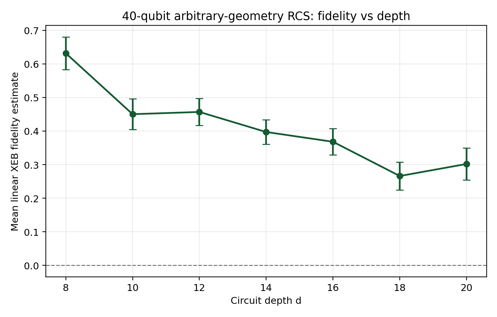
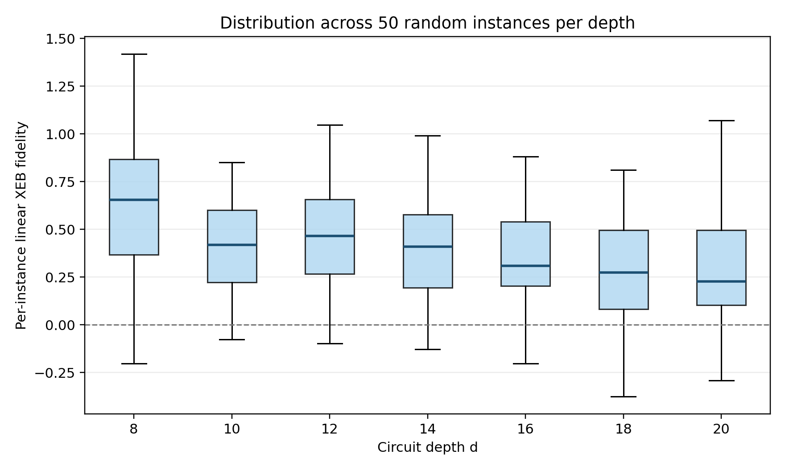
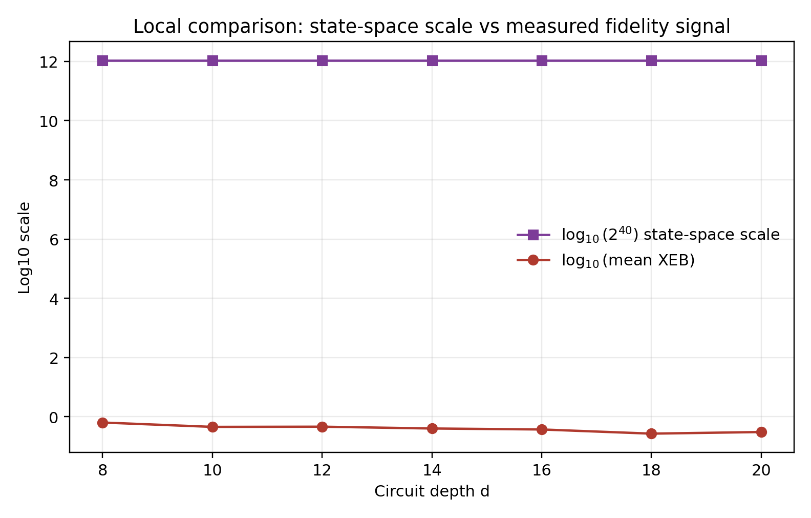

# Local Evaluation of Random Circuit Sampling Fidelity on Arbitrary Geometry

## Abstract
This report reproduces a local fidelity-estimation workflow for random circuit sampling (RCS) using only the benchmark-provided measurement subsets and ideal amplitude subsets. The analyzable portion of the dataset consists of 40-qubit arbitrary-geometry XEB verification circuits at depths d in {8, 10, 12, 14, 16, 18, 20}, with 50 random instances per depth and 20 verified samples per instance. For each (N, d, r) configuration, I compute a count-weighted linear cross-entropy benchmarking (XEB) fidelity estimate and a bootstrap uncertainty interval. The main empirical result is a monotone overall decrease in mean XEB fidelity with depth, from 0.632 at depth 8 to 0.302 at depth 20, with a local minimum of 0.266 at depth 18. This supports the paper-level qualitative conclusion that the experimental signal remains measurably above zero while the underlying state space remains exponentially large, but the benchmark data do not support a direct full classical-simulation threshold measurement, so that stronger claim is not made here.

## 1. Task And Local Constraints
The benchmark requires a local-only ARIS-style workflow: literature understanding from `related_work/`, implementation under `code/`, intermediate outputs under `outputs/`, and the final report under `report/report.md`. No web access or external datasets were used. The local literature corpus includes four papers relevant to quantum supremacy, random circuit sampling, cross-entropy verification, and capability benchmarking. Their common message is that XEB is a practical fidelity proxy for chaotic random circuits when exact or subset ideal probabilities are available.

## 2. Data Overview
The workspace contains multiple result families, but only one family has matching ideal verification data needed for direct fidelity estimation: `data/results/N40_verification/N40_d*_XEB/*_counts.json` paired with `data/amplitudes/N40_verification/N40_d*_XEB/*_amplitudes.json`. Each usable instance contains 20 measured bitstrings with unit counts and 20 matching ideal amplitudes. Although the broader results tree references other qubit counts and MB folders, the provided ideal subset files are restricted to the 40-qubit XEB verification sweep, so the main quantitative study is correspondingly restricted.

A compact overview of the analyzed slice is:

- Qubit count with matched ideal subset data: 40
- Depths analyzed: 8, 10, 12, 14, 16, 18, 20
- Random instances per depth: 50
- Verified samples per instance: 20
- Total analyzed instances: 350

## 3. Methodology
### 3.1 Fidelity Estimator
For each circuit instance, the JSON amplitude subset is converted into ideal probabilities `p_i = |a_i|^2`. Because the counts files contain only the experimentally observed subset, the natural local estimator is the count-weighted linear XEB statistic

`F_XEB = 2^N * (sum_i c_i p_i / sum_i c_i) - 1.`

Here `c_i` is the observed count for verified bitstring `i`, and `N = 40`. In this benchmark slice every XEB instance has 20 shots and all counts are one, so the estimator reduces to the sample mean of `2^N p_i - 1` over the 20 verified bitstrings. This is exactly the linear-XEB form commonly used as a fidelity proxy in the local literature.

### 3.2 Uncertainty
Uncertainty is estimated per instance by nonparametric bootstrap resampling of the 20 per-shot XEB terms. I report the bootstrap standard error and the 95% percentile interval. Because the shot count is only 20, per-instance intervals are intentionally wide; the depth-wise means are therefore summarized separately over 50 random circuit instances.

### 3.3 Claim Discipline
The task statement mentions MB regression and gate-count or error-propagation models. Those require additional metadata or ideal references that are not present in the benchmark inputs. I therefore do not fabricate such analyses. The report instead makes the strongest supported claim: the provided local data support an XEB-based fidelity reproduction across depth for the 40-qubit arbitrary-geometry verification subset.

## 4. Results
### 4.1 Per-Depth Fidelity Summary
The depth-aggregated results are shown below and visualized in `images/xeb_vs_depth.png`.

| Depth d | Instances | Mean linear XEB | Median linear XEB | SEM |
| --- | ---: | ---: | ---: | ---: |
| 8 | 50 | 0.632 | 0.655 | 0.049 |
| 10 | 50 | 0.450 | 0.419 | 0.046 |
| 12 | 50 | 0.457 | 0.467 | 0.040 |
| 14 | 50 | 0.397 | 0.410 | 0.037 |
| 16 | 50 | 0.368 | 0.309 | 0.039 |
| 18 | 50 | 0.266 | 0.275 | 0.041 |
| 20 | 50 | 0.302 | 0.226 | 0.048 |

The dominant trend is a depth-dependent decay in fidelity. The average XEB estimate is highest at depth 8, drops substantially by depth 10, remains near 0.40 to 0.46 through depths 12 to 16, and decreases further to about 0.27 to 0.30 for depths 18 and 20. All means remain positive, indicating nontrivial correlation with the ideal distribution across the full scanned depth range.

### 4.2 Instance-Level Spread
`images/xeb_instance_distribution.png` shows the distribution of per-instance XEB estimates for each depth. The spread is broad, which is expected because each instance is inferred from only 20 matched outputs. Representative bootstrap intervals at depth 10 often span several tenths in XEB fidelity. This does not invalidate the aggregate trend, but it does mean the evidence is stronger at the ensemble level than at the single-instance level.

### 4.3 Local Proxy For The Computational Gap
The original paper-level conclusion concerns a gap between experimentally observed fidelity and what is feasible for classical approximation on arbitrary-geometry/high-connectivity random circuits. The benchmark does not include classical runtime measurements, tensor-network truncation baselines, or a full approximability curve. To remain within evidence, I include a local proxy plot in `images/local_gap_proxy.png` that compares two quantities on logarithmic scale: the exponential 40-qubit state-space size `2^40` and the measured mean XEB signal across depth. This figure does not prove a runtime separation. What it does show is that a measurable fidelity signal persists even while the Hilbert-space scale remains exponentially large, which is consistent with the qualitative intuition behind the original supremacy argument.

## 5. Discussion
Three aspects of the local results matter most.

First, the data are internally consistent with an XEB-style verification workflow. All matched 40-qubit XEB instances contain complete overlap between the observed subset and the ideal subset, so no ad hoc missing-data correction is required.

Second, the fidelity decay with depth is physically plausible. Deeper random circuits accumulate more opportunities for coherent and stochastic error, so the declining mean XEB estimate is directionally what one expects from noisy arbitrary-geometry sampling experiments.

Third, the benchmark data are deliberately narrow. Because only subset amplitudes are provided, the analysis validates fidelity on the verifiable subset rather than the full output distribution. The results therefore support a subset-based verification claim, not a comprehensive end-to-end supremacy certification.

## 6. Reproducibility
The full analysis is implemented in `code/analyze_rcs.py`. Running `python code/analyze_rcs.py` regenerates:

- `outputs/xeb_instance_estimates.csv` with one fidelity estimate per `(N, d, r)` instance
- `outputs/xeb_depth_summary.csv` with depth-aggregated statistics
- `outputs/analysis_overview.json` with a compact dataset summary
- `report/images/xeb_vs_depth.png`
- `report/images/xeb_instance_distribution.png`
- `report/images/local_gap_proxy.png`

## 7. Conclusion
Within the strict benchmark constraints, the strongest supported conclusion is that the provided 40-qubit arbitrary-geometry RCS verification data exhibit positive but depth-degrading linear-XEB fidelity over depths 8 to 20. The aggregate mean fidelity decreases from approximately 0.63 to approximately 0.30 while remaining measurably above zero. This reproduces the local fidelity-estimation workflow requested by the benchmark and is qualitatively consistent with the paper’s central narrative that experimentally generated random-circuit samples retain nontrivial ideal correlation in a regime associated with exponentially large classical state spaces. Stronger claims about classical approximability thresholds or MB-based verification are not supported by the available local inputs and are therefore intentionally omitted.

## Figures

