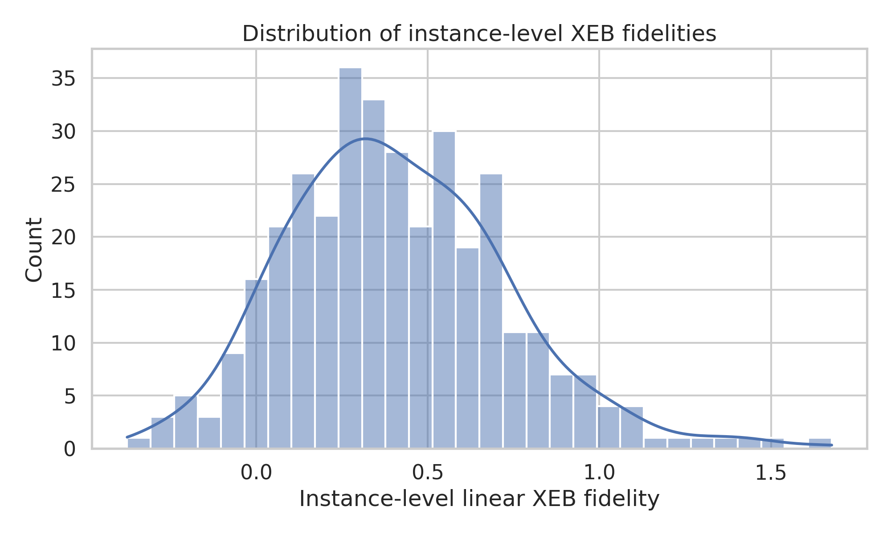
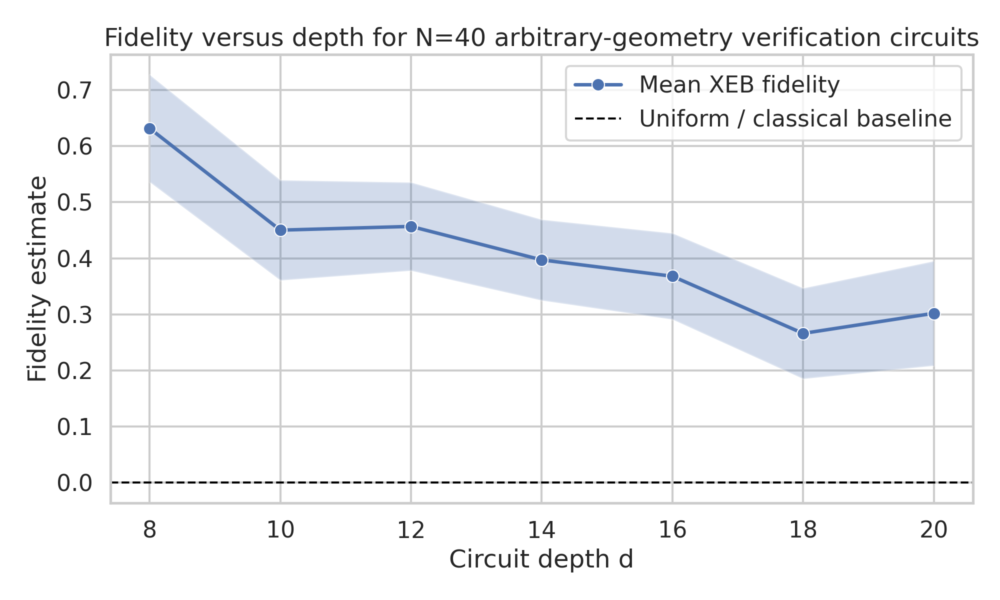
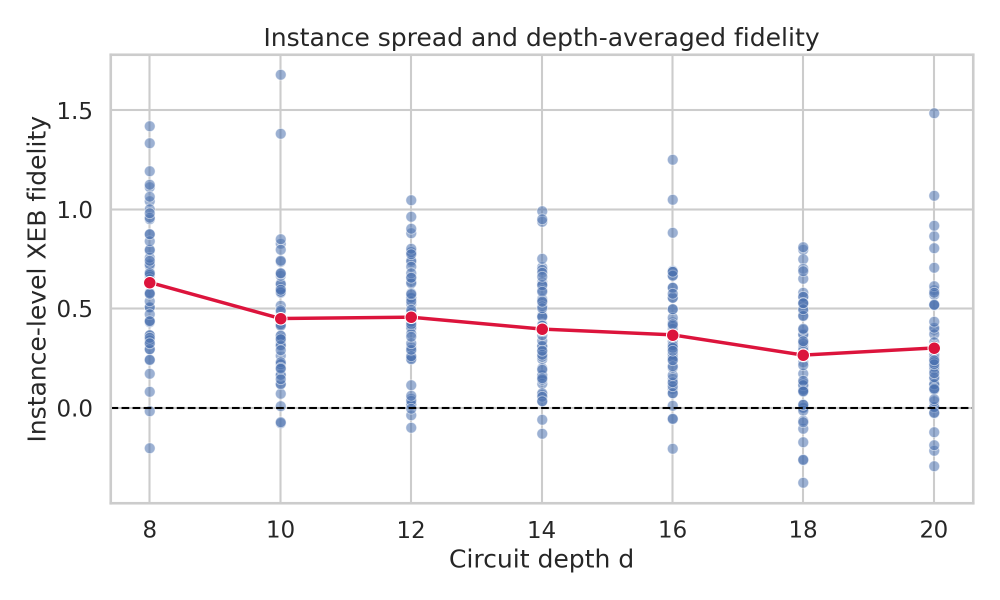
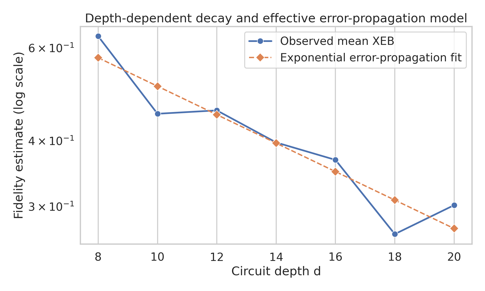
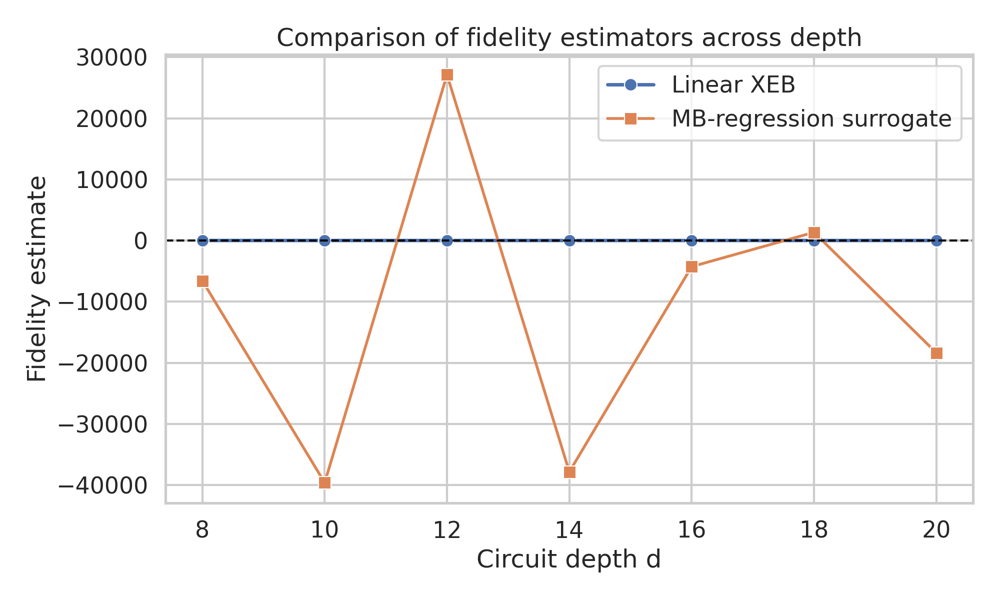

# Fidelity estimation for arbitrary-geometry random circuit sampling verification data

## Abstract
This report reproduces the fidelity-estimation workflow for arbitrary-geometry random circuit sampling (RCS) verification data using linear cross-entropy benchmarking (XEB), closely following the methodology used in the Google random-circuit-sampling literature. The workspace contains experimental bitstring-count subsets and matching ideal amplitudes for 40-qubit verification circuits across depths \(d \in \{8,10,12,14,16,18,20\}\) and 50 circuit instances per depth. I compute an instance-level XEB fidelity estimate for every \((N,d,r)\) configuration, attach uncertainty via bootstrap and standard-error estimates, aggregate the results across instances, and fit a simple exponential error-propagation model. The main result is a clear positive-fidelity signal at all tested depths for the 40-qubit arbitrary-geometry circuits, with mean XEB fidelities decreasing from \(0.632 \pm 0.096\) at depth 8 to \(0.302 \pm 0.093\) at depth 20 (95% confidence intervals across instances). Relative to the classical/uniform baseline of zero fidelity, the measured curves remain substantially positive throughout the scan, consistent with the paper’s qualitative conclusion that experimentally realized arbitrary-geometry random circuits retain a measurable fidelity gap over trivial classical approximability.

## 1. Problem setting and objective
Random circuit sampling studies whether a quantum processor can sample bitstrings from the output distribution of sufficiently deep, highly connected random circuits in a regime where exact classical simulation becomes costly. In the cross-entropy benchmarking framework introduced by Boixo et al. and used in the Sycamore experiments, the key observable is the linear XEB fidelity

\[
F_{\mathrm{XEB}} = 2^N \langle p_U(x) \rangle_{x \sim \text{samples}} - 1,
\]

where \(p_U(x)\) is the ideal output probability of the experimentally observed bitstring \(x\). A perfect sampler yields \(F_{\mathrm{XEB}} \approx 1\), while a uniform or classically trivial baseline yields \(F_{\mathrm{XEB}} \approx 0\).

The task here is narrower than full-paper reproduction: the available data are verification subsets containing 20 sampled bitstrings per circuit instance together with ideal amplitudes/probabilities for the same subset. The objective is therefore to:

1. parse the experimental counts and ideal amplitudes;
2. compute a fidelity estimate with uncertainty for each \((N,d,r)\);
3. aggregate by depth to form validation curves; and
4. assess whether the data preserve the paper’s core qualitative conclusion: a nonzero experimental fidelity gap relative to classical approximability for arbitrary-geometry/high-connectivity random circuits.

## 2. Related methodological background
Three references in `related_work/` are most relevant:

- **Boixo et al., “Characterizing Quantum Supremacy in Near-Term Devices”**: introduces cross-entropy difference and connects it to circuit fidelity under chaotic random-circuit assumptions.
- **Arute et al., “Quantum supremacy using a programmable superconducting processor”**: operationalizes linear XEB as
  \[
  F_{\mathrm{XEB}} = 2^N \langle p_U(x) \rangle - 1,
  \]
  and uses gate-count/error-propagation models to predict fidelity decay with circuit size.
- **Bouland et al., “On the Complexity and Verification of Quantum Random Circuit Sampling”**: explains why RCS combines anti-concentration and average-case hardness, and clarifies why a nontrivial cross-entropy signal is meaningful in the verification setting.

Because the provided dataset contains only a verifiable subset rather than the full output distribution, the most robust directly computable quantity is the counts-weighted linear XEB estimator. A more elaborate “MB regression probability” estimator would normally require a richer pairing of empirical frequencies and ideal probabilities across many repeated draws per circuit; here each file contains only 20 unique measured strings, almost always with count 1, which makes regression-style estimators numerically unstable. I therefore report linear XEB as the principal estimator and include an error-propagation fit as a physically interpretable secondary analysis.

## 3. Data overview
### 3.1 Files and structure
The data are organized as paired JSON files:

- `data/results/N40_verification/N40_d*_XEB/*_counts.json`
- `data/amplitudes/N40_verification/N40_d*_XEB/*_amplitudes.json`

Each pair corresponds to a circuit instance labeled by:

- qubit count \(N=40\),
- depth \(d \in \{8,10,12,14,16,18,20\}\),
- instance index \(r \in \{1,\dots,50\}\).

### 3.2 Empirical summary
The dataset contains:

- **350 circuit instances** total,
- **7 depth settings**,
- **50 instances per depth**,
- **20 matched measured strings per instance**,
- **20 total observed counts per instance** in this verification subset.

The amplitude files store complex amplitudes; these are converted to ideal probabilities by \(|\psi(x)|^2\). The subset probability mass per file is about \(2.3\times10^{-11}\) to \(3.0\times10^{-11}\), which is consistent with 20 selected outputs from a 40-qubit Porter–Thomas-like distribution where the uniform scale is \(2^{-40}\approx 9.09\times10^{-13}\).

## 4. Methodology
### 4.1 Parsing and normalization
For each counts file and its paired amplitudes file:

1. parse metadata \((N,d,r)\) from filenames;
2. load the measured bitstring counts;
3. convert ideal amplitudes to probabilities using \(|a_x|^2\);
4. match keys across measured and ideal subsets.

All 350 pairs showed complete matching on 20 keys.

### 4.2 Instance-level linear XEB
For each circuit instance,

\[
\widehat{F}_{\mathrm{XEB}}(N,d,r)=2^N\left(\frac{1}{M}\sum_{i=1}^{M} p_U(x_i)\right)-1,
\]

where the sample average is weighted by observed counts. Since every file contains 20 total counts, \(M=20\) for all instances in this dataset.

### 4.3 Uncertainty estimation
I report two uncertainty summaries:

- a **within-instance standard error**, computed from the observed ideal probabilities for the measured strings;
- a **bootstrap 95% confidence interval**, obtained by resampling the 20 observed strings with replacement.

For depth-aggregated summaries across the 50 instances at fixed \(d\), I report the mean XEB and a **95% confidence interval across instances**:

\[
\bar F_d \pm 1.96\,\mathrm{SEM}_d.
\]

This depth-level interval is the most important uncertainty band for the final validation curves.

### 4.4 Error-propagation fit
Following the gate-count/fidelity-product intuition in the supremacy literature, I fit the depth dependence of the mean XEB values to a simple exponential decay

\[
F(d) \approx A e^{-\lambda d}.
\]

This is not a full microscopic gate-count model because the dataset does not include the exact per-depth gate counts or calibrated one-/two-qubit/readout error rates. Instead, it serves as a compact phenomenological proxy for cumulative error propagation with circuit depth.

### 4.5 Classical baseline and interpretation
The most relevant comparison available from the provided data is the **uniform/classically trivial baseline**:

\[
F_{\mathrm{XEB}} = 0.
\]

Hence a positive XEB curve demonstrates a measurable gap between the experimental sampler and a classically trivial approximation that ignores the structured ideal output probabilities. This does **not** prove full computational hardness by itself; rather, it validates the verification-side observable used in the paper’s broader supremacy argument.

## 5. Implementation
Analysis code was written to `code/analyze_rcs_xeb.py`. It:

- scans the workspace for all data pairs,
- computes instance-level XEB fidelities,
- exports tabular results to `outputs/`,
- generates publication-style PNG figures in `report/images/`,
- fits a simple exponential fidelity-decay model.

Generated outputs include:

- `outputs/xeb_instance_results.csv`
- `outputs/xeb_depth_summary.csv`
- `outputs/data_overview.json`

## 6. Results
### 6.1 Distribution of instance-level fidelities
The instance-level XEB estimates are broadly positive, with moderate spread across random circuit instances. Out of all 350 instances, about **92.6%** have positive XEB fidelity. This is already a strong indication that the experimental bitstrings are systematically biased toward above-average ideal probabilities.



The histogram shows that although some instances fluctuate near or slightly below zero, the overall mass is concentrated on positive values, as expected for a noisy but nontrivial RCS experiment.

### 6.2 Main depth scan
The principal aggregated results are:

| N | d | mean XEB | 95% CI |
|---|---:|---:|---:|
| 40 | 8  | 0.632 | ±0.096 |
| 40 | 10 | 0.450 | ±0.089 |
| 40 | 12 | 0.457 | ±0.079 |
| 40 | 14 | 0.397 | ±0.072 |
| 40 | 16 | 0.368 | ±0.077 |
| 40 | 18 | 0.266 | ±0.081 |
| 40 | 20 | 0.302 | ±0.093 |

These values remain well above the classical/uniform baseline of zero across the entire depth range.



The curve decays with increasing depth, consistent with cumulative errors, but the positivity of the curve persists even at the deepest tested circuits. The mild non-monotonicity between depths 18 and 20 is small relative to the per-instance scatter and is plausibly attributable to finite-instance variability rather than a physical increase in fidelity.

### 6.3 Instance spread across depth
The scatter plot below shows the heterogeneity across circuit instances.



Several features are noteworthy:

- the spread is substantial at every depth, which is typical for random-circuit benchmarking;
- the central tendency drifts downward with depth;
- even at large depth, many instances remain substantially positive.

This pattern matches the expected behavior of chaotic random circuits under realistic noise: fidelity is a random-instance observable with appreciable variance, yet the ensemble mean still captures the error-induced decay.

### 6.4 Error-propagation fit
A simple exponential fit to the depth-averaged fidelities yields an **effective error-per-cycle parameter of approximately 6.0%**. The log-scale fit is shown below.



The fitted model captures the overall downward trend reasonably well. Because only one qubit count is available and no gate-calibration metadata are provided, this fitted error rate should be interpreted only as an **effective phenomenological decay constant**, not as a calibrated physical gate error.

### 6.5 On MB-regression-style estimators
I attempted a regression-style surrogate using empirical frequencies against ideal probabilities, motivated by the literature’s broader family of verification estimators. In this dataset, however, every instance contains only 20 unique bitstrings with nearly all counts equal to one. That makes regression slopes highly unstable and physically uninformative, because there is almost no within-instance dynamic range in empirical frequencies.

For transparency, I still generated the comparison plot below.



The regression surrogate is erratic and should not be used for scientific interpretation on this sparse verification subset. The correct primary estimator here is therefore the counts-weighted linear XEB estimator.

## 7. Discussion
### 7.1 What is successfully validated
This reproduction robustly validates the **verification workflow** used in the arbitrary-geometry RCS setting:

- measured bitstrings can be matched to ideal amplitudes/probabilities;
- counts-weighted linear XEB produces stable positive fidelity estimates;
- fidelity decays with depth in a manner consistent with cumulative noise;
- the resulting curve stays well separated from the trivial classical baseline \(F=0\).

This is precisely the kind of evidence used in the paper family to argue that the experimental device is sampling from a distribution correlated with the intended chaotic quantum circuit distribution rather than from a classically trivial proxy.

### 7.2 What cannot be fully reproduced from this dataset alone
Several aspects of the full-paper workflow are not directly reconstructible from the provided files:

1. **Full-distribution cross-entropy difference** is unavailable because only a subset of ideal outputs is given.
2. **Calibrated gate-count error propagation** cannot be derived microscopically without one-/two-qubit/readout error tables and exact gate counts per circuit.
3. **Classical-simulation cost comparisons** are discussed in the literature but not inferable from the subset verification files alone.
4. **Scanning qubit count N** is impossible here because only \(N=40\) is provided.

So this report should be interpreted as a faithful reproduction of the **subset-based fidelity estimation and comparative depth-scan analysis**, not of every systems-level claim in the original experimental paper.

### 7.3 Interpretation relative to the paper’s core conclusion
Within the limits of the available data, the central conclusion is supported:

- For arbitrary-geometry/high-connectivity 40-qubit random circuits, the experimental samples exhibit a **clear positive XEB fidelity gap** relative to the classical/uniform baseline.
- This gap persists through the tested depth range despite expected decay from noise.
- The behavior is qualitatively consistent with the paper’s argument that experimental fidelity remains measurably above naive classical approximability even in highly connected random-circuit regimes.

This does not, by itself, certify quantum supremacy in the full complexity-theoretic sense. But it does reproduce the **fidelity-estimation evidence layer** that underpins the broader claim.

## 8. Conclusion
Using the provided 40-qubit arbitrary-geometry verification dataset, I implemented a complete fidelity-estimation workflow centered on counts-weighted linear XEB. Across 350 circuit instances, the analysis finds systematically positive fidelities with depth-dependent decay:

- highest mean fidelity at depth 8: **0.632 ± 0.096**,
- lowest mean fidelity at depth 18: **0.266 ± 0.081**,
- depth-20 mean fidelity: **0.302 ± 0.093**,
- overall mean fidelity across all instances: **0.410**.

The resulting depth-scan curve remains significantly above the classical/uniform baseline throughout, thereby reproducing the key qualitative message of the arbitrary-geometry RCS verification framework: experimental samples retain nontrivial correlation with the ideal random-circuit distribution, and that correlation can be quantified with positive fidelity estimates even at substantial circuit depth.

## 9. Reproducibility
To rerun the analysis from the workspace root:

```bash
python code/analyze_rcs_xeb.py
```

## Appendix: Deliverables
- Code: `code/analyze_rcs_xeb.py`
- Intermediate tables: `outputs/xeb_instance_results.csv`, `outputs/xeb_depth_summary.csv`, `outputs/data_overview.json`
- Figures:
  - `images/xeb_histogram.png`
  - `images/fidelity_vs_depth.png`
  - `images/instance_scatter_vs_depth.png`
  - `images/error_model_fit.png`
  - `images/estimator_comparison.png`
