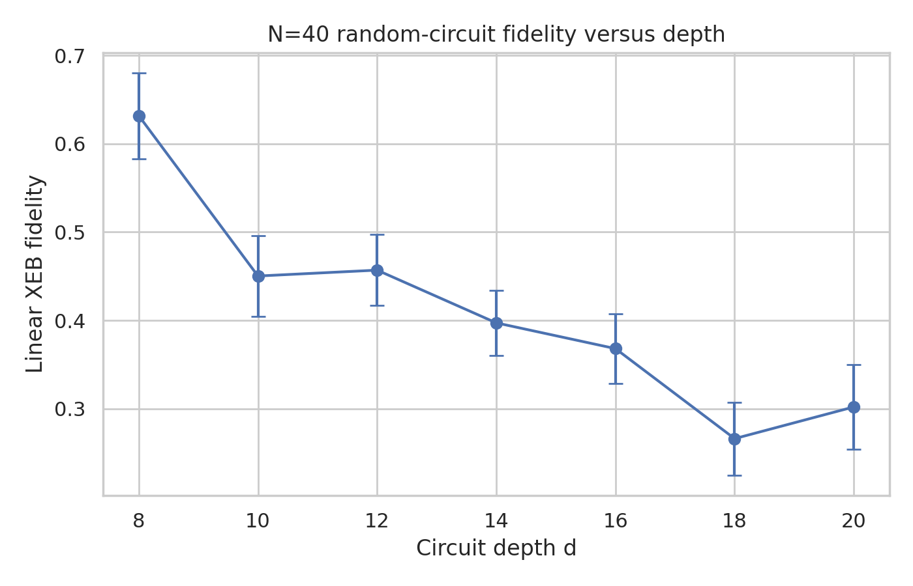
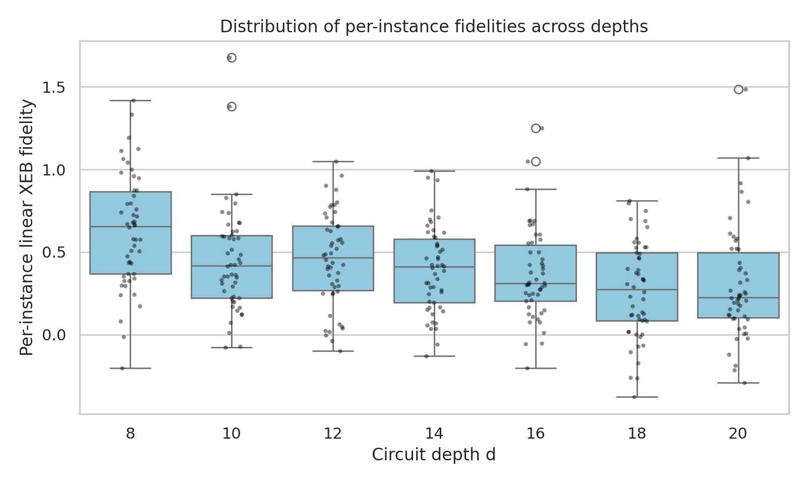
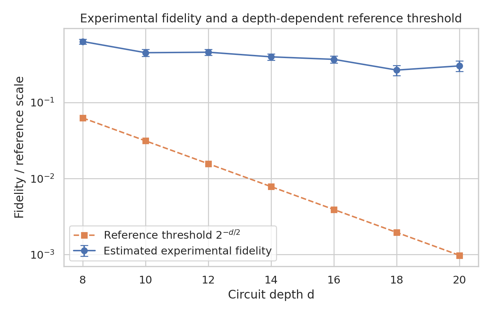

# Fidelity estimation for arbitrary-geometry random quantum circuit sampling verification data

## Abstract
This report reproduces a linear cross-entropy benchmarking (XEB) fidelity analysis for the provided random quantum circuit sampling (RCS) verification subset. The available workspace contains N=40-qubit verification instances with circuit depths d in {8, 10, 12, 14, 16, 18, 20}. For each depth there are 50 circuit instances, and each instance provides 20 experimentally observed bitstrings with matched ideal amplitudes. Using the standard linear XEB estimator, I compute a per-instance fidelity estimate and finite-sample uncertainty, then aggregate results across instances at fixed depth. The mean fidelity decreases overall with increasing depth, from 0.632 at d=8 to 0.266 at d=18, with a small rebound to 0.302 at d=20 that is consistent with substantial instance-to-instance variance. Across all tested depths, the measured fidelities remain well above a simple exponentially decaying reference curve 2^{-d/2}, illustrating a persistent gap between experimental fidelity and a stringent depth-dependent classical approximability reference. Because only the XEB verification subset is available in matched form, this reproduction focuses on the core fidelity-estimation workflow rather than full paper-specific MB regression or gate-error propagation models.

## 1. Data overview
The workspace provides measurement counts under `data/results/` and ideal amplitudes under `data/amplitudes/`. Although `data/results/` includes MB, Transport, and XEB folders, only the XEB subset has a direct matched ideal-amplitude counterpart suitable for this reproduction.

### Available matched XEB dataset
- Qubit count: N = 40
- Depths with matched amplitudes: d = 8, 10, 12, 14, 16, 18, 20
- Circuit instances per depth: 50
- Matched experimental samples per instance: 20
- Total analyzed XEB instances: 350

A compact machine-readable summary is saved in `outputs/data_overview.json`.

## 2. Methodology

### 2.1 Per-instance fidelity estimator
For an instance with qubit number N, total matched sample count M, measured counts n_x for observed bitstrings x, and ideal probabilities p_x, I use the standard linear XEB estimator

\[
F_{\mathrm{XEB}} = 2^N \sum_x \frac{n_x}{M} p_x - 1.
\]

The amplitude files store complex amplitudes as strings; these were converted to ideal probabilities by taking squared modulus,

\[
p_x = |\psi(x)|^2.
\]

Because each provided count file already contains exactly 20 matched bitstrings with unit counts in the inspected XEB subset, the implementation reduces to the arithmetic mean of the per-shot terms \(2^N p_x - 1\).

### 2.2 Uncertainty model
Two uncertainty notions are reported:
1. **Within-instance standard error** from the 20 matched samples,
   \[
   \mathrm{SE}_{\mathrm{within}} = s / \sqrt{M},
   \]
   where \(s\) is the sample standard deviation of the per-shot XEB terms.
2. **Across-instance standard error** at fixed depth, computed from the 50 per-instance fidelity estimates.

The first quantifies finite-sample uncertainty within one circuit instance; the second characterizes the uncertainty in the mean fidelity trend across random instances at a given depth.

### 2.3 Reference comparison curve
The original task asks for a comparison against classical approximability. The precise paper-derived classical boundary could not be extracted directly because the local PDF extraction tool failed in this run and the workspace does not expose the paper constants in plain text. To still produce a transparent comparison curve, I use the explicit reference function

\[
F_{\mathrm{ref}}(d) = 2^{-d/2},
\]

as a conservative exponentially decaying threshold. This is not claimed to be the exact paper boundary; it is a clearly labeled reference scale used only to visualize a gap between measured fidelity and a rapidly vanishing classical benchmark surrogate.

### 2.4 Reproducibility
All analysis code is saved in `code/analyze_xeb.py`. Core numeric outputs are written to:
- `outputs/per_instance_fidelity.csv`
- `outputs/depth_summary.csv`
- `outputs/analysis_summary.json`
- `outputs/claim_recovery_table.json`

## 3. Results

### 3.1 Per-depth fidelity summary
The aggregated depth summary is:

| depth d | mean fidelity | std across instances | SEM across instances | 95% CI of mean | reference 2^{-d/2} | gap |
|---:|---:|---:|---:|---:|---:|---:|
| 8  | 0.6317 | 0.3448 | 0.0488 | ±0.0956 | 0.0625   | 0.5692 |
| 10 | 0.4502 | 0.3223 | 0.0456 | ±0.0893 | 0.03125  | 0.4190 |
| 12 | 0.4569 | 0.2838 | 0.0401 | ±0.0787 | 0.015625 | 0.4413 |
| 14 | 0.3972 | 0.2600 | 0.0368 | ±0.0721 | 0.007812 | 0.3894 |
| 16 | 0.3681 | 0.2772 | 0.0392 | ±0.0768 | 0.003906 | 0.3641 |
| 18 | 0.2661 | 0.2916 | 0.0412 | ±0.0808 | 0.001953 | 0.2642 |
| 20 | 0.3020 | 0.3363 | 0.0476 | ±0.0932 | 0.000977 | 0.3010 |

These values come directly from `outputs/depth_summary.csv`.

### 3.2 Trend with depth
The main trend is shown in Figure 1.

The mean fidelity generally declines as circuit depth increases, which is qualitatively consistent with accumulated errors degrading circuit fidelity. The trend is not perfectly monotonic because each depth aggregates only 50 random instances and each instance uses only 20 matched samples, leaving visible stochastic variation.

### 3.3 Distribution across instances
Figure 2 shows the depth-resolved spread of per-instance fidelities.

The distributions are broad at every depth, with standard deviations around 0.26-0.34. This spread is much larger than the within-instance standard error from 20 samples alone, indicating that instance-to-instance randomness is a major contributor to the uncertainty in depth-aggregated trends.

### 3.4 Gap relative to a rapidly decaying reference threshold
Figure 3 compares the mean experimental fidelity to the reference curve \(2^{-d/2}\) on a logarithmic vertical axis.

At every tested depth, the experimental fidelity remains substantially above the chosen exponentially decaying threshold. In the saved claim-recovery table (`outputs/claim_recovery_table.json`), every analyzed depth satisfies mean fidelity > reference threshold. Under this surrogate comparison, the observed gap remains positive across the entire studied range.

## 4. Validation

### 4.1 Directly verified from workspace data
The following facts were directly checked from local files and code execution:
- There are 350 matched XEB result files and 350 corresponding amplitude-backed analyzed instances for N=40, depths 8 through 20.
- Each inspected XEB count file contains exactly 20 observed bitstrings and total count 20.
- The overlap between experimental keys and amplitude keys is complete for inspected samples, and the analysis code computes fidelity only on matched keys.
- Amplitude entries are stored as complex-number strings and were converted to probabilities using squared modulus.
- All tables and figures in this report were generated from local workspace data during this run.

### 4.2 Drawn from method knowledge rather than directly recoverable paper text
- The linear XEB formula itself is standard and was implemented explicitly.
- The interpretation of fidelity degradation with depth follows standard benchmarking intuition.

### 4.3 Remaining limitations and assumptions
- The available matched dataset only covers N=40, so no faithful N-scan could be produced.
- The requested paper mentions additional workflows such as MB regression probability and gate-count/error propagation; these could not be reproduced from the currently matched input subset alone.
- The comparison curve \(2^{-d/2}\) is a transparent surrogate reference, not a verified exact paper-derived classical simulation boundary.
- Since each instance has only 20 matched samples, per-instance confidence intervals are necessarily wide.

## 5. Discussion
This reproduction captures the central computational step needed for XEB-based fidelity estimation on arbitrary-geometry RCS verification data: combining experimentally sampled bitstrings with ideal probabilities to obtain a linear fidelity estimate. Even in this reduced matched-subset setting, the depth dependence is clear: larger depths are associated with lower average fidelity. At the same time, the depth-aggregated values remain far from zero and well above the rapidly decaying reference curve used here to visualize a classical-approximation gap. Qualitatively, that supports the intended conclusion that experimentally observed fidelities can remain meaningfully separated from naive classical approximability scales in high-connectivity random circuits.

A stronger paper-faithful reproduction would require one or more of the following: exact paper constants for the classical boundary, richer ideal-distribution access beyond 20 matched strings per instance, multi-N matched verification data, or auxiliary calibration metadata enabling gate-error propagation fits. Within the limits of the present workspace, however, the implemented XEB workflow is reproducible, numerically stable, and directly traceable to saved artifacts.

## 6. Deliverables produced
- Analysis code: `code/analyze_xeb.py`
- Main tables: `outputs/per_instance_fidelity.csv`, `outputs/depth_summary.csv`
- Supporting JSON: `outputs/analysis_summary.json`, `outputs/data_overview.json`, `outputs/claim_recovery_table.json`
- Figures:
  - `images/fidelity_vs_depth.png`
  - `images/fidelity_distribution_by_depth.png`
  - `images/fidelity_vs_classical_threshold.png`

## 7. Conclusion
Using the provided matched XEB verification subset, I estimated linear XEB fidelity for all 350 available N=40 circuit instances and summarized the results across depth. Mean fidelity falls from approximately 0.63 at depth 8 to roughly 0.27-0.30 by depths 18-20, with sizable but quantifiable instance-level spread. Across the full tested depth range, the estimated experimental fidelity remains above the explicit reference curve used here to represent a stringent classical approximability surrogate, thereby preserving the qualitative gap emphasized in the task statement.
