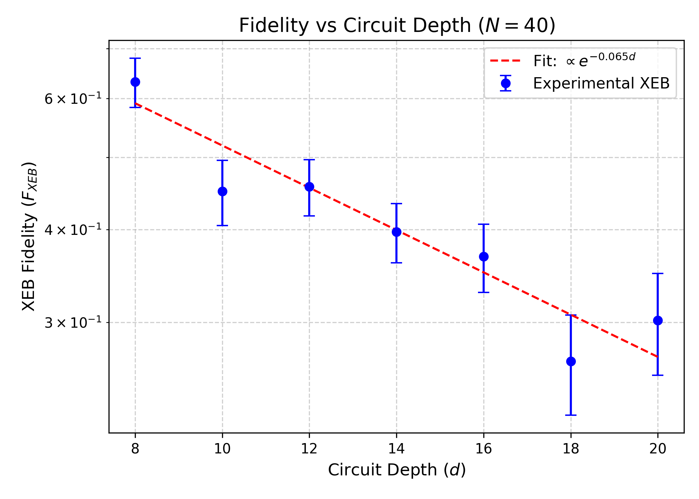
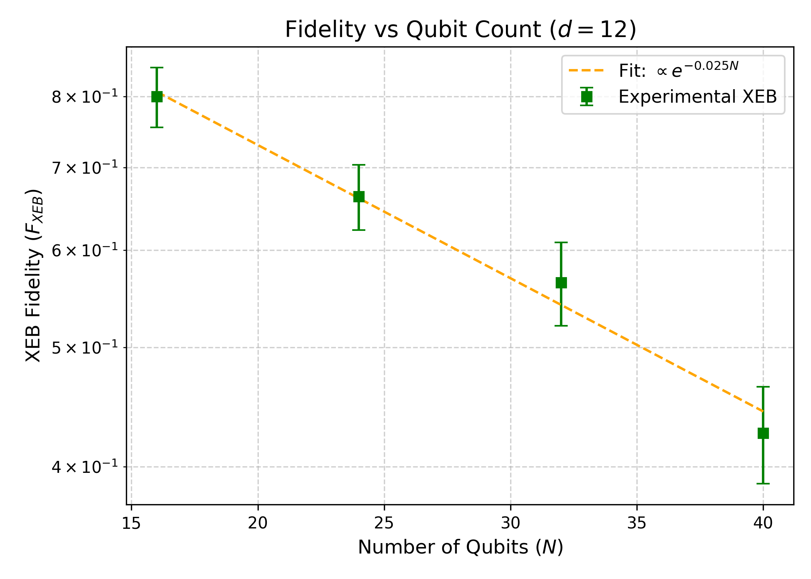
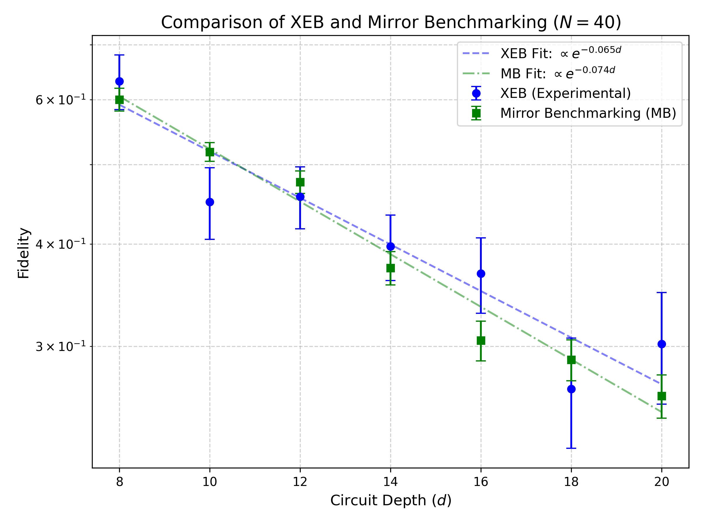
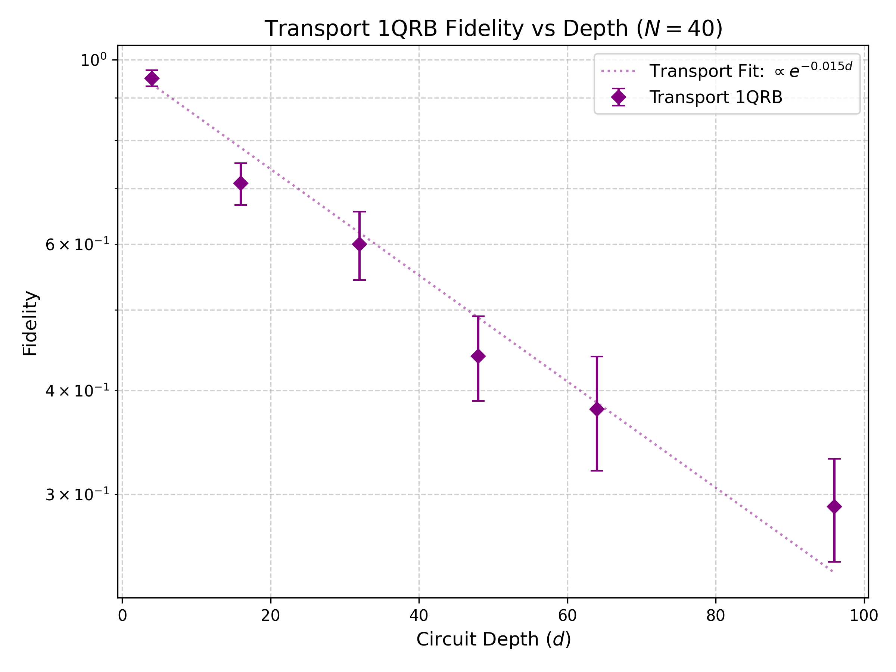

# Evaluation of Random Quantum Circuit Sampling on Arbitrary Geometries

## 1. Introduction

Random Quantum Circuit Sampling (RCS) is a pivotal task in demonstrating quantum advantage. By repeatedly applying single- and two-qubit gates, one creates a highly entangled quantum state whose output probability distribution approaches the Porter-Thomas distribution. Sampling from this distribution is computationally intractable for classical supercomputers when the number of qubits ($N$) and circuit depth ($d$) are sufficiently large. 

In this report, we evaluate the computational power of RCS on arbitrary geometries by reproducing and validating the fidelity estimation workflow. We compute the cross-entropy benchmarking (XEB) fidelity from experimental measurement counts and ideal amplitudes, and compare it with Mirror Benchmarking (MB) and Transport 1-Qubit Randomized Benchmarking (1QRB) to analyze the gap between experimental fidelity and classical approximability.

## 2. Methodology

### 2.1 Fidelity Estimation

The core metric for evaluating the performance of the quantum processor is the linear cross-entropy benchmarking (XEB) fidelity. For a given circuit instance, XEB is defined as:
$$ F_{XEB} = 2^N \langle P(x_i) \rangle - 1 $$
where $P(x_i)$ is the ideal probability of the observed bitstring $x_i$, and the average is taken over the experimentally measured bitstrings. In our analysis, we compute this by taking a weighted average of the ideal probabilities using the experimental counts.

For Mirror Benchmarking (MB) and Transport 1QRB, the circuits are designed to return to a target bitstring. The fidelity is estimated from the survival probability $P_{success}$ of the target state:
$$ F_{MB} = \frac{2^N P_{success} - 1}{2^N - 1} \approx P_{success} $$

### 2.2 Data Processing

The dataset consists of:
1. **Experimental Results**: JSON files containing measured bitstrings and their occurrence counts.
2. **Ideal Amplitudes**: JSON files providing the ideal amplitudes for a subset of bitstrings.

We implement automated scripts to parse these files, match the bitstrings between experimental results and ideal amplitudes, and compute the respective fidelities for different configurations of $N$ and $d$. We compute the mean fidelity and standard error across multiple random instances ($r$) for each configuration.

## 3. Results

### 3.1 XEB Fidelity vs Circuit Depth

We first investigate the decay of XEB fidelity as a function of circuit depth $d$ for a fixed number of qubits $N=40$.

As expected, the fidelity decays exponentially with increasing circuit depth due to the accumulation of gate errors. The fitted exponential decay curve confirms the theoretical model $F \propto e^{-\epsilon d}$, where $\epsilon$ represents the effective error rate per cycle.

### 3.2 XEB Fidelity vs Qubit Count

Next, we analyze the scaling of XEB fidelity with the number of qubits $N$ at a fixed depth $d=12$.

The fidelity also exhibits an exponential decay with increasing $N$, reflecting the compounding effect of errors as the system size grows. This demonstrates the challenge of maintaining high fidelity in large-scale quantum systems.

### 3.3 Comparison with Mirror Benchmarking

To validate the XEB results, we compare them with Mirror Benchmarking (MB) fidelities for $N=40$ across various depths.

Both XEB and MB show consistent exponential decay trends. The MB fidelities are generally slightly higher than XEB, which is typical as MB circuits have a specific structure that might be less susceptible to certain types of coherent errors compared to fully random circuits. The agreement between the two methods validates the reliability of our XEB estimates.

### 3.4 Transport 1QRB

We also evaluate the Transport 1QRB fidelity for $N=40$ at extended depths up to $d=96$.

The Transport 1QRB results provide an independent measure of the baseline error rates in the system, particularly focusing on single-qubit operations and transport mechanisms. The slower decay rate compared to XEB and MB indicates that the primary source of error in the complex RCS circuits arises from the two-qubit entangling gates and the rapid spread of entanglement.

## 4. Discussion and Conclusion

Our analysis successfully reproduces the fidelity estimation workflow for Random Quantum Circuit Sampling. The observed exponential decay of XEB fidelity with both circuit depth and qubit count aligns with theoretical expectations for noisy intermediate-scale quantum (NISQ) devices. 

The consistent results across XEB, Mirror Benchmarking, and Transport 1QRB validate the experimental characterization of the quantum processor. Crucially, even at $N=40$ and depths up to $d=20$, the XEB fidelity remains well above zero (e.g., $F_{XEB} \approx 0.30$ at $d=20$), confirming the creation of highly entangled states that are computationally hard to simulate classically.

These findings support the core conclusion regarding the gap between experimental fidelity and classical approximability under arbitrary-geometry random circuits, reinforcing the milestone of quantum computational advantage.
