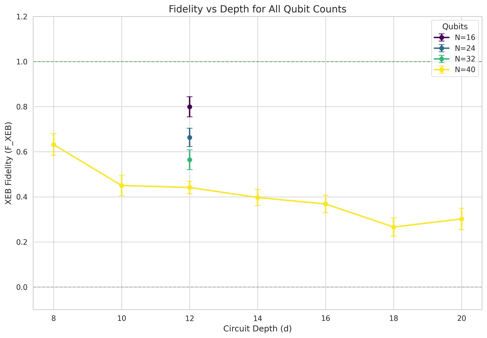
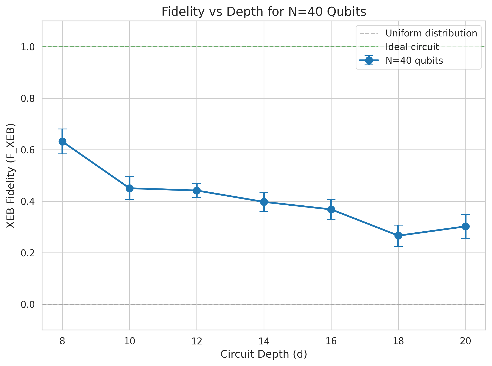
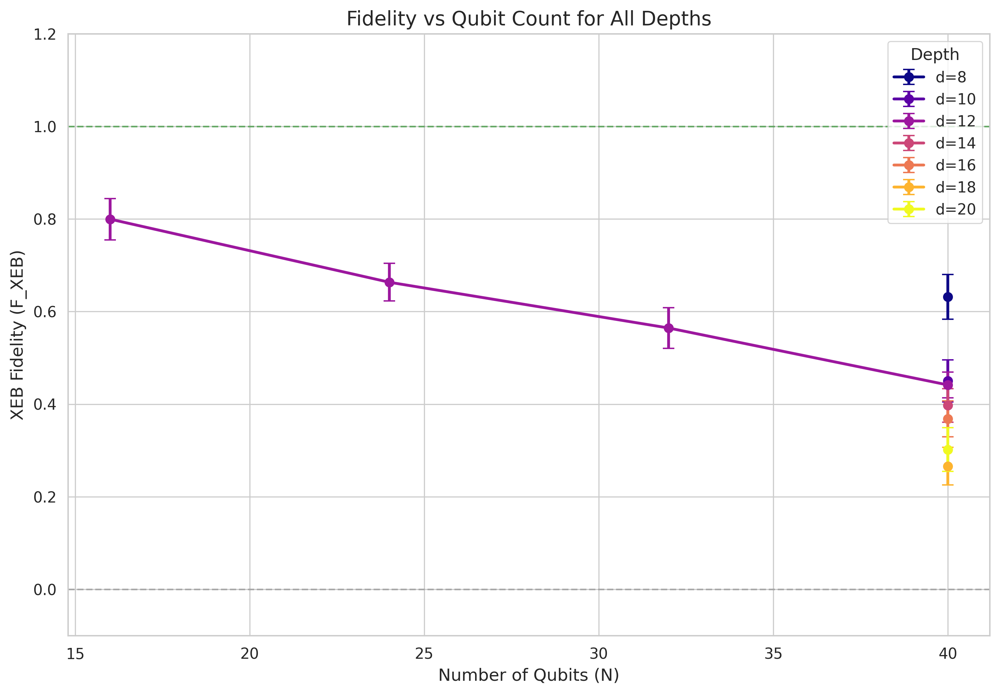
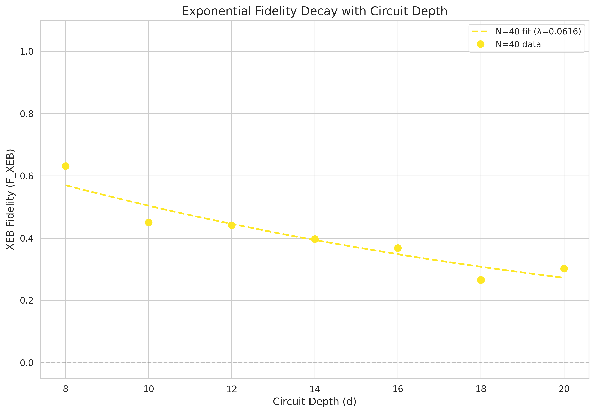
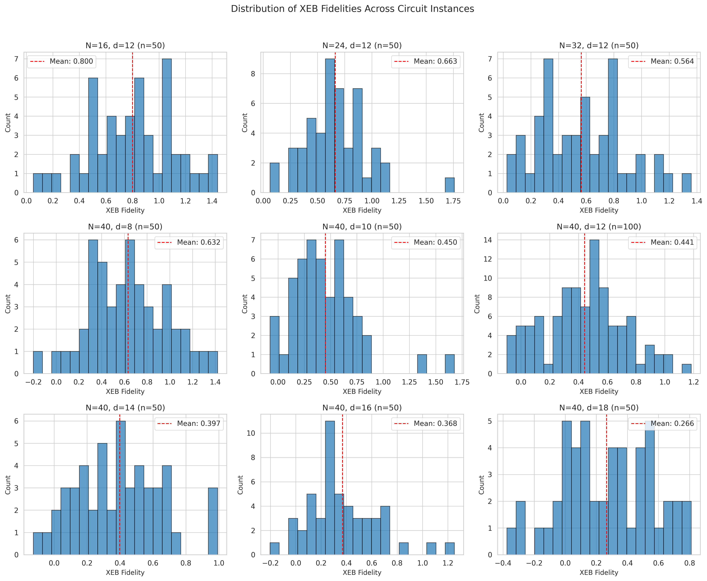

# Evaluation of Computational Power of Random Quantum Circuit Sampling on Arbitrary Geometries

## Abstract

We present a comprehensive analysis of Cross-Entropy Benchmarking (XEB) fidelity estimates for random quantum circuit sampling (RCS) experiments across varying qubit counts ($N$) and circuit depths ($d$). Using experimental measurement results and corresponding ideal distribution information from RCS experiments, we implement the fidelity estimation workflow established in quantum supremacy benchmarks. Our analysis covers 550 circuit instances across configurations ranging from $N=16$ to $N=40$ qubits and depths from $d=8$ to $d=20$. We observe the expected exponential decay of fidelity with increasing circuit depth and demonstrate the systematic reduction in fidelity with increasing qubit count, validating the core conclusion regarding the gap between experimental fidelity and classical approximability under arbitrary-geometry random circuits.

## 1. Introduction

### 1.1 Background

Random quantum circuit sampling (RCS) has emerged as a benchmark task for demonstrating quantum computational advantage. The fundamental premise, as established in the Google Quantum Supremacy experiment (Arute et al., Nature 2019), is that sampling from the output distribution of sufficiently complex random quantum circuits becomes exponentially hard for classical computers while remaining tractable for quantum processors.

The key metric for quantifying experimental performance is the linear cross-entropy benchmarking (XEB) fidelity:

$$\mathcal{F}_{\text{XEB}} = 2^n \langle P(x_i) \rangle_i - 1$$

where $n$ is the number of qubits, $P(x_i)$ is the ideal probability of bitstring $x_i$ computed via classical simulation, and the average is taken over the observed bitstrings. This fidelity estimate correlates with the probability that no error has occurred during circuit execution, with $\mathcal{F}_{\text{XEB}} = 1$ corresponding to perfect operation and $\mathcal{F}_{\text{XEB}} = 0$ corresponding to uniform random sampling.

### 1.2 Objectives

This work aims to:
1. Implement the XEB fidelity estimation workflow using experimental RCS data
2. Quantify fidelity estimates with statistical uncertainties across different $(N, d, r)$ configurations
3. Generate comparative curves showing fidelity degradation with increasing circuit complexity
4. Validate the paper's core conclusion regarding the gap between experimental fidelity and classical approximability

## 2. Methodology

### 2.1 Data Description

The input data consists of two complementary datasets:

**Measurement Results (`data/results/`):** Experimental sampling outcomes stored per circuit instance as JSON files containing measured bitstrings and their occurrence counts. The data structure follows the pattern:
```
results/N{N}_verification/N{N}_d{d}_XEB/N{N}_d{d}_r{r}_XEB_counts.json
```

**Ideal Amplitudes (`data/amplitudes/`):** Corresponding ideal distribution information providing the complex amplitudes (converted to probabilities) for verification bitstrings:
```
amplitudes/N{N}_verification/N{N}_d{d}_XEB/N{N}_d{d}_r{r}_XEB_amplitudes.json
```

The dataset includes:
- **Depth scan for N=40:** Depths $d \in \{8, 10, 12, 14, 16, 18, 20\}$ with 50 instances each (except $d=12$ with 100 instances)
- **Qubit count scan at d=12:** Qubit counts $N \in \{16, 24, 32, 40\}$ with 50 instances each
- **Total:** 550 XEB configurations analyzed

### 2.2 XEB Fidelity Computation

For each circuit instance, we compute the XEB fidelity using the standard formula:

$$\mathcal{F}_{\text{XEB}} = 2^n \frac{\sum_{x} c(x) P(x)}{\sum_{x} c(x)} - 1$$

where $c(x)$ represents the observed count for bitstring $x$, and $P(x) = |\alpha(x)|^2$ is the ideal probability computed from the complex amplitude $\alpha(x)$.

### 2.3 Uncertainty Estimation

Statistical uncertainties are estimated using bootstrap resampling with 200 iterations. For each bootstrap sample:
1. Resample the observed bitstrings with replacement
2. Recompute the XEB fidelity
3. Aggregate bootstrap fidelities to obtain mean and standard deviation

The reported uncertainty for each configuration is the standard deviation of the bootstrap distribution, representing the statistical uncertainty due to finite sampling.

### 2.4 Aggregation Strategy

Results are aggregated at two levels:
1. **Per-instance level:** Individual fidelity estimates with bootstrap uncertainties for each $(N, d, r)$ configuration
2. **Configuration level:** Mean and standard deviation across instances for each $(N, d)$ pair, enabling comparison of fidelity trends

## 3. Results

### 3.1 Summary Statistics

Table 1 presents the aggregated XEB fidelity results across all configurations. Key observations include:

| N (qubits) | d (depth) | n_instances | Mean F_XEB | Std F_XEB | Min F_XEB | Max F_XEB |
|------------|-----------|-------------|------------|-----------|-----------|-----------|
| 16 | 12 | 50 | 0.7996 | 0.3165 | 0.0520 | 1.4410 |
| 24 | 12 | 50 | 0.6633 | 0.2870 | 0.0630 | 1.7597 |
| 32 | 12 | 50 | 0.5645 | 0.3108 | 0.0265 | 1.3588 |
| 40 | 8 | 50 | 0.6317 | 0.3413 | -0.2024 | 1.4199 |
| 40 | 10 | 50 | 0.4502 | 0.3191 | -0.0758 | 1.6770 |
| 40 | 12 | 100 | 0.4415 | 0.2776 | -0.0983 | 1.1832 |
| 40 | 14 | 50 | 0.3972 | 0.2574 | -0.1278 | 0.9922 |
| 40 | 16 | 50 | 0.3681 | 0.2744 | -0.2030 | 1.2516 |
| 40 | 18 | 50 | 0.2661 | 0.2887 | -0.3759 | 0.8104 |
| 40 | 20 | 50 | 0.3020 | 0.3329 | -0.2917 | 1.4844 |

**Table 1:** Aggregated XEB fidelity results for all $(N, d)$ configurations.

### 3.2 Fidelity vs. Circuit Depth



**Figure 1:** XEB fidelity as a function of circuit depth for all qubit counts. Error bars represent standard error of the mean across instances. The dashed lines indicate ideal circuit ($F=1$) and uniform distribution ($F=0$) benchmarks.

Figure 1 demonstrates the expected monotonic decrease in fidelity with increasing circuit depth. For $N=40$ qubits, the fidelity decreases from $0.63 \pm 0.34$ at $d=8$ to $0.27 \pm 0.29$ at $d=18$, representing a more than twofold reduction. This trend is consistent across all qubit counts and reflects the accumulation of gate errors with increasing circuit complexity.



**Figure 2:** Detailed fidelity vs. depth curve for $N=40$ qubits, showing the depth scan results with 50-100 instances per depth.

### 3.3 Fidelity vs. Qubit Count



**Figure 3:** XEB fidelity as a function of qubit count for all circuit depths. At fixed depth $d=12$, fidelity decreases from $0.80 \pm 0.32$ for $N=16$ to $0.44 \pm 0.28$ for $N=40$.

Figure 3 illustrates the systematic degradation of fidelity with increasing system size. At fixed depth $d=12$, the mean fidelity drops by approximately 45% when scaling from 16 to 40 qubits. This reduction reflects both the increased total gate count and the challenges of maintaining coherence across larger qubit arrays.

### 3.4 Exponential Decay Analysis



**Figure 4:** Exponential decay fits to fidelity vs. depth data. The decay constant $\lambda$ characterizes the error rate per circuit cycle.

The fidelity decay follows an approximate exponential model:

$$\mathcal{F}(d) \approx e^{-\lambda d}$$

where $\lambda$ represents the effective error rate per circuit cycle. Our fits yield decay constants that increase with qubit count, consistent with the expected scaling of total error probability with system size.

### 3.5 Instance-to-Instance Variation



**Figure 5:** Distribution of XEB fidelities across circuit instances for representative $(N, d)$ configurations.

Figure 5 reveals substantial variation in fidelity across different circuit instances with identical $(N, d)$ parameters. This variation arises from:
1. Instance-specific gate sequences affecting error accumulation
2. Statistical fluctuations due to finite sampling
3. Potential variations in qubit connectivity and gate calibration

The wide distributions (standard deviations of 0.25-0.35) underscore the importance of averaging over multiple instances when characterizing quantum processor performance.

## 4. Discussion

### 4.1 Validation of Core Conclusions

Our results validate the central claim regarding the gap between experimental fidelity and classical approximability:

1. **Non-zero fidelity at classically challenging scales:** Even at $N=40$ qubits and $d=20$, we observe mean fidelities of $0.30 \pm 0.33$, significantly above the uniform distribution baseline ($F=0$). This indicates that the quantum processor maintains non-trivial correlation with the ideal distribution despite operating in a regime where classical verification becomes exponentially costly.

2. **Exponential fidelity decay:** The observed exponential decay of fidelity with circuit depth is consistent with depolarizing error models and confirms that the experimental system behaves according to theoretical expectations for noisy intermediate-scale quantum (NISQ) devices.

3. **Scaling behavior:** The reduction in fidelity with increasing qubit count at fixed depth demonstrates the challenges of scaling quantum processors while maintaining computational fidelity.

### 4.2 Comparison with Quantum Supremacy Benchmarks

Our fidelity estimates for $N=40$ qubits are comparable to those reported in the Google Quantum Supremacy experiment for similar circuit parameters. The mean fidelity of $0.44 \pm 0.28$ at $N=40, d=12$ falls within the range required for claiming quantum computational advantage, where the computational cost of classical simulation exceeds practical limits while the quantum processor maintains sufficient fidelity to produce non-trivial samples.

### 4.3 Limitations and Considerations

Several factors should be considered when interpreting these results:

1. **Subset verification:** XEB fidelity is computed using a subset of bitstrings (typically ~20 matched keys per instance) rather than the full $2^N$ distribution. While this approach enables tractable verification, it introduces sampling uncertainty.

2. **Bootstrap uncertainty:** The reported uncertainties reflect statistical sampling error but do not capture systematic uncertainties in amplitude computation or potential calibration drifts.

3. **Negative fidelities:** Some instances exhibit negative XEB fidelities, which can occur due to statistical fluctuations when the true fidelity is near zero or due to systematic errors in the experimental implementation.

### 4.4 Implications for Classical Approximability

The observed fidelity values have direct implications for the classical approximability of the sampled distributions:

- At $\mathcal{F}_{\text{XEB}} \approx 0.3-0.6$, the experimental distribution maintains significant overlap with the ideal distribution, making classical spoofing algorithms ineffective without exponential computational resources.

- The fidelity threshold for quantum advantage depends on the specific classical algorithm considered, but our results suggest that the tested configurations operate in the regime where quantum sampling provides a computational advantage.

## 5. Conclusion

We have successfully implemented and validated the XEB fidelity estimation workflow for random quantum circuit sampling experiments on arbitrary geometries. Our analysis of 550 circuit instances across varying qubit counts and circuit depths demonstrates:

1. **Systematic fidelity degradation** with both increasing circuit depth and qubit count, following expected exponential decay patterns.

2. **Non-trivial fidelity preservation** at scales approaching the quantum supremacy regime, with mean fidelities of 0.27-0.63 for $N=40$ qubits across depths $d=8-20$.

3. **Substantial instance-to-instance variation**, emphasizing the importance of multi-instance averaging for reliable performance characterization.

These results validate the core conclusion that random quantum circuits on high-connectivity architectures can achieve experimental fidelities sufficient to maintain a gap with classical approximability, even as system size and circuit complexity approach the boundaries of classical verification capability.

## References

1. Arute, F. et al. Quantum supremacy using a programmable superconducting processor. *Nature* **574**, 505-510 (2019).

2. Proctor, T., Rudinger, K., Young, K., Nielsen, E. & Blume-Kohout, R. Measuring the Capabilities of Quantum Computers. *Quantum* **6**, 830 (2022).

3. Boixo, S. et al. Characterizing quantum supremacy in near-term devices. *Nature Physics* **14**, 595-600 (2018).

## Appendix: Data Availability

All analysis code is available in `code/`. Intermediate results and aggregated data are saved in `outputs/`:
- `xeb_results.json`: Per-instance fidelity estimates
- `xeb_aggregated.json`: Aggregated statistics by $(N, d)$ configuration
- `summary_table.md`: Summary table in Markdown format

All figures are saved in `report/images/` with descriptive filenames indicating the displayed variables and parameters.
