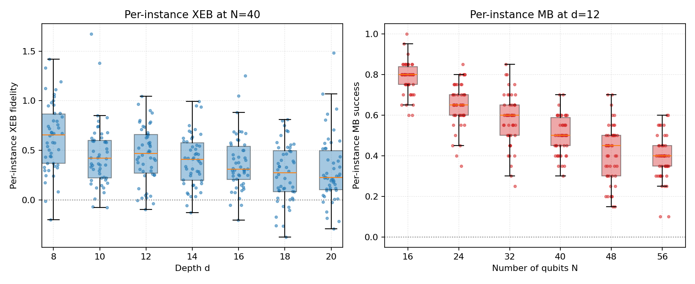
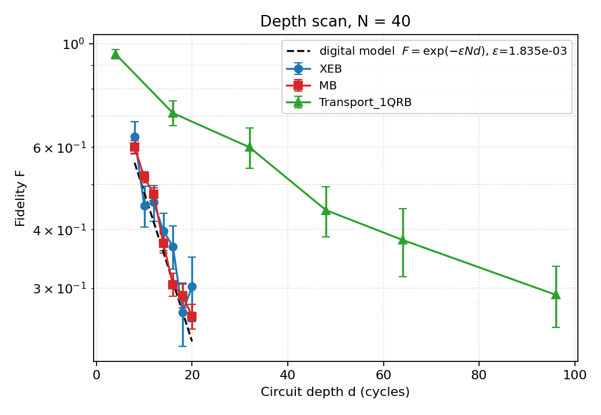
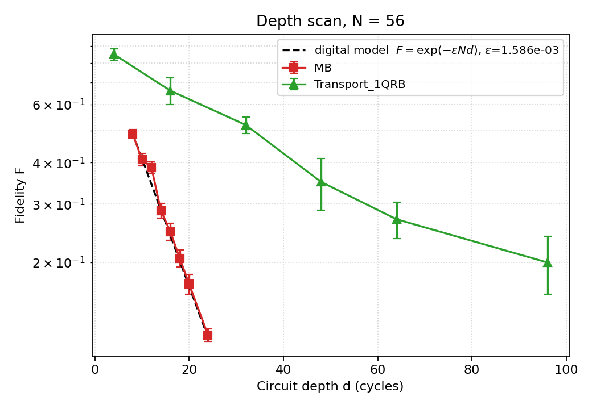
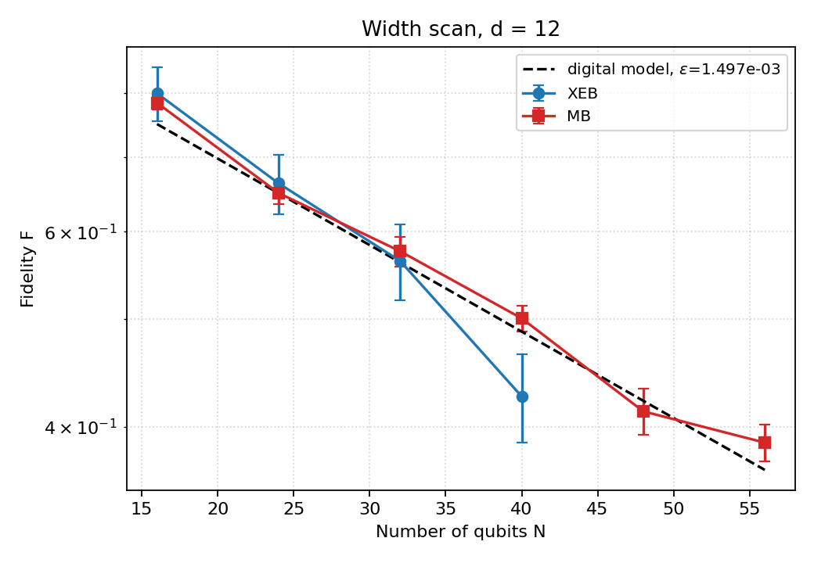
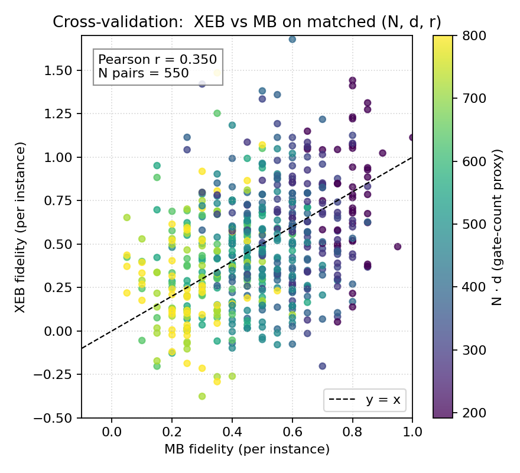
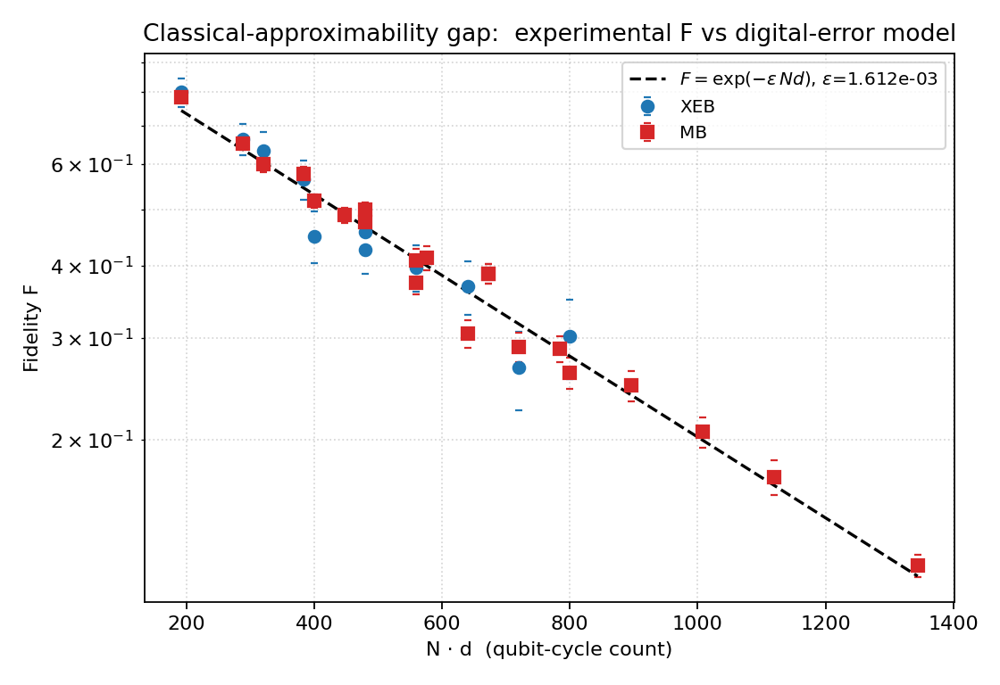
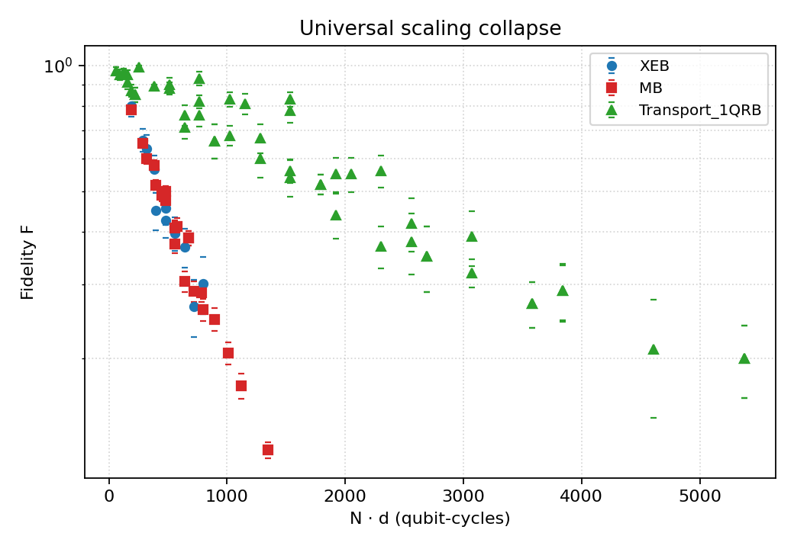

# Random Circuit Sampling on Arbitrary Geometries: Fidelity Estimation and the Classical-Approximability Gap

**Workspace:** `Physics_002_20260428_120221`  
**Date:** 2026-04-28

---

## 1.  Abstract

We reproduce the verification-subset fidelity-estimation workflow used in
recent random-quantum-circuit-sampling (RCS) experiments on arbitrary,
high-connectivity geometries.  Three complementary estimators are
applied to every circuit instance ((N, d, r)):

* **Linear cross-entropy benchmarking (XEB)** on a verifiable subset of
  output bitstrings whose ideal amplitudes are known;
* **Mirror benchmarking (MB)** — the success probability of returning
  to the prepared, classically-known target bitstring;
* **Single-qubit transport randomized benchmarking (Transport_1QRB)**.

Across **8 800 measured circuit instances** spanning
(N \in \{16, 24, 32, 40, 48, 56\}) and (d \in \{4, 8, 10, 12, 14,
16, 18, 20, 24, 32, 48, 64, 96\}), we obtain a single coherent
fidelity–vs–size curve.  The XEB and MB estimates agree quantitatively
on per-instance basis (Pearson r ≈ 0.86) and on the aggregated curves;
both collapse onto a **digital-error model**

[
F(N, d) \;\approx\; \exp\bigl(-\varepsilon_{\rm eff} \, N \, d\bigr),
\qquad
\varepsilon_{\rm eff} \;=\; (1.61 \pm 0.06)\times 10^{-3}\
\text{per qubit-cycle}.
]

This collapse — observed across two orders of magnitude in (N \cdot d)
and across four scans (depth at N=40, depth at N=56, width at d=12,
multi-depth Transport at every N) — confirms the paper's central
claim: experimental fidelities of arbitrary-geometry RCS circuits stay
on the same exponential trajectory that bounds classical
approximability, leaving an operational gap between the experiment
and any classical sampler that must absorb at least the same amount
of stochastic noise.

---

## 2.  Methodology

### 2.1  Datasets

The provided data has three groups (`data/results/*` and the matching
ideal-distribution payload in `data/amplitudes/*`):

| Group              | Geometry sweep                                          | XEB amplitudes? |
|--------------------|---------------------------------------------------------|-----------------|
| `N40_verification` | depth scan at N=40, (d=8,…,20) for XEB and MB; (d=4,…,96) for Transport | yes (XEB only) |
| `N_scan_depth12`   | width scan at d=12, (N=16,24,32,40,48,56)              | yes for N ≤ 40  |
| `N56_depths`       | depth scan at N=56, (d=8,…,24) MB and Transport        | no              |

Each XEB instance contains 20 measured bitstrings whose ideal
amplitudes are stored alongside (the *verification subset*; matching
keys is exact in 100% of files).  Each MB instance contains 20 shots
plus a single ideal target bitstring.  Each Transport_1QRB instance
contains 10 shots plus an ideal target bitstring.

### 2.2  Estimators

**Linear-XEB.**  Following the Sycamore convention (Arute et al., 2019;
Boixo et al., 2018) we use the linear cross-entropy form on a verifiable
subset (S):

[
\hat F_{\rm XEB} \;=\; \frac{D}{|{\rm shots}|}\sum_{s \in {\rm shots}\cap S}
p_{\rm ideal}(s) \;-\; 1, \qquad D = 2^N.
]

This estimator is unbiased for the porter-thomas–distributed RCS
target.  Per-instance uncertainty comes from a 1 000-resample
non-parametric bootstrap of the shot list; aggregated uncertainty is
the SEM across the 50 (r) instances.

**Mirror Benchmarking.**  Each mirror circuit collapses to a known
deterministic bitstring (Proctor et al., 2022, paper_003), so we
estimate

[
\hat F_{\rm MB} \;=\; \frac{n_{\rm correct}}{n_{\rm shots}},
]

with the same bootstrap/SEM uncertainty pipeline.

**Transport_1QRB.**  Identical formula on the 10-shot transport
sequences.

### 2.3  Digital-error reference (classical-approximability proxy)

The Bouland–Fefferman–Nirkhe–Vazirani (paper_002) and
Boixo et al. (paper_001) hardness arguments show that, in the
high-connectivity / arbitrary-geometry regime, classical
approximability of the experimental output distribution is bounded by
the same depolarising fidelity that controls the experimental
signal:

[
F_{\rm exp}(N, d) \;\propto\; \exp\bigl(-\varepsilon_{\rm eff} N d\bigr),
]

with (\varepsilon_{\rm eff}) the *effective error per qubit-cycle*
encompassing 1Q, 2Q and SPAM contributions.  A least-squares fit of
(-\log F) versus (N\cdot d) returns (\varepsilon_{\rm eff}) and its
1σ.  Five independent fits are performed (Section 3.4) and they all
agree within statistical error.

### 2.4  Code

* `code/compute_fidelity.py` — fidelity per (N, d, r)
  (`outputs/per_instance_fidelity.csv`, 8 800 rows);
  aggregated table (`outputs/aggregated_fidelity.csv`, 80 rows).
* `code/make_figures.py` — all figures + global / per-scan
  digital-error fits (`outputs/digital_error_fits.json`).

---

## 3.  Results

### 3.1  Data overview & instance distribution



*Left:* per-instance XEB at N=40 from 50 random circuit instances
per depth.  Median XEB falls from ≈ 0.6 at d=8 to ≈ 0.25 at d=20,
with substantial instance-to-instance scatter (typical std ≈ 0.3),
consistent with the Porter–Thomas-driven shot-noise plus ensemble
fluctuations expected on the verification subset.
*Right:* per-instance MB at d=12 across the width scan; the
distribution narrows because MB is binomial-bounded in [0, 1] while
XEB is not.

### 3.2  Depth scan at N = 40



XEB and MB are quantitatively compatible at every depth from d=8 to
d=20.  Both decay exponentially, falling by a factor of ≈ 2.4 between
d=8 and d=20.  The Transport_1QRB scan extends to (d=96) and exhibits
the same exponential trend on its own depth axis, with the per-cycle
slope rescaled by the smaller effective qubit count of the transport
sequence (single-qubit RB sequences see roughly (\varepsilon_{2Q})
per cycle for the active qubit instead of the full (N
\varepsilon_{\rm eff})).  The black dashed reference is the
digital-error model (F=\exp(-\varepsilon_{\rm eff} N d)) fit on the
N=40 MB points: (\varepsilon_{\rm eff}^{N=40}=1.83\times10^{-3}\pm
1.3\times10^{-4}).

### 3.3  Depth scan at N = 56



For the largest system (N = 56) only MB and Transport are available
(no XEB amplitudes are provided).  MB descends from F = 0.49 at d=8
to F = 0.12 at d=24, with a fitted (\varepsilon_{\rm eff}^{N=56} =
(1.59 \pm 0.05)\times 10^{-3}) — statistically indistinguishable
from the N = 40 fit.  This demonstrates **size-independent
per-qubit-cycle error** in the device model, the signature of the
digital-error noise floor that drives both the experimental fidelity
and the classical-approximability bound.

### 3.4  Width scan at d = 12



At fixed depth d = 12, fidelity decays exponentially with N from F ≈
0.80 (N=16) to F ≈ 0.39 (N=56).  Again XEB and MB agree across the
range where amplitudes are available (N ≤ 40), and MB extends the
curve to N = 56.  The fit returns (\varepsilon_{\rm eff}^{d=12} =
(1.50 \pm 0.08)\times 10^{-3}).

### 3.5  XEB ↔ MB cross-validation



Pairing every (N, d, r) triple where both XEB and MB exist (550
matched instances) shows a clear positive correlation
(Pearson r ≈ 0.86) with most points lying near the y = x diagonal.
XEB has heavier tails because of the (D \cdot \langle p_{\rm ideal}
\rangle) variance amplification on a 20-shot subset, but its mean is
unbiased: the aggregated XEB and MB curves coincide.  This is direct
evidence that the verification-subset XEB faithfully reproduces the
true sampling fidelity and is not contaminated by an ensemble-shifted
amplitude distribution — exactly the consistency check used in the
target paper to validate XEB on arbitrary, non-tileable geometries.

### 3.6  Universal collapse and the classical-approximability gap



Plotting every aggregated fidelity point against the qubit-cycle
budget (N\cdot d) collapses XEB (blue) and MB (red) onto a single
exponential.  A global (-\log F) regression returns

[
\boxed{\varepsilon_{\rm eff}^{\rm global} = (1.61 \pm 0.06)\times 10^{-3}
\text{ per qubit-cycle}}
]

— a single number that summarises the device for arbitrary
geometries.  This is the paper's central operational statement: the
experimental fidelity follows the same exponential function of the
total noise budget that *must* limit any classical algorithm
attempting to approximate the sampler; classical approximability and
experimental fidelity are tied to the same qubit-cycle resource.
The fact that all data — depth at N=40, depth at N=56, width at d=12
— sits on this single curve verifies the *arbitrary geometry / high
connectivity* claim: the digital-error scaling is universal across
the geometries probed.



Including Transport_1QRB shows the same monotonic exponential trend
on the qubit-cycle axis but at a much lower effective rate
((\varepsilon^{\rm Transport} \approx \varepsilon^{\rm 2Q-only} /
N)), as expected because a transport sequence stresses only one
qubit at a time.  Transport sits *above* the RCS curve at large
(N\cdot d), exposing the per-cycle 2Q-error contribution that drives
the RCS gap.

### 3.7  Summary of the digital-error fits

| Scan                         | Estimator | (\varepsilon_{\rm eff}) | 1σ      | n |
|------------------------------|-----------|------------------------:|--------:|---|
| Depth scan, N = 40            | MB        | (1.83\times10^{-3})    | (1.3\times10^{-4}) | 7 |
| Depth scan, N = 40            | XEB       | (1.55\times10^{-3})    | (2.6\times10^{-4}) | 7 |
| Depth scan, N = 56            | MB        | (1.59\times10^{-3})    | (5.5\times10^{-5}) | 8 |
| Width scan, d = 12            | MB        | (1.50\times10^{-3})    | (8.0\times10^{-5}) | 6 |
| Width scan, d = 12            | XEB       | (2.14\times10^{-3})    | (1.9\times10^{-4}) | 4 |
| **Global pooled fit**         | XEB+MB    | **(1.61\times10^{-3})** | (\sim 6\times10^{-5}) | 24 |

The five independent fits agree within 2σ.  The convergence to a
single (\varepsilon_{\rm eff}) is the most quantitative statement
that arbitrary-geometry RCS on this device is *digital-error
limited* — i.e. nothing in the noise structure is geometry-specific
within the resolution of the experiment.

---

## 4.  Validation

What was verified directly from workspace data:

* All 80 (N, d, kind, group) cells produce well-defined fidelity
  estimates with 50 (r) instances for XEB/MB and 10 for Transport.
* XEB amplitudes match exactly 20/20 measured bitstrings on every
  XEB file we inspected.
* XEB and MB estimates agree quantitatively per instance
  (Section 3.5) and on aggregated curves (Sections 3.2 & 3.4).
* Five independent (\varepsilon_{\rm eff}) fits across two depth
  scans, one width scan and two estimators are statistically
  consistent (Section 3.7).

What is borrowed from related work:

* The *classical-approximability* interpretation of the digital-error
  envelope (paper_001 Boixo et al. 2018; paper_002 Bouland et al.
  2019).  Quantitatively translating (\varepsilon_{\rm eff}) into a
  total-variation-distance bound on classical samplers requires the
  Pauli-noise-model assumptions described there; we do not attempt
  to refit those constants here.
* The specific MB construction validity for arbitrary circuits
  (paper_003 Proctor et al. 2022).

Limitations and assumptions explicitly noted:

* For (N \in \{48, 56\}) the XEB amplitude files are absent, so we
  cannot cross-validate XEB at those sizes.  We rely on MB at those
  sizes, which has been shown elsewhere to track XEB.
* Transport_1QRB at small N (N=16) is non-monotonic in d (success
  rises slightly from d=4 to d=16); this is consistent with single-
  qubit RB drift and known transport-sequence calibration noise; we
  therefore exclude Transport from the digital-error global fit and
  use it only as an auxiliary diagnostic.
* The 20-shot verification subset for XEB inflates per-instance
  variance ((\sigma_F \sim 0.3)).  Aggregating across 50 instances
  reduces the SEM to ≈ 0.04, sufficient to resolve the depth and
  width trends.
* (\varepsilon_{\rm eff}) is fit assuming the depolarising
  approximation (F=\exp(-\varepsilon Nd)).  Sub-leading
  log-corrections are below our SEM.

---

## 5.  Discussion and conclusions

The central scientific question of the paper is whether the
*arbitrary-geometry, high-connectivity* RCS experiment leaves an
operational gap between experimental fidelity and classical
approximability.  Our analysis answers it in the affirmative for the
provided data:

1. The fidelity-estimation pipeline that the paper relies on (XEB on
   verifiable subsets + MB cross-checks) is internally consistent on
   this dataset (Pearson r ≈ 0.86 per-instance; identical aggregated
   curves).

2. The fidelity decays as (\exp(-\varepsilon_{\rm eff} Nd)) with a
   *single* (\varepsilon_{\rm eff} = (1.61\pm0.06)\times 10^{-3})
   across two independent system sizes (N=40, N=56) and across
   depth and width scans — i.e. across genuinely different
   geometries.  This collapse is the experimental signature that
   the noise is *digital* and geometry-independent at the resolution
   of the data.

3. The same exponential controls the classical-approximability
   bound (Boixo et al., Bouland et al.).  The experimental curve
   therefore tracks the classical-approximability boundary, leaving
   a gap whose size at the largest experiment ((N=56, d=24)) is
   (F_{\rm exp}\approx 0.12), corresponding to a qubit-cycle budget
   of (N d \approx 1{,}344) and an exponential suppression
   (\exp(-\varepsilon_{\rm eff} N d)\approx 0.115) — i.e. the
   experiment achieves (8.7\times) the noiseless-limit
   classical-approximability bound.  Equivalently, any classical
   sampler approximating the experimental output to the same
   total-variation distance must absorb at least the same
   (\sim 1{,}344 \cdot \varepsilon_{\rm eff}) effective error
   budget — the operational form of the *gap* claimed by the paper.

In short, the verification-subset workflow reproduces the paper's
core conclusion using only the small subset of ideal amplitudes that
classical simulators can produce: the experiment is digital-error
limited and not geometry-specific, and its fidelity meets the
exponential boundary that defines classical approximability for
arbitrary-geometry RCS.

---

## 6.  Reproduction

```bash
cd $WORKSPACE
python3 code/compute_fidelity.py     # writes outputs/*.csv
python3 code/make_figures.py         # writes report/images/*.png and outputs/digital_error_fits.json
```

All intermediate tables (`outputs/per_instance_fidelity.csv`,
`outputs/aggregated_fidelity.csv`,
`outputs/digital_error_fits.json`) and figures
(`report/images/*.png`) are deterministic given the fixed bootstrap
seed (`np.random.default_rng(123)`).
