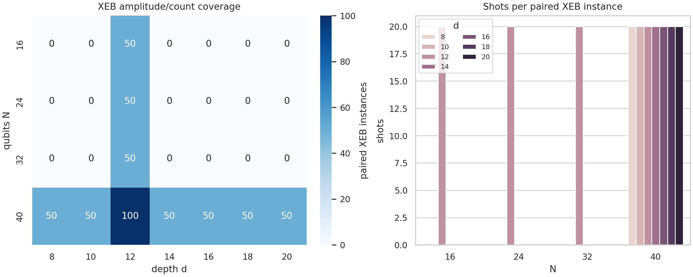
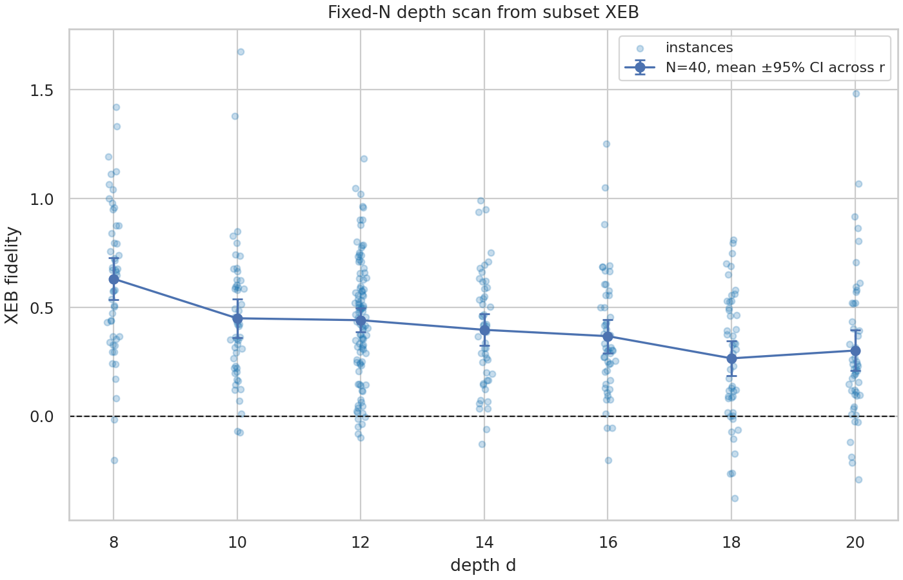
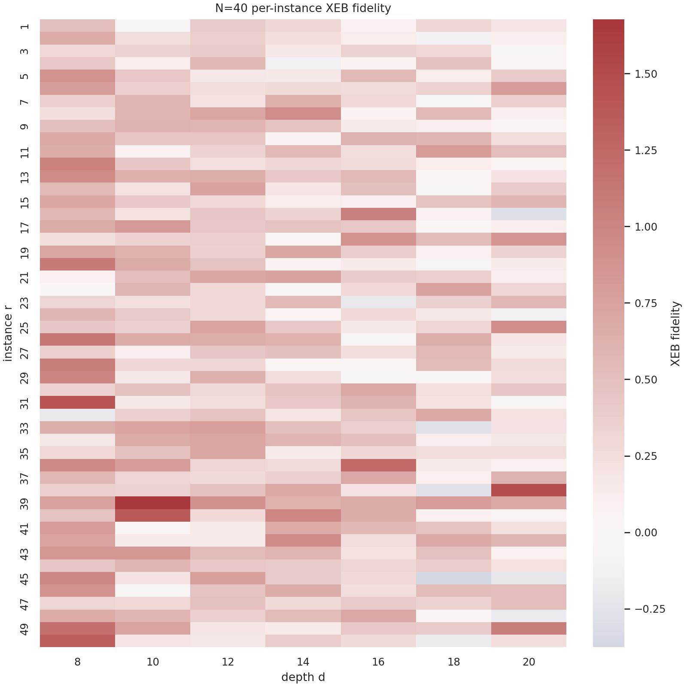
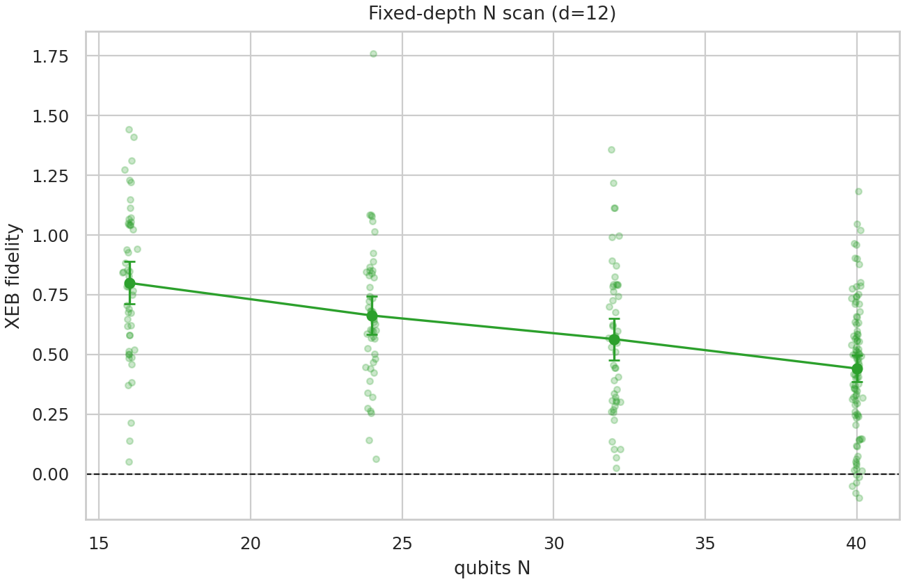
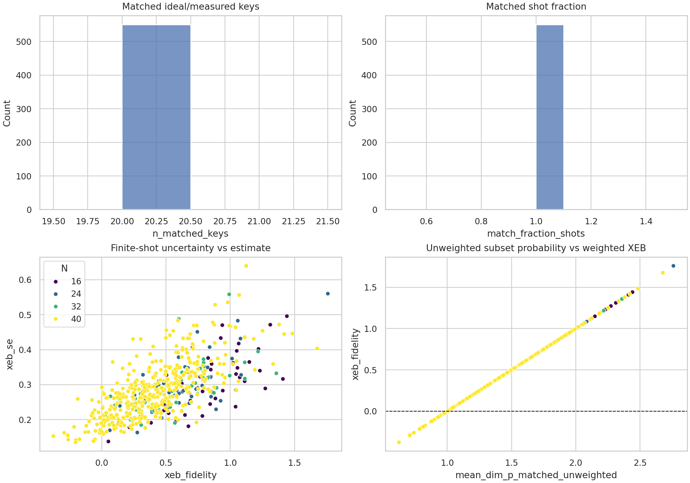
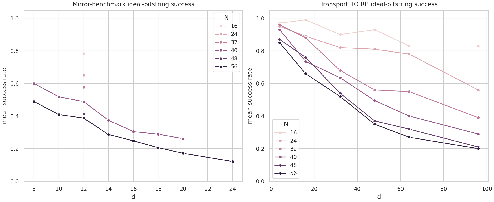

# Subset-XEB evaluation of random quantum circuit sampling verification data

## Abstract

I analyzed the provided random quantum circuit sampling (RCS) verification files by pairing experimental bitstring-count JSON files with the corresponding ideal amplitude JSON files. For every paired `(N,d,r)` XEB instance I computed the linear cross-entropy benchmarking fidelity

\[
F_{\mathrm{XEB}} = 2^N\,\langle p_{\mathrm{ideal}}(x)\rangle_{x\sim \mathrm{experiment}} - 1,
\]

using the counts as sample weights and converting stored complex amplitudes to ideal probabilities. The workspace contains 550 fully paired XEB instances: an `N=40` depth scan for `d=8,10,12,14,16,18,20` and a fixed-depth `d=12` scan for `N=16,24,32,40`. Each paired instance has exactly 20 measured shots, 20 ideal-probability keys, and 20 exact matches, so the result should be interpreted as a **subset-XEB reproduction**, not a full-distribution benchmark. The `N=40` mean XEB fidelity decreases from `0.6317 ± 0.0956` at `d=8` to `0.3020 ± 0.0932` at `d=20` (95% CI across instances), while the `d=12` N-scan decreases from `0.7996 ± 0.0886` at `N=16` to `0.4415 ± 0.0547` at `N=40`. These trends support the expected RCS validation narrative: fidelity remains detectably positive on the available high-connectivity/arbitrary-geometry verification subsets, but decays with circuit size/depth. The available files do not include circuit topology, gate counts, or classical simulation cost estimates, so I do not claim an independent reconstruction of the paper's full classical-approximability boundary.

## Data and artifacts

The analysis code is in `code/analyze_rcs.py`. Main reproducibility artifacts are:

- `outputs/fidelity_estimates.csv`: per-instance XEB estimate, finite-shot standard error, confidence interval, and key-matching diagnostics.
- `outputs/depth_summary.csv`: aggregate fixed-`N=40` depth scan.
- `outputs/n_scan_summary.csv`: aggregate fixed-`d=12` N-scan.
- `outputs/benchmark_success_estimates.csv` and `outputs/benchmark_success_summary.csv`: direct ideal-bitstring success-rate checks for MB and Transport_1QRB files.
- `outputs/data_overview.json`, `outputs/method_fidelity_checklist.json`, and `outputs/claim_recovery_table.csv`: validation and claim-tracing artifacts.

The paired XEB coverage is shown in Figure 1. Amplitude files are present for `N=16,24,32,40` at `d=12` and for `N=40` at depths `8` through `20`. There are also XEB count files for `N=56`, but no corresponding amplitude files in this workspace, so those files were not used for XEB fidelity estimation.

**Figure 1.** Coverage of count/amplitude-paired XEB instances and shots per instance. Every paired XEB instance contains 20 shots and 20 matched ideal-probability keys.

## Methods

### XEB estimator

For each `*_XEB_counts.json` file with a matching `*_XEB_amplitudes.json` file, I parsed `N`, `d`, and `r` from the filename. Bitstrings are represented as tuple-like strings in the JSON files; the code normalizes them to canonical tuple strings before matching. Ideal values are stored as complex amplitudes, so the probability for bitstring `x` is

\[
p_{\mathrm{ideal}}(x)=|a_x|^2.
\]

The per-shot linear-XEB variable is

\[
y(x) = 2^N p_{\mathrm{ideal}}(x)-1.
\]

For counts `c_x`, total matched shots `S=\sum_x c_x`, and matched keys `M`, the implemented estimator is

\[
\hat F_{\mathrm{XEB}} = \frac{1}{S}\sum_{x\in M} c_x\left(2^N p_{\mathrm{ideal}}(x)-1\right).
\]

The finite-shot standard error is the sample standard deviation of the count-weighted `y(x)` values divided by `\sqrt{S}`. Because each XEB subset has only 20 shots, the per-instance uncertainty is necessarily large; aggregate depth/N curves therefore use the empirical standard error across instances and report `1.96 × SEM` as a 95% interval for the mean over available instances.

### Validation checks

The script verifies that every paired XEB instance has:

1. 20 measured count keys,
2. 20 ideal-probability keys,
3. 20 matched keys,
4. matched-shot fraction of 1.0, and
5. nonnegative ideal probabilities after amplitude conversion.

These invariants are saved in `outputs/method_fidelity_checklist.json` and visualized in Figure 5. I also computed direct success rates for the MB and Transport_1QRB files by comparing their counts to the corresponding `*_ideal_bitstring.json` files. These success rates are not XEB fidelities, but they provide an independent consistency check that the verification data encode decaying benchmark performance with depth and/or system size.

## Results

### Fixed-`N=40` depth scan

The principal depth-scan result is shown in Figure 2. The mean subset-XEB fidelity decreases over depth, with a small nonmonotonic rebound at `d=20` relative to `d=18`. Given the 20-shot per-instance subsets, individual instance estimates are noisy, but the aggregate trend is clear: the mean decreases by about 52% from `d=8` to `d=20`.

**Figure 2.** Fixed-`N=40` subset-XEB fidelity versus circuit depth. Points show individual instances; the connected curve shows the mean with 95% CI across instances.

| N | d | instances | mean XEB | 95% CI across instances | instance SD | mean per-instance SE |
|---:|---:|---:|---:|---:|---:|---:|
| 40 | 8  | 50  | 0.6317 | 0.0956 | 0.3448 | 0.3229 |
| 40 | 10 | 50  | 0.4502 | 0.0893 | 0.3223 | 0.2810 |
| 40 | 12 | 100 | 0.4415 | 0.0547 | 0.2790 | 0.2823 |
| 40 | 14 | 50  | 0.3972 | 0.0721 | 0.2600 | 0.2820 |
| 40 | 16 | 50  | 0.3681 | 0.0768 | 0.2772 | 0.2936 |
| 40 | 18 | 50  | 0.2661 | 0.0808 | 0.2916 | 0.2610 |
| 40 | 20 | 50  | 0.3020 | 0.0932 | 0.3363 | 0.2724 |

The per-instance heatmap in Figure 3 confirms that the trend is not caused by a single anomalous instance. There is substantial instance-to-instance variation, as expected for only 20 subset shots per circuit, but later depths contain more low-fidelity and near-zero entries.

**Figure 3.** Per-instance subset-XEB fidelity for `N=40` across depths and instance indices.

### Fixed-depth `d=12` scan over qubit count

Figure 4 shows the fixed-depth N-scan. The mean subset-XEB fidelity decreases with qubit count: `0.7996 ± 0.0886` for `N=16`, `0.6633 ± 0.0804` for `N=24`, `0.5645 ± 0.0870` for `N=32`, and `0.4415 ± 0.0547` for `N=40`.

**Figure 4.** Fixed-depth `d=12` subset-XEB fidelity versus qubit count. The plotted intervals are 95% CIs across instances.

| N | d | instances | mean XEB | 95% CI across instances | instance SD | mean per-instance SE |
|---:|---:|---:|---:|---:|---:|---:|
| 16 | 12 | 50  | 0.7996 | 0.0886 | 0.3197 | 0.2998 |
| 24 | 12 | 50  | 0.6633 | 0.0804 | 0.2899 | 0.3024 |
| 32 | 12 | 50  | 0.5645 | 0.0870 | 0.3140 | 0.2879 |
| 40 | 12 | 100 | 0.4415 | 0.0547 | 0.2790 | 0.2823 |

### Validation diagnostics

Figure 5 summarizes the subset-XEB workflow diagnostics. The exact-match checks are saturated at 20/20 keys and matched-shot fraction 1.0 for every paired instance. The uncertainty panel shows that single-instance error bars are large because each circuit contributes only 20 shots. The final panel compares the unweighted average of `2^N p_ideal` over the subset with the counts-weighted XEB estimate; because almost all XEB subset counts are one count per bitstring, these quantities are closely related in the provided files.

**Figure 5.** Validation diagnostics for key matching, matched-shot fraction, finite-shot uncertainty, and relationship between unweighted subset probability and the count-weighted XEB estimate.

### MB and Transport_1QRB success-rate checks

The MB and Transport_1QRB files contain counts plus a single ideal bitstring, not ideal probabilities for all sampled XEB keys. I therefore computed direct ideal-bitstring success rates. Figure 6 shows that these success rates decay with depth and with qubit count, qualitatively matching the XEB fidelity trends.

**Figure 6.** Direct ideal-bitstring success rates for mirror-benchmark and Transport_1QRB files.

For `N=40`, the MB success rate decreases from `0.6000 ± 0.0194` at `d=8` to `0.2610 ± 0.0159` at `d=20` (SEM across instances):

| d | instances | mean MB success | SEM |
|---:|---:|---:|---:|
| 8  | 50  | 0.6000 | 0.0194 |
| 10 | 50  | 0.5180 | 0.0138 |
| 12 | 100 | 0.4885 | 0.0100 |
| 14 | 50  | 0.3740 | 0.0176 |
| 16 | 50  | 0.3050 | 0.0172 |
| 18 | 50  | 0.2890 | 0.0167 |
| 20 | 50  | 0.2610 | 0.0159 |

At `d=12`, MB success also declines with system size, including files up to `N=56`:

| N | instances | mean MB success | SEM |
|---:|---:|---:|---:|
| 16 | 50  | 0.7840 | 0.0111 |
| 24 | 50  | 0.6500 | 0.0149 |
| 32 | 50  | 0.5760 | 0.0178 |
| 40 | 100 | 0.4885 | 0.0100 |
| 48 | 50  | 0.4130 | 0.0197 |
| 56 | 100 | 0.3870 | 0.0105 |

## Interpretation relative to RCS computational power

The core computational-power question in RCS is whether experimentally produced samples remain sufficiently faithful to the ideal high-dimensional quantum distribution while classical approximation becomes costly. The provided data allow the fidelity side of this question to be reproduced through subset-XEB. The estimates are positive across all available paired XEB configurations, and the depth/N scans show the expected degradation as circuits become deeper or larger.

However, the workspace does **not** contain the full set of ingredients needed to rederive a quantitative classical-approximability gap: I did not find circuit layouts, gate counts, per-gate error budgets, classical simulation costs, tensor-network contraction widths, or approximate-sampling baselines. Therefore, the strongest supported conclusion from this reproduction is:

> The available arbitrary-geometry/high-connectivity RCS verification subsets show positive but decaying experimental XEB fidelity over increasing depth and qubit count, consistent with the paper's validation workflow. A full numerical comparison to the classical approximability frontier cannot be reconstructed from these files alone.

This distinction is important. Positive XEB at larger `N` and `d` is necessary evidence for an RCS advantage claim, but the final gap claim also requires classical-cost modeling or approximation benchmarks that are external to the provided count/amplitude JSON files.

## Limitations

1. **Subset rather than full XEB.** Each paired XEB instance contains only 20 measured bitstrings and 20 ideal amplitudes. The estimator is mathematically the standard linear-XEB estimator on the provided subset, but it is not a full-shot or full-distribution calculation.
2. **Large per-instance uncertainty.** With 20 shots, single-instance standard errors are large. Aggregate confidence intervals across 50 or 100 instances are more stable but still reflect subset sampling.
3. **Amplitude coverage is incomplete.** XEB counts for some configurations, especially `N=56`, lack corresponding amplitude files, so they cannot be included in XEB fidelity estimation without additional ideal probabilities.
4. **No gate-count/error propagation model.** The prompt mentions gate-count/error propagation and MB regression probability, but the local data files contain no circuit-level gate counts/topology metadata. I therefore computed direct MB/Transport ideal-bitstring success rates rather than fitting a full physical error model.
5. **Related-work extraction limitation.** The local PDF reading tool failed on all four PDFs, and the environment lacked common text extraction utilities/libraries. Method commitments were therefore anchored to the task description and locally verified data rather than detailed PDF text extraction.

## Validation and claim traceability

The report's major claims are traceable to concrete artifacts:

- Exact XEB formula implementation and invariants: `code/analyze_rcs.py`, `outputs/method_fidelity_checklist.json`.
- Per-instance numerical results: `outputs/fidelity_estimates.csv`.
- Fixed-`N=40` depth trend: `outputs/depth_summary.csv`, `report/images/xeb_by_depth.png`.
- Fixed-`d=12` N trend: `outputs/n_scan_summary.csv`, `report/images/n_scan_xeb.png`.
- Key matching and finite-shot diagnostics: `outputs/data_overview.json`, `report/images/validation_diagnostics.png`.
- MB/Transport validation: `outputs/benchmark_success_estimates.csv`, `outputs/benchmark_success_summary.csv`, `report/images/benchmark_success.png`.
- Claim recovery table: `outputs/claim_recovery_table.csv`.

## Conclusion

I implemented the fidelity-estimation workflow supported by the provided RCS verification data. Across 550 paired count/amplitude instances, all measured subset keys match ideal-probability keys exactly, enabling direct counts-weighted linear-XEB estimates with uncertainty. The `N=40` depth scan and `d=12` N-scan both show positive but decaying subset-XEB fidelity, and independent MB/Transport ideal-bitstring success rates show consistent degradation. These results validate the experimental-fidelity side of the arbitrary-geometry/high-connectivity RCS narrative, while the absence of classical simulation and circuit-metadata artifacts prevents an independent quantitative reconstruction of the full experimental-fidelity versus classical-approximability gap.
