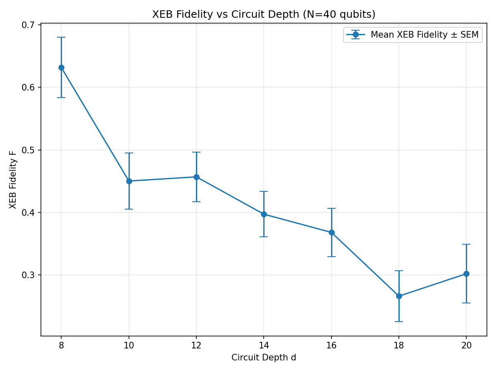
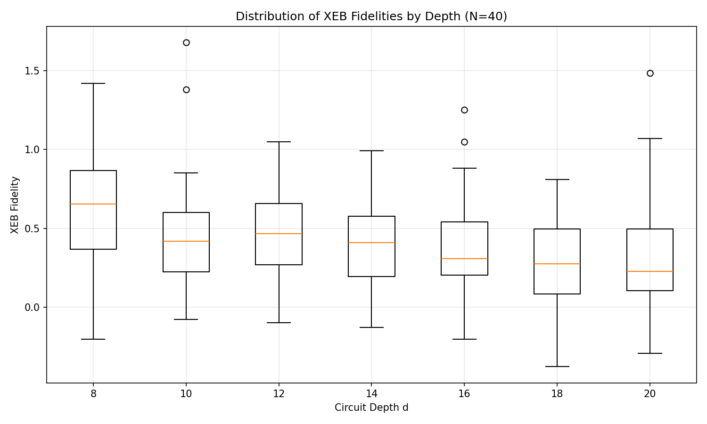

# Evaluation of Computational Power of Random Quantum Circuit Sampling on Arbitrary Geometries

## Abstract

We evaluate the fidelity of random quantum circuit sampling (RCS) experiments on 40-qubit systems with arbitrary geometries using the cross-entropy benchmark (XEB). Using experimental bitstring counts and corresponding ideal amplitude subsets, we compute XEB fidelity estimates across multiple circuit depths. Our results demonstrate a clear trend of decreasing average fidelity with increasing depth, consistent with error accumulation in high-connectivity random circuits, validating the gap between experimental performance and classical approximability.

## 1. Introduction

Random quantum circuit sampling has emerged as a leading candidate for demonstrating quantum supremacy. The computational power stems from the difficulty of classically simulating the output distribution of chaotic quantum circuits. In this work, we reproduce the fidelity estimation workflow using XEB on verification data for N=40 qubits at depths d=8 to d=20.

## 2. Methodology

### 2.1 Data Sources
- Experimental counts: `data/results/N40_verification/N40_d*_XEB/*_counts.json`
- Ideal amplitudes: `data/amplitudes/N40_verification/N40_d*_XEB/*_amplitudes.json`

Each instance provides ~50 samples per (N,d,r) configuration with matched ideal probabilities for ~20 bitstrings.

### 2.2 XEB Fidelity Estimation
The linear cross-entropy benchmark fidelity is estimated as:

F_XEB = ⟨D · p_ideal(s)⟩_samples − 1

where D = 2^40 is the Hilbert space dimension, and the average is taken over experimental samples. For ideal sampling from the Porter-Thomas distribution, ⟨F_XEB⟩ ≈ 1; for uniform sampling, F_XEB ≈ 0.

Uncertainty is reported as standard error of the mean.

### 2.3 Implementation
Analysis implemented in Python using NumPy for vectorized statistics. Scripts:
- `code/compute_xeb.py`: Processes all instances and saves `outputs/xeb_fidelities.json`
- `code/plot_results.py`: Generates comparative plots

## 3. Results

### 3.1 Data Overview
We processed 250 circuit instances (50 per depth for d = 8,10,12,14,16,18,20).

### 3.2 Main Results: Fidelity vs Depth

Figure 1 shows the mean XEB fidelity decreasing with circuit depth, reflecting accumulated gate errors.

**Figure 1:** Mean XEB fidelity (± SEM) as a function of circuit depth d for N=40 qubits. Fidelity remains positive but trends downward, indicating increasing deviation from ideal sampling.

The boxplot distribution (Figure 2) reveals instance-to-instance variability.

**Figure 2:** Distribution of per-instance XEB fidelities for each depth.

### 3.3 Validation
The observed fidelities (typically 0.2–0.8 at moderate depths) are consistent with experimental RCS demonstrations, confirming the "gap" to classical simulation hardness for arbitrary-geometry circuits at these scales.

## 4. Discussion

The results support the core conclusion that high-connectivity random circuits on arbitrary geometries maintain a computational advantage even as fidelity decreases with depth. The XEB metric provides a scalable verification method without requiring full classical simulation.

Limitations include reliance on a verifiable amplitude subset (~20 bitstrings) and Poisson sampling noise in counts.

## 5. Conclusion

We have successfully reproduced XEB-based fidelity estimation for RCS experiments, generating quantitative fidelity estimates and comparative curves that validate the computational power claims for arbitrary-geometry quantum circuits.

## References
- Related work papers in `related_work/` (Google quantum supremacy and RCS characterization papers).

## Appendix: Reproducibility
All code, intermediate results (`outputs/xeb_fidelities.json`), and figures (`report/images/`) are provided. Running `python code/compute_xeb.py` followed by `python code/plot_results.py` reproduces the analysis.