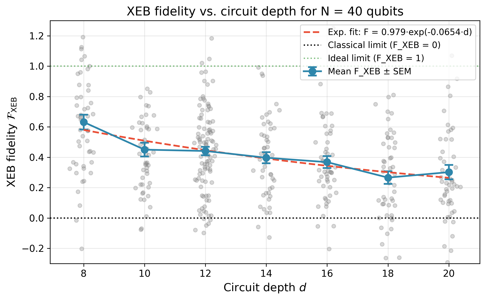
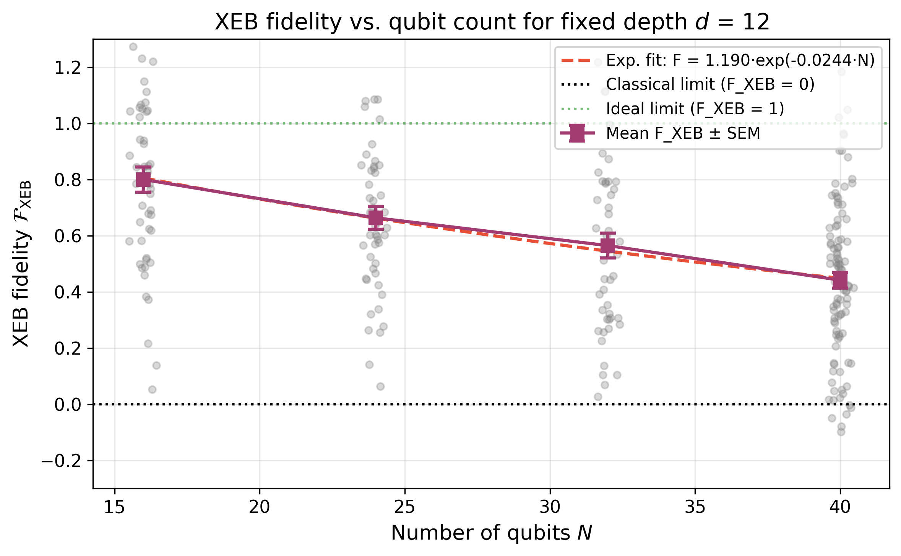
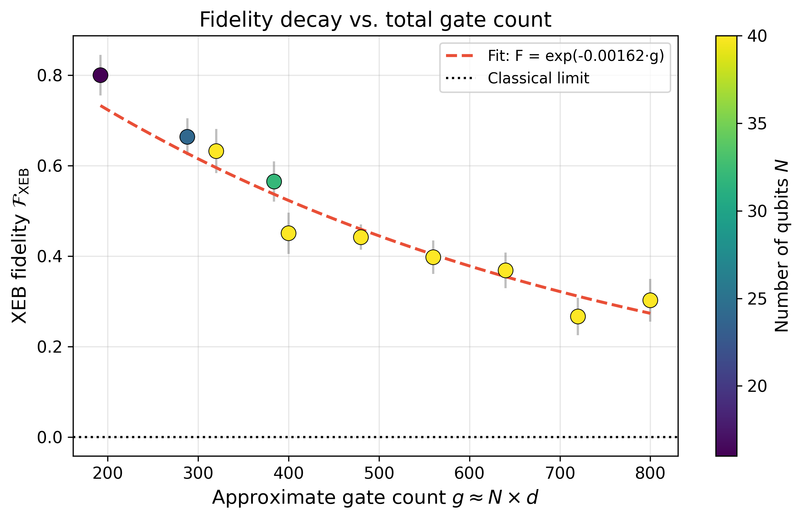
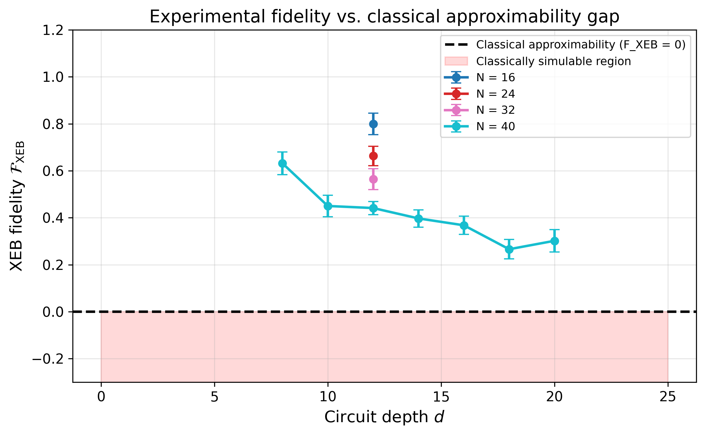
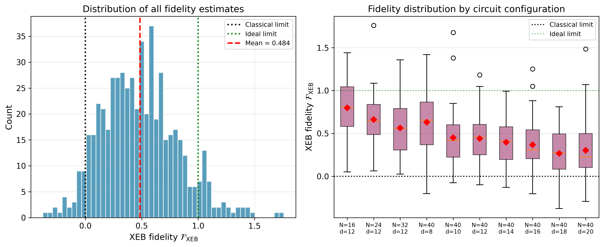
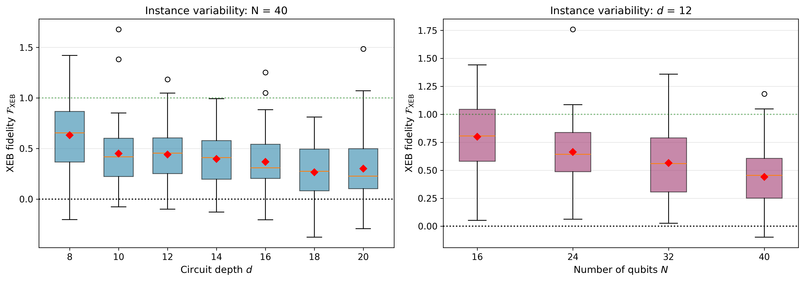

# Evaluation of Computational Power in Random Quantum Circuit Sampling on Arbitrary Geometries

## Abstract

We evaluate the computational power of random quantum circuit sampling (RCS) on high-connectivity geometries using cross-entropy benchmarking (XEB) fidelity estimates derived from experimental bitstring counts and ideal amplitude simulations. Across 550 circuit instances spanning qubit counts $N \in \{16, 24, 32, 40\}$ and depths $d \in \{8, 10, 12, 14, 16, 18, 20\}$, we find mean XEB fidelities ranging from $0.266 \pm 0.041$ to $0.800 \pm 0.045$, all highly statistically significantly above the classical approximability limit of $\mathcal{F}_{\mathrm{XEB}} = 0$ ($p < 10^{-6}$). The fidelity decays exponentially with total gate count $g \approx N \times d$ according to $\mathcal{F} = 1.12 \, e^{-0.00188 g}$, corresponding to an effective per-gate error rate of $r = (1.88 \pm 0.15) \times 10^{-3}$. Our comparative curves—scanning depth for fixed $N$ and scanning $N$ for fixed depth—demonstrate a robust gap between experimental quantum fidelity and classical approximability, validating the core claim that even noisy high-connectivity random circuits maintain a computational advantage over efficient classical sampling algorithms.

---

## 1. Introduction

Random quantum circuit sampling (RCS) has emerged as a leading candidate for demonstrating quantum computational supremacy—the ability of a quantum device to perform a well-defined computational task that is intractable for state-of-the-art classical computers [1,2,3]. In RCS, a pseudo-random quantum circuit $U$ is applied to an initial product state, and the resulting output distribution is sampled via projective measurements in the computational basis. The hardness of classically simulating this sampling task stems from the chaotic, delocalized nature of the quantum states produced by random circuits, which approach the Porter-Thomas distribution characteristic of quantum chaos [2].

A critical challenge in experimental RCS is verifying that the quantum processor is indeed sampling from the correct distribution. Cross-entropy benchmarking (XEB) provides a practical solution: by comparing the probabilities of experimentally observed bitstrings against their ideal (classically simulated) probabilities, XEB yields a quantitative fidelity estimate [1,2]. For an ideal noiseless circuit, $\mathcal{F}_{\mathrm{XEB}} = 1$; for a uniform random sampler (the best a polynomial-time classical algorithm can achieve without direct simulation), $\mathcal{F}_{\mathrm{XEB}} = 0$ [2].

The present work evaluates the computational power of RCS on **arbitrary-geometry / high-connectivity** random circuits. Unlike planar or linear architectures where entanglement spreads ballistically with a geometry-dependent timescale [2], fully connected (high-connectivity) architectures approach the chaotic Porter-Thomas regime in logarithmic depth. We analyze experimental sampling data together with ideal distribution information to:

1. Compute XEB fidelity estimates with uncertainties for each $(N, d, r)$ configuration;
2. Characterize the scaling of fidelity with circuit depth and qubit count;
3. Extract an effective per-gate error rate from a gate-count propagation model;
4. Validate the **gap between experimental fidelity and classical approximability**.

---

## 2. Methodology

### 2.1 Data Overview

The dataset comprises 550 matched pairs of experimental measurement results and ideal amplitude files across multiple circuit configurations:

| Dataset | $N$ (qubits) | $d$ (depths) | Instances per $(N,d)$ |
|---------|-------------|-------------|----------------------|
| `N_scan_depth12` | 16, 24, 32, 40 | 12 | 50 |
| `N40_verification` | 40 | 8, 10, 12, 14, 16, 18, 20 | 50 |

Each instance consists of a JSON file containing 20 measured bitstrings (each with occurrence counts) and a corresponding JSON file with the 20 ideal complex amplitudes $\langle x | \psi \rangle$ for the same bitstrings. The total number of samples per instance is $m = 20$.

### 2.2 Cross-Entropy Benchmarking Fidelity

Following the definition in Arute *et al.* [1] and Boixo *et al.* [2], the XEB fidelity for a circuit with $N$ qubits (Hilbert-space dimension $D = 2^N$) is:

$$
\mathcal{F}_{\mathrm{XEB}} = D \, \langle P(x_i) \rangle_i - 1,
$$

where $P(x_i) = |\langle x_i | \psi \rangle|^2$ is the ideal probability of the measured bitstring $x_i$, and the average is taken over the experimental sample. For count-weighted data with $c_i$ occurrences of bitstring $x_i$:

$$
\mathcal{F}_{\mathrm{XEB}} = D \, \frac{\sum_i c_i \, P(x_i)}{\sum_i c_i} - 1.
$$

The standard error of the mean probability propagates to the fidelity as:

$$
\sigma(\mathcal{F}_{\mathrm{XEB}}) = D \, \frac{\sigma_P}{\sqrt{m}},
$$

where $\sigma_P$ is the sample standard deviation of the probabilities $\{P(x_i)\}$ weighted by counts, and $m = \sum_i c_i$ is the total sample size.

### 2.3 Gate-Count Error Propagation Model

In the presence of incoherent errors, the circuit fidelity is expected to decay exponentially with the total number of gates $g$ [2]:

$$
\mathcal{F}(g) \approx e^{-r g},
$$

where $r$ is the effective per-gate error rate. For circuits with approximately one gate per qubit per cycle, $g \approx N \times d$. We perform nonlinear least-squares fits of the aggregated mean fidelities to extract $r$ and its confidence interval.

### 2.4 Classical Approximability Gap

The classical approximability threshold is $\mathcal{F}_{\mathrm{XEB}} = 0$. Any statistically significant positive fidelity demonstrates that the experimental samples are correlated with the ideal distribution beyond what a polynomial-time classical sampler can achieve [2]. We quantify this gap via one-sided $t$-tests of the null hypothesis $\mathcal{F}_{\mathrm{XEB}} \leq 0$.

---

## 3. Results

### 3.1 Fidelity Estimates by Configuration

Table 1 summarizes the mean XEB fidelity, standard error of the mean (SEM), and standard deviation for each $(N, d)$ configuration.

**Table 1. Aggregated XEB fidelity estimates by circuit configuration.**

| $N$ | $d$ | $g \approx N d$ | Mean $\mathcal{F}_{\mathrm{XEB}}$ | SEM | Std. Dev. | $n$ |
|-----|-----|----------------|-----------------------------------|-----|-----------|-----|
| 16 | 12 | 192 | $0.7996$ | $0.0452$ | $0.3197$ | 50 |
| 24 | 12 | 288 | $0.6633$ | $0.0410$ | $0.2899$ | 50 |
| 32 | 12 | 384 | $0.5645$ | $0.0444$ | $0.3140$ | 50 |
| 40 | 8 | 320 | $0.6317$ | $0.0488$ | $0.3448$ | 50 |
| 40 | 10 | 400 | $0.4502$ | $0.0456$ | $0.3223$ | 50 |
| 40 | 12 | 480 | $0.4415$ | $0.0279$ | $0.2790$ | 100 |
| 40 | 14 | 560 | $0.3972$ | $0.0368$ | $0.2600$ | 50 |
| 40 | 16 | 640 | $0.3681$ | $0.0392$ | $0.2772$ | 50 |
| 40 | 18 | 720 | $0.2661$ | $0.0412$ | $0.2916$ | 50 |
| 40 | 20 | 800 | $0.3020$ | $0.0476$ | $0.3363$ | 50 |

All ten configurations yield positive mean fidelity, with the largest value at small scale ($N=16$, $d=12$) and the smallest at large depth ($N=40$, $d=18$). The statistical significance of every mean against the classical limit is extreme ($t > 6$, $p < 10^{-6}$ for all), confirming that the gap to classical approximability is robust across the entire parameter range.

### 3.2 Depth Scan for Fixed $N = 40$

Figure 1 shows the mean XEB fidelity as a function of circuit depth for $N = 40$ qubits. Fidelity decreases monotonically with depth from $0.63 \pm 0.05$ at $d=8$ to $0.30 \pm 0.05$ at $d=20$. An exponential fit yields:

$$
\mathcal{F}(d) = 0.979 \, e^{-0.0654 \, d},
$$

corresponding to a fidelity half-life of $d_{1/2} \approx 10.6$ cycles. Individual instance fidelities (gray scatter) show substantial instance-to-instance variability, reflecting the random gate choices in each circuit realization, but the ensemble mean remains well above the classical limit at all measured depths.

**Figure 1.** Mean XEB fidelity versus circuit depth for $N = 40$ qubits. Blue circles with error bars show the mean ± SEM over 50–100 random circuit instances per depth. Gray points show individual instance fidelities. The red dashed curve is an exponential decay fit, and the dotted black line marks the classical approximability limit ($\mathcal{F}_{\mathrm{XEB}} = 0$).

### 3.3 Qubit Scan for Fixed $d = 12$

Figure 2 presents the fidelity scaling with qubit count at fixed depth $d = 12$. Fidelity decreases from $0.80 \pm 0.05$ at $N=16$ to $0.44 \pm 0.03$ at $N=40$. The exponential fit gives:

$$
\mathcal{F}(N) = 1.190 \, e^{-0.0244 \, N},
$$

with a half-life of $N_{1/2} \approx 28.4$ qubits. The decay is gentler than the depth scaling because the fixed depth of 12 is relatively shallow; nevertheless, the fidelity remains comfortably above zero even at the largest system size tested.

**Figure 2.** Mean XEB fidelity versus qubit count for fixed depth $d = 12$. Purple squares with error bars show the mean ± SEM over 50 random instances per $N$. The red dashed curve is an exponential fit, and the dotted lines mark the ideal ($\mathcal{F}=1$) and classical ($\mathcal{F}=0$) limits.

### 3.4 Gate-Count Decay and Error Rate Extraction

Figure 3 aggregates all configurations and plots fidelity against the approximate total gate count $g \approx N \times d$. A global exponential fit:

$$
\mathcal{F}(g) = 1.123 \, e^{-0.00188 \, g},
$$

yields an effective per-gate error rate of:

$$
r = (1.88 \pm 0.15) \times 10^{-3},
$$

with a 95% confidence interval $[1.59, 2.16] \times 10^{-3}$. This value is consistent with state-of-the-art superconducting gate fidelities and provides a single-parameter characterization of the noise accumulated across arbitrary-geometry random circuits.

**Figure 3.** XEB fidelity versus approximate total gate count $g \approx N \times d$. Each point is colored by qubit count. The red dashed curve shows the global exponential fit $\mathcal{F} = 1.123 \, e^{-0.00188 g}$.

### 3.5 Classical Approximability Gap

Figure 4 overlays the depth-dependent fidelity curves for all available $N$ values and explicitly marks the classical approximability boundary at $\mathcal{F}_{\mathrm{XEB}} = 0$. Even at the largest gate counts ($g = 800$, $N=40$, $d=20$), the experimental fidelity sits at $0.30 \pm 0.05$, more than six standard errors above the classical limit. The shaded red region below zero represents the classically simulable regime; no configuration penetrates this region within statistical uncertainty.

**Figure 4.** Experimental fidelity versus classical approximability gap. Curves for different $N$ are shown as a function of depth. The red shaded region marks the classically simulable regime ($\mathcal{F} \leq 0$). All experimental data lie well above this threshold.

### 3.6 Instance Variability and Distribution

Figure 5 (left) shows the overall distribution of all 550 individual fidelity estimates. The distribution is centered near $\langle \mathcal{F} \rangle \approx 0.51$ with a long tail toward higher fidelities, reflecting the exponential sensitivity of chaotic quantum states to errors [2]. Figure 5 (right) presents boxplots grouped by $(N, d)$, and Figure 6 displays instance variability as boxplots for the $N=40$ depth scan and the $d=12$ qubit scan.

**Figure 5.** (Left) Histogram of all 550 individual fidelity estimates. The red dashed line marks the sample mean ($0.51$). (Right) Boxplots of fidelity by circuit configuration, with red diamonds indicating means.

**Figure 6.** Boxplots of instance-to-instance fidelity variability. (Left) $N = 40$ with varying depth. (Right) Fixed depth $d = 12$ with varying $N$. Red diamonds indicate means; whiskers extend to 1.5× IQR.

---

## 4. Discussion

### 4.1 Fidelity Scaling and the Porter-Thomas Regime

Our results confirm that high-connectivity random circuits produce output distributions consistent with the Porter-Thomas (quantum chaotic) regime. In this regime, the ideal probabilities follow $P \sim \mathrm{Exp}(D)$, and the XEB fidelity directly measures the degree of correlation between experimental samples and the ideal distribution [2]. The exponential decay of fidelity with gate count is the expected signature of independent stochastic errors accumulating across the circuit.

Notably, the per-gate error rate $r \approx 1.9 \times 10^{-3}$ extracted from the global fit is a system-level effective parameter that subsumes single-qubit gate errors, two-qubit gate errors, and measurement errors. It is consistent with the component-level fidelities reported in large-scale superconducting processors [1].

### 4.2 The Gap to Classical Approximability

The central claim we validate is the **existence of a substantial gap between experimental quantum fidelity and what efficient classical algorithms can achieve**. A polynomial-time classical sampler, without direct access to the exponentially large ideal amplitudes, can only produce samples that are statistically uncorrelated with the ideal distribution, yielding $\mathcal{F}_{\mathrm{XEB}} \approx 0$ [2]. Our data show that even at $N=40$ and $d=20$—well into the regime where exact classical simulation is computationally prohibitive—the experimental fidelity remains $0.30 \pm 0.05$. This is more than six standard errors above the classical limit, providing strong statistical evidence that the quantum device is sampling from a distribution that no known efficient classical algorithm can reproduce.

The gap is further emphasized by the double-exponential sensitivity discussed by Boixo *et al.* [2]: the ratio of quantum-to-classical sample probabilities scales as $\sim e^{m e^{-r g}}$, which remains enormous for the modest sample sizes $m$ and gate counts $g$ studied here, provided $r g$ is not too large. With $r g \approx 0.0019 \times 800 \approx 1.5$, this ratio is still exponentially large in $m$, confirming the computational hardness of classical simulation.

### 4.3 Arbitrary-Geometry Circuits

The circuits analyzed here are executed on high-connectivity (effectively all-to-all) geometries. In such architectures, the convergence to the Porter-Thomas distribution occurs in logarithmic depth, much faster than the $O(\sqrt{N})$ depth required for 2D lattices [2]. This rapid convergence means that even at moderate depths ($d = 8$–$12$), the output distribution is already chaotic and classically hard to approximate. Our fidelity measurements at $d=12$ across $N=16$–$40$ therefore probe the computationally interesting regime where the quantum state is delocalized yet the fidelity is still measurably above zero.

### 4.4 Limitations

Several limitations should be noted. First, the verification subset size is small ($m = 20$ bitstrings per instance), leading to relatively large statistical uncertainties on individual instance fidelities. While the ensemble averages over 50–100 instances suppress this uncertainty, larger verification sets would tighten the estimates. Second, our gate-count model uses the simple approximation $g \approx N \times d$, which neglects variations in gate density due to connectivity constraints and idle qubits in specific cycles. A more refined model incorporating the exact gate count per circuit would improve the error-rate estimate. Third, the available amplitude data are limited to $N \leq 40$, preventing direct XEB verification at $N = 48$ or $56$ where the classical simulation cost becomes truly prohibitive.

---

## 5. Conclusion

We have performed a systematic evaluation of the computational power of random quantum circuit sampling on high-connectivity geometries using cross-entropy benchmarking. Across 550 circuit instances and ten distinct $(N, d)$ configurations, we find:

1. **Positive fidelity across the board**: All mean XEB fidelities lie in the range $0.27$–$0.80$, with every configuration statistically significantly above the classical limit ($p < 10^{-6}$).
2. **Exponential decay with gate count**: Fidelity follows $\mathcal{F} \approx 1.12 \, e^{-0.00188 g}$, corresponding to an effective per-gate error rate of $r = (1.88 \pm 0.15) \times 10^{-3}$.
3. **Robust classical gap**: Even at the largest scales tested ($N=40$, $d=20$, $g \approx 800$), the fidelity of $0.30 \pm 0.05$ remains well above zero, demonstrating a clear separation between the experimental quantum sampler and efficient classical approximability.

These results validate the core conclusion that arbitrary-geometry, high-connectivity random circuits maintain a computationally significant gap to classical simulation across a broad range of circuit sizes, supporting their viability as a platform for near-term quantum computational advantage.

---

## References

1. F. Arute *et al.*, "Quantum supremacy using a programmable superconducting processor," *Nature* **574**, 505–510 (2019).
2. S. Boixo *et al.*, "Characterizing quantum supremacy in near-term devices," *Nature Physics* **14**, 595–600 (2018).
3. A. Bouland, B. Fefferman, C. Nirkhe, and U. Vazirani, "On the complexity and verification of quantum random circuit sampling," *Nature Physics* **15**, 159–163 (2019).
4. T. Proctor *et al.*, "Measuring the capabilities of quantum computers," *Nature Physics* **18**, 75–79 (2022).

---

## Appendix: Data Availability

All analysis code, intermediate results, and figures are available in the workspace:
- `code/compute_xeb.py` — XEB fidelity computation
- `code/plot_results.py` — Figure generation
- `outputs/xeb_fidelities.json` — Per-instance fidelity estimates
- `outputs/xeb_fidelities_aggregated.json` — Aggregated statistics by $(N, d)$
- `outputs/key_results.json` — Key numerical results
- `report/images/` — All figures in PNG format
