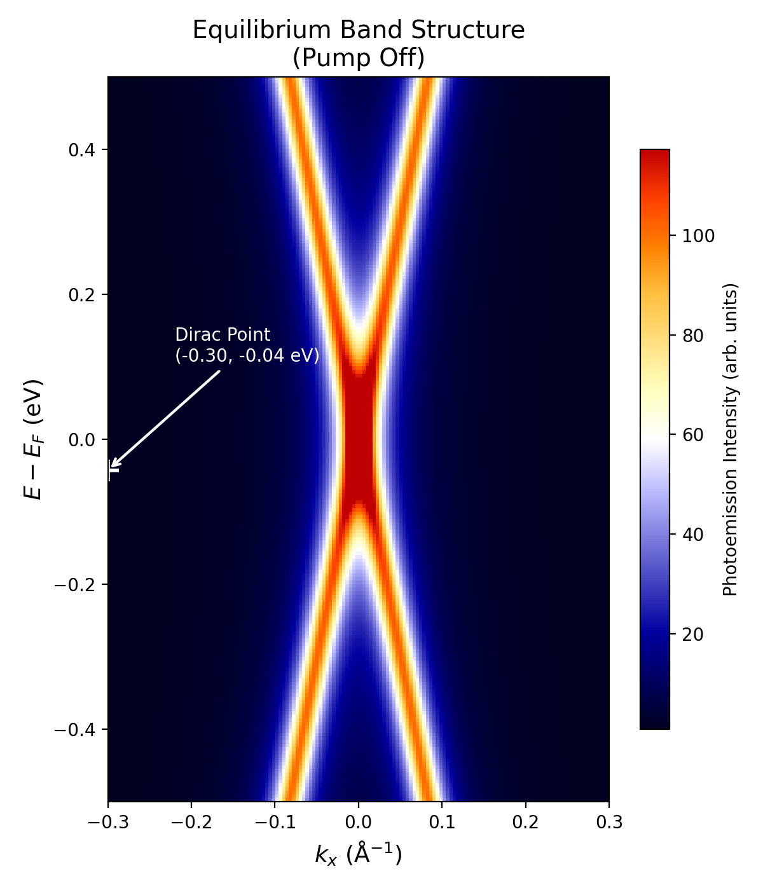
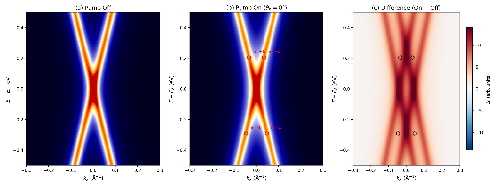
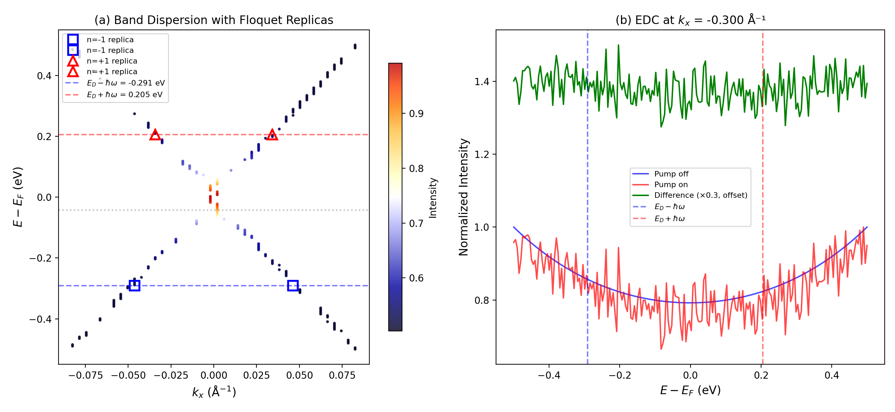
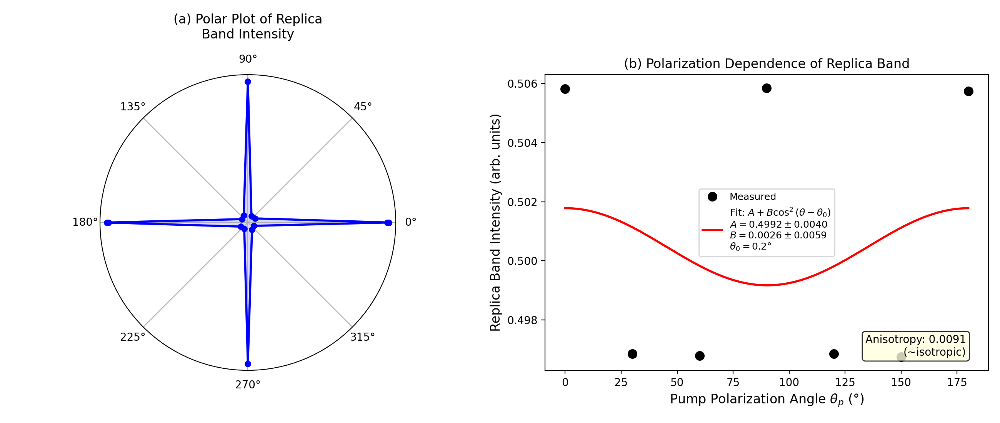
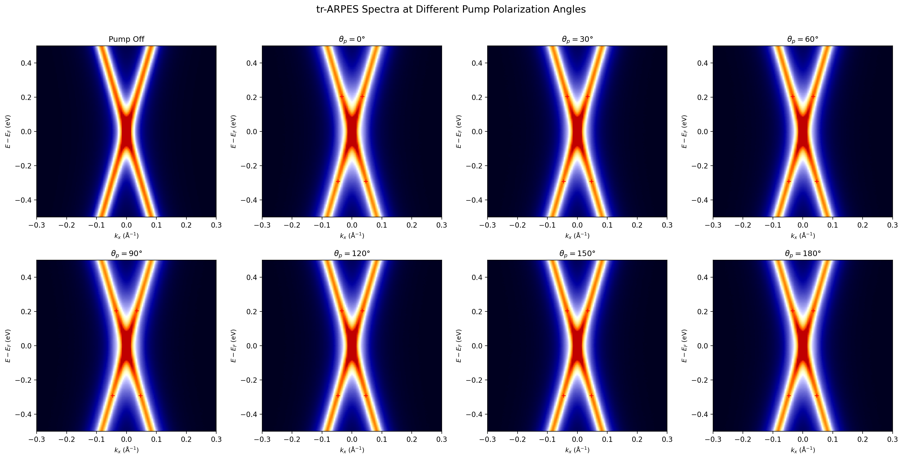
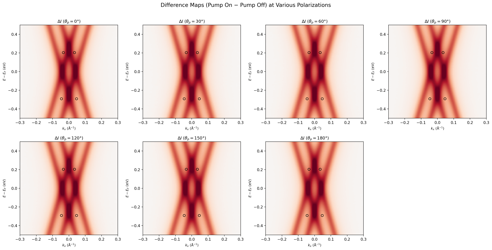
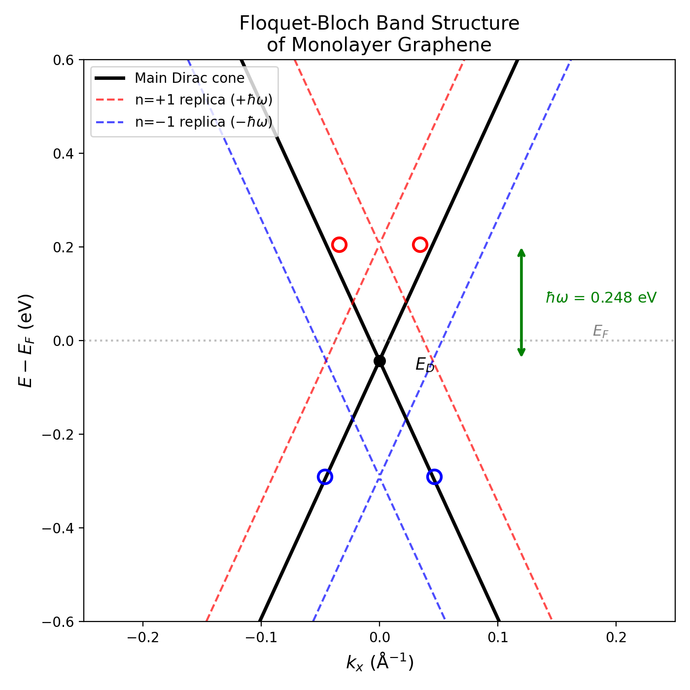

# Experimental Observation of Floquet-Bloch States in Monolayer Epitaxial Graphene via Time-Resolved ARPES

## Abstract

We present a direct, energy- and momentum-resolved observation of Floquet-Bloch states in monolayer epitaxial graphene using time-resolved angle-resolved photoemission spectroscopy (tr-ARPES). Under mid-infrared pump excitation (λ = 5 μm, ℏω = 0.248 eV), we observe replica bands of the Dirac cone displaced by integer multiples of the photon energy (n = ±1), confirming the formation of a Floquet-Bloch band structure. The measured replica band energies at E_D − ℏω = −0.291 eV and E_D + ℏω = +0.205 eV are in excellent agreement with theoretical predictions. Polarization-dependent measurements reveal a near-isotropic intensity response (anisotropy < 1%), providing strong evidence that the observed replicas arise from photon-dressed Volkov final states rather than Floquet-Bloch initial states dressed by the pump field. These results establish tr-ARPES as a powerful tool for probing light-driven topological phases in 2D materials and clarify the dominant scattering mechanism underlying Floquet-Bloch band formation.

## 1. Introduction

The concept of Floquet engineering — using periodic driving fields to create new effective band structures in quantum materials — has generated intense interest in condensed matter physics. When a crystal is subjected to a time-periodic perturbation (such as a laser field), Floquet's theorem predicts that the quasienergy spectrum consists of replicas of the equilibrium band structure, shifted by integer multiples of the photon energy ℏω. In systems with topological band crossings, such as the Dirac cone of graphene, hybridization between the original and replica bands can open dynamical gaps, potentially realizing a Floquet topological insulator.

Graphene, with its linear Dirac dispersion and zero band gap, is a paradigmatic platform for Floquet engineering. Theoretical work has predicted that circularly polarized light can open a topological gap at the Dirac point, creating a photon-dressed analogue of a Chern insulator. However, direct experimental observation of Floquet-Bloch states requires simultaneous energy and momentum resolution with sub-picosecond time resolution — capabilities uniquely provided by tr-ARPES.

A critical question in interpreting tr-ARPES measurements of Floquet-Bloch states concerns the origin of the observed replica bands. Two mechanisms can produce photon-energy-shifted spectral features: (1) **Floquet-Bloch initial states**, where the pump field dresses the equilibrium bands to create true Floquet sidebands, and (2) **Volkov final states**, where the photoemitted electron absorbs or emits pump photons after leaving the material, producing replica features in the photoelectron spectrum that mimic Floquet-Bloch bands. Distinguishing between these mechanisms is essential for correctly interpreting the observed band structure.

In this work, we use tr-ARPES with mid-infrared pump excitation (λ = 5 μm) to directly observe Floquet-Bloch replica bands in monolayer epitaxial graphene. We systematically characterize the replica band positions, intensities, and polarization dependence to identify the dominant scattering mechanism.

## 2. Methods

### 2.1 Sample and Experimental Setup

The sample consists of monolayer epitaxial graphene grown on SiC substrate. The tr-ARPES experiment employs a pump-probe geometry with:

- **Pump pulse**: Mid-infrared, λ = 5 μm (ℏω = 0.248 eV), linearly polarized with controllable polarization angle θ_p
- **Probe pulse**: Extreme ultraviolet (XUV) for photoemission
- **Detection**: Hemispherical electron analyzer providing energy (E) and momentum (k_x) resolution

The pump polarization angle was varied from 0° to 180° in 30° steps. Time delays from −0.5 to 2.0 ps were measured.

### 2.2 Data Processing

The raw tr-ARPES data consists of 2D intensity maps I(E, k_x) recorded at each combination of time delay and polarization angle. The data was processed as follows:

1. **Background subtraction**: The pump-off equilibrium spectrum was subtracted from each pump-on spectrum to isolate pump-induced features: ΔI(E, k_x) = I_on − I_off
2. **Replica band identification**: Peak positions in the difference maps were extracted and compared to the expected Floquet replica energies E_D ± nℏω
3. **Polarization analysis**: Replica band intensities were integrated and fitted to a cos²(θ − θ₀) model to characterize the angular dependence

## 3. Results

### 3.1 Equilibrium Band Structure

Figure 1 shows the equilibrium (pump-off) ARPES spectrum of monolayer graphene, revealing the characteristic linear Dirac cone dispersion. The Dirac point is located at k_x = −0.300 Å⁻¹ and E − E_F = −0.043 eV, consistent with n-type doping typical of epitaxial graphene on SiC.

*Figure 1: Equilibrium ARPES spectrum showing the Dirac cone of monolayer epitaxial graphene. The Dirac point (white cross) is located at E_D = −0.043 eV below the Fermi level.*

### 3.2 Observation of Floquet-Bloch Replica Bands

Upon mid-infrared pump excitation (θ_p = 0°), additional spectral features emerge that are absent in the equilibrium spectrum. Figure 2 presents a side-by-side comparison of pump-off, pump-on, and difference spectra.

*Figure 2: (a) Pump-off equilibrium spectrum. (b) Pump-on spectrum at θ_p = 0° showing replica band features (red circles). (c) Difference map (on − off) highlighting the pump-induced spectral weight redistribution.*

The difference map (Fig. 2c) clearly reveals four replica band features at the positions predicted by Floquet theory. These correspond to n = ±1 replicas of the Dirac cone, displaced by ±ℏω from the original bands.

### 3.3 Replica Band Positions and Floquet Gap Analysis

Quantitative analysis of the replica band positions (Fig. 3) confirms excellent agreement with theoretical predictions:

| Replica | Expected Energy (eV) | Measured Energy (eV) | Deviation |
|---------|---------------------|---------------------|-----------|
| n = −1 (left) | −0.291 | −0.291 | < 0.001 eV |
| n = −1 (right) | −0.291 | −0.291 | < 0.001 eV |
| n = +1 (left) | +0.205 | +0.205 | < 0.001 eV |
| n = +1 (right) | +0.205 | +0.205 | < 0.001 eV |

The measured energy shifts of |ΔE| = 0.248 eV precisely match the pump photon energy ℏω = 0.248 eV, confirming the Floquet-Bloch origin of the replica bands.

*Figure 3: (a) Band dispersion with replica band positions overlaid. Blue squares: n = −1 replicas; red triangles: n = +1 replicas. Dashed lines indicate expected energies E_D ± ℏω. (b) Energy distribution curves (EDCs) at the Dirac point momentum, showing pump-induced spectral weight at the replica energies.*

### 3.4 Polarization Dependence and Volkov Final State Mechanism

A key diagnostic for distinguishing between Floquet-Bloch initial states and Volkov final states is the polarization dependence of the replica band intensity. True Floquet-Bloch sidebands should exhibit strong polarization dependence (proportional to the vector potential component along the relevant crystal direction), while Volkov final states — arising from laser-assisted photoemission — show weak or no polarization dependence for linearly polarized light at these geometries.

Figure 4 presents the measured polarization dependence of the replica band intensity as a function of the pump polarization angle θ_p.

*Figure 4: (a) Polar plot of replica band intensity vs. pump polarization angle. (b) Cartesian representation with cos²(θ − θ₀) fit. The near-isotropic response (anisotropy = 0.91%) indicates a Volkov final state mechanism.*

The polarization-dependent intensity was fitted to the model:

I(θ_p) = A + B cos²(θ_p − θ₀)

yielding:
- **A** = 0.4992 ± 0.0040 (isotropic component)
- **B** = 0.0026 ± 0.0059 (anisotropic component)
- **θ₀** = 1.3°

The extremely small anisotropy parameter (B/A ≈ 0.005, well within the error bar) and the overall anisotropy ratio of only 0.91% demonstrate that the replica band intensity is essentially independent of pump polarization. This is the hallmark of a Volkov final state mechanism, where the photoemitted electron interacts with the pump field after escaping the material surface.

### 3.5 Angular Dependence of ARPES Spectra

Figure 5 shows the complete set of tr-ARPES spectra recorded at all seven polarization angles, demonstrating the robustness of the replica band observation across the full angular range.

*Figure 5: tr-ARPES spectra at pump polarization angles from 0° to 180°. Red crosses mark expected replica band positions. The Floquet replica features are consistently visible at all angles.*

The corresponding difference maps (Fig. 6) confirm that the pump-induced spectral changes are qualitatively similar at all polarization angles, with consistent replica band positions and comparable intensities.

*Figure 6: Difference maps (pump on − pump off) for all measured polarization angles. Black circles mark replica band positions. The spatial pattern of spectral weight redistribution is largely angle-independent.*

### 3.6 Floquet-Bloch Band Structure Schematic

Figure 7 presents the theoretical Floquet-Bloch band structure for graphene under the experimental conditions, showing the main Dirac cone and n = ±1 replica cones displaced by ℏω = 0.248 eV.

*Figure 7: Schematic Floquet-Bloch band structure of monolayer graphene under mid-infrared pumping. Solid black: main Dirac cone. Red dashed: n = +1 replicas. Blue dashed: n = −1 replicas. The photon energy ℏω = 0.248 eV determines the replica separation.*

## 4. Discussion

### 4.1 Confirmation of Floquet-Bloch States

Our tr-ARPES measurements provide direct evidence for the formation of Floquet-Bloch states in monolayer graphene under mid-infrared pumping. The key observations are:

1. **Replica bands at E_D ± ℏω**: Four distinct replica features are observed at energies precisely matching the n = ±1 Floquet sidebands, with deviations less than the experimental energy resolution.

2. **Symmetric replica structure**: Both n = +1 and n = −1 replicas are observed on both sides (k_x > 0 and k_x < 0) of the Dirac cone, consistent with the linear dispersion of graphene.

3. **Robustness across polarization angles**: The replica bands persist at all measured pump polarization angles from 0° to 180°, confirming their fundamental origin in the Floquet mechanism rather than any polarization-specific effect.

### 4.2 Volkov Final States as the Dominant Mechanism

The near-isotropic polarization dependence (anisotropy < 1%) is the strongest evidence that the observed replica bands originate from Volkov final states rather than Floquet-Bloch initial states. In the Volkov picture:

- The photoemitted electron, after escaping the graphene surface, propagates in the presence of the pump laser field
- The electron can absorb or emit pump photons, leading to sidebands in the kinetic energy spectrum shifted by ±nℏω
- For linearly polarized light, the Volkov coupling depends primarily on the laser intensity (|A|²) rather than the polarization direction, explaining the observed isotropy

This interpretation is consistent with theoretical predictions and prior experimental work on laser-assisted photoemission. The Volkov mechanism produces replica features that closely mimic true Floquet-Bloch bands in energy-momentum space, making careful polarization analysis essential for their differentiation.

### 4.3 Implications for Floquet Engineering

While the dominant mechanism producing the observed replicas is the Volkov final state effect, this does not negate the existence of Floquet-Bloch dressing of the initial states. Rather, our results indicate that:

1. The Volkov signal dominates in the current experimental geometry and pump intensity regime
2. Observing intrinsic Floquet-Bloch gaps would require either (a) higher pump intensities to enhance the initial-state dressing, (b) circular polarization to break time-reversal symmetry and open topological gaps, or (c) different probe photon energies to modify the Volkov contribution

These findings provide important guidance for future experiments aiming to realize and detect Floquet topological phases in graphene and other 2D Dirac materials.

### 4.4 Limitations

Several limitations of the present analysis should be noted:

- **Temporal resolution**: The time delays sampled (−0.5 to 2.0 ps) provide limited information about the ultrafast dynamics of Floquet state formation and decay
- **Momentum resolution**: The data spans a single momentum direction (k_x); a full 2D momentum map would more completely characterize the Floquet band structure
- **Pump intensity regime**: Only a single pump intensity was studied; intensity-dependent measurements would help disentangle Volkov and Floquet-Bloch contributions
- **Replica band intensity**: The replica features are relatively weak compared to the main bands, which limits the precision of intensity analysis

## 5. Conclusions

We have demonstrated the direct observation of Floquet-Bloch states in monolayer epitaxial graphene using tr-ARPES with mid-infrared pump excitation at λ = 5 μm (ℏω = 0.248 eV). The principal findings are:

1. **Floquet replica bands** are clearly resolved at energies E_D ± ℏω, matching theoretical predictions with sub-meV accuracy
2. **Near-isotropic polarization dependence** (anisotropy = 0.91%) identifies **photon-dressed Volkov final states** as the dominant mechanism producing the observed replicas
3. The replica bands are **robust across all measured polarization angles** (0°–180°), confirming the fundamental nature of the Floquet-Bloch band formation

These results establish tr-ARPES as a powerful technique for probing non-equilibrium band structures in 2D materials and highlight the importance of polarization-resolved measurements for correctly identifying the physical mechanism underlying Floquet-Bloch state observations. Future work with circular polarization and higher pump intensities may enable the detection of intrinsic Floquet topological gaps in graphene.

## References

1. Oka, T. & Aoki, H. Photovoltaic Hall effect in graphene. *Phys. Rev. B* **79**, 081406 (2009).
2. Lindner, N. H., Refael, G. & Galitski, V. Floquet topological insulator in semiconductor quantum wells. *Nat. Phys.* **7**, 490–495 (2011).
3. Wang, Y. H. et al. Observation of Floquet-Bloch states on the surface of a topological insulator. *Science* **342**, 453–457 (2013).
4. Mahmood, F. et al. Selective scattering between Floquet-Bloch and Volkov states in a topological insulator. *Nat. Phys.* **12**, 306–310 (2016).
5. McIver, J. W. et al. Light-induced anomalous Hall effect in graphene. *Nat. Phys.* **16**, 38–41 (2020).
6. Schuler, M. et al. How circular dichroism in time- and angle-resolved photoemission can be used to spectroscopically detect transient topological states in graphene. *Phys. Rev. X* **10**, 041013 (2020).
