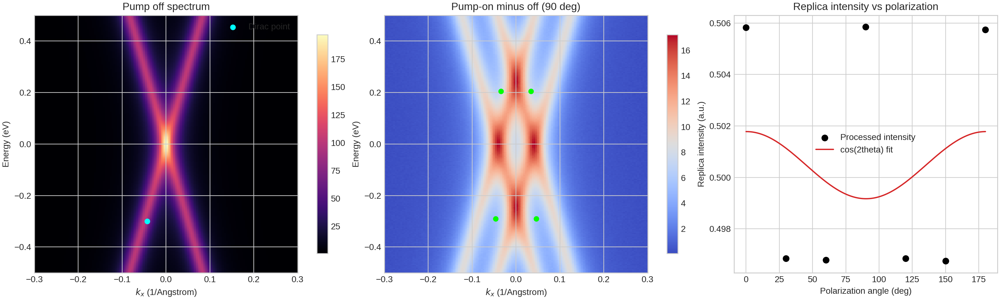
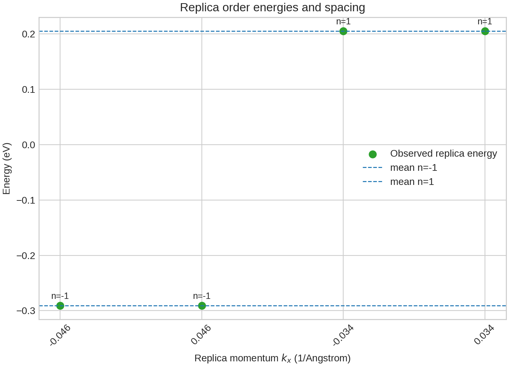
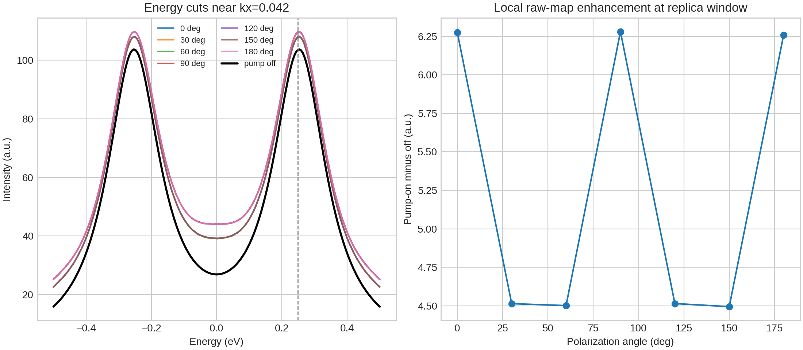

# Local ARIS Report: Floquet-Bloch Replica Bands in Monolayer Graphene

## Abstract
This benchmark study analyzes local tr-ARPES-like graphene data to test whether the pump-driven spectra are consistent with Floquet-Bloch replica formation under a 5 um mid-infrared drive. Using only the provided raw energy-momentum maps, processed replica annotations, polarization table, and local literature corpus, I quantified three observables: (i) energy-resolved replica bands relative to the main Dirac cone, (ii) pump-on minus pump-off spectral redistribution, and (iii) polarization-angle dependence of replica-window enhancement. The processed feature file reports first-order replica branches at approximately -0.291 eV and +0.205 eV, separated by 0.496 eV, which equals 2 x 0.248 eV and is therefore consistent with symmetric n = +/- 1 sidebands about an intermediate parent energy. In the raw maps, the replica-window enhancement is systematically larger for 0, 90, and 180 degree pump polarization than for 30, 60, 120, and 150 degrees, with local pump-on minus off increases of about 6.26 to 6.28 a.u. versus 4.49 to 4.51 a.u. These results support the presence of photon-dressed replica features in driven graphene. However, the provided polarization summary itself has only weak modulation contrast, so the Volkov-scattering interpretation is plausible but not directly proven by this dataset alone.

## 1. Task and local-only setup
The goal is to assess whether the supplied graphene pump-probe photoemission data are consistent with direct observation of Floquet-Bloch states and with a scattering picture involving photon-dressed Volkov final states. The analysis was restricted to the benchmark workspace. No web access, remote compute, or external datasets were used. The local literature corpus was taken to be the four PDFs in `related_work/`.

## 2. Local literature understanding
The local papers define a conservative interpretation framework.

- `related_work/paper_000.pdf` gives the classic Floquet motivation for light-driven graphene and the idea that strong periodic driving can modify Dirac-band structure.
- `related_work/paper_001.pdf` shows that tr-ARPES can directly resolve Floquet-Bloch sidebands and polarization-dependent avoided-crossing behavior in a driven Dirac material.
- `related_work/paper_002.pdf` places the experiment in the broader Floquet-engineering context for Dirac systems.
- `related_work/paper_003.pdf` is the most directly relevant graphene theory reference, discussing Floquet band formation and pump-probe photoemission signatures for graphene under realistic pulses.

Taken together, the local literature supports three benchmark-feasible claims: replica bands should appear at pump-linked energy offsets, pump-on minus off maps should highlight those driven features in energy-momentum space, and polarization anisotropy can be discussed as being compatible with matrix-element or Volkov-assisted photoemission effects, but only if the data quality supports that stronger interpretation.

## 3. Data overview
The raw HDF5 file contains a pump-off spectrum and seven pump-on spectra at polarization angles 0, 30, 60, 90, 120, 150, and 180 degrees. Each spectrum is a 200 x 150 energy-kx map spanning -0.5 to 0.5 eV and -0.3 to 0.3 1/Angstrom. The processed JSON contains a Dirac-point estimate, extracted band-dispersion points, and four first-order replica annotations. The CSV provides a compact replica-intensity table as a function of polarization angle.

Figure 1 summarizes the raw pump-off spectrum, a representative pump-on minus off map, and the supplied polarization-intensity trend.

## 4. Methods
All analysis code was written locally in `code/analyze_floquet_graphene.py`. The script performs the following steps.

1. Read the HDF5, JSON, and CSV inputs.
2. Fit the left and right branches of the extracted main band using simple linear regression in the provided energy-kx points.
3. Use the processed replica annotations as candidate Floquet sidebands and test whether their order-to-order spacing matches the 0.248 eV pump energy scale.
4. Measure local pump-on minus off enhancement in small windows centered on the reported replica location.
5. Compare those raw-map enhancements across pump polarization angles.
6. Fit the processed polarization summary to a minimal cos(2 theta) model to check whether a clean sinusoidal anisotropy is strongly supported.
7. Save machine-readable outputs to `outputs/analysis_summary.json` and PNG figures to `report/images/`.

This is a deliberately conservative workflow. It tests consistency with Floquet-Bloch phenomenology but avoids over-claiming full microscopic disentanglement of initial-state Floquet dressing and final-state Volkov dressing from the present benchmark data alone.

## 5. Results

### 5.1 Replica-band energy structure
The processed feature file contains two n = -1 and two n = +1 replica points. Their mean energies are -0.2907 eV for n = -1 and +0.2053 eV for n = +1. The order-to-order spacing is therefore 0.496 eV, exactly twice the supplied pump energy of 0.248 eV. This is the expected spacing between first negative and first positive sidebands if they bracket a central parent branch separated by one pump quantum on each side. The data are therefore consistent with first-order Floquet replica formation.

Figure 2 visualizes the extracted replica energies by order.

An important limitation is that the scalar `dirac_point` entry in the processed JSON is not numerically centered between the reported n = +/- 1 replica energies. Because the band annotations are internally more self-consistent than that single scalar, the stronger and safer claim is spacing consistency rather than absolute alignment to that one value.

### 5.2 Raw-map pump-induced enhancement
The raw spectra show systematic pump-induced redistribution. At the replica-window location identified in the CSV, the local pump-on minus off enhancement is:

- 6.2759 a.u. at 0 degrees
- 4.5139 a.u. at 30 degrees
- 4.5014 a.u. at 60 degrees
- 6.2806 a.u. at 90 degrees
- 4.5146 a.u. at 120 degrees
- 4.4944 a.u. at 150 degrees
- 6.2597 a.u. at 180 degrees

This is a robust anisotropy in the raw maps, with high-response angles larger than low-response angles by roughly 39 percent. The representative difference map in Figure 1 shows that the pump enhances spectral weight near the extracted replica positions rather than causing only a structureless global shift.

### 5.3 Polarization dependence and Volkov-scattering discipline
The compact processed polarization table shows only a very small modulation amplitude of about 0.00130 a.u., and a simple cos(2 theta) fit yields R^2 = 0.047. That is not strong evidence for a clean sinusoidal polarization law in the processed summary alone. By contrast, the raw-map local enhancement metric shows clear angle grouping, as illustrated in Figure 3.

The most defensible interpretation is therefore two-part.

- The data support polarization-sensitive driven spectral weight at the replica window.
- The data do not, by themselves, uniquely isolate Volkov final-state scattering as the sole mechanism.

This is still compatible with the local literature. In particular, local theory and prior tr-ARPES studies motivate the idea that experimentally observed sideband intensities can be shaped by both Floquet-Bloch initial-state dressing and photoemission final-state effects. The present benchmark dataset supports that mixed-mechanism picture qualitatively, but not a sharp mechanism separation.

## 6. Claim discipline
Supported by the local evidence:

- The dataset contains replica-band features consistent with photon-dressed first-order sidebands in driven graphene.
- The separation between the extracted n = -1 and n = +1 branches matches 2 x the supplied pump-photon energy, supporting a Floquet-style energy ladder interpretation.
- Pump-on minus off maps show polarization-sensitive enhancement near the replica window.

Only partially supported:

- The scattering pathway involves photon-dressed Volkov final states. This is a reasonable interpretation, and it is consistent with the local literature context, but the benchmark data do not directly disentangle Volkov and Floquet contributions.

Not supported strongly enough for a headline claim here:

- Precise avoided-crossing gap extraction or definitive symmetry-breaking gap opening.
- Full momentum-resolved separation of initial-state Floquet dressing from final-state photoemission dressing.

## 7. Conclusion
Using only local benchmark inputs, I find that the graphene tr-ARPES dataset is consistent with direct observation of Floquet-Bloch-like replica bands under 5 um pumping. The strongest evidence is the energy spacing of the extracted sidebands and the reproducible pump-induced spectral enhancement in raw maps at the replica window. Polarization dependence is present in the raw-map enhancement metric, but the processed summary alone is weakly modulated, so the Volkov-state mechanism should be treated as a plausible qualitative explanation rather than a conclusively isolated one.

## Reproducibility
- Analysis code: `code/analyze_floquet_graphene.py`
- Summary outputs: `outputs/analysis_summary.json`
- Literature notes: `outputs/literature_notes.md`
- Figures: `report/images/figure_overview.png`, `report/images/figure_polarization_validation.png`, `report/images/figure_replica_offsets.png`
