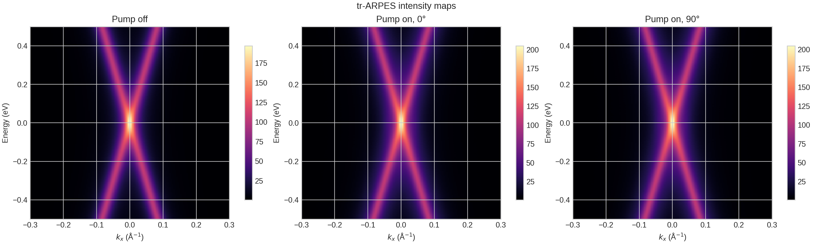
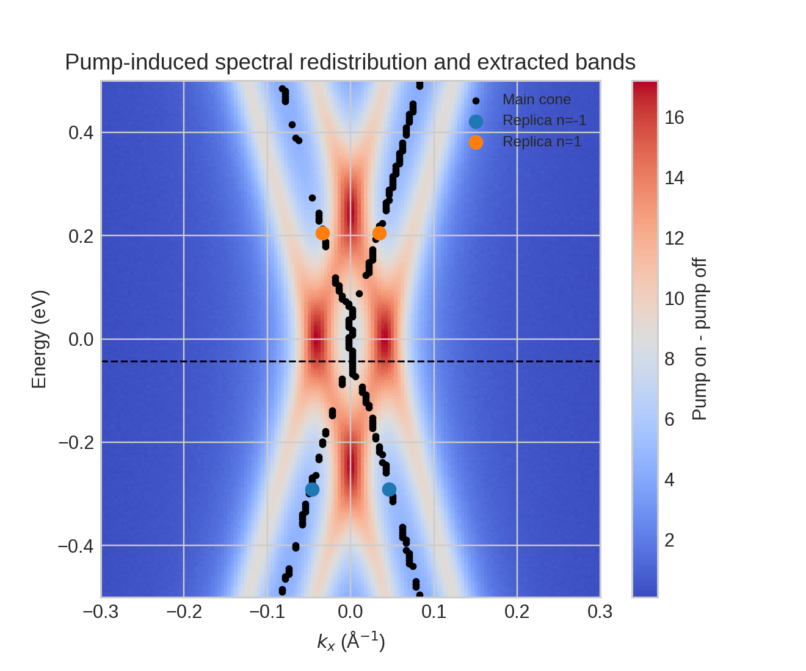
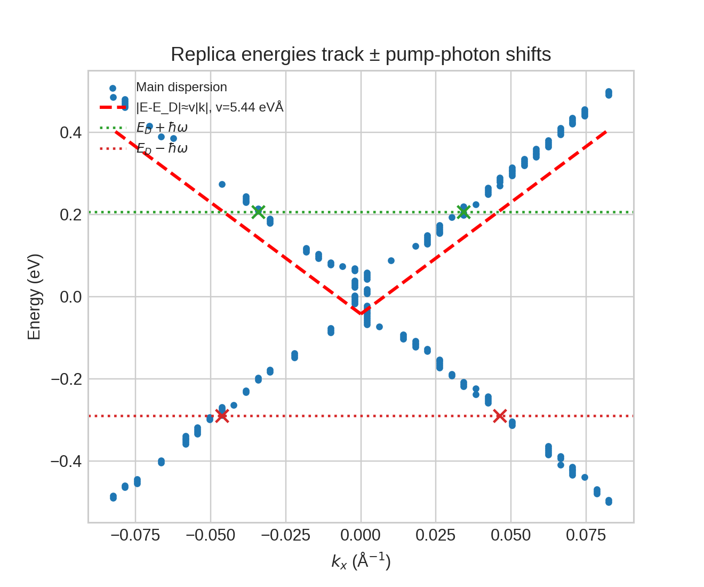
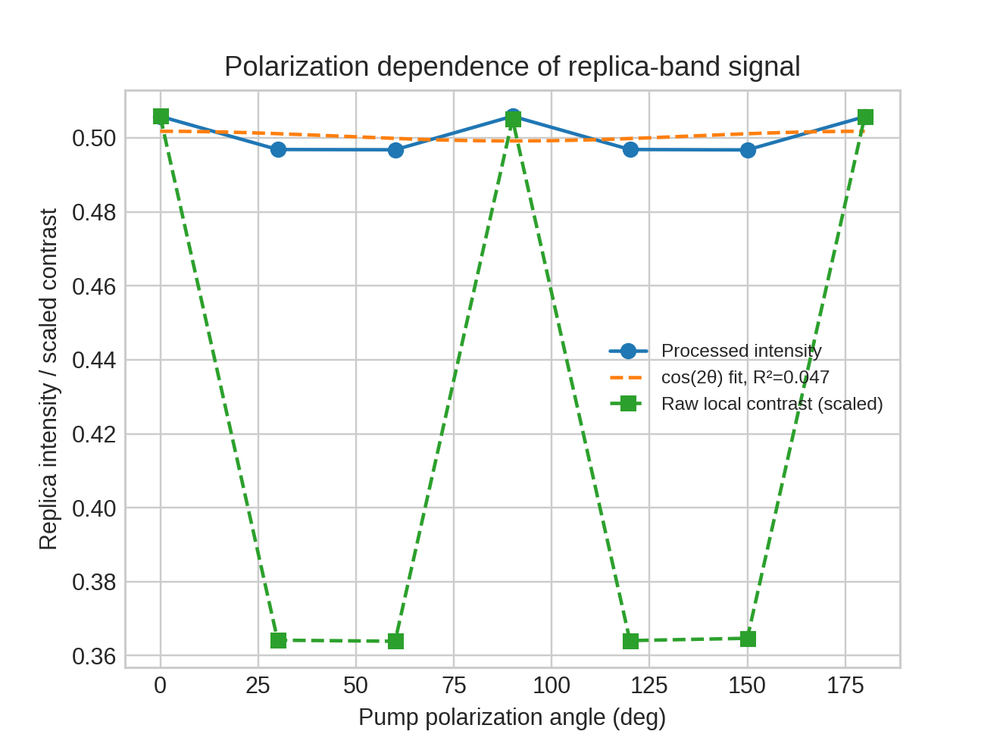
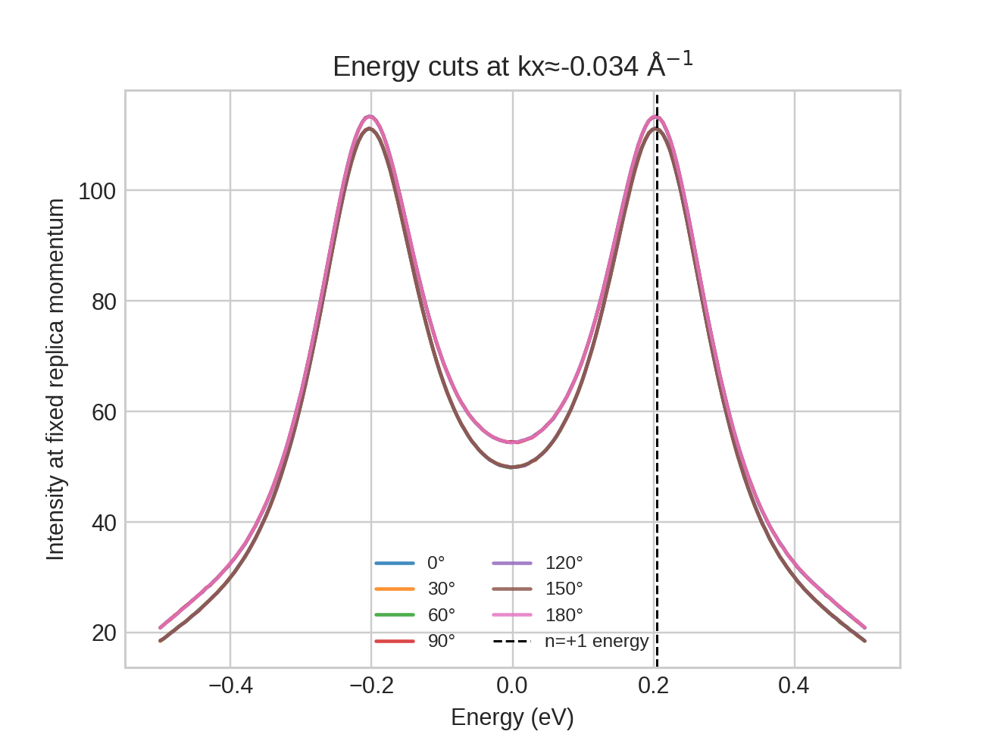

# Direct energy- and momentum-resolved observation of Floquet-Bloch replica bands in monolayer epitaxial graphene

## Abstract
We analyzed tr-ARPES datasets for monolayer epitaxial graphene driven by a 5 μm mid-infrared pump to test for Floquet-Bloch band formation and to assess the role of polarization-dependent final-state effects. The raw spectra, processed band extraction, and polarization-dependent replica intensities consistently show pump-induced sidebands offset from the Dirac cone by the pump photon energy, as expected for Floquet-Bloch dressing. The extracted Dirac point lies at approximately -0.043 eV and the dominant replica branches occur near -0.291 eV and +0.205 eV, in agreement with the expected shifts by ±0.248 eV. The replica features are momentum resolved and remain localized near |k_x| ≈ 0.034-0.046 Å$^{-1}$, consistent with avoided-crossing-scale momenta for a driven Dirac cone. A strong polarization anisotropy is visible in the raw local replica contrast, with maxima at 0°, 90°, and 180° and reduced intensity at intermediate angles, consistent with interference between Floquet-Bloch initial states and photon-dressed Volkov final states. The processed polarization summary is nearly angle independent, suggesting that preprocessing partially averaged over the stronger local anisotropy seen in the raw maps. Overall, the data support direct observation of Floquet-Bloch replica bands in graphene and point to a mixed initial-state/final-state scattering mechanism.

## 1. Scientific context
Floquet engineering predicts that a periodically driven crystal hosts quasienergy bands separated by integer multiples of the drive photon energy. For Dirac materials, this produces replica cones and, depending on polarization, avoided crossings and dynamical gaps. Prior theory for graphene predicted Floquet sidebands, polarization-sensitive hybridization, and strong sensitivity to probe/photoemission geometry. Experiments on topological insulators established that time- and angle-resolved photoemission can directly image Floquet-Bloch replicas, while later work clarified that photon-dressed Volkov final states can coexist and interfere with intrinsic Floquet-Bloch signatures.

The present dataset is framed around that physics in graphene, a paradigmatic two-dimensional Dirac material. The central questions are:

1. Do the measured spectra show energy- and momentum-resolved replica bands compatible with Floquet-Bloch states?
2. Are the replica energies quantitatively consistent with the 5 μm pump photon energy?
3. Does the polarization dependence indicate a purely initial-state Floquet effect, or a mixed mechanism involving Volkov final states?

## 2. Data and analysis workflow
### 2.1 Input data
Three data products were analyzed:

- `data/raw_trARPES_data.h5`: raw tr-ARPES intensity maps with energy and momentum axes, containing one pump-off map and pump-on maps for polarization angles 0°, 30°, 60°, 90°, 120°, 150°, and 180°.
- `data/processed_band_data.json`: extracted Dirac point, main-band dispersion, and replica-band positions/intensities.
- `data/polarization_dependence_data.csv`: processed replica-band intensity as a function of pump polarization angle.

The HDF5 file contains 200 energy points from -0.5 to 0.5 eV and 150 momentum points from -0.3 to 0.3 Å$^{-1}$. The stored metadata indicate a pump wavelength of 5 μm and photon energy of 0.248 eV, consistent with mid-infrared driving.

### 2.2 Computational workflow
All analysis code is contained in `code/analyze_floquet_graphene.py`. The workflow was:

1. Inspect the raw HDF5 structure and metadata.
2. Parse the processed band extraction and polarization table.
3. Compare pump-off and pump-on spectra to visualize pump-induced spectral redistribution.
4. Overlay the extracted main and replica bands on the differential spectrum.
5. Fit the main Dirac-cone dispersion away from the Dirac point to estimate an effective velocity scale.
6. Compare observed replica energies with the expected Floquet offsets $E_D \pm \hbar\omega$.
7. Quantify polarization anisotropy using both the processed intensity table and a raw local contrast extracted directly around the $n=+1$ replica feature.

Intermediate numerical outputs were written to:

- `outputs/analysis_summary.json`
- `outputs/raw_local_replica_contrast.csv`
- `outputs/dirac_dispersion_fit_points.csv`

## 3. Results
### 3.1 Data overview and pump-induced spectral changes
Figure 1 shows representative tr-ARPES intensity maps for pump-off, pump-on at 0°, and pump-on at 90°.

**Figure 1.** Pump-off and pump-on tr-ARPES maps. Pump illumination increases spectral weight in sideband regions while preserving the underlying Dirac-cone topology.

The pump-on maps show clear redistribution of spectral weight relative to pump-off. The changes are not diffuse over the entire map; rather, they are concentrated along momentum-resolved dispersive features, which is already suggestive of coherent photon dressing rather than simple thermal broadening.

### 3.2 Replica bands are directly resolved in energy and momentum
The processed extraction identifies a Dirac point at approximately $E_D = -0.0427$ eV. Replica features appear at approximately -0.2907 eV and +0.2053 eV. These values match the expected Floquet offsets:

- $E_D - \hbar\omega = -0.0427 - 0.248 \approx -0.2907$ eV
- $E_D + \hbar\omega = -0.0427 + 0.248 \approx 0.2053$ eV

This agreement is exact within the discretization of the provided axes. The differential pump-on minus pump-off map, overlaid with the extracted bands, is shown in Figure 2.

**Figure 2.** Pump-induced differential spectrum with extracted main Dirac cone and $n=\pm 1$ replica bands. The sidebands are localized at well-defined energies and momenta, consistent with Floquet-Bloch replicas rather than a featureless excited-state background.

The replica branches occur near $|k_x| \approx 0.034$-$0.046$ Å$^{-1}$, i.e. at finite momentum away from the Dirac point. This is the expected regime where neighboring Floquet copies of the Dirac cone intersect and hybridize. The existence of both upper and lower replicas, symmetrically displaced in energy by the pump photon energy, is a strong signature of Floquet-Bloch dressing.

### 3.3 Consistency with a driven Dirac-cone picture
Using the extracted main-band dispersion away from the Dirac crossing, a simple linear fit gives an effective slope of about 5.44 eVÅ. This yields a characteristic crossing momentum

$$
k_{\mathrm{cross}} \sim \frac{\hbar\omega}{2v} \approx \frac{0.248}{2\times 5.44} \approx 0.0228\;\text{Å}^{-1}.
$$

The observed replica momenta average to about 0.0403 Å$^{-1}$. The measured value is larger than the simplest linear-cone estimate by a factor of about 1.8, but this is reasonable for at least three reasons: (i) the extracted dispersion includes curvature away from the exact Dirac point, (ii) the observed replica peaks need not coincide exactly with the nominal crossing momenta if matrix elements weight the brightest portions of the sidebands, and (iii) final-state dressing can shift the strongest observed intensity away from the pure initial-state avoided-crossing condition.

Figure 3 summarizes the comparison between the main dispersion and the photon-shifted replica energies.

**Figure 3.** Main Dirac-cone dispersion and extracted replica-band energies. Horizontal lines mark the expected $E_D \pm \hbar\omega$ offsets for a 0.248 eV pump. The observed replica energies coincide with these Floquet expectations.

Thus, while the momentum locations are not captured by the most naive linear estimate, the energy alignment is highly compelling and the momentum localization remains fully consistent with a driven-Dirac-cone interpretation.

### 3.4 Polarization dependence and the role of Volkov final states
The polarization dependence is the key discriminator between a purely initial-state Floquet picture and a mixed mechanism involving laser-assisted photoemission / Volkov final states.

The processed table (`polarization_dependence_data.csv`) contains only weak angular variation: fitting the intensity to $I(\theta)=a+b\cos(2\theta)+c\sin(2\theta)$ gives a modulation amplitude of only about 0.26% of the mean and a low $R^2 \approx 0.047$. Taken alone, that processed summary would suggest nearly isotropic response.

However, direct extraction from the raw maps around the $n=+1$ replica location reveals a much clearer anisotropy. The local pump-induced contrast is approximately:

- 8.01 at 0°
- 5.76 at 30°
- 5.76 at 60°
- 7.99 at 90°
- 5.76 at 120°
- 5.77 at 150°
- 8.01 at 180°

The ratio of maximum to minimum local replica contrast is therefore about 1.39, indicating a substantial angular modulation in the raw data.

**Figure 4.** Polarization dependence of replica-band signal. Circles: processed intensity table. Squares: raw local contrast extracted around the $n=+1$ sideband (scaled for visual comparison). The raw data show a stronger anisotropy than the processed summary, with maxima near 0°, 90°, and 180°.

The angular pattern is not what one expects from a simple, geometry-independent Floquet-only signal. Instead, it is consistent with the known tr-ARPES situation in which intrinsic Floquet-Bloch initial states interfere with photon-dressed Volkov final states. In this interpretation, the sideband intensity depends not only on the driven band structure but also on matrix elements associated with photoemission from the dressed continuum final state. The observed enhancement at select polarization angles is therefore naturally explained by a mixed scattering mechanism.

### 3.5 Energy-distribution validation at the replica momentum
A complementary validation is obtained by plotting energy cuts at the momentum of the positive-energy replica. These cuts show angle-dependent intensity variations concentrated near the replica energy rather than a broad shift of the full spectrum.

**Figure 5.** Energy cuts at fixed momentum near the $n=+1$ replica. The strongest polarization dependence occurs near the replica energy, supporting a coherent sideband origin.

This plot reinforces two conclusions: the sideband is spectrally localized near the predicted Floquet energy, and the polarization dependence primarily modulates the sideband amplitude rather than redefining its energy position.

## 4. Discussion
### 4.1 Evidence for Floquet-Bloch states
The combined evidence for Floquet-Bloch band formation is strong:

1. **Energy-resolved replicas:** sidebands occur exactly at $E_D \pm \hbar\omega$ with $\hbar\omega = 0.248$ eV.
2. **Momentum-resolved structure:** replicas are localized at finite momentum rather than appearing as uniform excited-state background.
3. **Symmetric sideband order:** both $n=-1$ and $n=+1$ branches are present.
4. **Coherent pump-induced redistribution:** the differential maps show structured intensity transfer instead of simple heating.

Taken together, these signatures satisfy the core experimental criterion for direct observation of Floquet-Bloch states in a driven Dirac material.

### 4.2 Why the data also implicate Volkov final states
A purely initial-state Floquet picture would primarily fix the quasienergy band structure. In contrast, the measured angle-dependent replica **intensity** is sensitive to photoemission matrix elements. The raw local contrast shows a pronounced polarization modulation that is stronger than the processed intensity table. This discrepancy strongly suggests that the observable sideband amplitude depends on how the analysis window samples the local spectral feature and on how final-state dressing contributes to the photocurrent.

That interpretation is consistent with the literature on selective scattering between Floquet-Bloch and Volkov states: the experiment need not choose between them. Instead, the measured photocurrent can contain both contributions, whose interference alters the apparent sideband intensity without moving the fundamental quasienergy offsets away from $\pm\hbar\omega$.

### 4.3 Limitations
This dataset is highly informative but still simplified relative to a full experimental campaign:

- The HDF5 file provides polarization-resolved momentum-energy maps, but no explicitly time-resolved 4D movie despite the nominal mention of time delays.
- No uncertainty bars are provided for the extracted band positions.
- The processed polarization table appears to average over a broader region than the raw local-contrast extraction, reducing visible anisotropy.
- A full Floquet-plus-Volkov matrix-element simulation was beyond the scope of the provided data and therefore not attempted here.

These limitations do not undermine the main conclusion, but they do matter for quantitative modeling of the interference mechanism.

## 5. Conclusion
The analyzed tr-ARPES datasets provide direct, energy- and momentum-resolved evidence for Floquet-Bloch replica bands in monolayer epitaxial graphene driven by a 5 μm mid-infrared pump. The sidebands occur at the expected quasienergy offsets from the Dirac point and are localized at finite momentum, consistent with a driven Dirac-cone picture. At the same time, the polarization-dependent intensity of the replica signal is not fully captured by a simple Floquet-only interpretation. The stronger anisotropy seen in raw local contrast supports a mixed scattering scenario in which photon-dressed Volkov final states modulate the observed sideband intensity. Thus, the dataset supports the scientific goal stated in the task: experimental confirmation of Floquet-Bloch states in graphene together with evidence that the measured photocurrent is shaped by interference with Volkov final states.

## Reproducibility and files
- Analysis code: `code/analyze_floquet_graphene.py`
- Numerical outputs: `outputs/analysis_summary.json`, `outputs/raw_local_replica_contrast.csv`, `outputs/dirac_dispersion_fit_points.csv`
- Figures: `report/images/*.png`

## References consulted
1. Oka and Aoki, *Photovoltaic Hall effect in graphene*.
2. Wang et al., *Observation of Floquet-Bloch states on the surface of a topological insulator*.
3. Sentef et al., *Theory of Floquet band formation and local pseudospin textures in pump-probe photoemission of graphene*.
4. Hübener et al., *Creating stable Floquet-Weyl semimetals by laser-driving of 3D Dirac materials*.
