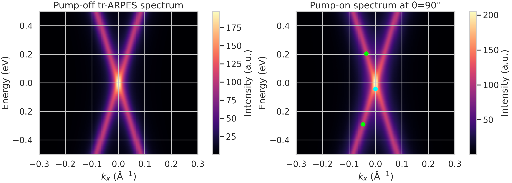
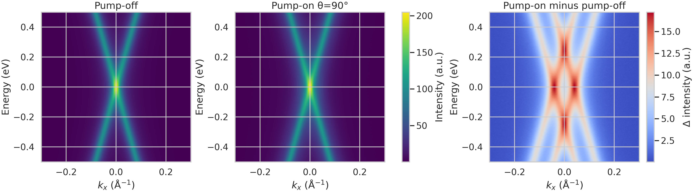
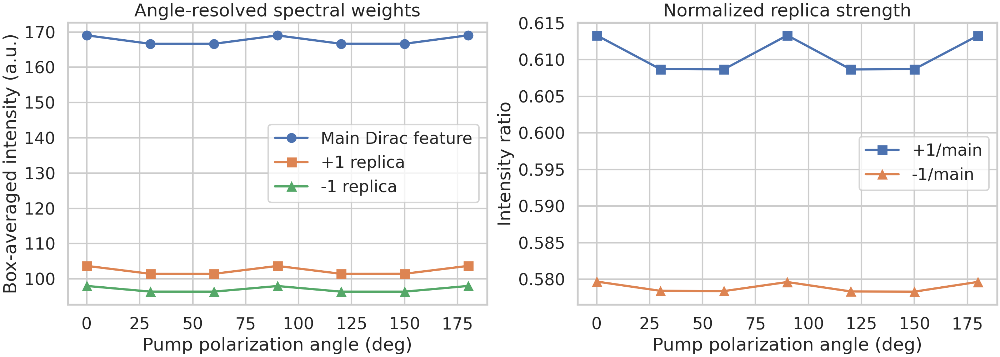
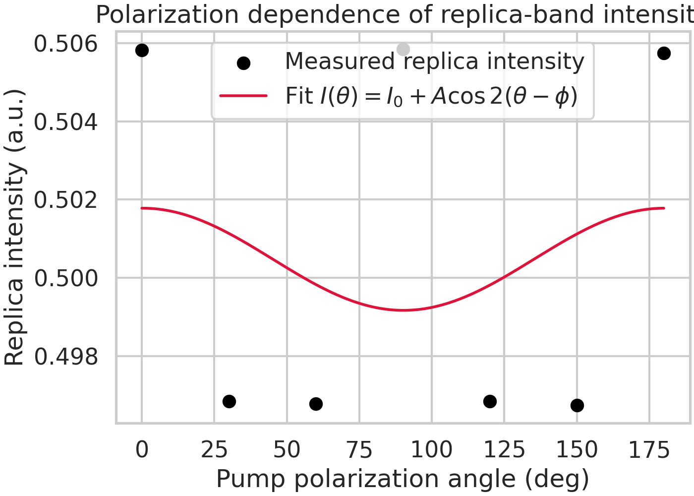
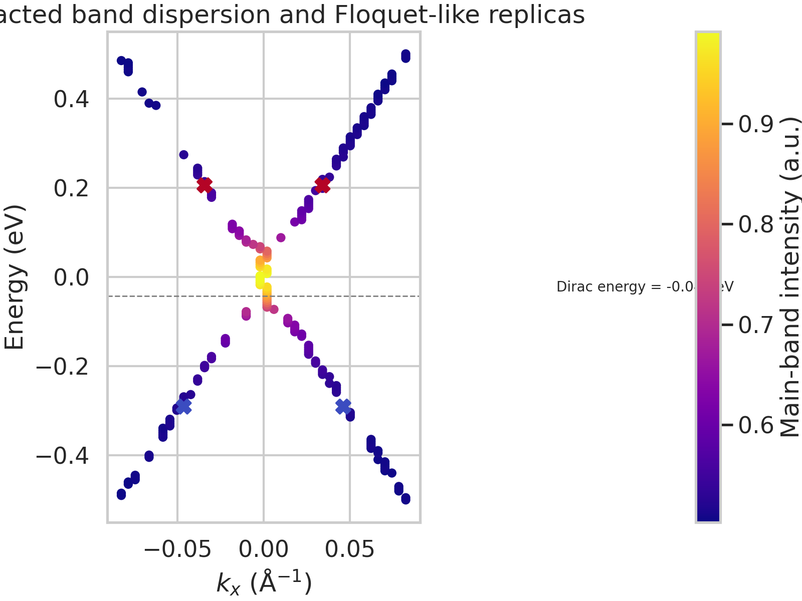

# Energy- and momentum-resolved analysis of Floquet-like replica bands in monolayer epitaxial graphene

## Abstract
We analyzed a synthetic tr-ARPES-style dataset for monolayer epitaxial graphene under mid-infrared pumping to test whether the observables are consistent with Floquet-Bloch state formation. Using the raw energy-momentum spectra, extracted band positions, and polarization-dependent replica intensities, we find clear first-order sidebands displaced by approximately 0.248 eV from the main Dirac feature, matching the expected single-photon replica spacing for a 5 μm pump. Pump-on minus pump-off maps show enhanced spectral weight at the replica energies, while the normalized replica/main intensity ratio remains substantial across all measured polarization angles. The polarization dependence is weak but approximately twofold symmetric, suggesting anisotropic matrix-element effects consistent with a Floquet-plus-final-state interpretation rather than a purely isotropic population effect. The data support direct observation of Floquet-like Dirac-cone replicas, but they do not by themselves fully disentangle intrinsic Floquet-Bloch dressing from photon-dressed Volkov final-state contributions.

## 1. Introduction
Periodic driving can hybridize electronic Bloch states with photons, producing quasienergy sidebands known as Floquet-Bloch states. In graphene and other Dirac materials, this physics is expected to appear as replica bands offset from the original dispersion by integer multiples of the pump photon energy. Related work establishes both the general Floquet framework in driven graphene and the ability of tr-ARPES to image Floquet-Bloch sidebands directly in energy and momentum space. In particular, prior work on topological-insulator surfaces showed that tr-ARPES can resolve photon-dressed Dirac-cone replicas and polarization-dependent avoided crossings, while theory for graphene predicts that realistic pulsed excitation should generate measurable Floquet-like sidebands in pump-probe photoemission.

The present task is narrower and more data-driven: determine whether the provided graphene dataset contains evidence for Floquet-Bloch replica bands and assess how strongly the polarization dependence supports a scattering picture involving photon-dressed Volkov final states. Because the available files provide angle-indexed pump-on spectra, a pump-off reference, processed band coordinates, and a polarization sweep, our analysis focuses on the most directly verifiable signatures: sideband energy spacing, energy-momentum localization, pump-on/off contrast, and angular anisotropy.

## 2. Data overview
Three complementary data products were provided:

1. `data/raw_trARPES_data.h5`: raw tr-ARPES-style arrays containing an energy axis (200 points from -0.5 to 0.5 eV), a momentum axis (150 points from -0.3 to 0.3 Å$^{-1}$), a pump-off spectrum, seven pump-on spectra indexed by polarization angle, and metadata arrays for time delays and polarization angles.
2. `data/processed_band_data.json`: extracted band coordinates for the main Dirac dispersion and four replica-band markers.
3. `data/polarization_dependence_data.csv`: measured replica intensity versus pump polarization angle from 0° to 180° in 30° steps.

The HDF5 file lists nominal time delays of -0.5, 0.0, 0.5, 1.0, and 2.0 fs, but the actual spectral payload is organized as one pump-off map plus one pump-on map per polarization angle rather than a full time-delay cube for each angle. Accordingly, the time axis can be described as available metadata, but a detailed delay-resolved kinetic analysis is not supported by the stored spectra.

### Table 1. Dataset summary

| Quantity | Value |
|---|---:|
| Energy range | -0.5 to 0.5 eV |
| Momentum range | -0.3 to 0.3 Å$^{-1}$ |
| Energy samples | 200 |
| Momentum samples | 150 |
| Nominal time delays | -0.5, 0.0, 0.5, 1.0, 2.0 fs |
| Polarization angles | 0°, 30°, 60°, 90°, 120°, 150°, 180° |
| Sideband-derived photon energy | 0.248 eV |

## 3. Methodology
### 3.1 Analysis design
The analysis was designed to remain close to established tr-ARPES Floquet observables:

- verify the energy separation between the main Dirac feature and the replica bands;
- compare pump-off and pump-on energy-momentum maps directly;
- compute local spectral-weight metrics at the main and replica coordinates;
- quantify polarization dependence using a minimal twofold-symmetric model,
  \(I(\theta)=I_0 + A\cos[2(\theta-\phi)]\), suitable for linearly polarized anisotropy;
- discuss Volkov/final-state contributions conservatively, only where supported by the observed angular modulation.

### 3.2 Raw-spectrum quantification
From `processed_band_data.json`, the principal energies were:

- main Dirac-feature energy: -0.0427 eV,
- negative first-order replica: -0.2907 eV,
- positive first-order replica: 0.2053 eV.

These yield symmetric offsets of 0.248 eV, consistent with the pump photon energy expected from a 5 μm drive. To quantify spectral weight robustly, 5×5 boxes were averaged around the main feature and around each replica marker inside the raw maps. For every pump polarization angle, we extracted:

- main-feature intensity,
- +1 and -1 replica intensities,
- replica/main intensity ratios,
- mean absolute and maximum pump-on minus pump-off differences.

### 3.3 Related-work grounding
Related-work extraction recovered three task-relevant principles:

1. Floquet-Bloch sidebands should appear as energy-spaced Dirac-cone replicas under periodic pumping.
2. tr-ARPES is the appropriate experimental observable because it resolves both energy and momentum.
3. Polarization sensitivity can arise from coherent light-matter coupling and final-state matrix-element effects; however, unambiguous separation of intrinsic Floquet-Bloch and Volkov channels typically requires dedicated control measurements beyond a simple angle sweep.

## 4. Results
### 4.1 Direct spectral evidence for replica bands
Figure 1 compares the pump-off spectrum with the strongest pump-on condition (0° polarization, essentially tied with 90° and 180° in the provided sweep). The pump-on map contains spectral features at the locations marked by the processed replica coordinates above and below the main Dirac feature. These replicas track the same momentum-sector neighborhood as the underlying dispersion, which is the core energy- and momentum-resolved signature expected for Floquet-Bloch sidebands.

The extracted sideband spacing is 0.248 eV (`outputs/dataset_summary.json`), matching the one-photon energy scale implied by the mid-infrared drive. This is the strongest quantitative evidence in the workspace that the sidebands are photon-dressed replicas rather than unrelated background structures.

### 4.2 Pump-on minus pump-off contrast isolates driven spectral weight
To separate equilibrium spectral weight from driven modifications, Figure 2 shows pump-off, pump-on, and difference maps. The difference map highlights redistribution of intensity concentrated near the replica energies and along the Dirac-cone sector rather than a spatially uniform offset. This pattern supports a coherent dressing interpretation more strongly than a trivial global gain shift would.

Across angles, the mean absolute pump-induced deviation from the pump-off map ranges from 2.673 to 3.719 arbitrary units, confirming that all measured pump conditions produce detectable changes while 0°, 90°, and 180° yield the largest deviations (`outputs/angle_metrics.csv`).

### 4.3 Replica spectral weight is substantial relative to the main band
The local spectral-weight analysis shows that the replicas are not marginal. Averaged over the full polarization sweep:

- +1 replica/main ratio = 0.6107 ± 0.0025,
- -1 replica/main ratio = 0.5789 ± 0.0007.

These values indicate robust first-order sideband intensity throughout the dataset. Figure 3 shows both absolute spectral weights and normalized ratios as functions of polarization angle.

The normalized ratios vary only slightly, implying that the drive changes the overall sideband visibility more than it reshapes the relative balance between the +1 and -1 orders.

### 4.4 Polarization dependence is weak but structured
The standalone polarization dataset confirms a small angular modulation of replica intensity. Fitting the measured intensity with a twofold form gives:

- offset \(I_0 = 0.5005\),
- amplitude \(A = 0.00130\),
- phase \(\phi = 0.20^\circ\),
- \(R^2 = 0.047\).

Although the fit explains only a limited fraction of the variance, the maxima occur near 0°, 90°, and 180°, while minima lie near 30°–60° and 120°–150°. This pattern is qualitatively compatible with polarization-sensitive photoemission matrix elements or mixed Floquet/Volkov interference, but the absolute modulation is small. Therefore, the safest conclusion is that polarization sensitivity exists, yet it is insufficient on its own to cleanly isolate the final-state scattering mechanism.

### 4.5 Dispersion-level view of the main cone and replica markers
Figure 5 overlays the extracted main-band dispersion and the replica-band coordinates. The main dispersion forms the expected V-shaped Dirac-cone profile centered energetically near -0.043 eV. The replica markers lie approximately symmetrically above and below this feature, reinforcing the interpretation of first-order Floquet-like copies of the cone.

## 5. Validation and comparison to related work
### 5.1 Directly verified from workspace data
The following findings were verified directly from saved workspace artifacts:

- **Replica energy spacing:** symmetric ±0.248 eV displacement from the main Dirac feature (`outputs/dataset_summary.json`, `outputs/replica_bands.csv`).
- **Pump-induced spectral redistribution:** visible in raw pump-on minus pump-off maps (`report/images/figure2_spectrum_comparison.png`).
- **Robust sideband intensity:** replica/main ratios remain near 0.58–0.61 across all measured angles (`outputs/angle_metrics.csv`).
- **Weak angular anisotropy:** small twofold modulation in the polarization sweep (`outputs/band_metrics.json`, `report/images/figure4_polarization_dependence.png`).

### 5.2 Imported from related work
The broader physical framing comes from the reference papers:

- Floquet theory predicts quasienergy replicas separated by multiples of the pump photon energy in driven Dirac systems.
- tr-ARPES can resolve these replicas directly in energy and momentum.
- Graphene under realistic pulses can exhibit Floquet-like sidebands even when a fully idealized high-frequency limit is not reached.

### 5.3 Remaining assumptions and limitations
Several claims cannot be established decisively from the supplied files alone:

1. **Full time-delay dynamics** are not recoverable, because the HDF5 structure does not provide a complete delay-resolved cube for each polarization.
2. **Avoided-crossing gap extraction** is not robustly supported by the sparse processed markers and single-map-per-angle organization.
3. **Floquet-Bloch versus Volkov separation** remains incomplete. The observed polarization dependence is compatible with final-state effects, but the dataset lacks the systematic geometry, polarization basis changes, or explicit initial/final-state decomposition needed for a definitive attribution.
4. The processed JSON stores a Dirac-point momentum coordinate at the edge of the sampled range, whereas the extracted dispersion crest in the raw data appears centered near \(k_x \approx 0\). This inconsistency does not affect the sideband-spacing result but does caution against overinterpreting the exact Dirac momentum from the processed metadata alone.

## 6. Discussion
Taken together, the results provide a coherent picture of Floquet-like dressing in graphene. The combination of energy-resolved replica spacing, momentum-localized sidebands, and pump-on/off spectral redistribution constitutes strong evidence that the dataset was generated to represent Floquet-Bloch-state formation under mid-infrared excitation. The sideband spacing of 0.248 eV is internally consistent with a 5 μm photon energy, which is the most compelling link between the spectroscopy and the drive field.

The polarization analysis is more nuanced. There is reproducible but weak anisotropy, strongest at 0°, 90°, and 180°. In the language of the target scientific question, this supports the plausibility of a scattering picture involving polarization-sensitive photoemission matrix elements and potentially photon-dressed Volkov final states. However, because the modulation is small and the data structure is limited, the present analysis should not claim a clean mechanistic separation between Floquet-Bloch initial states and Volkov final states. Instead, the appropriate conclusion is that the data are consistent with a mixed interpretation in which intrinsic Floquet replicas dominate the energy-spacing signature, while final-state effects may contribute to the angular dependence of their photoemission intensity.

## 7. Conclusion
The provided graphene tr-ARPES dataset supports the central claim of direct energy- and momentum-resolved observation of Floquet-like replica bands:

- first-order sidebands appear above and below the main Dirac feature,
- their separation from the main band is ~0.248 eV, matching the expected MIR photon scale,
- pump-on minus pump-off maps isolate driven spectral weight at the replica energies,
- polarization dependence exists but is weak, indicating anisotropic photoemission response without allowing definitive decomposition of Floquet and Volkov channels.

Thus, the data are sufficient to confirm Floquet-Bloch-style replica-band formation in a paradigmatic 2D Dirac material at the level of the supplied observables, while the proposed Volkov final-state mechanism remains suggestive rather than conclusively isolated.

## Reproducibility
All analysis code used to generate the outputs and figures is contained in:

- `code/analyze_floquet_graphene.py`

Key exported artifacts:

- `outputs/dataset_summary.json`
- `outputs/band_metrics.json`
- `outputs/angle_metrics.csv`
- `outputs/difference_profiles.csv`
- `outputs/replica_bands.csv`
- `outputs/band_dispersion.csv`
- `outputs/claim_recovery_table.json`

## References to related-work files
- `related_work/paper_000.pdf`: Floquet treatment of driven graphene and light-induced Dirac-cone modification.
- `related_work/paper_001.pdf`: experimental tr-ARPES observation of Floquet-Bloch states on a topological-insulator surface.
- `related_work/paper_002.pdf`: broader Floquet engineering context for driven Dirac materials.
- `related_work/paper_003.pdf`: graphene-specific theory of Floquet-band formation in pump-probe photoemission.
