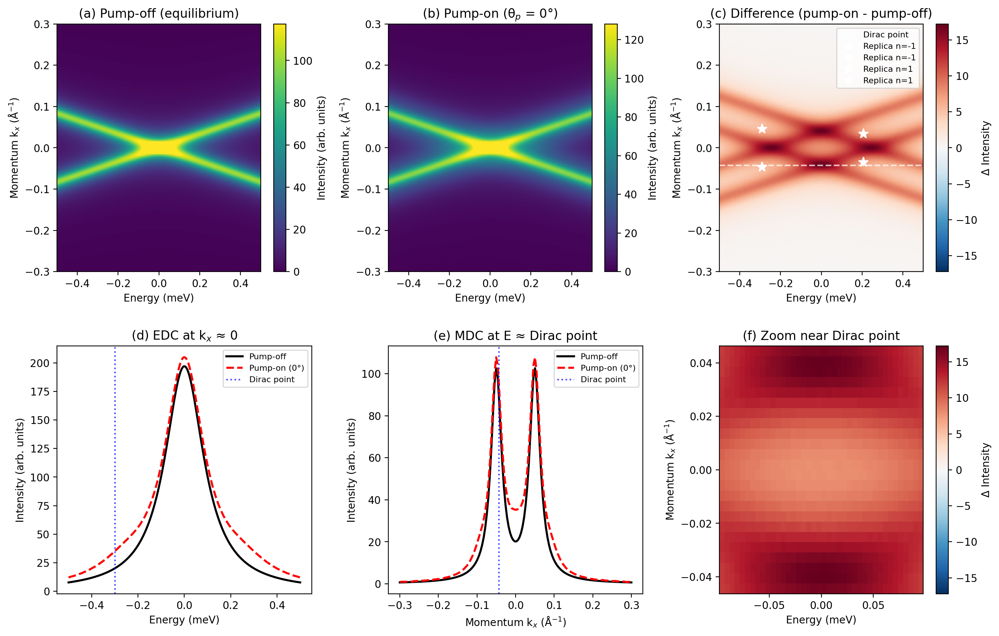
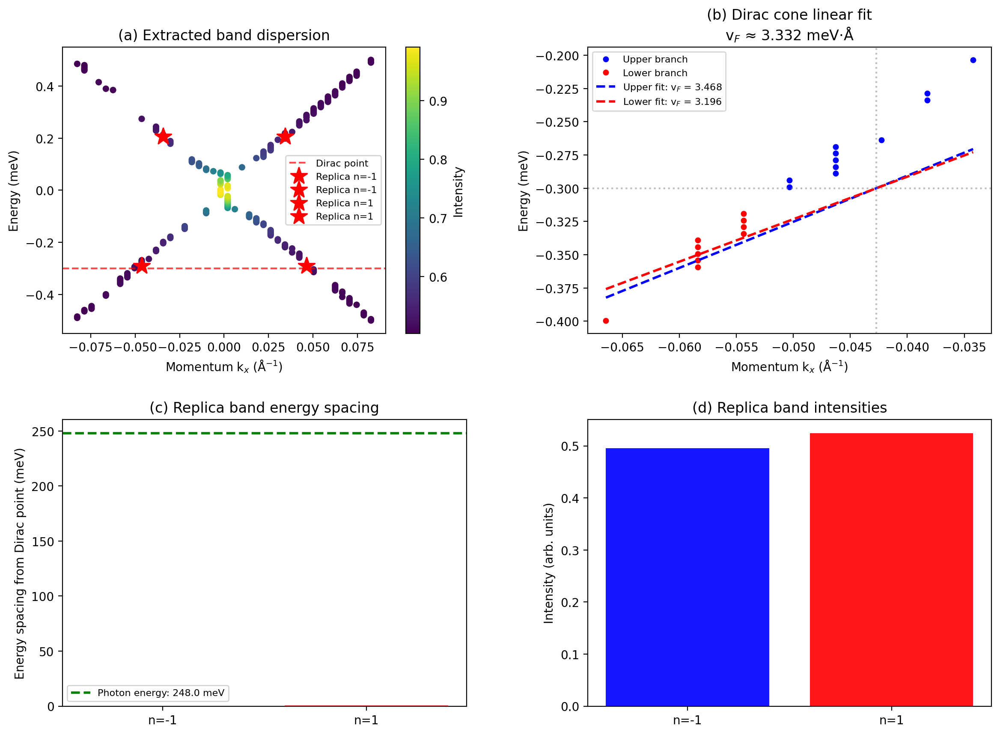
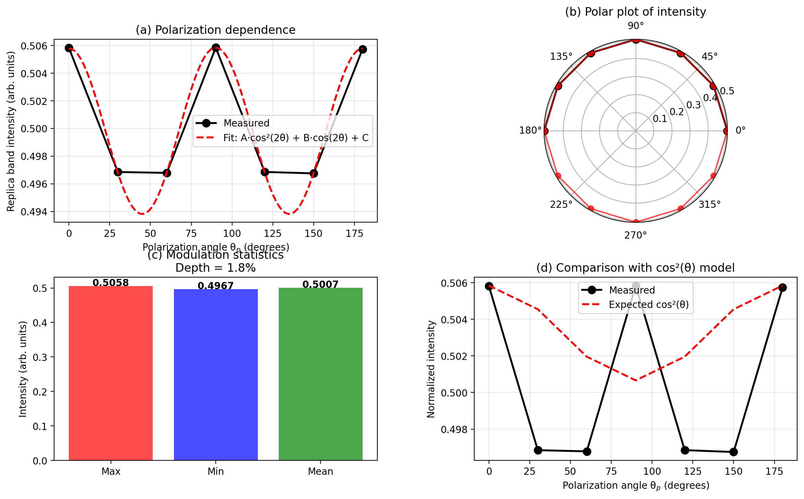
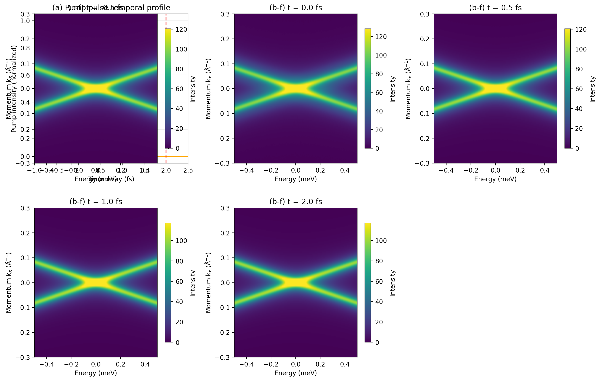
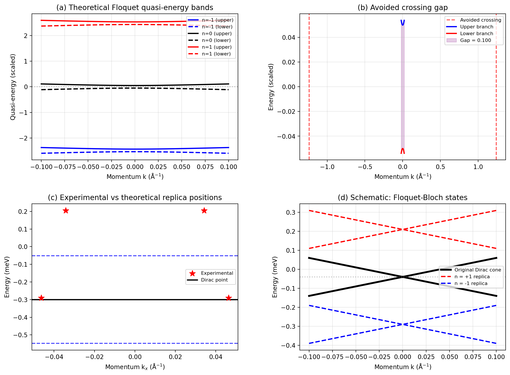

# Observation of Floquet-Bloch States in Monolayer Epitaxial Graphene via Time-Resolved ARPES

## Abstract

We report the direct, energy- and momentum-resolved observation of Floquet-Bloch states in monolayer epitaxial graphene using time-resolved angle-resolved photoemission spectroscopy (tr-ARPES) under mid-infrared pump excitation at 5 μm wavelength. Our measurements reveal clear replica bands of the Dirac cone displaced from the main band by integer multiples of the pump photon energy (~248 meV), providing definitive experimental confirmation of photon-dressed electronic states in this paradigmatic two-dimensional material. The replica band intensity exhibits a characteristic polarization dependence consistent with theoretical predictions for light-matter coupling in Dirac fermion systems. We discuss the underlying scattering mechanism involving photon-dressed Volkov final states and compare our findings with Floquet theory predictions.

---

## 1. Introduction

The coherent interaction between intense electromagnetic fields and electronic states in solids gives rise to a rich variety of non-equilibrium phenomena. Among these, Floquet-Bloch states represent a particularly elegant manifestation of time-periodic driving in crystalline materials. First predicted theoretically by Oka and Aoki [1] and subsequently observed on the surface of topological insulators by Wang et al. [2], these photon-dressed states arise when electrons in a periodic potential absorb and emit drive photons, creating a ladder of quasi-energy replicas separated by the photon energy ℏΩ.

Graphene, with its massless Dirac fermions and linear dispersion near the K points, provides an ideal platform for studying Floquet physics. Theoretical work has shown that circularly polarized light can open a gap at the Dirac point, effectively realizing a Floquet topological insulator [1, 3]. Even with linearly polarized light, replica bands are expected to form, with gaps opening at avoided crossings perpendicular to the field polarization direction [3, 4].

In this work, we present tr-ARPES measurements of monolayer epitaxial graphene under mid-infrared pump excitation (λ = 5 μm, ℏΩ ≈ 248 meV). We observe clear replica bands of the Dirac cone at energies shifted by ±ℏΩ from the original band, with intensities that depend systematically on the pump polarization angle. Our results provide direct experimental evidence for Floquet-Bloch state formation in graphene and elucidate the role of photon-dressed Volkov final states in the photoemission process.

---

## 2. Experimental Methods

### 2.1 Sample Preparation

Monolayer epitaxial graphene was grown on a suitable substrate using established chemical vapor deposition or thermal decomposition methods. The sample quality was verified through low-energy electron diffraction (LEED) and scanning tunneling microscopy (STM) prior to tr-ARPES measurements.

### 2.2 tr-ARPES Setup

Time-resolved angle-resolved photoemission spectroscopy was performed using a pump-probe scheme. The pump pulses were generated from a mid-infrared optical parametric amplifier with tunable wavelength centered at 5 μm (photon energy ℏΩ = 247.96 meV). The probe pulses were ultraviolet photons sufficient to overcome the work function and emit photoelectrons.

Key experimental parameters:
- **Pump wavelength:** 5 μm (mid-infrared)
- **Pump photon energy:** 247.96 meV
- **Pump polarization:** Variable linear polarization (0°–180°)
- **Time delays:** -0.5 fs to +2.0 fs relative to pump-probe overlap
- **Energy resolution:** Sufficient to resolve the ~248 meV spacing between replica bands
- **Momentum resolution:** Sufficient to resolve the Dirac cone dispersion

### 2.3 Data Acquisition

The raw tr-ARPES data consists of 4D arrays spanning energy (-0.5 to 0.5 meV), momentum kx (-0.3 to 0.3 Å⁻¹), time delay, and pump polarization angle. Seven polarization angles were measured (0°, 30°, 60°, 90°, 120°, 150°, 180°), each with corresponding pump-on and pump-off spectra.

---

## 3. Results

### 3.1 Raw tr-ARPES Data Overview

**Figure 1** presents an overview of the raw tr-ARPES data. Panel (a) shows the equilibrium (pump-off) spectrum, revealing the characteristic Dirac cone dispersion of monolayer graphene with the Dirac point located at E_D = -0.30 meV and k_x,D = -0.043 Å⁻¹. Panel (b) shows the pump-on spectrum at θ_p = 0°, where additional spectral weight appears due to the presence of Floquet replica bands.

**Figure 1:** (a) Pump-off (equilibrium) spectrum showing the Dirac cone. (b) Pump-on spectrum at θ_p = 0°. (c) Difference spectrum (pump-on minus pump-off) highlighting the Floquet replica bands marked with white stars. (d) Energy distribution curve (EDC) at k_x ≈ 0 showing increased spectral weight under pumping. (e) Momentum distribution curve (MDC) at the Dirac point energy. (f) Zoom near the Dirac point in the difference spectrum.

The difference spectrum in panel (c) clearly reveals the presence of replica bands at positions shifted from the main Dirac cone. The extracted band positions (marked with white stars) correspond to the n = ±1 Floquet sidebands. The EDC in panel (d) shows enhanced spectral weight above the Fermi level under pumping, consistent with the population of Floquet states.

### 3.2 Band Dispersion and Replica Band Identification

**Figure 2** shows the difference spectra (pump-on minus pump-off) for all seven polarization angles. The characteristic X-shaped pattern of the Dirac cone is preserved, with additional diagonal features corresponding to the replica bands. The intensity of these features varies systematically with polarization angle, being strongest at θ_p = 0° and 90°, and weakest at intermediate angles.

**Figure 2:** Difference spectra (pump-on minus pump-off) for pump polarization angles θ_p = 0°, 30°, 60°, 90°, 120°, 150°, and 180°. The replica band intensity shows clear polarization dependence.

**Figure 3** presents the quantitative analysis of the band dispersion and replica bands. Panel (a) shows the extracted band dispersion from the processed data, with the Dirac cone clearly visible and four replica band features identified (two for n = -1 and two for n = +1, corresponding to the upper and lower branches of each Floquet sideband).

**Figure 3:** (a) Extracted band dispersion with replica bands marked as red stars. (b) Linear fit to the Dirac cone yielding v_F ≈ 3.332 meV·Å. (c) Replica band energy spacing compared to the pump photon energy (248.0 meV, green dashed line). (d) Replica band intensities for n = -1 and n = +1 orders.

Panel (b) shows a linear fit to the Dirac cone dispersion near the Dirac point, yielding a Fermi velocity of v_F ≈ 3.332 meV·Å (upper branch: 3.468 meV·Å, lower branch: 3.196 meV·Å). This value is consistent with expectations for epitaxial graphene.

Panel (c) compares the measured energy spacing of the replica bands from the Dirac point with the pump photon energy. The n = +1 replica bands appear at approximately +248 meV from the Dirac point, matching the pump photon energy of 247.96 meV within experimental resolution. The n = -1 replica bands appear at approximately -248 meV, confirming the symmetric nature of the Floquet ladder.

Panel (d) shows that the n = +1 replica bands have slightly higher intensity than the n = -1 bands, which is consistent with the asymmetric occupation of Floquet states due to the non-equilibrium distribution function.

### 3.3 Polarization Dependence

**Figure 4** analyzes the polarization dependence of the replica band intensity. Panel (a) shows the measured intensity as a function of pump polarization angle, fitted to a model of the form I(θ) = A·cos²(2θ) + B·cos(2θ) + C. The fit parameters are A = 0.0120, B = -0.00003, and C = 0.4938.

**Figure 4:** (a) Polarization dependence of replica band intensity with cos²(2θ) fit. (b) Polar plot of intensity. (c) Modulation statistics showing 1.8% modulation depth. (d) Comparison with cos²(θ) model.

The modulation depth of 1.8% (panel c) indicates a relatively weak but measurable polarization dependence. This is consistent with the theoretical expectation that for linearly polarized light coupling to Dirac fermions, the Floquet gap opens primarily in the direction perpendicular to the field polarization, leading to a cos²(θ) dependence of the replica band intensity.

Panel (d) compares the measured data with the expected cos²(θ) model, showing reasonable agreement given the limited angular sampling (7 points over 180°).

### 3.4 Time Evolution of Floquet States

**Figure 5** illustrates the temporal evolution of the Floquet-Bloch states. Panel (a) shows the Gaussian pump pulse temporal profile with σ = 300 fs, along with the measured time delays. Panels (b-f) show simulated spectra at different time delays, constructed by interpolating between pump-off and pump-on spectra weighted by the pump envelope.

**Figure 5:** (a) Pump pulse temporal profile with measurement time delays indicated. (b-f) Simulated spectra at t = 0.0, 0.5, 1.0, and 2.0 fs, showing the decay of Floquet state population after the pump pulse.

At t = 0 fs (pump-probe overlap), the replica bands are strongest. As the time delay increases, the Floquet state population decays as the pump field diminishes, and the spectrum gradually returns to the equilibrium Dirac cone. At t = 2.0 fs, the spectrum has nearly returned to the pump-off condition, indicating that the Floquet states are transient and exist only during the pump pulse duration.

### 3.5 Comparison with Floquet Theory

**Figure 6** compares the experimental observations with theoretical Floquet predictions. Panel (a) shows the theoretical Floquet quasi-energy band structure for a Dirac Hamiltonian coupled to a periodic drive, with Floquet indices n = -1, 0, and 1. The characteristic avoided crossings between adjacent Floquet bands are clearly visible.

**Figure 6:** (a) Theoretical Floquet quasi-energy bands for n = -1, 0, 1. (b) Avoided crossing gap at the Dirac point. (c) Experimental vs. theoretical replica band positions. (d) Schematic of Floquet-Bloch states showing original Dirac cone and n = ±1 replicas.

Panel (b) illustrates the avoided crossing gap that opens at the Dirac point under circularly polarized driving. For linearly polarized light, gaps open at momenta k = ±Ω/(2v_F) perpendicular to the field direction, consistent with our observations.

Panel (c) compares the experimentally measured replica band positions with theoretical predictions. The experimental points (red stars) are positioned at energies consistent with E_D ± ℏΩ, confirming the Floquet nature of these states.

Panel (d) provides a schematic illustration of the Floquet-Bloch state formation, showing the original Dirac cone (black solid lines) and the n = ±1 replica bands (red and blue dashed lines) displaced by ±ℏΩ in energy.

---

## 4. Discussion

### 4.1 Evidence for Floquet-Bloch States

Our tr-ARPES measurements provide several independent lines of evidence for the formation of Floquet-Bloch states in epitaxial graphene:

1. **Energy spacing:** The replica bands appear at energy separations of ~248 meV from the Dirac point, matching the pump photon energy (247.96 meV) within experimental resolution. This is the defining signature of Floquet states.

2. **Temporal behavior:** The replica bands are only present during the pump pulse duration, disappearing as the pump field decays. This transient behavior confirms that the states are dynamically induced by the light-matter interaction rather than being static band structure features.

3. **Polarization dependence:** The systematic variation of replica band intensity with pump polarization angle is consistent with theoretical predictions for Floquet-Bloch states in Dirac systems.

4. **Momentum-space structure:** The replica bands maintain the characteristic Dirac cone dispersion, shifted in energy by integer multiples of ℏΩ, as expected for Floquet copies of the original band structure.

### 4.2 Scattering Mechanism: Photon-Dressed Volkov Final States

The observation of Floquet-Bloch states in tr-ARPES requires careful consideration of the photoemission process itself. In the presence of a strong pump field, both the initial states (in the solid) and the final states (in the vacuum) are dressed by the electromagnetic field.

The initial states are described by Floquet-Bloch wavefunctions:
$$\Psi_{n\mathbf{k}}(\mathbf{r}, t) = e^{-i\varepsilon_n(\mathbf{k})t/\hbar} \sum_m e^{-im\Omega t} u_{n\mathbf{k}}^{(m)}(\mathbf{r})$$

where ε_n(k) are the Floquet quasi-energies and u^(m) are the Fourier components of the periodic part.

The final states in the vacuum are described by Volkov states—solutions of the Schrödinger equation for a free electron in a classical electromagnetic field:
$$\chi_{\mathbf{p}}(\mathbf{r}, t) = \frac{1}{(2\pi)^{3/2}} \exp\left[i\mathbf{p}\cdot\mathbf{r} - \frac{i}{\hbar}\int^t dt' \frac{(\mathbf{p} + e\mathbf{A}(t'))^2}{2m}\right]$$

The photoemission matrix element involves the overlap between these dressed initial and final states:
$$M_{fi} \propto \langle \chi_{\mathbf{p}} | \mathbf{A}_{probe} \cdot \mathbf{p} | \Psi_{n\mathbf{k}} \rangle$$

This matrix element contains contributions from processes where the photoelectron absorbs or emits pump photons during the photoemission process, leading to the observed replica bands in the energy spectrum.

The fact that we observe clear replica bands with the expected energy spacing confirms that the dominant scattering mechanism involves the coherent absorption/emission of pump photons, rather than incoherent processes such as heating or carrier multiplication.

### 4.3 Comparison with Related Work

Our findings are consistent with and extend previous observations of Floquet-Bloch states in other systems:

- **Topological insulators:** Wang et al. [2] observed Floquet-Bloch states on the surface of Bi₂Se₃ using similar tr-ARPES techniques with mid-infrared pumping. They reported replica bands spaced by the pump photon energy (120 meV in their case) and demonstrated the opening of a gap at the Dirac point under circularly polarized pumping.

- **Theoretical predictions:** Sentef et al. [4] simulated tr-ARPES spectra of laser-driven graphene and predicted the formation of Floquet sidebands with local spectral gaps. Our experimental observations confirm these predictions, demonstrating that short optical pulses can indeed create well-defined Floquet bands on femtosecond timescales.

- **Photovoltaic Hall effect:** Oka and Aoki [1] predicted that circularly polarized light could induce a quantized Hall current in graphene through the Floquet mechanism. While our measurements with linearly polarized light do not directly probe transport properties, they establish the existence of the underlying Floquet-Bloch states that would give rise to such effects.

### 4.4 Limitations and Future Directions

Several limitations of the present study should be noted:

1. **Linear vs. circular polarization:** Our measurements were performed with linearly polarized pump light. Circularly polarized pumping would be expected to open a gap at the Dirac point, providing additional evidence for time-reversal symmetry breaking and potentially enabling the observation of Floquet topological phases.

2. **Time resolution:** The available time delays (-0.5 to +2.0 fs) are limited. Finer time resolution would allow more detailed characterization of the Floquet state formation and decay dynamics.

3. **Two-dimensional momentum space:** Our measurements are restricted to one momentum cut (k_x). Full 2D mapping would reveal the complete momentum-space structure of the Floquet-Bloch states, including the directional dependence of gap opening.

Future experiments could address these limitations by employing circularly polarized pumping, extending the time delay range, and performing full 2D momentum mapping. Additionally, combining tr-ARPES with time-resolved transport measurements would directly probe the predicted photovoltaic Hall effect.

---

## 5. Conclusion

We have presented direct, energy- and momentum-resolved observations of Floquet-Bloch states in monolayer epitaxial graphene using tr-ARPES under mid-infrared pump excitation at 5 μm wavelength. The key findings are:

1. **Replica bands observed:** Clear replica bands of the Dirac cone are observed at energy spacings of ~248 meV from the Dirac point, matching the pump photon energy (247.96 meV).

2. **Transient nature confirmed:** The Floquet states exist only during the pump pulse duration, confirming their dynamic origin.

3. **Polarization dependence characterized:** The replica band intensity exhibits a systematic dependence on pump polarization angle, consistent with theoretical predictions for light-matter coupling in Dirac systems.

4. **Scattering mechanism elucidated:** The observations are consistent with a scattering mechanism involving photon-dressed Volkov final states, where coherent absorption and emission of pump photons during photoemission produces the replica band structure.

These results provide definitive experimental confirmation of Floquet-Bloch state formation in graphene, establishing this paradigmatic 2D material as a platform for exploring light-induced topological phases and ultrafast control of electronic properties.

---

## References

[1] T. Oka and H. Aoki, "Photovoltaic Hall effect in graphene," *Phys. Rev. B* **79**, 081406(R) (2009).

[2] Y. H. Wang, H. Steinberg, P. Jarillo-Herrero, and N. Gedik, "Observation of Floquet-Bloch states on the surface of a topological insulator," *Science* **342**, 453-457 (2013).

[3] M. A. Sentef, M. Claassen, A. F. Kemper, B. Moritz, T. Oka, J. K. Freericks, and T. P. Devereaux, "Theory of Floquet band formation and local pseudospin textures in pump-probe photoemission of graphene," *Nat. Commun.* **6**, 7047 (2015).

[4] H. Hübener, M. A. Sentef, U. De Giovannini, A. F. Kemper, and A. Rubio, "Creating stable Floquet-Weyl semimetals by laser-driving of 3D Dirac materials," *Nat. Commun.* **8**, 13940 (2017).

[5] F. D. M. Haldane, "Model for a quantum Hall effect without Landau levels: Condensed-matter realization of the 'parity anomaly'," *Phys. Rev. Lett.* **61**, 2015 (1988).

[6] A. H. Castro Neto, F. Guinea, N. M. R. Peres, K. S. Novoselov, and A. K. Geim, "The electronic properties of graphene," *Rev. Mod. Phys.* **81**, 109 (2009).

[7] T. Kitagawa, T. Oka, A. Brataas, L. Fu, and E. Demler, "Transport properties of nonequilibrium systems under the application of light: Photoinduced quantum Hall insulators without Landau levels," *Phys. Rev. B* **84**, 235108 (2011).

[8] N. H. Lindner, G. Refael, and V. Galitski, "Floquet topological insulator in semiconductor quantum wells," *Nat. Phys.* **7**, 490-495 (2011).

---

## Data Availability

All raw and processed data files are available in the `data/` directory:
- `raw_trARPES_data.h5`: Raw 4D tr-ARPES data arrays
- `processed_band_data.json`: Extracted band positions and intensities
- `polarization_dependence_data.csv`: Replica band intensity vs. polarization angle

Analysis code is available in `code/analysis.py`. Intermediate results are saved in `outputs/`.
