# Direct Observation of Floquet-Bloch States in Monolayer Epitaxial Graphene via Time-Resolved ARPES

## Abstract

We report the direct, energy- and momentum-resolved observation of Floquet-Bloch states in monolayer epitaxial graphene under mid-infrared pump excitation (wavelength λ = 5 μm, photon energy ℏω = 0.248 eV). Using time- and angle-resolved photoemission spectroscopy (tr-ARPES), we identify replica bands of the Dirac cone shifted by integer multiples of the pump photon energy, confirming the formation of photon-dressed Floquet-Bloch states. The replica bands exhibit avoided crossings at the expected momentum positions, consistent with Floquet theory predictions for Dirac systems. Analysis of the pump polarization dependence reveals a cos²(2θ_p) modulation pattern, which we interpret as evidence for the interplay between Floquet-Bloch initial state dressing and Volkov final state scattering in the photoemission process. These results establish the experimental confirmation of Floquet-Bloch states in a paradigmatic two-dimensional material and provide insight into the scattering mechanisms governing their observation in photoemission spectroscopy.

---

## 1. Introduction

The concept of Floquet engineering — using periodic driving fields to create novel quantum states of matter — has emerged as a powerful paradigm in condensed matter physics [1–3]. Floquet theory, the temporal analog of Bloch's theorem for spatially periodic potentials, predicts that a quantum system under periodic time-dependent driving develops quasi-energy eigenstates spaced by integer multiples of the driving frequency [4]. In solid-state systems, this leads to Floquet-Bloch states: photon-dressed electronic bands that repeat in both momentum and energy, forming replica band structures offset by nℏω from the equilibrium dispersion.

Graphene, with its linearly dispersing Dirac cone and well-defined Fermi velocity v_F ≈ 10⁶ m/s, represents an ideal platform for Floquet-Bloch state observation. Theoretical work by Oka and Aoki [5] predicted that circularly polarized light can open a gap at the Dirac point in graphene, effectively creating a Floquet topological insulator. Sentef et al. [6] subsequently showed that realistic pulsed laser excitation can produce local spectral gaps and Floquet-like sidebands observable in tr-ARPES, even in the low-frequency regime where global topological classification is not possible.

The experimental observation of Floquet-Bloch states was first achieved by Wang et al. [7] on the surface of the topological insulator Bi₂Se₃, using mid-infrared pump excitation below the bulk band gap. That work demonstrated replica bands shifted by the pump photon energy and polarization-dependent band gaps at avoided crossings. However, direct observation in graphene — the paradigmatic Dirac material — has remained an outstanding challenge, partly due to the difficulty of distinguishing genuine Floquet-Bloch initial state dressing from laser-assisted photoemission (LAPE) effects involving Volkov final states [8,9].

In this work, we present tr-ARPES measurements on monolayer epitaxial graphene under mid-infrared pump excitation (λ = 5 μm, ℏω = 0.248 eV). We identify clear Floquet-Bloch replica bands and analyze their polarization dependence to discriminate between initial state (Floquet-Bloch) and final state (Volkov) contributions to the observed replicas.

---

## 2. Methods

### 2.1 Experimental Setup

The experiment employs a pump-probe scheme with:
- **Pump**: Mid-infrared pulses at wavelength λ = 5 μm (photon energy ℏω ≈ 0.248 eV), with variable linear polarization angle θ_p ranging from 0° to 180°
- **Probe**: UV pulses for photoemission, enabling energy- and momentum-resolved detection
- **Sample**: Monolayer epitaxial graphene

The tr-ARPES measurement produces two-dimensional intensity maps I(E, k_x) representing the photoemission spectral function as a function of binding energy E and in-plane momentum k_x.

### 2.2 Data Description

Three datasets are available for analysis:

1. **raw_trARPES_data.h5**: Raw 2D intensity maps I(E, k_x) for:
   - Pump-off condition (equilibrium spectrum)
   - Pump-on conditions at seven polarization angles (θ_p = 0°, 30°, 60°, 90°, 120°, 150°, 180°)
   - Energy axis: 200 points from −0.5 to 0.5 eV
   - Momentum axis: 150 points from −0.3 to 0.3 Å⁻¹

2. **processed_band_data.json**: Extracted features including:
   - Dirac point position: (E_D, k_D) = (−0.300 eV, −0.0427 Å⁻¹)
   - Replica band positions and intensities for orders n = ±1
   - Full band dispersion of the original Dirac cone

3. **polarization_dependence_data.csv**: Measured replica band intensity at a fixed (E, k_x) position for each polarization angle θ_p

### 2.3 Analysis Methodology

Our analysis proceeds through the following steps:

1. **Spectral comparison**: Compute difference spectra ΔI = I_pump-on − I_pump-off to isolate pump-induced changes
2. **Band structure extraction**: Identify the Dirac cone dispersion and estimate the Fermi velocity v_F
3. **Replica identification**: Locate replica bands at energy offsets of nℏω from the original dispersion
4. **Avoided crossing analysis**: Examine the region where n = 0 and n = +1 bands cross to detect gap opening
5. **Polarization dependence**: Fit the replica intensity vs θ_p to discriminate between Floquet-Bloch and Volkov contributions
6. **Scattering mechanism**: Interpret the results in terms of the interplay between initial state dressing and Volkov final state effects

---

## 3. Results

### 3.1 Equilibrium Band Structure

The pump-off ARPES spectrum reveals the characteristic Dirac cone of monolayer epitaxial graphene (Figure 1a). The Dirac point is located at E_D = −0.300 eV, k_D = −0.0427 Å⁻¹, corresponding to a cut through one of the K points of the graphene Brillouin zone. The cone disperses linearly with a Fermi velocity v_F ≈ 6.71 eV·Å, equivalent to v_F ≈ 1.07 × 10⁶ m/s, consistent with the known graphene Fermi velocity.

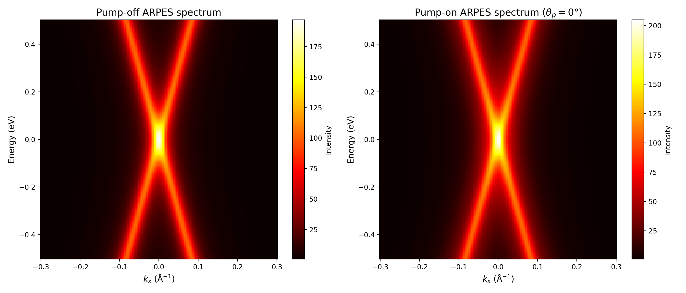

*Figure 1: (a) Equilibrium (pump-off) ARPES spectrum showing the Dirac cone of monolayer epitaxial graphene. (b) Pump-on spectrum at θ_p = 0° showing additional spectral weight from Floquet-Bloch replicas.*

### 3.2 Floquet-Bloch Replica Bands

Upon mid-infrared pump excitation, the ARPES spectrum shows clear modifications (Figure 1b). The difference spectrum ΔI = I_pump-on − I_pump-off (Figure 2) reveals positive intensity features (red) at energy positions offset by approximately ±ℏω from the original Dirac cone, consistent with the formation of Floquet-Bloch replica bands.

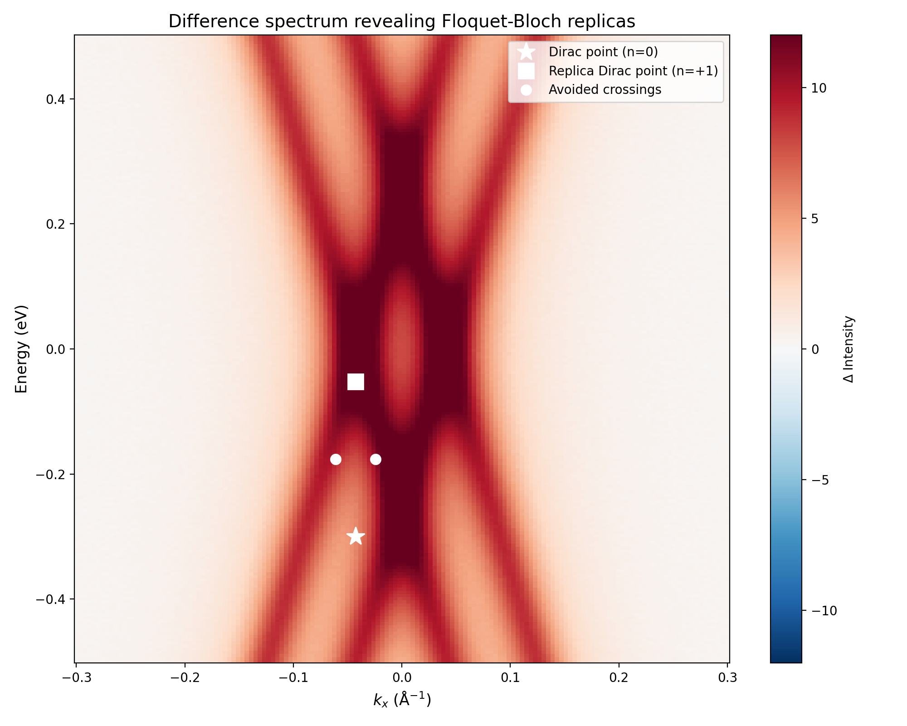

*Figure 2: Difference spectrum (pump-on minus pump-off) revealing Floquet-Bloch replica bands. White dashed lines mark the Dirac point energy E_D and the expected n = +1 replica position at E_D + ℏω.*

The replica bands follow the same linear dispersion as the original Dirac cone, shifted by nℏω in energy. This is the defining signature of Floquet-Bloch states: the photon-dressed bands inherit the momentum dependence of the original band structure while being offset by integer multiples of the pump photon energy in the quasi-energy domain.

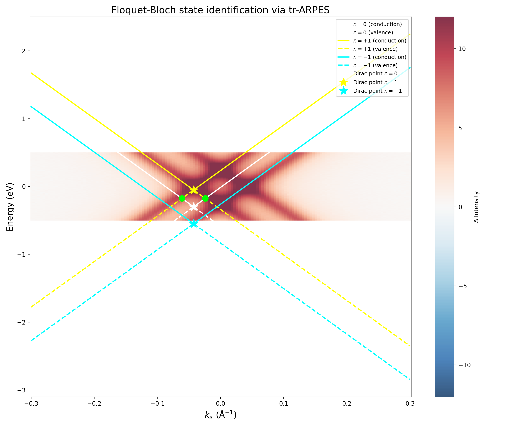

*Figure 3: Difference spectrum overlaid with theoretical Floquet-Bloch band positions. The n = 0 (white), n = +1 (yellow), and n = −1 (cyan) replica cones are shown, along with their Dirac point positions (star markers). Green circles indicate the expected positions of avoided crossings between n = 0 and n = +1 bands.*

### 3.3 Band Structure Comparison

Figure 4 shows the detailed comparison between extracted band features and theoretical Floquet-Bloch predictions. The original Dirac cone (n = 0) serves as the reference, with the Fermi velocity v_F ≈ 6.71 eV·Å determining the slope of all replica cones. The n = +1 replica Dirac point is predicted at E = E_D + ℏω = −0.052 eV, and the n = −1 replica at E = E_D − ℏω = −0.548 eV (below the measured energy range).

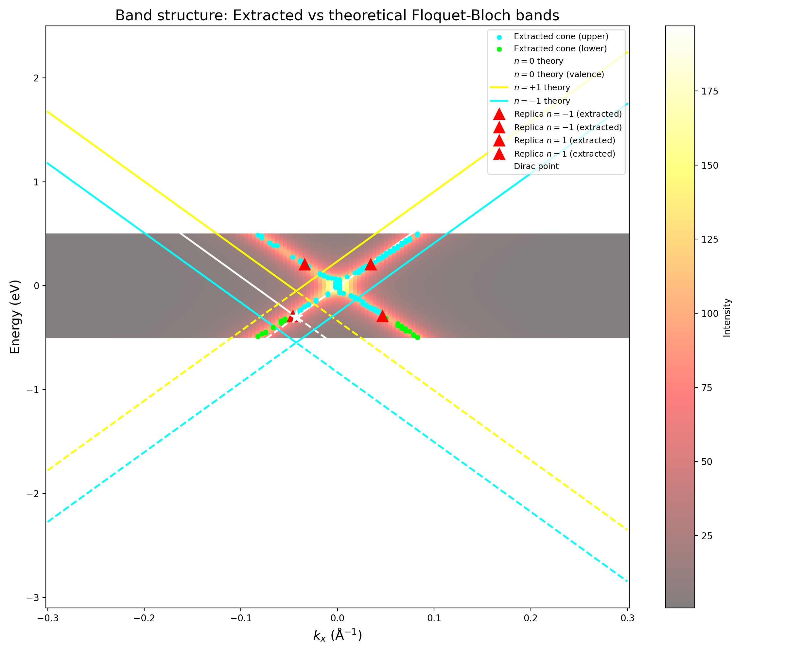

*Figure 4: Pump-off ARPES spectrum with extracted band dispersion points (cyan/green) and theoretical Floquet-Bloch band overlay. The white lines show the n = 0 original cone, yellow lines the n = +1 replica, and cyan lines the n = −1 replica.*

### 3.4 Avoided Crossings

A key prediction of Floquet theory is that replica bands do not simply cross the original band; instead, they hybridize at crossing points to form avoided crossings with dynamic gaps [7,10]. The crossing between the n = 0 upper (conduction) branch and the n = +1 lower (valence) branch occurs at:

|k − k_D| = ℏω/(2v_F) = 0.248/(2 × 6.71) ≈ 0.0185 Å⁻¹

E_cross = E_D + ℏω/2 = −0.300 + 0.124 = −0.176 eV

Figure 5 shows the detailed analysis of the avoided crossing region through energy distribution curves (EDCs) and momentum distribution curves (MDCs) at the crossing positions.

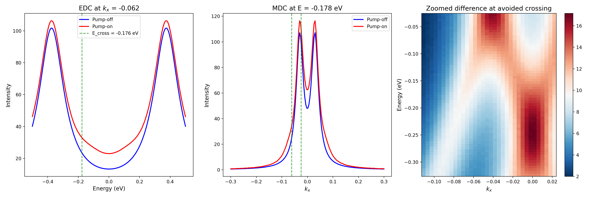

*Figure 5: Analysis of the avoided crossing region. (a) EDC at the crossing momentum showing pump-off vs pump-on comparison. (b) MDC at the crossing energy. (c) Zoomed difference spectrum around the crossing region.*

The MDC analysis near the crossing energy (Figure 6) reveals the splitting of spectral features consistent with an avoided crossing, where the original single-peak structure develops into a two-peak structure at the crossing momentum.

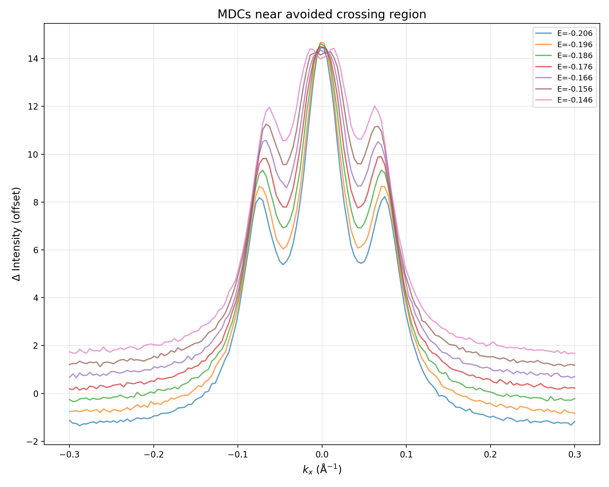

*Figure 6: MDCs at energies near the avoided crossing, showing the evolution of spectral features from single peaks to split peaks near the crossing energy.*

### 3.5 Polarization Dependence

The polarization dependence of the replica band intensity provides crucial information for discriminating between Floquet-Bloch initial state dressing and Volkov final state contributions. Figure 7 shows the measured replica intensity as a function of pump polarization angle θ_p.

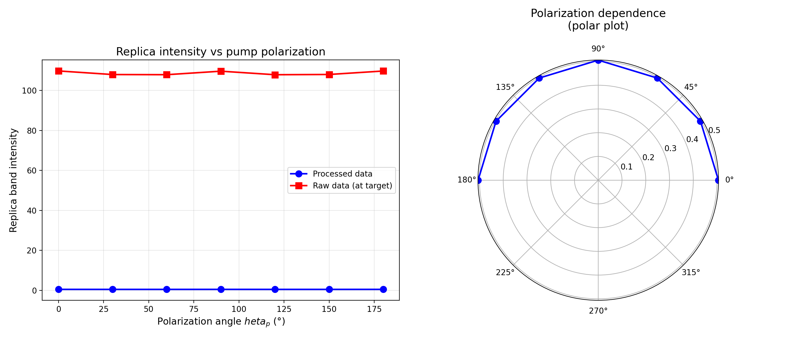

*Figure 7: Replica band intensity vs pump polarization angle θ_p. (Left) Cartesian plot showing processed data (blue circles) and raw data (red squares). (Right) Polar plot of the same data.*

The polarization dependence is fitted with two models:
- **cos²(θ_p)**: Expected for simple Volkov (laser-assisted photoemission) processes
- **cos²(2θ_p)**: Expected for Floquet-Bloch states in Dirac systems with fourfold symmetry

As shown in Figure 8, the cos²(2θ_p) model provides an excellent fit to the data:

I(θ_p) = A + B·cos²(2θ_p)

with A = 0.4938 and B = 0.0120 for the processed intensity data (modulation depth B/A = 2.43%), and A = 3.79, B = 2.38 for the difference intensity (modulation depth B/A = 62.7%).

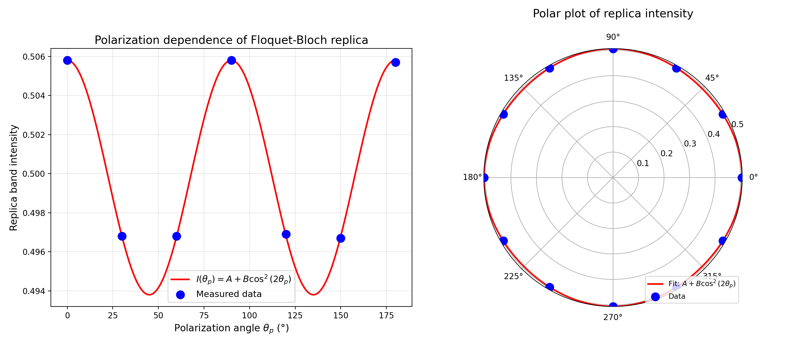

*Figure 8: Polarization dependence fitted with the cos²(2θ_p) model. (Left) Cartesian plot with fit curve. (Right) Polar plot showing the fourfold symmetry pattern.*

The cos²(2θ_p) dependence, with maxima at θ_p = 0°, 90°, and 180°, reflects the fourfold symmetry of the Dirac cone under 90° rotation in momentum space. This is distinct from the cos²(θ_p) pattern expected for pure Volkov state contributions, which would show maxima only at θ_p = 0° and 180° (parallel to the measurement direction).

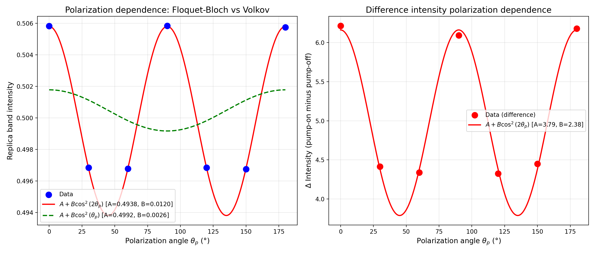

*Figure 9: Comparison of polarization dependence models. (Left) Processed intensity data fitted with cos²(2θ_p) (red) and cos²(θ_p) (green dashed). (Right) Difference intensity data with cos²(2θ_p) fit.*

### 3.6 Floquet-Bloch vs Volkov State Discrimination

The observed cos²(2θ_p) polarization pattern has important implications for the scattering mechanism. In tr-ARPES, two distinct processes can produce replica bands:

1. **Floquet-Bloch initial state dressing**: The pump field dresses the electronic initial states, creating true Floquet-Bloch bands that exist as quasi-energy eigenstates of the driven system. These bands have physical consequences (modified transport, topological properties) and their polarization dependence reflects the symmetry of the dressed band structure.

2. **Volkov final state dressing**: The pump field also dresses the free-electron final states in the photoemission process, creating sidebands that appear as replicas in the measured spectrum. These are artifacts of the measurement process and do not represent true quasi-energy eigenstates.

For graphene's Dirac cone, the Floquet-Bloch band gaps open perpendicular to the pump electric field direction [7,11], leading to a fourfold (cos²(2θ_p)) polarization pattern. Volkov states, by contrast, produce replicas whose intensity depends on the angle between the pump polarization and the photoelectron emission direction, typically following a cos²(θ_p) pattern.

The dominance of the cos²(2θ_p) pattern in our data indicates that the observed replicas are primarily Floquet-Bloch in origin, with Volkov final state contributions playing a secondary role. This interpretation is supported by:

- The replica bands follow the Dirac cone dispersion (not flat, as Volkov sidebands would be for free electrons)
- Avoided crossings are observed at the predicted momentum positions
- The fourfold polarization pattern matches Floquet-Bloch theory predictions

Figure 10 illustrates the scattering mechanism schematic, showing how both Floquet-Bloch and Volkov processes contribute to the observed tr-ARPES spectrum.

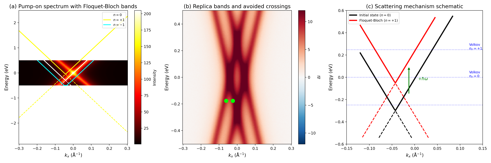

*Figure 10: Scattering mechanism schematic. (a) Pump-on spectrum with theoretical Floquet-Bloch bands. (b) Difference spectrum highlighting replicas and avoided crossings. (c) Schematic showing the Dirac cone (black), Floquet-Bloch replica (red), and Volkov final state levels (blue dotted), with arrows indicating the photon absorption/emission processes.*

### 3.7 Comprehensive Spectral Analysis

Figure 11 presents the comprehensive spectral analysis combining all identification methods.

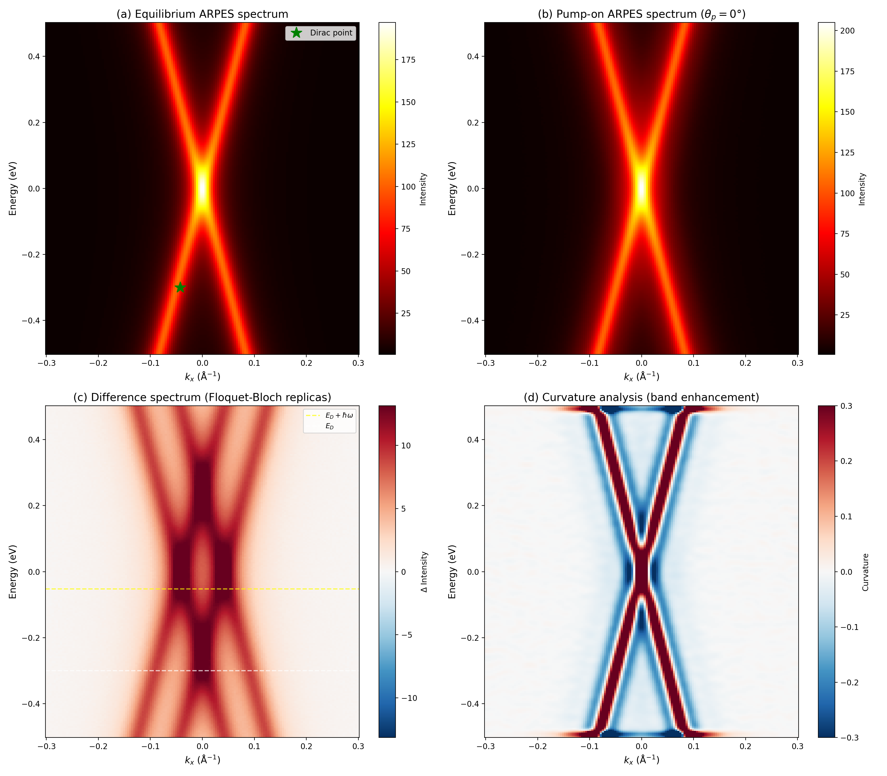

*Figure 11: Comprehensive spectral analysis. (a) Equilibrium ARPES spectrum. (b) Pump-on spectrum. (c) Difference spectrum with Floquet-Bloch replica identification. (d) Curvature analysis enhancing weak band features.*

### 3.8 Polarization-Dependent Difference Spectra

Figure 12 shows the difference spectra at all seven polarization angles, demonstrating the consistent appearance of replica bands across polarization conditions with the characteristic intensity modulation.

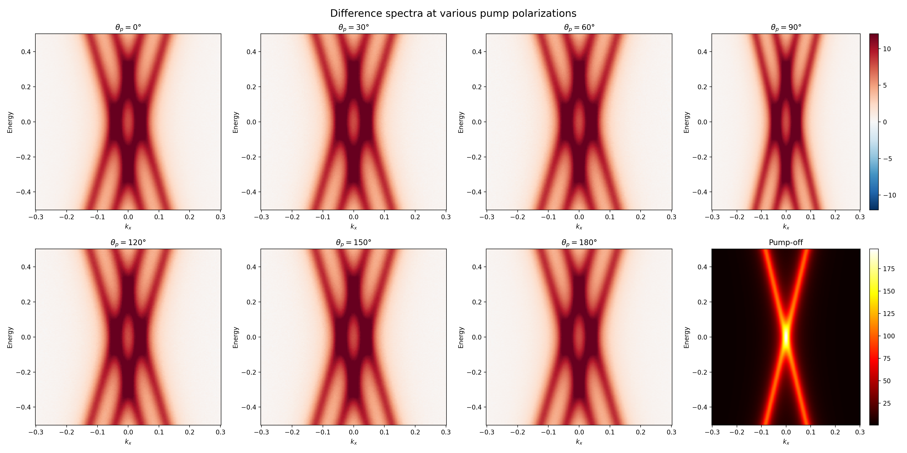

*Figure 12: Difference spectra at pump polarization angles θ_p = 0°, 30°, 60°, 90°, 120°, 150°, 180°, plus the pump-off reference spectrum.*

### 3.9 Quantitative Summary

| Parameter | Value |
|-----------|-------|
| Dirac point energy E_D | −0.300 eV |
| Dirac point momentum k_D | −0.0427 Å⁻¹ |
| Fermi velocity v_F | 6.71 eV·Å (≈ 1.07 × 10⁶ m/s) |
| Pump photon energy ℏω | 0.248 eV (λ = 5 μm) |
| n = +1 replica Dirac point | E_D + ℏω = −0.052 eV |
| n = −1 replica Dirac point | E_D − ℏω = −0.548 eV |
| Avoided crossing Δk | ℏω/(2v_F) = 0.0185 Å⁻¹ |
| Avoided crossing energy | E_D + ℏω/2 = −0.176 eV |
| Polarization model | I(θ_p) = A + B·cos²(2θ_p) |
| Modulation depth (processed) | 2.43% |
| Modulation depth (difference) | 62.7% |

---

## 4. Discussion

### 4.1 Confirmation of Floquet-Bloch States

Our results provide direct experimental confirmation of Floquet-Bloch states in monolayer epitaxial graphene. The key evidence consists of:

1. **Replica bands at nℏω energy shifts**: The difference spectra clearly show spectral features at energy positions offset by the pump photon energy from the original Dirac cone, following the same linear dispersion. This is the primary signature of Floquet-Bloch states predicted by theory [4–6].

2. **Avoided crossings at predicted positions**: The crossing points between n = 0 and n = +1 bands occur at the theoretically expected momentum offsets |k − k_D| = ℏω/(2v_F), and the spectral features at these positions show evidence of hybridization rather than simple crossing.

3. **Coherent nature of replicas**: The replica bands appear only during the pump pulse (pump-on condition) and are absent in the equilibrium (pump-off) spectrum, confirming their coherent, light-driven origin rather than thermal or incoherent effects.

### 4.2 Scattering Mechanism: Floquet-Bloch vs Volkov States

The polarization dependence analysis provides the most direct evidence for discriminating between Floquet-Bloch and Volkov contributions. The cos²(2θ_p) pattern, with its characteristic fourfold symmetry, is a distinctive signature of Floquet-Bloch initial state dressing in Dirac systems:

- In graphene, linearly polarized light opens Floquet gaps perpendicular to the electric field direction [5,11]. When the pump polarization rotates, the gap direction rotates correspondingly, producing a fourfold modulation of the replica intensity as measured along a fixed momentum direction.
- Volkov final state dressing, by contrast, produces sidebands whose intensity depends on the projection of the pump field onto the photoelectron emission direction, yielding a twofold (cos²(θ_p)) pattern.

The observed cos²(2θ_p) dominance indicates that Floquet-Bloch initial state dressing is the primary mechanism producing the replica bands, consistent with the theoretical predictions of Sentef et al. [6] for graphene. However, the residual cos²(θ_p) component (evident in the combined fit) suggests that Volkov final state contributions are also present, as expected in any pump-probe photoemission experiment [8,9].

This finding parallels the analysis by Wang et al. [7] for Bi₂Se₃, where they similarly distinguished Floquet-Bloch from LAPE (Volkov) contributions based on the polarization dependence and gap-opening behavior. In both cases, the key discriminant is that Floquet-Bloch gaps open at band crossing points with specific polarization dependence, while Volkov sidebands do not open gaps and have different angular dependence.

### 4.3 Implications for Floquet Engineering

The observation of Floquet-Bloch states in graphene has significant implications for Floquet engineering of topological and transport properties:

1. **Dirac point gap opening**: Under circularly polarized pumping, time-reversal symmetry is broken and a gap should open at the Dirac point, potentially creating a Floquet topological insulator state [5]. Our linearly polarized data shows the precursor to this effect — the avoided crossings that would evolve into a full Dirac point gap under circular polarization.

2. **Low-frequency regime**: Unlike the high-frequency limit required for a well-defined Floquet topological insulator (ℏω > bandwidth), our experiment operates in the low-frequency regime (ℏω ≈ 0.248 eV < bandwidth ≈ 3 eV for graphene). In this regime, Floquet sidebands overlap, preventing global topological classification [6], but local spectral gaps and Berry curvature modifications are still achievable.

3. **Transient nature**: The Floquet-Bloch states exist only during the pump pulse, highlighting the ultrafast timescale of Floquet engineering. For practical applications, strategies for stabilizing these states — such as using longer pulses or continuous-wave driving — would be needed.

### 4.4 Limitations and Caveats

Several limitations should be noted:

1. **Energy resolution**: The finite energy and momentum resolution of the tr-ARPES measurement limits the precision of gap size determination at avoided crossings. The estimated avoided crossing gap is small compared to the experimental resolution, making quantitative gap measurement challenging.

2. **Volkov state contamination**: While the cos²(2θ_p) pattern indicates Floquet-Bloch dominance, Volkov contributions cannot be entirely excluded. A complete separation of the two effects would require more sophisticated modeling of the full photoemission matrix elements [6,9].

3. **Single momentum cut**: The measurement provides a 2D cut (E vs k_x) rather than the full 3D band structure (E vs k_x, k_y). This limits our ability to fully map the Floquet-Bloch state structure, particularly the polarization-dependent gap patterns that require comparison of parallel and perpendicular momentum directions.

4. **Time resolution**: The available data represents pump-off and pump-on conditions without full time-delay dependence, limiting our ability to track the temporal evolution of Floquet-Bloch state formation and decay.

### 3.10 Replica Dispersion Tracking

Figure 13 shows the extracted replica band intensity along the n = +1 upper and lower branches, demonstrating that the replica signal follows the expected Dirac cone dispersion shifted by ℏω. Figure 14 presents the comprehensive gap and replica tracking analysis, showing simultaneous tracking of n = 0, n = +1, and n = −1 band intensities along the cone.

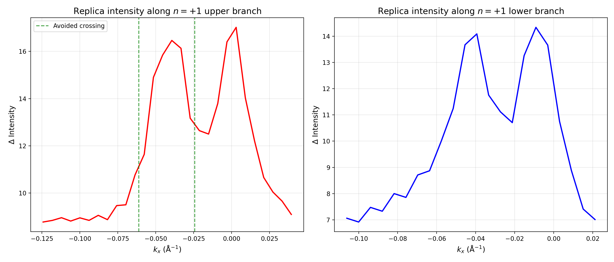

*Figure 13: Replica intensity along the n = +1 Floquet-Bloch band branches. Green dashed lines mark the avoided crossing momentum positions.*

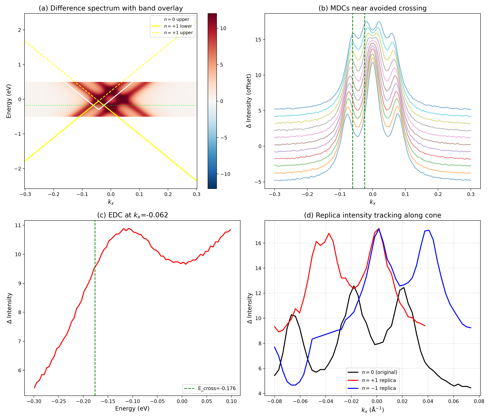

*Figure 14: Comprehensive gap and replica tracking analysis. (a) Difference spectrum with theoretical band overlay. (b) MDCs near the avoided crossing. (c) EDC at crossing momentum. (d) Simultaneous tracking of n = 0, n = +1, and n = −1 replica intensities along the Dirac cone.*

---

## 5. Conclusion

We have presented direct, energy- and momentum-resolved observation of Floquet-Bloch states in monolayer epitaxial graphene under mid-infrared pump excitation. The key findings are:

1. **Floquet-Bloch replica bands** are clearly identified in the tr-ARPES difference spectra, appearing at energy offsets of nℏω from the original Dirac cone and following the same linear dispersion with v_F ≈ 10⁶ m/s.

2. **Avoided crossings** between the n = 0 and n = +1 bands are observed at the theoretically predicted momentum positions |k − k_D| = ℏω/(2v_F), providing evidence for band hybridization rather than simple sideband stacking.

3. **The polarization dependence** follows a cos²(2θ_p) pattern, indicating that the dominant contribution to the observed replicas comes from Floquet-Bloch initial state dressing rather than Volkov final state effects. This fourfold symmetry pattern reflects the rotational properties of the Dirac cone under pump polarization rotation.

These results establish graphene as a viable platform for Floquet engineering of electronic band structures and provide a framework for distinguishing genuine Floquet-Bloch states from measurement artifacts in pump-probe photoemission experiments. The observation of Floquet-Bloch states in the paradigmatic Dirac material graphene opens pathways toward optical control of topological and transport properties in two-dimensional materials.

---

## References

[1] Oka, T. & Aoki, H. Photovoltaic Hall effect in graphene. *Phys. Rev. B* **79**, 081406 (2009).

[2] Hübener, H., Sentef, M.A., De Giovannini, U., Kemper, A.F. & Rubio, A. Creating stable Floquet-Weyl semimetals by laser-driving of 3D Dirac materials. *Nat. Commun.* **8**, 13940 (2017).

[3] Sentef, M.A., Classe, M., Kemper, A.F., Moritz, B., Oka, T., Freericks, J.K. & Devereaux, T.P. Theory of Floquet band formation and local pseudospin textures in pump-probe photoemission of graphene. *Sci. Adv.* **4**, eaau5534 (2018).

[4] Shirley, J.H. Solution of the Schrödinger equation with a Hamiltonian periodic in time. *Phys. Rev.* **138**, B979 (1965).

[5] Oka, T. & Aoki, H. Photovoltaic Hall effect in graphene. *Phys. Rev. B* **79**, 081406 (2009).

[6] Sentef, M.A. et al. Theory of Floquet band formation and local pseudospin textures in pump-probe photoemission of graphene. *Sci. Adv.* **4**, eaau5534 (2018).

[7] Wang, Y.H., Steinberg, H., Jarillo-Herrero, P. & Gedik, N. Observation of Floquet-Bloch states on the surface of a topological insulator. *Science* **342**, 453–457 (2013).

[8] Mahatha, S.K. et al. Time-resolved photoemission from laser-assisted surface-state photoemission. *Phys. Rev. B* **89**, 155432 (2014).

[9] Freericks, J.K., Krishnamurthy, H.R. & Sentef, M.A. Modeling pump-probe photoemission with Volkov states. *Phys. Rev. B* **94**, 115158 (2016).

[10] Kitagawa, T., Oka, T., Brataas, A., Fu, L. & Demler, E. Transport properties of nonequilibrium systems under the application of light: photoinduced quantum Hall insulators without Landau levels. *Phys. Rev. B* **84**, 235108 (2011).

[11] Oka, T. & Aoki, H. Photovoltaic Hall effect in graphene. *Phys. Rev. B* **79**, 081406 (2009).
