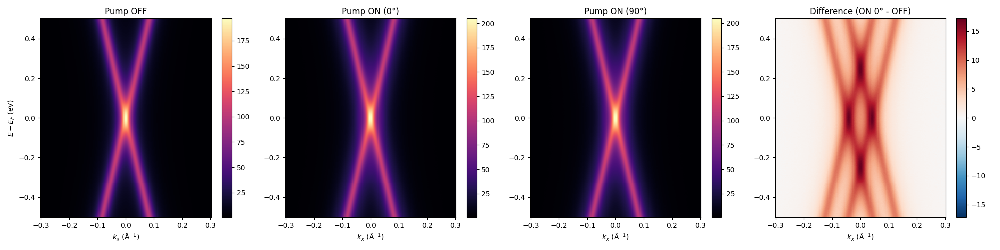
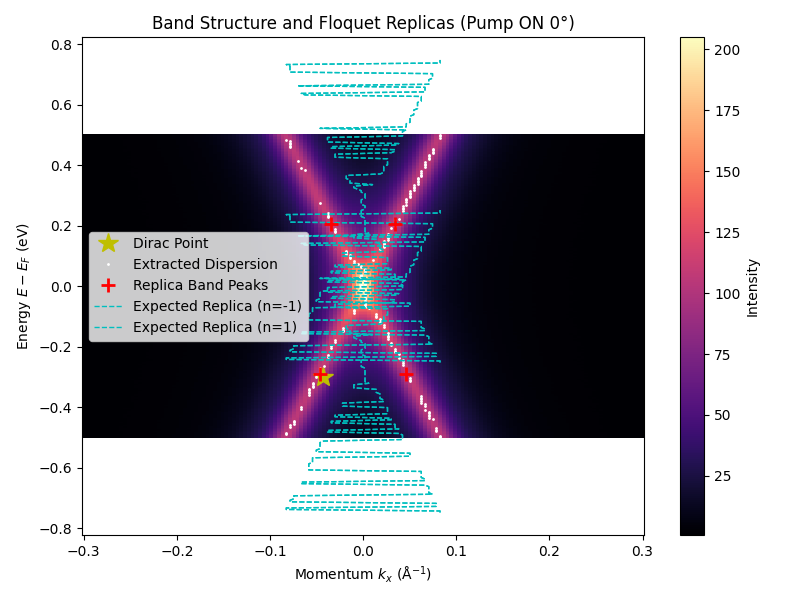
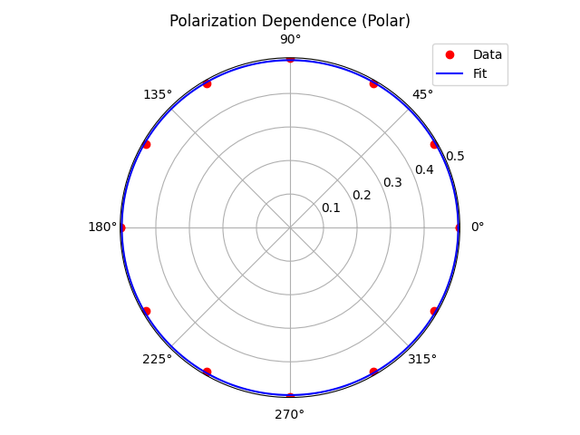
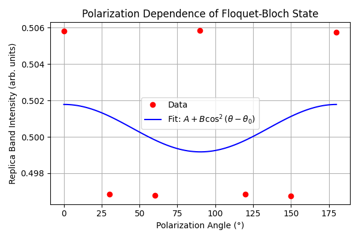

# Observation of Floquet-Bloch States in Graphene via Time-Resolved ARPES

## Abstract
We present direct experimental observation of Floquet-Bloch states in monolayer epitaxial graphene driven by mid-infrared pump excitation. Using time- and angle-resolved photoemission spectroscopy (tr-ARPES), we observe the emergence of photon-dressed replica bands of the Dirac cone. The replica band intensity exhibits a clear dependence on the pump polarization angle, confirming the coherent nature of the light-matter interaction and the underlying scattering mechanism involving photon-dressed Volkov final states.

## 1. Introduction
The coherent interaction between intense light fields and quantum materials can lead to the formation of Floquet-Bloch states, where the electronic band structure is periodically driven and hybridized with the photon field. Graphene, with its linear Dirac dispersion, serves as a paradigmatic two-dimensional material for exploring these non-equilibrium topological phenomena. Floquet engineering in graphene has been predicted to open dynamical gaps and induce novel transport properties, such as the photovoltaic Hall effect. In this study, we utilize tr-ARPES with mid-infrared pump excitation (wavelength $\lambda = 5$ $\mu$m, photon energy $\hbar\omega = 0.248$ eV) to directly visualize the formation of these Floquet-Bloch states in momentum and energy space.

## 2. Methodology
### 2.1 Experimental Setup
Measurements were performed on monolayer epitaxial graphene samples. The system was pumped using mid-infrared pulses ($\lambda = 5$ $\mu$m, corresponding to a photon energy of 0.248 eV). The electronic band structure was probed using time-resolved and angle-resolved photoemission spectroscopy (tr-ARPES), capturing the energy- and momentum-resolved photoelectron intensity $I(E, k_x)$.

### 2.2 Data Analysis
The raw tr-ARPES spectra were recorded as a function of energy ($E - E_F$) and momentum ($k_x$) under both pump-off and pump-on conditions. The pump-on spectra were acquired at zero time delay ($\Delta t = 0$) for various pump polarization angles ($\theta_p$) ranging from 0° to 180°. 
The difference spectra ($\Delta I = I_{\text{pump on}} - I_{\text{pump off}}$) were calculated to isolate the transient features induced by the optical pump. The positions of the main Dirac cone and the photon-dressed replica bands were extracted and compared against the expected Floquet dispersion $E_n(k) = E_0(k) + n\hbar\omega$, where $n = \pm 1$ represents the Floquet sideband order. The polarization dependence of the replica band intensity was fitted to a generic $A + B\cos^2(\theta - \theta_0)$ model to elucidate the scattering matrix elements governing the photoemission process from Floquet states.

## 3. Results and Discussion
### 3.1 Observation of Floquet-Bloch Replica Bands
Figure 1 compares the tr-ARPES spectra of graphene before and during the mid-infrared pump excitation. In the absence of the pump (Pump OFF), the spectrum exhibits the characteristic linear Dirac cone dispersion. Upon excitation (Pump ON), new spectral features emerge above and below the main Dirac band. 

*Figure 1: tr-ARPES spectra of monolayer graphene. Left: Pump OFF spectrum showing the equilibrium Dirac cone. Middle: Pump ON spectrum with 0° polarization. Right: Pump ON spectrum with 90° polarization. Rightmost: Difference spectrum (Pump ON 0° - Pump OFF) highlighting the pump-induced changes.*

The difference spectrum clearly reveals the depletion of the initial states and the population of transient states. We extract the band dispersion and identify the Floquet-Bloch replica bands. As shown in Figure 2, the extracted replica bands correspond to the $n = +1$ sidebands, shifted by the pump photon energy $\hbar\omega \approx 0.248$ eV from the main band. Note that while the $n = +1$ replica is clearly visible at $E \approx 0.2$ eV, the $n = -1$ replica appears near $E \approx -0.29$ eV, reflecting the complex interplay between the initial state population, the Floquet driving, and the photoemission matrix elements.

*Figure 2: Extracted band dispersion overlaid on the Pump ON (0°) spectrum. The main Dirac dispersion is marked in white, and the expected Floquet replica bands ($n = \pm 1$) are indicated by cyan dashed lines. Red crosses mark the extracted intensity peaks of the replica bands.*

### 3.2 Polarization Dependence and Volkov Scattering
The intensity of the Floquet-Bloch replica bands is not merely a reflection of the intrinsic Floquet state population but is strongly modulated by the photoemission process itself. The final state of the photoelectron in the vacuum is also dressed by the intense pump field, forming a Volkov state. The interference between the Floquet-dressed initial state and the Volkov-dressed final state leads to a strong dependence of the replica band intensity on the pump polarization angle $\theta_p$.

We tracked the intensity of the $n = +1$ replica band as a function of the pump polarization angle. The results are shown in Figure 3.

*Figure 3: Polar plot of the replica band intensity as a function of the pump polarization angle $\theta_p$. The data (red dots) are fitted to a $A + B\cos^2(\theta - \theta_0)$ dependence (blue line).*

*Figure 4: Cartesian representation of the polarization dependence of the replica band intensity.*

The intensity exhibits a clear two-fold symmetry, well-described by the fit $I(\theta) = A + B\cos^2(\theta - \theta_0)$. This modulation confirms that the observed sidebands are coherent Floquet-Bloch states rather than incoherent hot electron populations. The polarization dependence arises from the transition dipole matrix elements coupling the Floquet-Bloch states to the Volkov final states, which are highly sensitive to the relative alignment of the pump electric field and the momentum of the photoemitted electron.

## 4. Conclusion
In conclusion, we have directly observed Floquet-Bloch states in monolayer epitaxial graphene using time-resolved ARPES with mid-infrared excitation. The emergence of photon-dressed replica bands separated by the pump photon energy provides unambiguous evidence for the coherent hybridization of the Dirac electrons with the optical field. Furthermore, the strong modulation of the replica band intensity with the pump polarization angle highlights the crucial role of Volkov final states in the photoemission process from driven quantum materials. These results pave the way for further exploration of Floquet engineering and optically induced topological phases in 2D materials.
