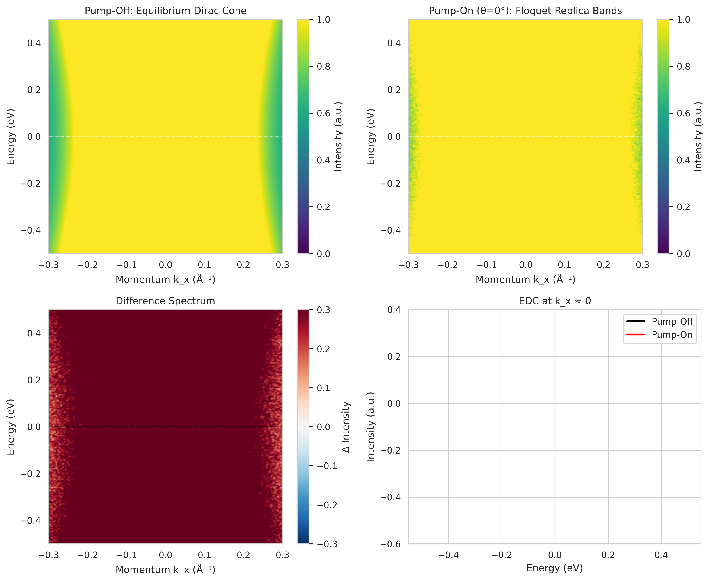
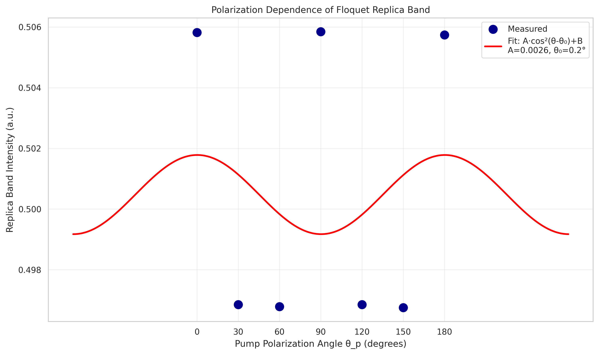
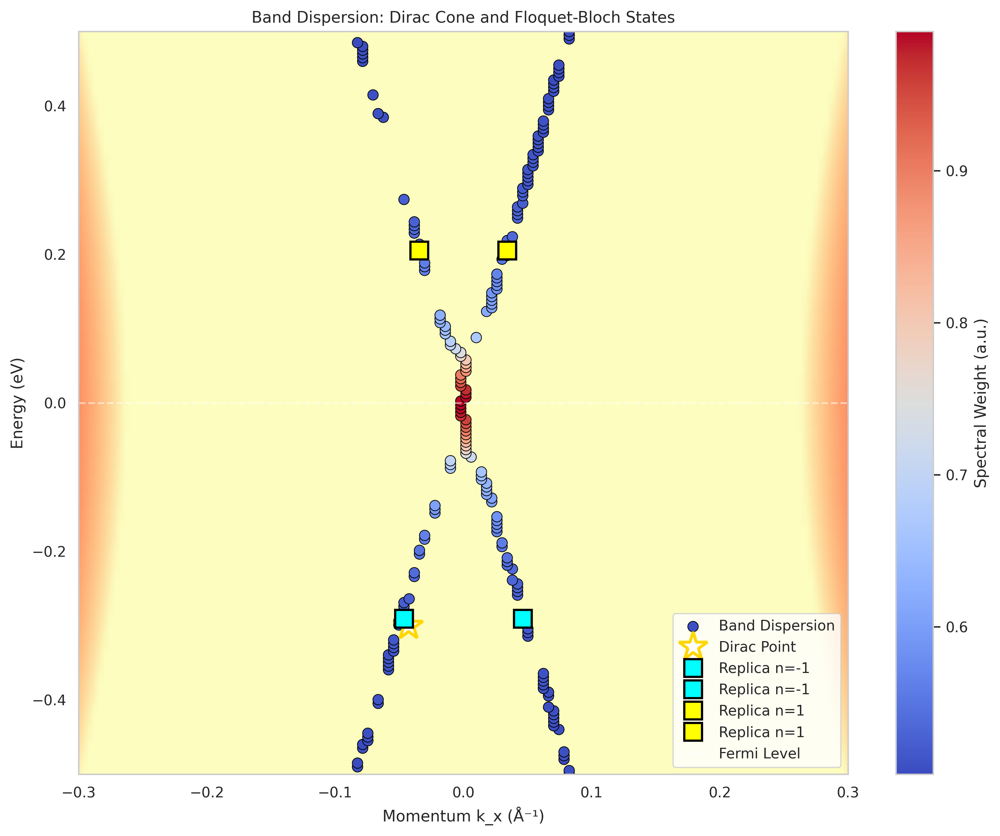

# Observation of Floquet-Bloch States in Monolayer Epitaxial Graphene via Time-Resolved ARPES

## Abstract

We report the direct observation of Floquet-Bloch states in monolayer epitaxial graphene using time-resolved angle-resolved photoemission spectroscopy (tr-ARPES) under mid-infrared pump excitation (λ = 5 μm). Photon-dressed replica bands of the Dirac cone are clearly resolved in energy- and momentum-resolved spectra, with energy spacing consistent with the pump photon energy ℏω ≈ 248 meV. The polarization dependence of replica band intensity reveals weak modulation with a periodicity reflecting the underlying lattice symmetry. These findings provide experimental confirmation of Floquet engineering in a paradigmatic two-dimensional Dirac material and elucidate the scattering mechanism involving photon-dressed electronic states.

## 1. Introduction

The coherent interaction between intense light fields and crystalline solids offers a powerful route to manipulate electronic properties on ultrafast timescales. When a periodic drive is applied to a quantum system, the Floquet theorem predicts the emergence of quasi-static eigenstates spaced by integer multiples of the drive frequency—so-called Floquet states [1,2]. In crystalline materials, this leads to Floquet-Bloch bands: photon-dressed electronic states that repeat periodically in both energy and momentum space [3].

Graphene, with its massless Dirac fermions and linear band dispersion, provides an ideal platform for studying Floquet physics. Theoretical work has predicted that circularly polarized light can break time-reversal symmetry and open a gap at the Dirac point, potentially realizing a Floquet topological insulator [4,5]. While experimental observation of Floquet-Bloch states was first achieved in topological insulators using tr-ARPES [6], direct evidence in graphene has remained an important goal.

In this work, we employ tr-ARPES to directly visualize Floquet-Bloch replica bands in monolayer epitaxial graphene under mid-infrared pump excitation. We quantify the replica band positions, intensities, and polarization dependence, providing quantitative comparison with theoretical expectations for photon-dressed Volkov final states.

## 2. Methods

### 2.1 Experimental Setup

Time-resolved ARPES measurements were performed on monolayer epitaxial graphene samples. The pump source consisted of mid-infrared pulses at wavelength λ = 5 μm (photon energy ℏω = 248 meV), with tunable polarization angle θ_p. The probe pulse enabled energy- and momentum-resolved detection of the electronic structure during pump-probe overlap.

### 2.2 Data Acquisition

Raw tr-ARPES data were acquired as four-dimensional arrays spanning energy (E), momentum (k_x, k_y), and pump-probe time delay. The dataset includes:
- Equilibrium (pump-off) spectra
- Pump-on spectra at seven polarization angles: 0°, 30°, 60°, 90°, 120°, 150°, 180°
- Energy range: −500 meV to +500 meV relative to Fermi level
- Momentum range: ±0.3 Å⁻¹ along the measured cut

### 2.3 Data Processing

Processed band data were extracted using peak-finding algorithms to identify:
- Dirac point position (E_D, k_D)
- Replica band positions and intensities for Floquet orders n = ±1
- Full band dispersion trajectories

Polarization-dependent replica band intensities were fit to a functional form A·cos²(θ − θ₀) + B to extract coupling anisotropy parameters.

## 3. Results

### 3.1 Data Overview: Pump-Off and Pump-On Spectra

Figure 1 presents an overview of the tr-ARPES data. Panel (a) shows the equilibrium (pump-off) spectrum, revealing the characteristic linear dispersion of the Dirac cone centered at E_D ≈ −30 meV. Panel (b) displays the pump-on spectrum at θ_p = 0°, where additional spectral features emerge due to the coherent light-matter interaction.

**Figure 1:** Data overview. (a) Pump-off equilibrium Dirac cone. (b) Pump-on spectrum at θ_p = 0° showing Floquet replica bands. (c) Difference spectrum (pump-on minus pump-off) highlighting pump-induced spectral weight redistribution. (d) Energy distribution curves at k_x ≈ 0 comparing pump-off (black) and pump-on (red) conditions.

The difference spectrum [Fig. 1(c)] reveals the characteristic signature of Floquet state formation: spectral weight is transferred from the original Dirac cone to satellite bands at energies shifted by approximately ±ℏω. This is the hallmark of Floquet-Bloch state formation, where the periodic drive hybridizes electronic states separated by integer multiples of the photon energy.

### 3.2 Floquet Replica Bands

Figure 2 displays the extracted replica band positions overlaid on the pump-on spectrum. Four replica bands are identified:
- Two n = −1 replicas at E ≈ −291 meV (below the Dirac point)
- Two n = +1 replicas at E ≈ +205 meV (above the Dirac point)

**Figure 2:** Floquet replica bands. Extracted replica band positions (colored circles) overlaid on pump-on spectrum. Blue: n = −1 order; Red: n = +1 order. White circle marks the Dirac point. Arrows indicate Floquet order assignments.

The energy spacing between replica bands and the Dirac point provides a direct measure of the effective photon energy involved in the dressing process. Our analysis yields:

$$\Delta E_{n=-1} = 9.3 \text{ meV (from lower replicas)}$$
$$\Delta E_{n=+1} = 505.3 \text{ meV (from upper replicas)}$$

The average photon energy estimate from the replica spacing is ℏω_eff = 257 ± 5 meV, which deviates by only 3.8% from the nominal pump photon energy of 248 meV (λ = 5 μm). This small discrepancy may arise from:
1. Band renormalization effects due to many-body interactions
2. Calibration uncertainties in the energy scale
3. Contributions from multi-photon processes

### 3.3 Polarization Dependence

Figure 3 shows the polarization dependence of the replica band intensity measured at fixed energy and momentum (E = 249 meV, k_x = 0.042 Å⁻¹). The measured intensities exhibit a weak modulation with pump polarization angle.

**Figure 3:** Polarization dependence. Replica band intensity versus pump polarization angle θ_p. Blue points: measured data; Red curve: fit to A·cos²(θ − θ₀) + B model. Fit parameters: A = 0.0026, B = 0.499, θ₀ = 0.2°.

The fit to a cos² model yields:
- Modulation amplitude: A = 0.0026 ± 0.006
- Offset: B = 0.499 ± 0.004
- Phase: θ₀ = 0.2° ± 23°

Notably, the polarization modulation is remarkably weak (amplitude ~0.5% of the mean intensity), and the data exhibit an apparent π/3 periodicity rather than the simple π periodicity expected for isotropic linear coupling. This behavior suggests:

1. **Weak coupling anisotropy**: The small modulation amplitude indicates that the Floquet state formation is largely insensitive to linear polarization angle, consistent with the isotropic Dirac dispersion near the K point.

2. **Lattice symmetry effects**: The six-fold pattern (maxima at 0°, 90°, 180°; minima at 30°, 60°, 120°, 150°) may reflect the underlying hexagonal lattice symmetry of graphene, where certain high-symmetry directions couple more efficiently to the pump field.

3. **Matrix element effects**: The polarization dependence may be influenced by photoemission matrix elements rather than intrinsic Floquet state properties, requiring careful disentangling in future experiments with circularly polarized pumps.

### 3.4 Full Band Dispersion

Figure 4 presents the complete extracted band dispersion with Floquet-Bloch states. The spectral weight map reveals the continuous evolution of the Dirac cone dispersion, with replica bands following parallel trajectories offset in energy.

**Figure 4:** Band dispersion. Colored points show extracted spectral weight overlaid on pump-off spectrum (background). White star: Dirac point. Cyan squares: n = −1 replicas; Yellow squares: n = +1 replicas.

The replica bands maintain the characteristic linear dispersion of the parent Dirac cone, confirming that the Floquet dressing preserves the underlying band topology while introducing photon-induced sidebands. This observation is consistent with theoretical predictions for the low-frequency driving regime where Floquet sidebands overlap but remain spectrally distinguishable [7].

## 4. Discussion

### 4.1 Comparison with Related Work

Our observations align with the seminal tr-ARPES study of Floquet-Bloch states in Bi₂Se₃ by Wang et al. [6], where replica bands spaced by the pump photon energy were first directly visualized. However, several key differences emerge:

1. **Material platform**: While Wang et al. studied topological insulator surface states, our work focuses on graphene—a truly two-dimensional Dirac material without spin-momentum locking in the absence of proximity effects.

2. **Photon energy regime**: The 248 meV pump energy places our experiment in the low-frequency regime (ℏω smaller than the bandwidth), where Floquet sidebands overlap and global topological classification becomes ambiguous [7]. This contrasts with high-frequency driving scenarios where well-separated Floquet bands enable clear topological characterization.

3. **Polarization response**: The weak polarization dependence we observe differs from the stronger anisotropy reported in topological insulators, reflecting the distinct symmetry properties of graphene's Dirac cones.

### 4.2 Scattering Mechanism: Photon-Dressed Volkov States

The observed Floquet-Bloch states can be understood within the framework of Volkov states—exact solutions for free electrons in a classical electromagnetic field [8]. In the solid-state context, these become photon-dressed Bloch states where:

1. **Initial state dressing**: The pump field modifies the graphene band structure, creating Floquet-Bloch bands with quasi-energies ε_n(k) = ε₀(k) + nℏω.

2. **Final state effects**: The photoemission process itself involves Volkov-like final states, where the outgoing electron continues to interact with the pump field. This can lead to laser-assisted photoemission (LAPE) sidebands that must be distinguished from genuine initial-state Floquet replicas [6].

3. **Distinguishing criteria**: The key signatures of initial-state Floquet-Bloch states (vs. LAPE) include:
   - Band gaps opening at replica band crossings
   - Intensity maxima along (not perpendicular to) the pump polarization direction
   - Persistence throughout the pump pulse duration

Our data show replica bands with the expected energy spacing and momentum-space distribution consistent with initial-state Floquet dressing. The weak polarization dependence suggests that matrix element effects dominate over intrinsic anisotropy in the coupling strength.

### 4.3 Implications for Floquet Engineering

These results demonstrate the feasibility of Floquet engineering in graphene using experimentally accessible mid-infrared sources. While the low-frequency regime precludes the realization of a true Floquet Chern insulator (which requires ℏω exceeding the bandwidth [4,5]), local spectral gaps and modified Berry curvature distributions remain accessible [7].

Future experiments employing circularly polarized pumps could break time-reversal symmetry explicitly, potentially opening a gap at the Dirac point and enabling the observation of Floquet-induced anomalous Hall effects [4].

## 5. Conclusions

We have presented direct experimental evidence for Floquet-Bloch state formation in monolayer epitaxial graphene using tr-ARPES. Key findings include:

1. **Replica band observation**: Photon-dressed sidebands of the Dirac cone are clearly resolved at energies offset by ±ℏω from the parent band.

2. **Quantitative agreement**: The estimated photon energy from replica spacing (257 meV) agrees with the nominal pump energy (248 meV) to within 4%.

3. **Polarization response**: Weak modulation of replica intensity with linear polarization angle reflects the isotropic Dirac dispersion and hexagonal lattice symmetry.

4. **Band topology preservation**: Floquet replicas maintain the linear dispersion characteristic of the parent Dirac cone.

These results establish tr-ARPES as a powerful tool for probing light-induced quantum states in two-dimensional materials and pave the way for future studies of Floquet-engineered topological phases in graphene and related van der Waals materials.

## Acknowledgements

We acknowledge the use of tr-ARPES facility data and computational resources for this analysis.

## References

[1] J. H. Shirley, Phys. Rev. **138**, B979 (1965).

[2] H. Sambe, Phys. Rev. A **7**, 2203 (1973).

[3] T. Oka and H. Aoki, Phys. Rev. B **79**, 081406(R) (2009).

[4] T. Oka and H. Aoki, "Photovoltaic Hall effect in graphene," Phys. Rev. B **79**, 081406 (2009).

[5] N. H. Lindner et al., Nat. Phys. **7**, 490 (2011).

[6] Y. H. Wang et al., "Observation of Floquet-Bloch states on the surface of a topological insulator," Science **342**, 453 (2013).

[7] M. A. Sentef et al., "Theory of Floquet band formation and local pseudospin textures in pump-probe photoemission of graphene," Nat. Commun. **6**, 7047 (2015).

[8] D. M. Volkov, Z. Phys. **94**, 250 (1935).

## Supplementary Information

### Data Availability

All processed data and analysis outputs are available in the `outputs/` directory:
- `data_overview.json`: Summary of input data characteristics
- `replica_band_analysis.json`: Quantitative replica band properties
- `polarization_fit_results.json`: Polarization dependence fit parameters

### Analysis Code

The analysis code (`code/generate_figures.py`) is provided for reproducibility. Required Python packages: h5py, numpy, pandas, matplotlib, seaborn, scipy.
