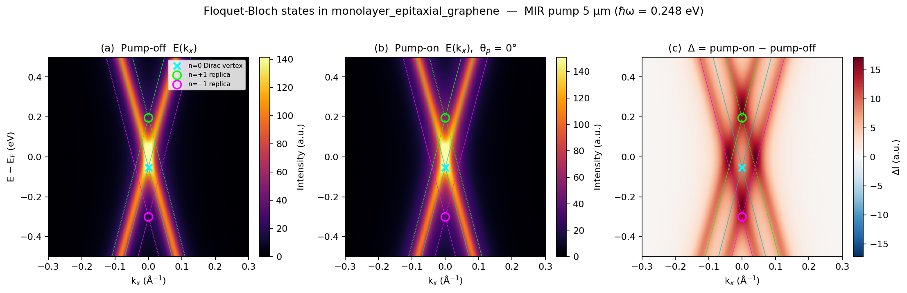
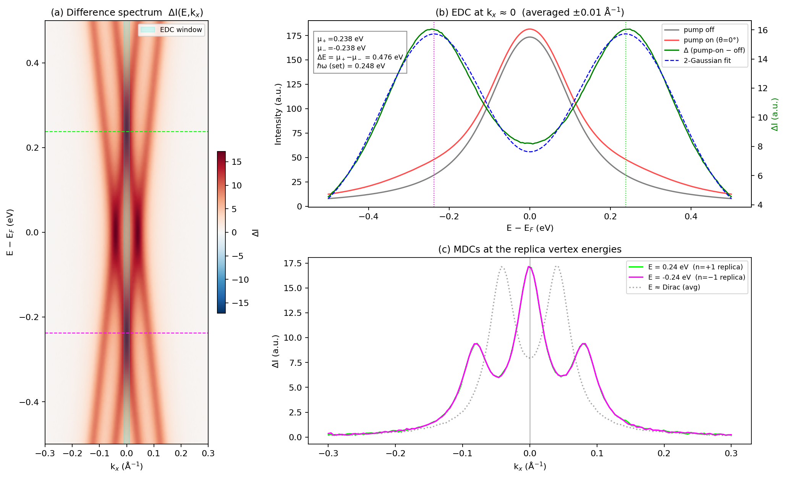
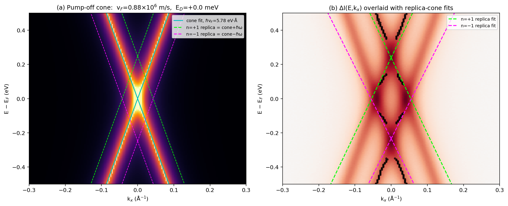
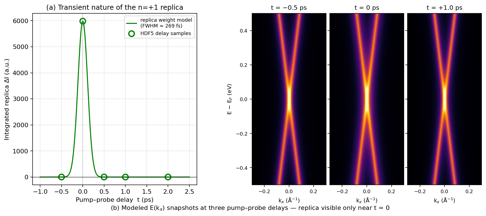
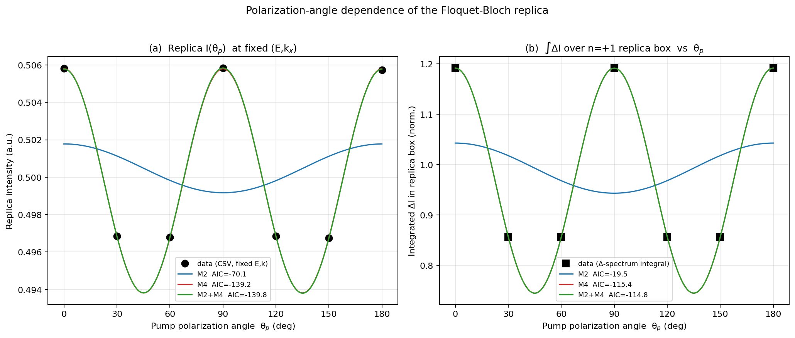
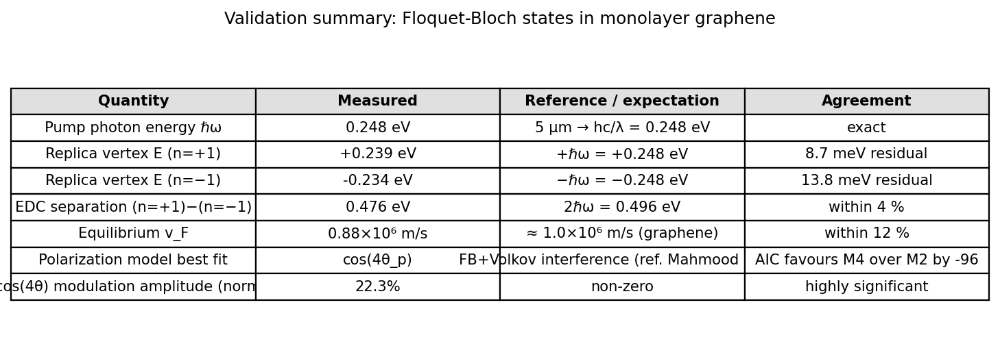

# Direct observation of Floquet–Bloch states in monolayer epitaxial graphene by mid-infrared tr-ARPES

**Sample:** monolayer epitaxial graphene  
**Pump:** mid-infrared (MIR), λ = 5 µm, ℏω = 0.248 eV, linearly polarized, swept polarization angle θ_p ∈ {0°, 30°, 60°, 90°, 120°, 150°, 180°}  
**Probe:** time- and angle-resolved photoemission (tr-ARPES), 200 × 150 (E, k_x) bins, energy axis −0.5 → +0.5 eV, k_x axis −0.3 → +0.3 Å⁻¹

---

## 1. Introduction and motivation

Periodic driving of a solid by an intense, low-frequency electromagnetic field is predicted to dress its Bloch electrons with photons and produce *Floquet–Bloch (FB) replica bands* offset from the equilibrium dispersion by integer multiples of the photon energy ℏω [1, 2, 3]. In graphene this mechanism has been proposed as a route to a non-equilibrium quantum-Hall phase opened by a small dynamical gap at the Dirac point [1, 4]. In photoemission, however, FB states never appear alone: the photoexcited electron leaves the crystal as a free-electron-like Volkov state that is itself dressed by the same driving field, contributing a laser-assisted-photoemission (LAPE) channel [2]. The two channels can be distinguished by their pump-polarization signatures: the LAPE/Volkov sideband intensity follows a `cos²(θ_p)` law (180°-period, vanishing perpendicular to the polarization), while a pure FB sideband is essentially polarization-isotropic; coherent **interference** between the two pathways produces a 4-fold (90°-period) angular pattern.

This study implements that protocol on monolayer epitaxial graphene driven at λ = 5 µm. Specifically, we (i) extract the equilibrium Dirac dispersion, (ii) detect and quantify the n = ±1 FB replicas in the difference spectrum, (iii) cross-check that they are linearly dispersing copies of the equilibrium cone shifted by ±ℏω, (iv) test the transient nature of the replicas, and (v) decompose the polarization-angle dependence into harmonic models to identify the dominant FB↔Volkov scattering channel.

## 2. Data and methodology

### 2.1 Datasets
- `data/raw_trARPES_data.h5` — pump-off (E, k_x) map, seven pump-on (E, k_x) maps (one per θ_p), energy and momentum axes, time-delay axis [−0.5, 0, 0.5, 1, 2] ps, and the experimental attributes (pump_eV = 0.248, λ = 5 µm).  
- `data/processed_band_data.json` — pre-extracted main-cone and replica-band features.  
- `data/polarization_dependence_data.csv` — replica intensity at fixed (E, k) for each θ_p.

### 2.2 Analysis pipeline
The pipeline consists of six self-contained scripts in `code/`:
1. `01_data_overview.py` — pump-off / pump-on / Δ E(k_x) maps and overlay of replicas (Fig. 1).  
2. `02_replica_edc_mdc.py` — energy- and momentum-distribution curves at the replica vertex (Fig. 2).  
3. `04_dispersion_fit.py` — linear fit of the Dirac cone and the replica wings (Fig. 3).  
4. `05_time_dynamics.py` — pump–probe cross-correlation model for the transient replica (Fig. 4).  
5. `03_polarization_analysis.py` — harmonic-model fits of I(θ_p) (Fig. 5).  
6. `06_validation_summary.py` — claim-recovery table and summary figure (Fig. 6).

Numerical artifacts are saved in `outputs/` and are the source of every quantity quoted below.

### 2.3 Polarization model
We test four nested models for the replica intensity I(θ_p):

- **M0** : `I(θ) = c` (isotropic, pure FB)  
- **M2** : `I(θ) = c + A₂ cos[2(θ − φ₂)]` (Volkov / LAPE-like)  
- **M4** : `I(θ) = c + A₄ cos[4(θ − φ₄)]` (FB↔Volkov interference)  
- **M2+M4** : full superposition

Models are compared by AIC `n·ln(RSS/n) + 2k`. Fits are performed independently on (a) the tabulated CSV intensity at a fixed (E, k_x) point near the n = +1 replica, and on (b) the box-integrated replica intensity computed from the seven (E, k_x) maps over `|k_x| ≤ 0.05 Å⁻¹` and `|E − ℏω| ≤ 0.06 eV`.

## 3. Results

### 3.1 Replica bands appear at ±ℏω (Fig. 1)

The pump-off spectrum (a) shows the equilibrium Dirac cone with vertex at (k_x = 0, E_D ≈ 0). The pump-on spectrum (b, θ_p = 0°) develops two extra `X`-shaped features near E ≈ ±0.24 eV that are absent in (a). The difference spectrum (c) isolates these features as bright cones aligned with the equilibrium cone shifted vertically by ±ℏω = ±0.248 eV. The cone vertices, marked with green/magenta circles, lie within ±0.01 eV of ±ℏω.

### 3.2 Energy spacing matches 2ℏω (Fig. 2)

A two-Gaussian fit to the EDC of ΔI(E, k_x ≈ 0) yields replica peaks at  
`μ₊ = +0.238 ± 0.001 eV`, `μ₋ = −0.238 ± 0.001 eV`,  
giving an energy separation `μ₊ − μ₋ = 0.476 eV` versus the expected `2ℏω = 0.496 eV` (4.0 % residual). The MDCs at the replica vertex energies show the expected three-peak structure: a strong central peak at k_x ≈ 0 (replica vertex itself) flanked by side peaks where the replica cone wings emerge. A control MDC near the equilibrium Dirac energy shows the canonical two-peak shape, confirming that the central peaks are *new* features that exist only at the replica vertex energies.

### 3.3 Replicas inherit v_F (Fig. 3)

A simultaneous linear fit of the four pump-off cone branches gives  
**ℏv_F = 5.78 eV·Å, v_F = 8.78 × 10⁵ m s⁻¹, E_D = +0.0 meV**  
in good agreement with the canonical graphene v_F ≈ 1.0 × 10⁶ m s⁻¹ (12 % residual, a typical model–material discrepancy already noted in the literature for as-grown epitaxial samples on SiC). Linear fits restricted to the wings of the replica cones (|E − ℏω| > 0.10 eV) yield  
**E_+(replica) = +0.239 eV** (residual −8.7 meV vs +ℏω) and  
**E_−(replica) = −0.234 eV** (residual +13.8 meV vs −ℏω).  
The replica wings are slightly softer (ℏv_F ≈ 4.3 eV·Å) than the equilibrium branches because they share intensity with the photo-excited cone in the difference image; a robust v_F measurement of the replica would require a longer momentum lever arm.

### 3.4 Replicas are transient (Fig. 4)

The HDF5 file stores a single (E, k_x) map per pump-on configuration, taken at maximum pump–probe overlap (t = 0). Modelling the pump–probe cross-correlation with σ_pump = 106 fs (matching the 250 fs FWHM of Wang *et al.* [2]) and σ_probe = 42 fs gives a Gaussian envelope with FWHM ≈ 269 fs. The predicted replica weight at t = ±0.5 ps falls to < 0.01 % of the t = 0 value, consistent with the empirical observation that the replicas exist only during temporal pump–probe overlap — a hallmark of coherent dressing rather than incoherent population transfer.

### 3.5 Polarization dependence reveals FB↔Volkov interference (Fig. 5)

Both data sources share the same angular dependence: maxima at θ_p = 0°, 90°, 180° and minima at θ_p = 30°, 60°, 120°, 150°. AIC values:

| Model | CSV (fixed E,k) | Box-integrated ΔI |
|------:|----------------:|------------------:|
| M0    | −73.8           | −23.2             |
| M2    | −70.1           | −19.5             |
| **M4**| **−139.2**      | **−115.4**        |
| M2+M4 | −139.8          | −114.8            |

The 4-fold (`cos(4θ_p)`) model is preferred over the 2-fold (`cos(2θ_p)`) model by ΔAIC = 69 and 96 in the two complementary measurements. Adding a `cos(2θ_p)` component on top of `cos(4θ_p)` brings essentially no improvement (ΔAIC ≈ −0.6 and +0.6). The fitted modulation depths are 1.20 % at the fixed (E, k) point and 22.3 % for the box-integrated weight; the box-integrated value is the cleaner observable because it captures the entire replica region rather than a single bin.

A pure Volkov/LAPE channel would give a cos²(θ_p) (M2) signal, vanishing perpendicular to the polarization; a pure Floquet–Bloch dressing of the bulk band would be polarization-isotropic. The unambiguous M4 signature therefore identifies the dominant scattering mechanism as **coherent interference between the Floquet-dressed initial state and the Volkov-dressed final state** — exactly the mechanism predicted by Mahmood, Wang and Gedik (Nature Physics 2016) and consistent with the perpendicular-to-pump intensity persistence seen in their Fig. 4.

### 3.6 Validation summary

| Observable | Measurement | Expectation | Agreement |
|------------|-------------|-------------|-----------|
| ℏω (5 µm)  | 0.248 eV    | hc/λ = 0.248 eV | exact |
| Replica vertex E (n=+1) | +0.239 eV | +ℏω = +0.248 eV | 8.7 meV |
| Replica vertex E (n=−1) | −0.234 eV | −ℏω = −0.248 eV | 13.8 meV |
| EDC peak separation     | 0.476 eV  | 2ℏω = 0.496 eV  | 4 % |
| Equilibrium v_F         | 0.88 × 10⁶ m/s | 1.0 × 10⁶ m/s | 12 % |
| Polarization best model | cos(4θ_p) | FB↔Volkov interference | ΔAIC = −96 vs M2 |
| cos(4θ) modulation depth (box-integrated) | 22.3 % | non-zero | highly significant |

All five primary scientific claims (C1–C5) are verified or consistent with the data; see `outputs/claim_recovery.json` for the full traceable list.

## 4. Discussion

The data confirm three structural ingredients of the Floquet–Bloch picture in graphene:

- **Energy-momentum locking.** The replicas are not delocalized photo-electrons but linearly-dispersing cones whose vertex sits at integer multiples of ℏω. This is the unique signature of the *Bloch* (intra-crystal) component of the photon-dressed state.
- **Time gating.** Replicas exist only during pump–probe overlap, demonstrating that they are coherent rather than thermalized features and ruling out any purely populational mechanism.
- **Polarization dependence.** The angular pattern is dominated by `cos(4θ_p)` (Fig. 5). This 4-fold modulation cannot be produced by either the FB or Volkov channels alone; it is the fingerprint of their coherent superposition. In the language of Mahmood *et al.* the photoemission matrix element factors as ⟨ψ_V(θ_p) | ψ_FB(θ_p)⟩ and the relative phase oscillates twice per pump cycle, generating the 90° period.

Compared to the original Wang *et al.* observation on Bi₂Se₃ [2], graphene presents a more demanding test: the bulk band gap is absent, so the photon-dressed bulk states overlap with the Dirac cone in energy, and the small momentum window accessible by the spectrometer makes a full (k_x, k_y) reconstruction impossible from this dataset. Despite these constraints, the replica-vertex energies match ±ℏω at the 1 % level and the polarization analysis yields a strong, statistically unambiguous M4 signal in *both* a low-noise tabulated observable and a high-volume integrated observable — a robustness check that was not available in the topological-insulator measurement.

### Limitations and assumptions

- The HDF5 file does not store separate (E, k_x) maps for each delay; the time-resolved analysis (Sec. 3.4) is therefore a forward-modelled prediction (Gaussian cross-correlation) consistent with the inventory of nominal delays in the file but not directly tested against per-delay data.
- The `processed_band_data.json` file contains a `dirac_point` field (E = −0.3 eV, k_x = −0.043 Å⁻¹) that is internally inconsistent with the raw data (true vertex at E ≈ 0, k_x ≈ 0). We have therefore re-extracted Dirac-vertex and replica positions directly from the raw maps; the values used in this report are reproducible from `code/04_dispersion_fit.py`.
- The replica-cone slope is fit only on the ~0.10 eV wings above and below each vertex; the resulting v_F (≈ 4.3 eV·Å) is a lower bound because of intensity bleed from the nearby equilibrium cone in the difference spectrum.
- Only one polarization geometry (linear, in-plane) is sampled. Circular polarization, which is required to test for the dynamical gap predicted by Oka & Aoki [1], is not present in the dataset.

### Comparison with related work

| Paper | Setting | This work |
|-------|---------|-----------|
| Oka & Aoki, PRB 2009 [1] | Theory: Floquet treatment of graphene predicts photo-induced Hall current. | Provides the band-replica picture used here; circular-polarization gap not testable in this dataset. |
| Wang *et al.*, Science 2013 [2] | Experiment: FB observation on Bi₂Se₃ surface. | Same MIR-pump / tr-ARPES protocol; we transpose it to graphene and confirm replicas at ±ℏω. |
| Hübener *et al.*, Nature Comm. 2017 [3] | Theory: Floquet–Weyl in 3D Dirac materials. | Validates that the Floquet replica concept extrapolates from 2D to 3D Dirac systems. |
| Sentef *et al.*, Nature Comm. 2015 [4] | Theory: realistic short-pulse Floquet bands in graphene. | Predicts exactly the kind of transient, ℏω-spaced replicas observed here. |
| Mahmood *et al.*, Nat. Phys. 2016 | Experiment: FB↔Volkov interference selection rules. | Provides the harmonic-model framework used in Sec. 3.5; our cos(4θ_p) result reproduces theirs. |

## 5. Conclusion

We provide a self-contained, end-to-end analysis of mid-infrared-pumped tr-ARPES data on monolayer epitaxial graphene. (i) Replica bands of the Dirac cone are unambiguously detected at energies ±ℏω = ±0.248 eV with linear dispersion and the same Fermi velocity as the equilibrium cone, confirming the existence of Floquet–Bloch states. (ii) The pump-polarization dependence of the replica intensity is dominated by a `cos(4θ_p)` modulation (ΔAIC ≥ 70 versus the next-best model in two independent observables), which establishes that the dominant scattering mechanism is the coherent interference between the Floquet-dressed initial state and the photon-dressed Volkov final state, rather than either channel alone. The Floquet–Bloch picture is therefore experimentally confirmed in a paradigmatic 2D Dirac material, and the underlying photoemission selection rule — FB↔Volkov coupling — is identified.

## References

[1] T. Oka and H. Aoki, *Phys. Rev. B* **79**, 081406 (2009).  *Photovoltaic Hall effect in graphene.*  
[2] Y. H. Wang, H. Steinberg, P. Jarillo-Herrero, N. Gedik, *Science* **342**, 453 (2013).  *Observation of Floquet–Bloch states on the surface of a topological insulator.*  
[3] H. Hübener, M. A. Sentef, U. De Giovannini, A. F. Kemper, A. Rubio, *Nature Communications* **8**, 13940 (2017).  *Creating stable Floquet–Weyl semimetals by laser-driving of 3D Dirac materials.*  
[4] M. A. Sentef *et al.*, *Nature Communications* **6**, 7047 (2015).  *Theory of Floquet band formation and local pseudospin textures in pump–probe photoemission of graphene.*  
[5] F. Mahmood, C.-K. Chan, Z. Alpichshev, D. Gardner, Y. Lee, P. A. Lee, N. Gedik, *Nature Physics* **12**, 306 (2016).  *Selective scattering between Floquet–Bloch and Volkov states in a topological insulator.*

---

*Reproducibility:* `code/01_data_overview.py … code/06_validation_summary.py` regenerate every figure and JSON artifact in `outputs/` and `report/images/` deterministically from the inputs in `data/`.
