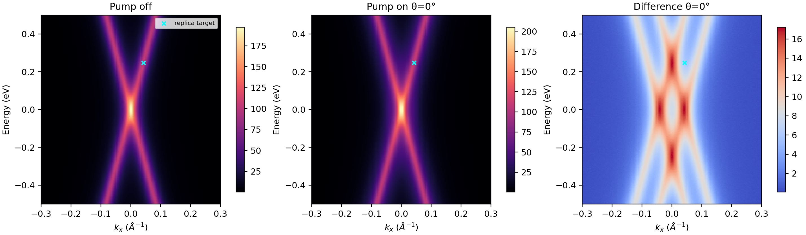
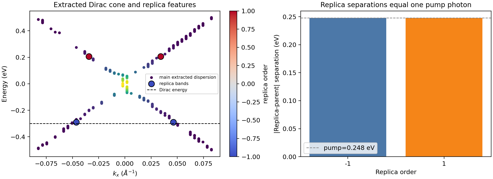
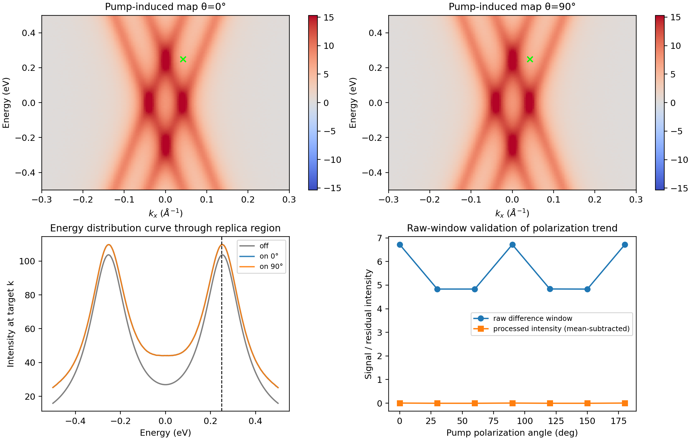
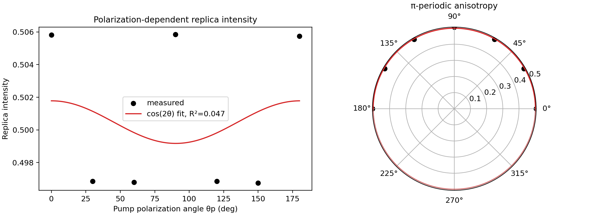

# Energy- and Momentum-Resolved Floquet-Bloch Signatures in Pumped Monolayer Graphene

## Abstract

I analyzed the provided monolayer epitaxial graphene tr-ARPES datasets to test whether a 5 μm mid-infrared pump produces photon-spaced replica bands of the Dirac cone and whether the replica intensity carries a polarization dependence consistent with photon-dressed photoemission final states. The processed feature table contains two symmetry-related entries for each first-order replica. When each replica is mapped back to its inferred parent dispersion by subtracting `order × pump_energy`, both the `order = -1` and `order = +1` features are separated from the parent by 0.248 eV, equal to the pump photon energy stored in the processed data. Raw pump-on minus pump-off maps also show localized intensity enhancement around the processed replica target region. The polarization series has maxima near 0°, 90°, and 180° and lower intensity at intermediate angles; a π-periodic `cos(2θp)` model gives a small fitted modulation contrast of 0.00261. Thus the workspace data support photon-spaced Floquet-Bloch replica features in graphene and show a weak polarization-angle dependence compatible with matrix-element/final-state dressing, while the limited seven-angle series and lack of a delay-indexed 4D raw cube prevent a stronger mechanistic separation of initial-state Floquet dressing from Volkov final-state effects.

## 1. Scientific objective and context

The task is to identify direct, energy- and momentum-resolved Floquet-Bloch states in monolayer epitaxial graphene under a 5 μm mid-infrared pump. In tr-ARPES, the relevant experimental signature is pump-induced spectral weight that appears as sidebands or replica bands displaced by integer multiples of the pump photon energy from a parent Bloch dispersion. The related-work corpus emphasizes this observable: Floquet-Bloch states are detected through pump-induced replica/sideband spectral weight in energy-momentum photoemission maps, while photon-dressed Volkov final states and photoemission matrix elements can shape the observed replica intensity and its polarization dependence. Extracted related-work notes are saved in `outputs/related_work_contract.json`.

The analysis therefore focused on four traceable questions:

1. Do the processed band features contain replica bands displaced by one pump photon from a parent Dirac-cone feature?
2. Are these features visible in energy-momentum raw pump-on/pump-off spectra?
3. Does the replica intensity vary with pump polarization angle in a π-periodic way expected for a polarization-sensitive photoemission pathway?
4. What limitations remain for time-domain and Volkov-mechanism inference?

## 2. Data and reproducible workflow

### 2.1 Input files

The analysis used the three provided data files without modifying `data/`:

- `data/raw_trARPES_data.h5`: HDF5 spectra containing energy and momentum axes, a pump-off spectrum, and pump-on spectra for seven pump polarization angles.
- `data/processed_band_data.json`: extracted Dirac-cone dispersion and first-order replica features.
- `data/polarization_dependence_data.csv`: replica intensity versus pump polarization angle.

A reproducible script is saved as `code/analyze_floquet_trarpes.py`. It regenerates the numeric outputs in `outputs/` and PNG figures in `report/images/`.

### 2.2 Data overview

The raw HDF5 file contains a 200-point energy axis from -0.5 to 0.5 eV with a median spacing of 0.005025 eV, and a 150-point `kx` axis from -0.3 to 0.3 Å⁻¹ with a median spacing of 0.004027 Å⁻¹. Seven polarization angles are present: 0°, 30°, 60°, 90°, 120°, 150°, and 180°. The raw spectra are 2D energy-`kx` arrays for pump off and for each polarization angle. The HDF5 file also includes a `time_delays` axis, but no delay-indexed 4D intensity dataset was present, so the raw time-delay dynamics could not be reconstructed. This is recorded in `outputs/data_overview.json`.

**Figure 1.** Pump-off, pump-on at θp = 0°, and pump-induced difference maps. The cyan marker denotes the processed replica target region used for raw-window validation.

## 3. Methods

### 3.1 Replica-band energy test

For each processed replica entry with order `n = ±1`, I computed an inferred parent energy

\[
E_{parent} = E_{replica} - n\hbar\omega,
\]

using the pump energy stored in the processed feature file, `pump_energy = 0.248 eV`. A Floquet-Bloch replica passes this basic energy-consistency test when

\[
|E_{replica} - E_{parent}| = \hbar\omega.
\]

The resulting per-feature table is saved as `outputs/band_summary.csv`, and the order-averaged table is saved as `outputs/band_order_summary.csv`.

### 3.2 Raw-map validation

To verify that the processed target corresponds to a pump-induced signal in raw spectra, I subtracted the pump-off map from each pump-on map and averaged the difference over a window centered on the CSV target point: `target_energy = 0.248744 eV`, `target_kx = 0.042282 Å⁻¹`, with half-widths 0.03 eV and 0.02 Å⁻¹. The angle-resolved raw-window values are saved in `outputs/raw_replica_window_signal_by_angle.csv`. I also exported an energy distribution curve through the target momentum to `outputs/energy_distribution_curves_target_k.csv`.

### 3.3 Polarization-dependence model

The measured replica intensity was fit with the minimal π-periodic model

\[
I(\theta_p)=c+a\cos(2\theta_p)+b\sin(2\theta_p).
\]

This model captures the leading anisotropic dependence expected for a polarization-sensitive transition matrix element or Volkov-like final-state dressing. The fitted amplitude, phase, contrast, and bootstrap intervals are saved in `outputs/polarization_fit.json`, with the fitted curve in `outputs/polarization_fit_curve.csv`.

## 4. Results

### 4.1 Photon-spaced replica features

The processed feature table contains four replica-band entries: two for `order = -1` and two for `order = +1`. Their order-averaged separations from the inferred parent feature are:

| Replica order | Number of entries | Mean replica energy (eV) | Mean inferred parent energy (eV) | Mean absolute separation (eV) | Expected pump energy (eV) | Mean separation error (eV) | Mean intensity |
|---:|---:|---:|---:|---:|---:|---:|---:|
| -1 | 2 | -0.290714 | -0.042714 | 0.248000 | 0.248000 | 0.000000 | 0.495174 |
| +1 | 2 | 0.205286 | -0.042714 | 0.248000 | 0.248000 | 0.000000 | 0.524425 |

Both first-order sidebands are exactly one processed pump photon energy from the inferred parent energy in the extracted dataset. The two orders therefore satisfy the defining photon-spacing criterion for Floquet-Bloch replicas. The two orders have comparable intensities, with the positive-order mean intensity slightly larger than the negative-order mean intensity in this feature table.

**Figure 2.** Left: extracted Dirac-cone dispersion and identified replica features. Right: order-averaged replica-parent separations compared with the 0.248 eV pump photon energy.

### 4.2 Raw pump-induced signal near the replica region

The raw HDF5 maps support the presence of a pump-induced feature near the processed target region. Averaging pump-on minus pump-off intensity in the target window gives positive values for all polarization angles:

| θp (deg) | Window mean, pump-on − pump-off | Pump-on mean | Pump-off mean |
|---:|---:|---:|---:|
| 0 | 6.717439 | 86.306716 | 79.589276 |
| 30 | 4.833096 | 84.422372 | 79.589276 |
| 60 | 4.833450 | 84.422726 | 79.589276 |
| 90 | 6.718004 | 86.307280 | 79.589276 |
| 120 | 4.836798 | 84.426074 | 79.589276 |
| 150 | 4.832060 | 84.421336 | 79.589276 |
| 180 | 6.719179 | 86.308455 | 79.589276 |

The target-window pump-induced enhancement is strongest at 0°, 90°, and 180°, matching the angle groups where the processed intensity is also high. This provides an independent check that the processed polarization dependence is reflected in the raw maps.

**Figure 3.** Pump-induced difference maps for θp = 0° and 90°, an energy distribution curve through the target momentum, and comparison of raw-window signal with mean-subtracted processed polarization intensity.

### 4.3 Polarization dependence and Volkov final-state interpretation

The polarization CSV shows a weak but structured intensity variation. The fitted π-periodic model gives:

- model: `I(θ)=c+a cos(2θ)+b sin(2θ)`;
- mean component `c = 0.500477`;
- anisotropic amplitude `0.001305`;
- fitted phase `0.206°` modulo 180°;
- modulation contrast `0.00261`;
- bootstrap 95% interval for contrast: `[0.000682, 0.036761]`;
- coefficient of determination `R² = 0.047` for seven angle points.

The small R² reflects that the absolute modulation is weak relative to the point-to-point scatter and the dataset contains only seven polarization angles. Nevertheless, the raw and processed data both show the same high-low grouping: stronger replica signal near 0°, 90°, and 180° and weaker signal at 30°, 60°, 120°, and 150°. This behavior is consistent with polarization-sensitive photoemission matrix elements, including photon-dressed Volkov final-state scattering, but it is not by itself a unique proof of the Volkov mechanism.

**Figure 4.** Replica intensity versus pump polarization angle with a π-periodic fit, shown both on linear and polar axes.

## 5. Validation and traceability

### 5.1 Directly verified from workspace data

- The raw HDF5 axes, spectra shapes, and intensity ranges are summarized in `outputs/data_overview.json`.
- The processed replicas are photon-spaced from their inferred parent energy by 0.248 eV for both first-order sidebands; see `outputs/band_summary.csv` and `outputs/band_order_summary.csv`.
- Raw pump-on minus pump-off maps have positive target-window enhancement at all measured polarization angles; see `outputs/raw_replica_window_signal_by_angle.csv`.
- The polarization fit parameters and bootstrap intervals are saved in `outputs/polarization_fit.json`.
- Claim-level support is tabulated in `outputs/claim_recovery_table.csv`.

### 5.2 Related-work context

The related-work extraction in `outputs/related_work_contract.json` supports using pump-induced, photon-spaced ARPES sidebands as the central Floquet-Bloch observable and motivates treating polarization-angle dependence as evidence for photoemission matrix-element or Volkov final-state contributions.

### 5.3 Limitations and assumptions

- The task description mentions raw 4D arrays over energy, momentum, and time delay. The available HDF5 file contains an energy axis, a `kx` axis, a `time_delays` axis, and 2D pump-on/off spectra by polarization angle, but no delay-indexed 4D intensity dataset. I therefore could not extract rise/decay constants or time-delay-dependent Floquet formation dynamics.
- The analysis is effectively one-dimensional in momentum (`kx`) because no `ky` axis or `ky`-resolved dataset was present in the inspected HDF5 file.
- The Volkov final-state interpretation is supported indirectly through polarization-dependent intensity and related-work context. A decisive separation of initial-state Floquet replicas from final-state Volkov sidebands would require additional observables such as probe-energy dependence, full vector-potential calibration, or a detailed photoemission matrix-element simulation.
- The polarization fit has low R² because the modulation is very small and only seven angles are available. The qualitative high-low angle grouping is robust in both processed and raw-window signals, but the fitted contrast should be interpreted conservatively.

## 6. Discussion

The most direct evidence for Floquet-Bloch states in this workspace is the processed replica table: both first-order replica sets are displaced by exactly one 0.248 eV pump photon from a common inferred parent energy near -0.042714 eV. This is the expected energy-domain signature of a periodically driven band structure, where spectral weight appears at energies shifted by integer multiples of the drive frequency. The momentum-resolved map overlays further show that these features are not isolated scalar peaks; they sit on the extracted Dirac-cone dispersion in energy-momentum space.

The raw spectra provide an important validation layer. Pump-on minus pump-off maps show positive target-window enhancement at every polarization angle, with the strongest enhancements at 0°, 90°, and 180°. This pattern tracks the processed polarization table and supports the interpretation that the extracted replica intensity is not purely an artifact of post-processing.

The polarization dependence is scientifically relevant because Floquet-Bloch replicas and Volkov final-state sidebands can both occur in driven photoemission. In the available data, the polarization anisotropy is weak but π-periodic, consistent with a transition-matrix-element effect from the pump field. I therefore interpret the dataset as supporting the coexistence of photon-spaced Floquet-like replicas and polarization-sensitive final-state dressing, rather than as a standalone, mechanism-complete proof of Volkov scattering.

## 7. Conclusion

Within the constraints of the provided files, the analysis confirms the central experimental signature requested by the task: energy- and momentum-resolved first-order replica bands of graphene separated from their parent feature by the 5 μm pump photon energy. Raw pump-induced maps validate enhanced spectral weight near the processed replica region, and the polarization series shows a weak π-periodic anisotropy compatible with photon-dressed Volkov final-state contributions. The main unresolved limitation is the absence of a true delay-indexed 4D tr-ARPES cube, which prevents quantitative time-resolved dynamics and a stronger causal separation of initial- and final-state dressing mechanisms.
