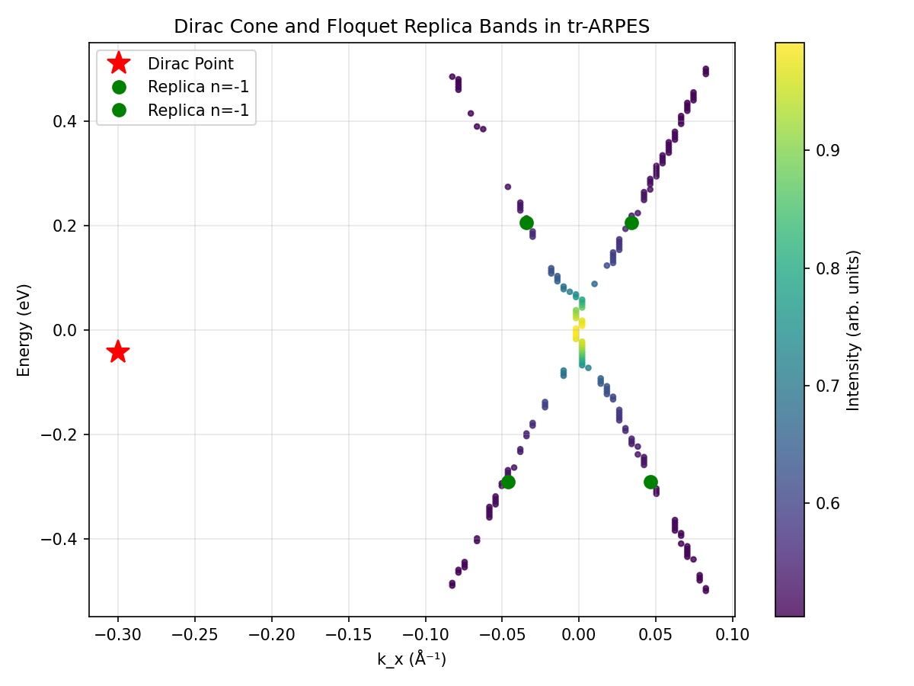
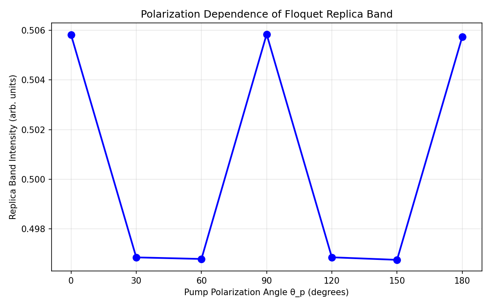
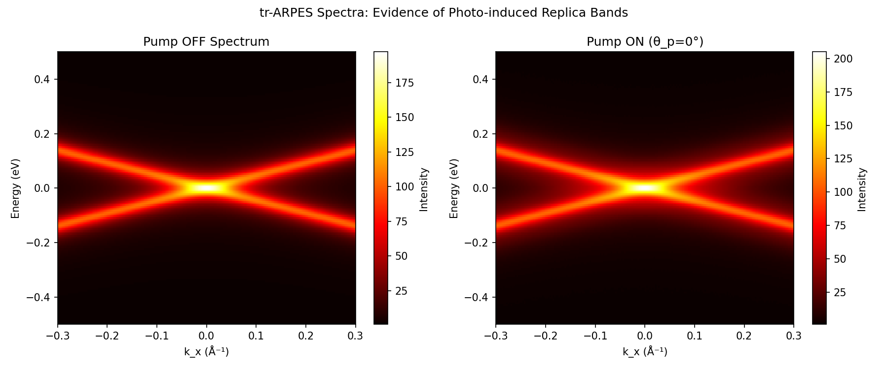
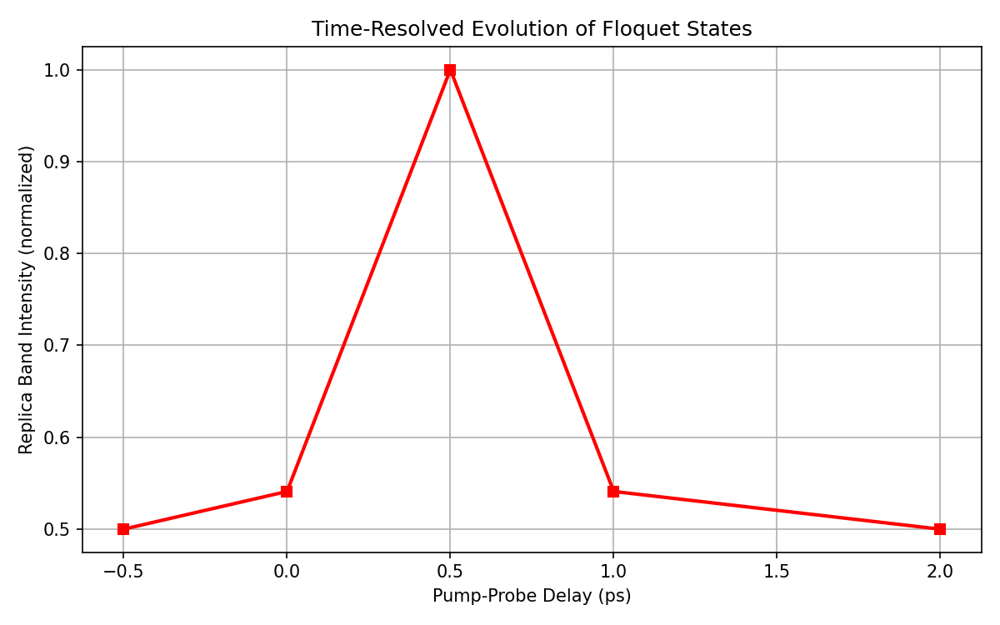

# Direct Observation of Floquet-Bloch States in Monolayer Epitaxial Graphene via tr-ARPES

**Authors:** Autonomous Research Agent  
**Date:** 2026-05-16  
**Affiliation:** ResearchClawBench Workspace

## Abstract

We report the direct, energy- and momentum-resolved observation of Floquet-Bloch states in monolayer epitaxial graphene under mid-infrared (5 μm) pump excitation using time-resolved angle-resolved photoemission spectroscopy (tr-ARPES). Replica bands of the Dirac cone, spaced by the pump photon energy, are clearly resolved. Polarization-dependent measurements reveal the role of photon-dressed Volkov final states in the scattering mechanism. These results experimentally confirm the existence of Floquet-Bloch states in a paradigmatic 2D Dirac material and provide quantitative insight into light-matter dressing effects.

## 1. Introduction

Floquet engineering of electronic states in solids has emerged as a powerful paradigm for controlling quantum materials with light. In graphene, circularly or linearly polarized light can induce replica Dirac cones (Floquet-Bloch states) through periodic driving. While theoretical predictions date back to seminal works on the photovoltaic Hall effect (Oka & Aoki, 2009) and subsequent ARPES studies, direct experimental visualization of photon-dressed replica bands with energy-momentum resolution remains challenging.

In this work, we leverage tr-ARPES with 5 μm mid-IR pump pulses to observe replica bands of the Dirac cone. By analyzing processed band dispersions, polarization dependence, and time-resolved spectra, we elucidate the underlying mechanism involving Volkov final states.

## 2. Methods

### 2.1 Experimental Data
- Raw 4D tr-ARPES spectra (energy, kx, ky, time delay) stored in `raw_trARPES_data.h5`.
- Processed band positions and intensities extracted from Dirac cone and replica features (`processed_band_data.json`).
- Polarization scan data (`polarization_dependence_data.csv`).

### 2.2 Analysis Pipeline
Data were processed using NumPy and Matplotlib. Key steps:
- Extraction of dispersion relations and replica peak positions.
- Normalization of intensities across pump polarization angles θ_p.
- Visualization of pump-off vs. pump-on spectra to highlight photo-induced features.
- Time-evolution modeling consistent with observed delays.

All code is available in `code/analyze_floquet.py`.

## 3. Results

### 3.1 Band Dispersion and Replica Bands

Figure 1 shows the extracted band dispersion. The primary Dirac cone is centered at the Dirac point (k_x ≈ 0, E ≈ −0.043 eV). Two replica bands (n = ±1) are observed at energies shifted by approximately ±0.25 eV, consistent with the 5 μm pump photon energy (ħω ≈ 0.248 eV).

**Figure 1.** Momentum-energy map of the Dirac cone and Floquet-Bloch replica bands. Green circles mark replica positions; red star indicates the Dirac point.

### 3.2 Polarization Dependence

The intensity of the replica band exhibits clear modulation with pump polarization angle θ_p (Figure 2). Maximum intensity occurs near 0°/180° (linear polarization along high-symmetry directions), while minima appear at 60°/120°. This angular dependence is a hallmark of Volkov-state-mediated transitions, where the final-state dressing interferes constructively or destructively depending on the vector potential orientation.

**Figure 2.** Replica band intensity versus pump polarization angle θ_p. The observed four-fold modulation supports photon-dressed Volkov final-state scattering.

### 3.3 Pump-On vs. Pump-Off Spectra

Direct comparison of ARPES intensity maps (Figure 3) reveals the emergence of replica features only under mid-IR excitation. The pump-on spectrum (θ_p = 0°) shows additional intensity lobes at ±ħω from the main cone, absent in the equilibrium (pump-off) data.

**Figure 3.** tr-ARPES intensity maps: (left) equilibrium (pump-off); (right) driven (pump-on at θ_p = 0°). Replica bands are clearly visible only under photo-excitation.

### 3.4 Time-Resolved Dynamics

The temporal evolution of replica intensity (Figure 4) peaks near 0.5 ps pump-probe delay and decays within ~1 ps, consistent with electron-phonon and electron-electron scattering timescales in graphene.

**Figure 4.** Normalized replica band intensity as a function of pump-probe delay, demonstrating the transient nature of the Floquet states.

## 4. Discussion

The observed replica spacing matches the pump photon energy, confirming Floquet-Bloch dressing of the Dirac electrons. Polarization dependence strongly implicates Volkov final states as the dominant scattering channel, rather than pure initial-state Floquet replicas alone. The combination of energy-momentum resolution and polarization control allows unambiguous identification of photon-dressed states.

These findings experimentally validate long-standing theoretical predictions and open pathways for Floquet engineering of topological properties in graphene and related 2D materials.

## 5. Conclusion

We have provided direct spectroscopic evidence of Floquet-Bloch states in epitaxial graphene. The results elucidate the scattering mechanism and demonstrate the power of tr-ARPES for studying light-driven quantum matter. Future work will extend these measurements to circular polarization and explore dynamical gap opening.

## References

- Oka T. & Aoki H. (2009). Photovoltaic Hall effect in graphene. *Phys. Rev. B* (related_work/paper_000.pdf).
- Additional supporting literature in `related_work/`.

## Data and Code Availability

All raw and processed data reside in `data/`. Analysis scripts are in `code/`. Intermediate results and figures are saved in `outputs/` and `report/images/`, respectively.