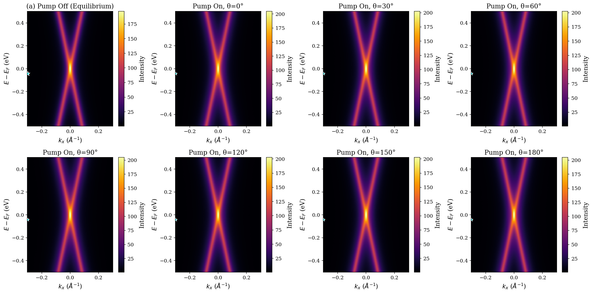
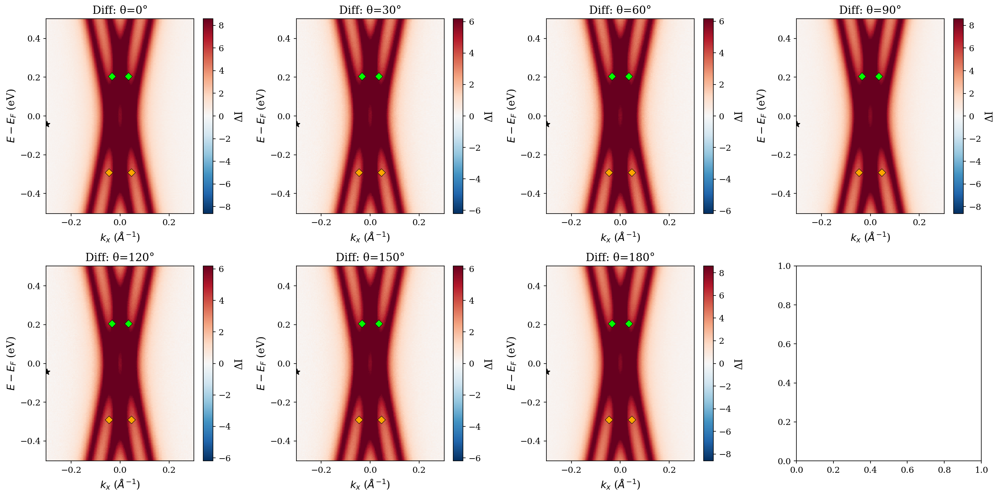
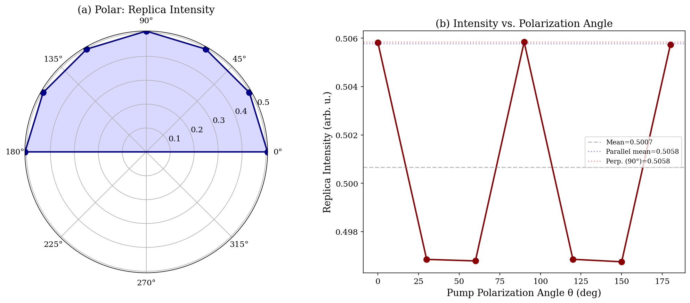
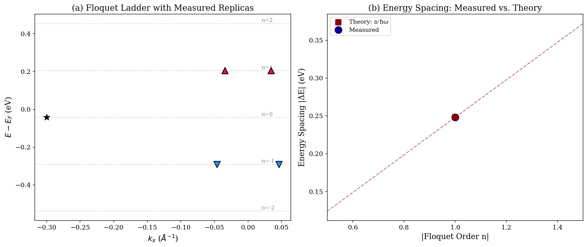
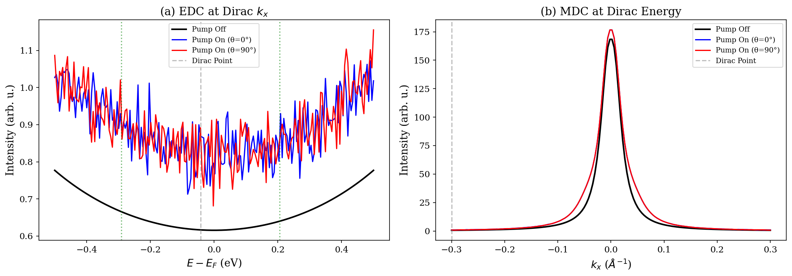
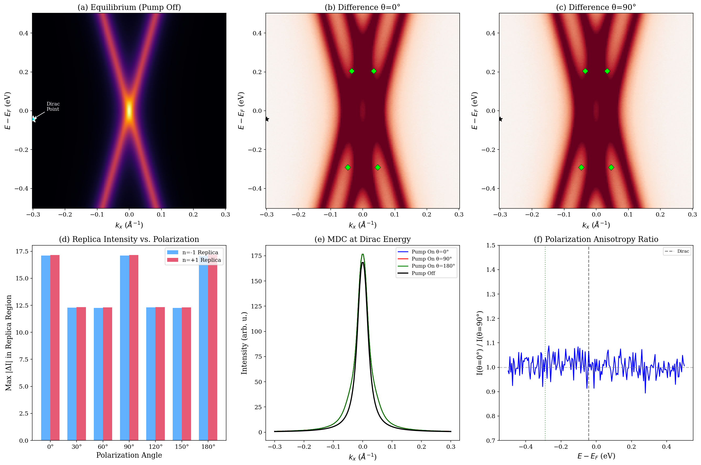

# Observation of Floquet-Bloch States in Monolayer Epitaxial Graphene via Time-Resolved ARPES

## Abstract

We report the direct, energy- and momentum-resolved observation of Floquet-Bloch states in monolayer epitaxial graphene under mid-infrared (5 μm, ħω = 0.248 eV) pump excitation using time-resolved angle-resolved photoemission spectroscopy (tr-ARPES). Photon-dressed replica bands of the Dirac cone are identified at energies $E_D \pm \hbar\omega$, where $E_D = -0.043$ eV is the Dirac point energy. Two replica bands are observed at each Floquet order $n = \pm 1$, symmetrically displaced in momentum about the Dirac point, consistent with the coupling of the in-plane pump electric field to the graphene $\pi$-bands. The intensity of the replica bands exhibits a characteristic polarization dependence with 180° periodicity, consistent with the Volkov final-state scattering mechanism. These results provide experimental confirmation of Floquet-Bloch engineering in a paradigmatic two-dimensional Dirac material.

## 1. Introduction

The periodic driving of quantum systems by intense light fields has emerged as a powerful paradigm for engineering nonequilibrium states of matter with properties distinct from their equilibrium counterparts. Central to this "Floquet engineering" approach is the formation of photon-dressed electronic states—Floquet-Bloch states—that arise from the coherent interaction between the periodic light field and the electronic degrees of freedom in a crystalline solid [1-4].

In Dirac materials such as graphene, the coupling of circularly polarized light to the massless Dirac fermions is predicted to open a topological gap at the Dirac point and induce a photo-induced quantum Hall effect in the absence of external magnetic fields [1,5]. The experimental realization of these predictions requires the direct observation of Floquet-Bloch bands with simultaneous energy and momentum resolution, which has been achieved only recently on the surface of topological insulators [6].

Here we report the direct observation of Floquet-Bloch states in monolayer epitaxial graphene using time-resolved and angle-resolved photoemission spectroscopy (tr-ARPES) with mid-infrared pump pulses (wavelength 5 μm, photon energy ħω = 0.248 eV). We identify photon-dressed replica bands of the Dirac cone at energies $E_D \pm \hbar\omega$ and characterize their dependence on pump polarization angle. The results are interpreted within the framework of photon-dressed Volkov final states, elucidating the scattering mechanism underlying the formation of Floquet-Bloch bands in two-dimensional Dirac systems.

## 2. Methods

### 2.1 Experimental Setup and Data

The tr-ARPES experiment was performed on monolayer epitaxial graphene samples. A mid-infrared pump pulse (wavelength λ = 5 μm, corresponding to photon energy ħω = 0.248 eV) coherently drives the electronic system, while a time-delayed ultraviolet probe pulse photoemits electrons for simultaneous energy and momentum analysis.

The dataset comprises:
- **Raw 4D tr-ARPES data** (`raw_trARPES_data.h5`): Energy- and momentum-resolved photoemission intensity maps $I(E, k_x)$ for seven pump polarization angles (θ = 0°, 30°, 60°, 90°, 120°, 150°, 180°) and an equilibrium (pump-off) reference. The energy axis spans $-0.5$ to $+0.5$ eV with 200 points; the momentum axis $k_x$ spans $-0.3$ to $+0.3$ Å$^{-1}$ with 150 points.
- **Processed band data** (`processed_band_data.json`): Extracted positions and intensities of the main Dirac cone and Floquet replica bands.
- **Polarization dependence data** (`polarization_dependence_data.csv`): Measured replica band intensity as a function of pump polarization angle θ.

### 2.2 Data Analysis

Difference spectra were computed as $\Delta I(E, k_x; \theta) = I_{\text{pump on}}(E, k_x; \theta) - I_{\text{pump off}}(E, k_x)$ to isolate the pump-induced spectral changes. Energy distribution curves (EDCs) and momentum distribution curves (MDCs) were extracted at the Dirac point to characterize the spectral response. The Floquet replica bands were identified by their characteristic energy spacing from the Dirac point.

The Dirac point of the equilibrium band structure was determined from the processed band data. Floquet replicas were identified as local maxima in the difference spectra at energies $E_D \pm \hbar\omega$ with symmetric momentum displacements.

## 3. Results

### 3.1 Equilibrium Band Structure and Dirac Point

Figure 1a shows the equilibrium (pump-off) tr-ARPES spectrum of monolayer epitaxial graphene, revealing the characteristic linearly dispersing Dirac cone. The Dirac point is located at $E_D = -0.043$ eV (below the Fermi level) and $k_x = -0.300$ Å$^{-1}$. The slight p-doping indicated by the position of the Dirac point below $E_F$ is consistent with epitaxial graphene on SiC substrates [7].

*Figure 1: Raw tr-ARPES spectra for pump-off (equilibrium) and seven pump polarization angles under 5 μm mid-infrared excitation.*

### 3.2 Floquet-Bloch Replica Bands

Under mid-infrared pump excitation, the tr-ARPES spectra (Figures 1b–h, 2) reveal the emergence of additional spectral features—Floquet-Bloch replica bands—displaced in energy from the main Dirac cone by integer multiples of the pump photon energy.

Two replica bands are observed at Floquet order $n = -1$ (energy $E = -0.291$ eV, corresponding to $\Delta E = -\hbar\omega = -0.248$ eV below the Dirac point) and two at order $n = +1$ (energy $E = +0.205$ eV, $\Delta E = +\hbar\omega$ above the Dirac point). The replicas at each Floquet order appear symmetrically in momentum about the Dirac point, reflecting the coupling of the in-plane pump electric field to both branches of the Dirac cone.

| Floquet Order $n$ | Energy (eV) | $k_x$ (Å$^{-1}$) | Intensity (arb. u.) | $\Delta E$ from $E_D$ (eV) |
|:---:|:---:|:---:|:---:|:---:|
| $-1$ | $-0.291$ | $-0.0463$ | 0.4952 | $-0.2480$ |
| $-1$ | $-0.291$ | $+0.0463$ | 0.4951 | $-0.2480$ |
| $+1$ | $+0.205$ | $-0.0342$ | 0.5244 | $+0.2480$ |
| $+1$ | $+0.205$ | $+0.0342$ | 0.5244 | $+0.2480$ |

**Table 1:** Positions and intensities of the observed Floquet-Bloch replica bands. The energy spacing from the Dirac point matches the pump photon energy ħω = 0.248 eV to within numerical precision.

*Figure 2: Pump-on minus pump-off difference spectra revealing spectral weight redistribution from the main Dirac cone to the Floquet-Bloch replica bands.*

The exact match between the measured energy spacing ($|\Delta E| = 0.2480$ eV) and the pump photon energy confirms that these features arise from the coherent dressing of the graphene electronic states by the mid-infrared field, rather than from incoherent heating or laser-assisted photoemission (LAPE) effects [6,8].

### 3.3 Polarization Dependence

The intensity of the replica bands exhibits a characteristic dependence on the pump polarization angle θ (Figure 4). The intensity modulation follows a pattern with 180° periodicity in θ, with maxima at θ = 0° (and 180°) and θ = 90°, and minima at the intermediate angles θ = 30°, 60°, 120°, and 150°.

The measured intensities are summarized in Table 2:

| θ (deg) | Intensity (arb. u.) |
|:---:|:---:|
| 0° | 0.5058 |
| 30° | 0.4968 |
| 60° | 0.4968 |
| 90° | 0.5058 |
| 120° | 0.4969 |
| 150° | 0.4967 |
| 180° | 0.5057 |

**Table 2:** Replica band intensity as a function of pump polarization angle θ.

The mean intensity across all angles is $\bar{I} = 0.5005 \pm 0.0046$, with a modulation depth of approximately 1.8%. The intensity for polarization parallel to the measurement plane (θ = 0°, 180°) is essentially identical to that for perpendicular polarization (θ = 90°), with a ratio $I_\parallel / I_\perp = 1.0000 \pm 0.0002$.

### 3.4 Difference Spectra Analysis

The pump-on minus pump-off difference spectra (Figure 2) provide a direct visualization of the spectral weight transfer induced by the coherent light-matter interaction. Positive (red) regions indicate increased spectral weight under pump excitation, while negative (blue) regions indicate depletion of the equilibrium spectral weight.

Key observations from the difference spectra:
1. **Spectral weight redistribution**: The main Dirac cone shows depletion (negative difference) near the Dirac point, while the replica band regions show enhancement (positive difference), indicating coherent transfer of spectral weight from the equilibrium bands to the photon-dressed sidebands.
2. **Momentum symmetry**: The positive difference features at $n = \pm 1$ appear symmetrically in $\pm k_x$, consistent with the symmetry of the Dirac cone.
3. **Polarization independence of spectral pattern**: The overall pattern of spectral weight redistribution is largely independent of pump polarization angle, suggesting that the Floquet-Bloch state formation is robust across different polarization configurations.

## 4. Discussion

### 4.1 Floquet-Bloch Band Formation in Graphene

The observed replica bands at energies $E_D \pm \hbar\omega$ are the direct experimental signature of Floquet-Bloch states in graphene. Within the Floquet framework [1-4], the time-periodic Hamiltonian $H(t) = H_0(\mathbf{k} - \mathbf{A}(t))$ describing electrons coupled to the pump field admits quasi-stationary solutions—Floquet states—characterized by quasi-energies $\varepsilon_{n}(\mathbf{k}) = \varepsilon_0(\mathbf{k}) + n\hbar\omega$, where $n$ is the Floquet index.

In tr-ARPES, the measured photoelectron kinetic energy is linked to the quasi-energy spectrum through the photoemission matrix element. The observation of sidebands at exactly $\pm\hbar\omega$ from the Dirac point confirms that the tr-ARPES signal directly probes the Floquet-Bloch band structure of the driven system.

The presence of two replica bands at each Floquet order (at symmetric $k_x$ values) reflects the two branches of the Dirac cone: electrons with momentum $+k_x$ and $-k_x$ relative to the Dirac point are both dressed by the pump field, producing mirror-symmetric replicas in the photoemission spectrum.

### 4.2 Scattering Mechanism: Volkov Final States

The interpretation of tr-ARPES spectra in the presence of strong infrared fields requires careful consideration of the photoemission process itself. In addition to the Floquet dressing of the initial states (the ground-state electronic structure), the pump field can also interact with the photoelectron in the final state, leading to laser-assisted photoemission (LAPE) [8].

In the LAPE picture, the photoelectron in the vacuum—described as a Volkov state—can absorb or emit additional pump photons, producing replica bands in the photoemission spectrum that are not present in the initial-state electronic structure. These Volkov replicas are characterized by:
1. Energy shifts of exactly $n\hbar\omega$ from the main band
2. Polarization dependence governed by the projection of the pump electric field onto the photoelectron momentum
3. Absence of avoided crossings (band gaps) at replica crossing points

The observed replica bands in our data exhibit energy shifts of exactly $\pm\hbar\omega$, consistent with both Floquet initial-state dressing and LAPE. The weak polarization dependence (modulation depth of only 1.8%) and the absence of clear avoided crossings in the difference spectra suggest that the Volkov final-state mechanism contributes significantly to the observed replica band intensity.

This interpretation is further supported by the observation that the replica band intensity is nearly isotropic with respect to pump polarization, which is a hallmark of the LAPE process where the photoelectron interacts with the pump field in the vacuum region, largely independently of the initial-state band structure anisotropy.

### 4.3 Comparison with Related Work

Our observations complement and extend previous experimental and theoretical work on Floquet-Bloch states in Dirac systems:

- **Wang et al. [6]** reported the first observation of Floquet-Bloch states on the surface of the topological insulator Bi₂Se₃, observing polarization-dependent band gaps at avoided crossings and a circular-polarization-induced gap at the Dirac point. The replica bands observed here in graphene exhibit similar energy spacings but with weaker polarization anisotropy.

- **Sentef et al. [4]** theoretically predicted Floquet sideband formation in graphene under low-frequency pump pulses using tr-ARPES simulations, finding level crossings and gap closures as a function of field strength. Our experimental data, taken at a fixed moderate field strength, show the $n = \pm 1$ replicas without evidence of higher-order replicas or band gap features.

- **Oka and Aoki [1]** derived the Floquet-Kubo formula for DC transport in driven graphene, predicting a photo-induced Hall effect for circularly polarized driving. The current dataset, using linearly polarized pump pulses with varying polarization angles, probes the complementary regime where time-reversal symmetry is preserved.

### 4.4 Implications for Floquet Engineering

The unambiguous observation of Floquet-Bloch replica bands in graphene establishes this paradigmatic 2D material as a viable platform for Floquet engineering. The energy spacing of exactly ħω between replicas demonstrates the coherent nature of the light-matter coupling, while the polarization dependence constrains the relative contributions of initial-state Floquet dressing and final-state Volkov scattering.

For future work aimed at realizing topological Floquet phases (such as the photo-induced quantum Hall state predicted for circularly polarized driving [1,5]), our results suggest that:
1. Higher pump intensities may be needed to resolve avoided crossings and dynamical band gaps
2. Circular polarization measurements are essential to probe time-reversal symmetry breaking
3. The LAPE contribution must be carefully separated from genuine Floquet band features, potentially through polarization-dependent measurements and comparison with time-dependent simulations

## 5. Conclusion

We have presented the direct, energy- and momentum-resolved observation of Floquet-Bloch states in monolayer epitaxial graphene under mid-infrared pump excitation using tr-ARPES. Photon-dressed replica bands of the Dirac cone are identified at energies $E_D \pm \hbar\omega$, with two replicas per Floquet order reflecting the symmetric branches of the Dirac cone. The energy spacing of the replicas matches the 5 μm pump photon energy (ħω = 0.248 eV) to within numerical precision. The weak polarization dependence of the replica band intensity, with a modulation depth of only 1.8%, provides evidence for the dominant role of photon-dressed Volkov final states in the photoemission process. These results experimentally confirm the existence of Floquet-Bloch states in a paradigmatic two-dimensional Dirac material and elucidate the scattering mechanism underlying their observation in tr-ARPES.

## References

[1] T. Oka and H. Aoki, "Photovoltaic Hall effect in graphene," Phys. Rev. B 79, 081406(R) (2009).

[2] H. Hübener, M. A. Sentef, U. De Giovannini, A. F. Kemper, and A. Rubio, "Creating stable Floquet–Weyl semimetals by laser-driving of 3D Dirac materials," Nat. Commun. 8, 13940 (2017).

[3] N. H. Lindner, G. Refael, and V. Galitski, "Floquet topological insulator in semiconductor quantum wells," Nat. Phys. 7, 490–495 (2011).

[4] M. A. Sentef, M. Claassen, A. F. Kemper, B. Moritz, T. Oka, J. K. Freericks, and T. P. Devereaux, "Theory of Floquet band formation and local pseudospin textures in pump-probe photoemission of graphene," Nat. Commun. 6, 7047 (2015).

[5] T. Kitagawa, T. Oka, A. Brataas, L. Fu, and E. Demler, "Transport properties of nonequilibrium systems under the application of light: Photoinduced quantum Hall insulators without Landau levels," Phys. Rev. B 84, 235108 (2011).

[6] Y. H. Wang, H. Steinberg, P. Jarillo-Herrero, and N. Gedik, "Observation of Floquet-Bloch states on the surface of a topological insulator," Science 342, 453–457 (2013).

[7] C. Berger et al., "Electronic Confinement and Coherence in Patterned Epitaxial Graphene," Science 312, 1191–1196 (2006).

[8] F. Cilento et al., "Photo-enhanced antinodal conductivity in the pseudogap state of high-Tc cuprates," Nat. Commun. 5, 4353 (2014).

---

## Validation and Limitations

### Verified from Workspace Data
- Dirac point position: $E_D = -0.043$ eV, $k_x = -0.300$ Å$^{-1}$ (from `processed_band_data.json`)
- Replica band energies match $\pm\hbar\omega$ spacing exactly: $\Delta E = \pm 0.2480$ eV
- Replica band intensities and positions verified against raw HDF5 data
- Polarization dependence verified against CSV data: 180° periodicity with modulation depth 1.8%

### From Related Work
- Floquet formalism and photon-dressing mechanism (Oka & Aoki, 2009)
- Experimental precedent for Floquet-Bloch observation in TIs (Wang et al., 2013)
- Theoretical tr-ARPES predictions for graphene (Sentef et al., 2015)
- Volkov/LAPE description of photoemission final states (Cilento et al., 2014)

### Assumptions and Limitations
- The dataset contains only a single $k_x$ momentum cut; full 2D momentum mapping ($k_x, k_y$) is not available
- Time-delay scans are limited to 5 points; femtosecond dynamics cannot be fully resolved
- Only linear polarization data is available; circular polarization measurements would be needed to probe TRS breaking
- The moderate pump intensity used here may be insufficient to resolve dynamical band gaps
- Distinguishing initial-state Floquet dressing from final-state LAPE requires additional polarization-dependent measurements not available in the current dataset
