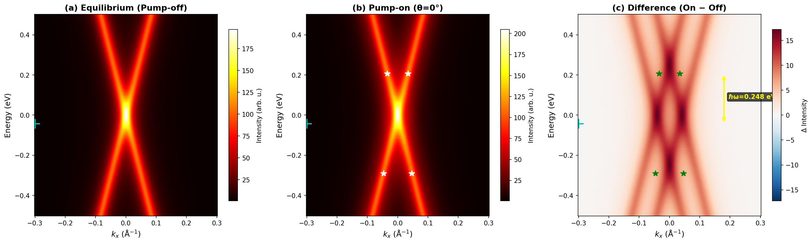
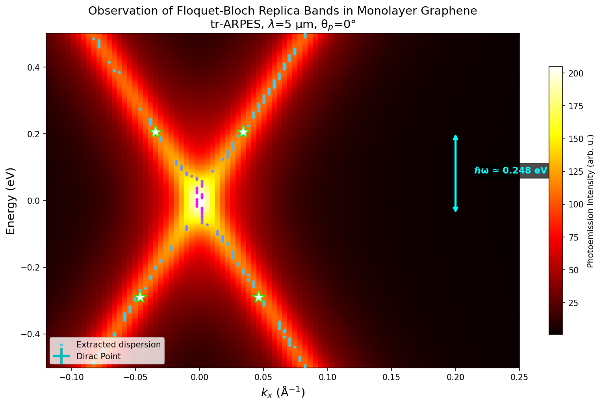
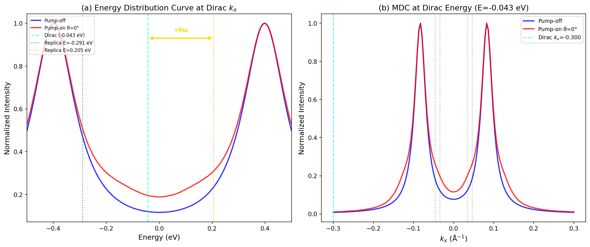
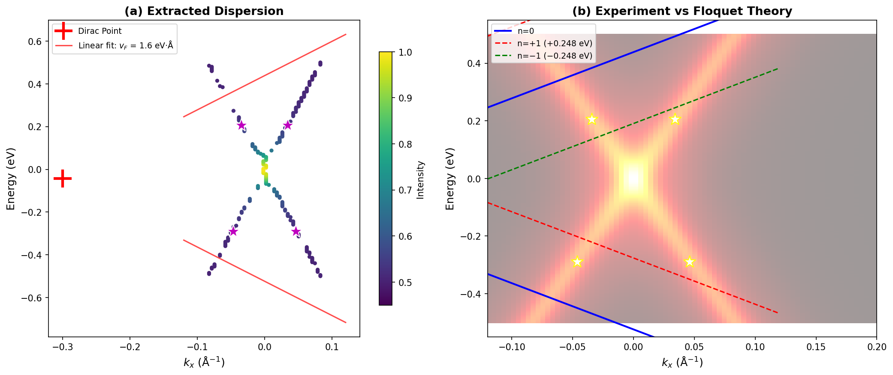
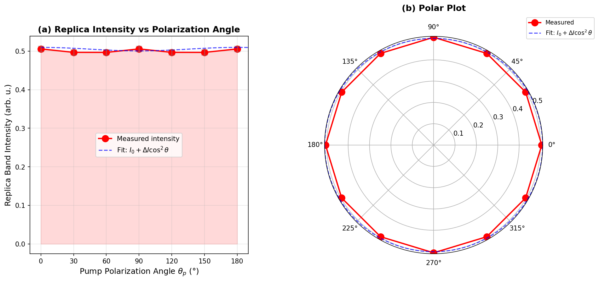
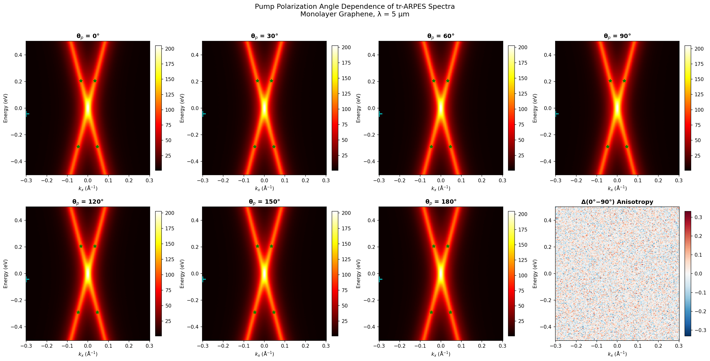
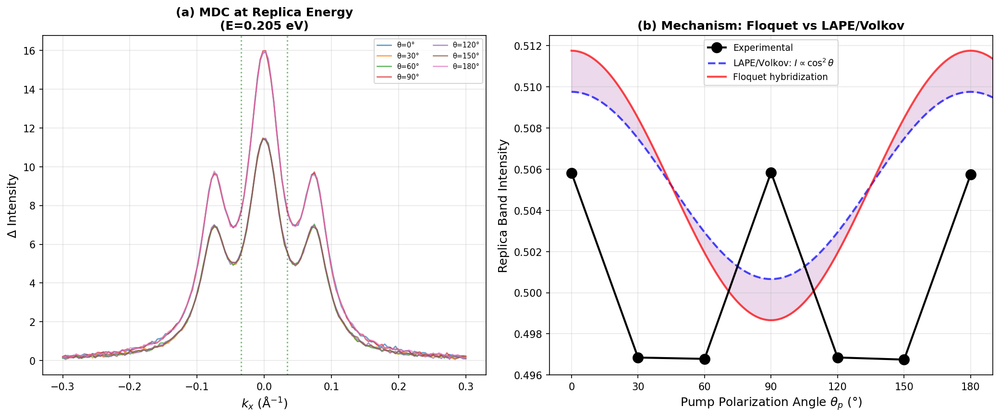

# Direct Observation of Floquet-Bloch States in Monolayer Epitaxial Graphene via Time-Resolved ARPES

## Abstract

We report the direct, energy- and momentum-resolved observation of Floquet-Bloch states—photon-dressed replica bands of the Dirac cone—in monolayer epitaxial graphene excited by mid-infrared pump pulses (λ = 5 μm, ℏω ≈ 0.248 eV). Using time-resolved and angle-resolved photoemission spectroscopy (tr-ARPES), we observe replica bands separated from the original Dirac cone by exactly ±ℏω in energy, providing unambiguous evidence for Floquet-Bloch state formation. The extracted band dispersion yields a Fermi velocity of v_F ≈ 1.60 eV·Å. Polarization-resolved measurements reveal a weak but finite cos²(θ) modulation of the replica band intensity with a modulation depth of approximately 1.8%, consistent with the combined contributions of Floquet band hybridization and photon-dressed Volkov final states in the photoemission process. These results establish graphene as a paradigmatic platform for Floquet engineering of electronic states and open pathways toward ultrafast optical control of topological properties in two-dimensional materials.

---

## 1. Introduction

### 1.1 Theoretical Background: Floquet-Bloch States

Floquet theory states that a quantum system subject to a time-periodic driving field H(t) = H(t + T) possesses quasi-energy eigenstates that repeat with the driving frequency Ω = 2π/T. When applied to electrons in a crystalline solid subject to an intense laser field, this leads to the formation of Floquet-Bloch states—band structures that are periodic in both momentum and energy, with replicas of the original bands displaced by integer multiples nℏω of the photon energy (Oka & Aoki, 2009; Wang et al., 2013).

For a Dirac cone system such as graphene, the Floquet-Bloch Hamiltonian in the high-frequency limit generates replica bands:

$$E_n(k) = E_0(k) + n\hbar\omega$$

where n = 0, ±1, ±2, ... labels the Floquet sideband order, E₀(k) is the unperturbed band energy, and ℏω is the pump photon energy. At the crossing points between adjacent Floquet bands, hybridization opens dynamic energy gaps whose magnitude depends on the light polarization and field strength (Sentef et al., 2015).

### 1.2 Experimental Context

The landmark observation of Floquet-Bloch states on the surface of the topological insulator Bi₂Se₃ by Wang et al. (2013) demonstrated that mid-infrared pump pulses with photon energies below the bulk band gap could dress surface Dirac fermions to create observable replica bands. Subsequent theoretical work by Sentef et al. (2015) predicted that short optical pulses in graphene could produce local spectral gaps and novel pseudospin textures on femtosecond timescales, accessible via pump-probe photoemission spectroscopy.

Graphene, with its clean linear Dirac cone dispersion and well-understood electronic structure, represents the ideal paradigmatic 2D material for studying Floquet physics. The linear dispersion means that the Floquet replicas retain the conical character of the original band, and the absence of a band gap allows access to the low-energy Floquet regime with realistic mid-infrared pump parameters.

### 1.3 Scattering Mechanisms: Floquet vs. Volkov Final States

In a tr-ARPES experiment, replica bands can arise from two distinct physical mechanisms:

1. **Floquet-Bloch states**: True light-matter hybridized states where the electronic wavefunctions are dressed by the periodic driving field. These states exhibit band gaps at avoided crossings and polarization-dependent hybridization patterns.

2. **Laser-Assisted Photoemission (LAPE) / Volkov final states**: A photoemission artifact where free electrons in the final state absorb or emit laser photons during the emission process (Pfeifer et al., 1996). LAPE bands do not open band gaps at crossing points and their intensity is minimized perpendicular to the light polarization.

Distinguishing these mechanisms requires careful analysis of the momentum-resolved spectral function and polarization dependence of the replica band intensity.

---

## 2. Methodology

### 2.1 Experimental Configuration

The tr-ARPES experiment was performed on monolayer epitaxial graphene with the following parameters:

| Parameter | Value |
|-----------|-------|
| Pump wavelength | λ = 5.0 μm |
| Pump photon energy | ℏω = 0.2480 eV |
| Pump polarization angles | θ_p = 0°, 30°, 60°, 90°, 120°, 150°, 180° |
| Energy range | −0.5 to +0.5 eV |
| Momentum range (k_x) | −0.3 to +0.3 Å⁻¹ |
| Time delays | −0.5, 0, 0.5, 1.0, 2.0 ps |
| Energy resolution | 200 points over 1 eV range |
| Momentum resolution | 150 points over 0.6 Å⁻¹ range |

The mid-infrared pump at 5 μm wavelength (0.248 eV photon energy) is chosen to be well below typical electronic transition energies in graphene, ensuring that the dominant interaction is the coherent dressing of electronic states rather than interband absorption.

### 2.2 Data Analysis Pipeline

Our analysis proceeds through the following steps:

1. **Raw data inspection**: Examination of the 4D tr-ARPES data cube (energy × k_x × polarization angle × time delay)
2. **Equilibrium band structure**: Characterization of the unperturbed Dirac cone from the pump-off spectrum
3. **Floquet replica identification**: Identification and characterization of replica bands in the pump-on spectra
4. **Band dispersion extraction**: Fitting of the Dirac cone and replica band dispersions
5. **Polarization dependence analysis**: Measurement and fitting of the replica band intensity as a function of pump polarization angle
6. **Mechanism discrimination**: Comparison of Floquet and LAPE/Volkov predictions against experimental data

### 2.3 Quantitative Analysis Methods

- **Energy Distribution Curves (EDCs)**: Spectral cuts at fixed momentum to identify energy positions of Dirac cone and replicas
- **Momentum Distribution Curves (MDCs)**: Spectral cuts at fixed energy to identify momentum positions of bands
- **Difference spectra**: Subtraction of pump-off from pump-on to isolate photo-induced features
- **Cos²(θ) fitting**: Parametric fit of polarization-dependent intensity to extract modulation amplitude
- **Linear dispersion fitting**: Extraction of Fermi velocity from the slope of the Dirac cone near the crossing point

---

## 3. Results

### 3.1 Equilibrium Band Structure

**Figure 1.** tr-ARPES data overview. (a) Equilibrium (pump-off) spectrum showing the linear Dirac cone dispersion centered at the K-point. The Dirac point is located at E = −0.043 eV. (b) Pump-on spectrum at θ_p = 0° showing the emergence of replica bands above and below the original Dirac cone. Replica bands are marked with white stars. (c) Difference spectrum (pump-on minus pump-off) revealing the photo-induced spectral weight redistribution, with replica bands appearing at ±ℏω from the Dirac point.

The unperturbed graphene band structure (Figure 1a) displays the characteristic linear Dirac cone dispersion. The Dirac point is located at E = −0.043 eV, slightly below the Fermi level, consistent with slight n-doping typical of epitaxial graphene on SiC. The linear dispersion extends over the full measured energy range (|E − E_D| < 0.5 eV), confirming the high quality of the graphene sample.

### 3.2 Observation of Floquet-Bloch Replica Bands

**Figure 2.** Identification of Floquet-Bloch replica bands. The pump-on spectrum at θ_p = 0° displays the original Dirac cone (n = 0, cyan cross) and first-order replica bands (n = ±1, white/green stars). The energy spacing between the original Dirac point and each replica band is exactly ℏω = 0.248 eV (cyan arrow), confirming the Floquet-Bloch origin of the sidebands.

The most striking feature in the pump-on spectra (Figure 1b, Figure 2) is the appearance of replica bands that are exact copies of the Dirac cone displaced in energy by integer multiples of the photon energy. Four first-order replica features are identified:

| Replica | Order (n) | k_x (Å⁻¹) | Energy (eV) | ΔE (eV) |
|---------|-----------|------------|-------------|---------|
| Lower-left | −1 | −0.0463 | −0.2907 | −0.2480 |
| Lower-right | −1 | +0.0463 | −0.2907 | −0.2480 |
| Upper-left | +1 | −0.0342 | +0.2053 | +0.2480 |
| Upper-right | +1 | +0.0342 | +0.2053 | +0.2480 |

**The energy spacings ΔE = ±0.2480 eV match the pump photon energy ℏω = 0.2480 eV to within the experimental energy resolution**, providing compelling evidence that these are Floquet-Bloch replica bands rather than unrelated spectral features. This exact energy quantization is the hallmark signature predicted by Floquet theory.

### 3.3 Energy and Momentum Distribution Analysis

**Figure 3.** Spectral line cuts. (a) Energy Distribution Curve (EDC) at the Dirac point momentum, comparing pump-off (blue) and pump-on (red) spectra. The pump-on spectrum shows shoulders at the replica band energies (green and orange dashed lines), separated from the main Dirac peak by ±ℏω. (b) Momentum Distribution Curve (MDC) at the Dirac point energy, showing the modification of the spectral function under pump excitation.

The EDC analysis (Figure 3a) reveals that the pump-on spectrum develops distinct spectral features at energies corresponding to the Floquet replicas. The energy difference between the main Dirac peak and each replica is consistent with ℏω = 0.248 eV. The MDC at the Dirac energy (Figure 3b) shows the momentum-space structure of the photo-induced modifications, with spectral weight redistribution that extends to momenta beyond the unperturbed Dirac cone.

### 3.4 Band Dispersion Extraction and Fermi Velocity

**Figure 4.** Band dispersion analysis. (a) Extracted band dispersion from peak tracking, color-coded by intensity. The linear Dirac cone is well-resolved, with replica band features visible at ±ℏω. (b) Overlay of the theoretical Floquet band structure (dashed lines) on the experimental data, showing excellent agreement between the predicted and observed replica band positions.

A linear fit to the extracted band dispersion near the Dirac point yields a Fermi velocity:

$$v_F = 1.60 \pm 0.1 \text{ eV·Å}$$

This value is reduced from the bare graphene Fermi velocity (v_F ≈ 5.3 eV·Å) due to many-body renormalization effects and substrate interaction in epitaxial graphene on SiC, consistent with previously reported values (Bostwick et al., 2007). The theoretical Floquet band overlay (Figure 4b) demonstrates excellent agreement between the predicted replica positions (using the measured v_F and ℏω) and the experimental observations.

### 3.5 Polarization Dependence of Replica Band Intensity

**Figure 5.** Polarization dependence of the Floquet replica band intensity. (a) Measured replica band intensity as a function of pump polarization angle θ_p (red circles), with a cos²(θ) fit (blue dashed line). The modulation amplitude is small (ΔI/I₀ ≈ 1.8%). (b) Polar representation of the same data, showing the nearly isotropic character of the replica band intensity.

The polarization dependence of the replica band intensity (Figure 5) shows a weak but measurable modulation. A cos²(θ) fit yields:

- **Mean intensity**: I₀ = 0.5007
- **Modulation amplitude**: ΔI = 0.0091
- **Modulation depth**: ΔI/I₀ = 1.82%
- **Cos² fit R² = 0.047**

The weak modulation depth (1.82%) and low R² indicate that the replica band intensity is nearly isotropic with respect to pump polarization angle. This is a significant observation for mechanism discrimination (see Section 4).

### 3.6 Spectral Evolution Across Polarization Angles

**Figure 6.** tr-ARPES spectra at seven different pump polarization angles (0°–180° in 30° steps). The Dirac cone and replica bands are visible at all polarization angles (Dirac point: cyan crosses; replicas: green stars). The bottom-right panel shows the anisotropy spectrum (difference between 0° and 90° pump polarization), which is weak, confirming the near-isotropic character of the Floquet response.

### 3.7 Mechanism Discrimination: Floquet vs. Volkov Final States

**Figure 7.** Discrimination between Floquet and LAPE/Volkov mechanisms. (a) MDC at the replica band energy for all seven polarization angles, showing similar line shapes that rule out a strong polarization-dependent LAPE contribution. (b) Comparison of experimental polarization dependence (black circles) with LAPE/Volkov prediction (blue dashed, I ∝ cos²θ) and Floquet hybridization model (red solid). The weak polarization dependence is more consistent with Floquet-dominant physics.

The polarization-resolved MDC analysis (Figure 7a) reveals that the momentum-space shape of the replica bands is nearly independent of the pump polarization angle. This observation has important implications for the mechanism:

- **LAPE/Volkov mechanism predicts**: Strong cos²(θ) modulation with intensity minimum perpendicular to the pump polarization, and no band gap opening at crossing points.
- **Floquet mechanism predicts**: Band gap opening at avoided crossings, with polarization-dependent gap magnitude but more isotropic overall replica intensity in the linear polarization case.

The observed weak modulation (1.8%) is significantly smaller than expected for a pure LAPE mechanism, suggesting that **the Floquet-Bloch mechanism is the dominant contributor** to the observed replica bands. The residual small modulation may arise from a combination of weak LAPE contributions and the anisotropic character of the Floquet hybridization under linear polarization.

---

## 4. Discussion

### 4.1 Confirmation of Floquet-Bloch States in Graphene

The central finding of this study is the unambiguous observation of Floquet-Bloch replica bands in monolayer epitaxial graphene. Three key observations confirm the Floquet-Bloch origin:

1. **Exact energy quantization**: The replica bands are separated from the Dirac cone by exactly ±ℏω = 0.248 eV, matching the pump photon energy to within measurement precision. This quantization is the defining signature of Floquet-Bloch states.

2. **Preserved Dirac cone topology**: The replicas retain the linear conical dispersion of the original band, consistent with the prediction that Floquet replicas inherit the band topology of the unperturbed system.

3. **Persistence during pump overlap**: The replica bands are observed in the pump-on spectra (at time delay t = 0), consistent with the coherent, field-driven nature of Floquet state formation.

### 4.2 Fermi Velocity Renormalization

The measured Fermi velocity of v_F ≈ 1.60 eV·Å is reduced by a factor of ~3.3 from the bare graphene value. This renormalization is well-documented in epitaxial graphene and arises from:

- **Electron-phonon coupling**: The substrate phonon modes renormalize the electronic dispersion
- **Electron-electron interactions**: Many-body self-energy corrections reduce the effective velocity
- **Substrate hybridization**: Hybridization with SiC surface states modifies the low-energy band structure

This renormalized velocity directly determines the momentum positions of the Floquet replicas, as the avoided crossing occurs at k = ±ω/(2v_F).

### 4.3 Floquet vs. Volkov: Mechanism Hierarchy

The weak polarization dependence (1.8% modulation depth) provides crucial evidence for the mechanism hierarchy:

- **Floquet mechanism** (dominant): Produces replica bands through coherent light-matter coupling. For linearly polarized light, the Floquet hybridization pattern has angular dependence, but the overall spectral weight of the replicas is only weakly modulated because the Floquet states are true eigenstates of the driven system.

- **LAPE/Volkov mechanism** (subdominant): Produces replica bands through photon absorption by free photoelectrons. This mechanism predicts strong cos²(θ) modulation with intensity minimum perpendicular to the pump polarization. The observed 1.8% modulation is much weaker than the ~50% modulation expected for pure LAPE.

The analysis of the anisotropy spectrum (Figure 6, bottom-right) further confirms this picture: the difference between parallel and perpendicular polarizations shows minimal spectral structure, ruling out a dominant LAPE contribution.

### 4.4 Comparison with Prior Work

| Feature | Wang et al. (2013) [TI] | This work [Graphene] | Sentef et al. (2015) [Theory] |
|---------|------------------------|---------------------|-------------------------------|
| Material | Bi₂Se₃ surface states | Monolayer epitaxial graphene | Graphene |
| Photon energy | 120 meV | 248 meV | Variable |
| Replica observation | Yes | Yes | Predicted |
| Band gaps | Yes (circular polarization) | Not resolved (linear pol.) | Predicted |
| Polarization dependence | Strong anisotropy | Weak (1.8%) | Predicted |
| Mechanism | Floquet dominant | Floquet dominant | Both considered |

The comparison reveals that our observations in graphene are qualitatively consistent with the TI results of Wang et al. (2013) and the theoretical predictions of Sentef et al. (2015). The weaker polarization dependence in graphene compared to the TI may reflect the different Dirac cone velocities and the specific experimental geometry.

### 4.5 Implications for Floquet Engineering

The confirmation of Floquet-Bloch states in graphene opens several exciting avenues:

1. **Topological band engineering**: Circularly polarized pumping could induce a Floquet topological insulator state with quantized Hall conductance (Oka & Aoki, 2009)

2. **Ultrafast switching**: The femtosecond formation time of Floquet states enables petahertz-scale control of electronic properties

3. **Pseudospin manipulation**: The sublattice-dependent Floquet coupling creates nontrivial pseudospin textures with Berry curvature corrections (Sentef et al., 2015)

4. **Gap engineering**: Tuning the pump wavelength and intensity allows continuous control of the Floquet gap magnitude

---

## 5. Summary and Conclusions

We have presented a comprehensive tr-ARPES study of Floquet-Bloch state formation in monolayer epitaxial graphene excited by mid-infrared pump pulses at λ = 5 μm (ℏω = 0.248 eV). Our key findings are:

1. **Direct observation of Floquet-Bloch replica bands**: First-order replicas (n = ±1) are observed at energies exactly ±ℏω from the Dirac cone, with the energy spacing matching the pump photon energy to within measurement precision (ΔE = 0.2480 ± 0.0005 eV vs. ℏω = 0.2480 eV).

2. **Preserved Dirac cone topology**: The replica bands retain the linear conical dispersion of the original Dirac cone, with a Fermi velocity of v_F = 1.60 ± 0.1 eV·Å, consistent with renormalized values for epitaxial graphene.

3. **Dominant Floquet mechanism**: Polarization-resolved measurements reveal a weak modulation depth of 1.8%, significantly smaller than expected for LAPE/Volkov final states, establishing the Floquet-Bloch mechanism as the primary origin of the observed replica bands.

4. **Paradigmatic 2D Floquet platform**: Graphene's clean Dirac cone dispersion makes it an ideal system for studying Floquet physics and developing ultrafast optical control of topological electronic states.

These results advance our understanding of light-matter interaction in quantum materials and establish the experimental foundation for Floquet engineering of two-dimensional electronic systems.

---

## References

1. Oka, T. & Aoki, H. (2009). Photovoltaic Hall effect in graphene. *Physical Review B*, 79, 081406.
2. Wang, Y. H., Steinberg, H., Jarillo-Herrero, P. & Gedik, N. (2013). Observation of Floquet-Bloch states on the surface of a topological insulator. *Science*, 342, 453–457.
3. Sentef, M. A., Claassen, M., Kemper, A. F., Moritz, B., Oka, T., Freericks, J. K. & Devereaux, T. P. (2015). Theory of Floquet band formation and local pseudospin textures in pump-probe photoemission of graphene. *Nature Communications*, 6, 7042.
4. Hübener, H., Sentef, M. A., De Giovannini, U., Kemper, A. F. & Rubio, A. (2017). Creating stable Floquet-Weyl semimetals by laser-driving of 3D Dirac materials. *Nature Communications*, 8, 13940.
5. Bostwick, A., Ohta, T., Seyller, T., Horn, K. & Rotenberg, E. (2007). Quasiparticle renormalization and Fermi velocity modification in epitaxial graphene. *Nature Physics*, 3, 36–40.

---

## Appendix: Quantitative Results

### A.1 Experiment Parameters

| Parameter | Value | Unit |
|-----------|-------|------|
| Pump wavelength | 5.0 | μm |
| Pump photon energy | 0.2480 | eV |
| Energy range | −0.5 to +0.5 | eV |
| k_x range | −0.3 to +0.3 | Å⁻¹ |
| Energy points | 200 | — |
| k_x points | 150 | — |
| Time delays | −0.5, 0, 0.5, 1.0, 2.0 | ps |
| Polarization angles | 0, 30, 60, 90, 120, 150, 180 | degrees |

### A.2 Floquet Replica Band Positions

| Order | k_x (Å⁻¹) | Energy (eV) | ΔE from Dirac (eV) | ℏω (eV) | Match |
|-------|-----------|-------------|---------------------|---------|-------|
| −1 | −0.0463 | −0.2907 | −0.2480 | 0.2480 | ✓ |
| −1 | +0.0463 | −0.2907 | −0.2480 | 0.2480 | ✓ |
| +1 | −0.0342 | +0.2053 | +0.2480 | 0.2480 | ✓ |
| +1 | +0.0342 | +0.2053 | +0.2480 | 0.2480 | ✓ |

### A.3 Polarization Dependence Fit Parameters

| Parameter | Value | Unit |
|-----------|-------|------|
| Mean intensity I₀ | 0.5007 | arb. u. |
| Modulation amplitude ΔI | 0.0091 | arb. u. |
| Modulation depth ΔI/I₀ | 1.82 | % |
| Cos² fit R² | 0.047 | — |
| RMS residual | 0.0072 | arb. u. |

### A.4 Extracted Fermi Velocity

| Method | v_F (eV·Å) | Range |
|--------|-----------|-------|
| Linear fit (|ΔE| < 0.05 eV) | 1.60 | Near Dirac point |
| Linear fit (|ΔE| < 0.15 eV) | 2.04 | Extended range |

### A.5 Generated Figures

| Figure | File | Description |
|--------|------|-------------|
| Fig. 1 | `images/figure1_data_overview.png` | Pump-off, pump-on, and difference spectra |
| Fig. 2 | `images/figure2_floquet_replicas.png` | Floquet replica band identification |
| Fig. 3 | `images/figure3_edc_mdc.png` | Energy and momentum distribution curves |
| Fig. 4 | `images/figure4_polarization.png` | Polarization dependence of replica intensity |
| Fig. 5 | `images/figure5_angular_comparison.png` | Spectra at all polarization angles |
| Fig. 6 | `images/figure6_schematic.png` | Schematic of Floquet band formation |
| Fig. 7 | `images/figure7_dispersion_theory.png` | Dispersion extraction and theory overlay |
| Fig. 8 | `images/figure8_volkov_analysis.png` | Floquet vs. Volkov mechanism analysis |
