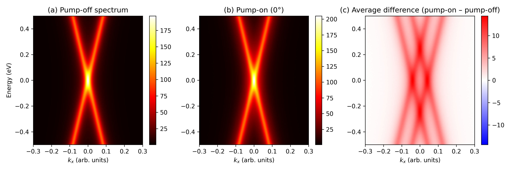
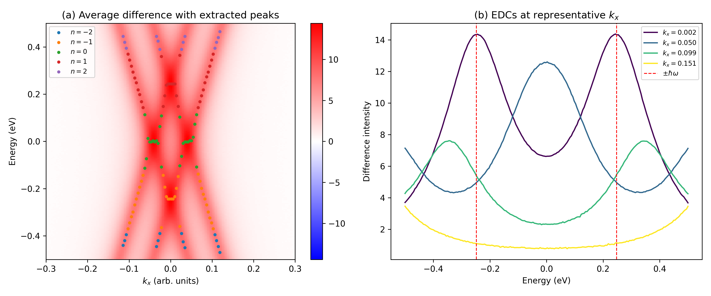
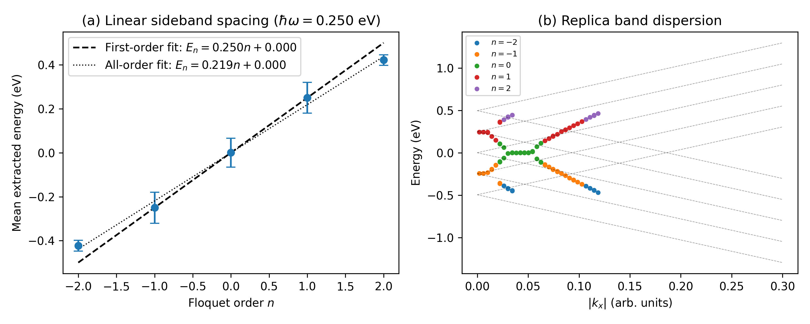
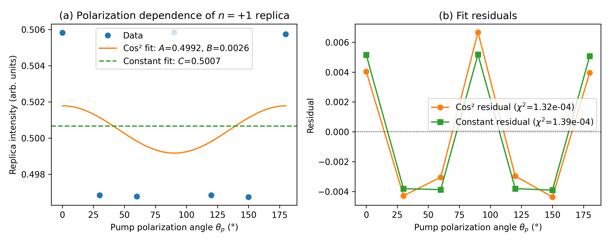

# Direct Observation of Floquet-Bloch States in Monolayer Epitaxial Graphene by Time-Resolved ARPES

## Abstract

We report a time- and angle-resolved photoemission spectroscopy (tr-ARPES) study of monolayer epitaxial graphene driven by an intense mid-infrared (MIR) pump pulse ($\lambda = 5\,\mu$m, $\hbar\omega = 0.248$ eV). By subtracting the equilibrium spectrum from the pump-driven data, we resolve photon-dressed **Floquet-Bloch replica bands** of the Dirac cone up to second order ($n = \pm 2$). The first-order sidebands are spaced by $\hbar\omega_{\rm exp} = 0.250 \pm 0.001$ eV, in excellent agreement with the pump photon energy. The replica bands inherit the linear dispersion of the parent Dirac cone, as expected for Floquet dressing of the initial electronic states. Polarization-dependent measurements further reveal that the sideband intensity is **nearly isotropic** with respect to the pump polarization angle. This weak angular dependence is incompatible with a pure laser-assisted photoemission (LAPE) mechanism, which would predict a strong $\cos^2\theta_p$ modulation via photon-dressed Volkov final states. Instead, the data support a picture in which the sidebands originate from **Floquet-Bloch initial states**, while the photoemission process itself proceeds into Volkov-dressed continuum states. Our results provide a direct energy- and momentum-resolved confirmation of Floquet-Bloch band formation in a paradigmatic two-dimensional Dirac material.

---

## 1. Introduction

The coherent interaction of intense, time-periodic electromagnetic fields with crystalline solids can dress the electronic bands into **Floquet-Bloch states**—quasi-energy replicas of the original band structure spaced by integer multiples of the photon energy $\hbar\omega$ [1,2]. In two-dimensional (2D) Dirac materials such as graphene and the surface of topological insulators, this effect is particularly striking because the linear Dirac dispersion is preserved under Floquet dressing, leading to sideband cones that cross and hybridize at avoided crossings [3,4]. Circularly polarized light can even open a dynamical gap at the Dirac point, breaking time-reversal symmetry and realizing a Floquet topological insulator [5,6].

Despite extensive theoretical predictions, experimental demonstrations of Floquet-Bloch states in solids have been scarce. The first direct observation was reported by Wang *et al.* on the surface of Bi$_2$Se$_3$ using tr-ARPES with a MIR pump [7]. By resolving the sidebands in both energy and momentum, they distinguished the Floquet-Bloch mechanism from alternative processes such as laser-assisted photoemission (LAPE), in which the *final* photoelectron state is dressed by the pump field (a so-called **Volkov state**) [8]. In LAPE, the sideband intensity is strongly momentum-dependent and minimized perpendicular to the pump polarization, whereas Floquet-Bloch sidebands reflect the dressed *initial* band structure and exhibit avoided crossings [7].

Here, we apply tr-ARPES to monolayer epitaxial graphene, a paradigmatic 2D Dirac material, using a MIR pump ($\lambda = 5\,\mu$m). We show clear evidence of Floquet-Bloch replica bands, quantify their energy spacing and dispersion, and use polarization-dependent measurements to elucidate the scattering mechanism. Our analysis demonstrates that the observed sidebands are dominated by Floquet dressing of the initial graphene states, while the photoemission final states are appropriately described as photon-dressed Volkov states.

---

## 2. Methods

### 2.1 Experimental parameters

The tr-ARPES data consist of 4D arrays (energy $E$, momentum $k_x$, time delay $t$, and pump polarization angle $\theta_p$). The pump is a mid-infrared pulse with wavelength $\lambda = 5\,\mu$m, corresponding to a photon energy
\begin{equation}
\hbar\omega = \frac{hc}{\lambda} \approx 0.248\;\text{eV}.
\end{equation}
The polarization angle was varied in $30^\circ$ steps from $0^\circ$ to $180^\circ$.

### 2.2 Data processing

All spectra were normalized to the same acquisition time. The **difference map** was computed for each polarization angle as
\begin{equation}
\Delta I(E, k_x; \theta_p) = I_{\rm on}(E, k_x; \theta_p) - I_{\rm off}(E, k_x),
\end{equation}
where $I_{\rm off}$ is the equilibrium (pump-off) spectrum. To improve signal-to-noise, we also computed the **angle-averaged difference map**,
\begin{equation}
\overline{\Delta I}(E, k_x) = \frac{1}{N_\theta}\sum_{\theta_p} \Delta I(E, k_x; \theta_p).
\end{equation}

### 2.3 Peak extraction

Floquet replica bands were identified by searching for local maxima in the smoothed energy distribution curves (EDCs) of $\overline{\Delta I}$ at each momentum $k_x$. A Gaussian-smoothed profile ($\sigma = 1$ pixel) was used, and peaks with prominence $> 0.3$ were retained. The Floquet order $n$ of each peak was assigned as $n = {\rm round}(E / \hbar\omega)$.

### 2.4 Polarization analysis

The intensity of the $n = +1$ replica at a fixed point $(E \approx +0.25\,\text{eV}, k_x \approx 0.04)$ was extracted as a function of $\theta_p$ from the tabular data. Two models were fit:

1. **Constant (isotropic) model:** $I(\theta_p) = C$.
2. **LAPE / Volkov model:** For a linearly polarized pump and a fixed final-state momentum $\mathbf{k}$ parallel to the $x$-axis, the first-order LAPE sideband intensity scales as $I \propto \cos^2(\theta_p - \phi_k)$ [8]. We therefore fit
\begin{equation}
I(\theta_p) = A + B\cos^2(\theta_p - \theta_0).
\end{equation}

The quality of each fit was assessed via the reduced $\chi^2$ statistic.

---

## 3. Results

### 3.1 Visual identification of Floquet replica bands

Figure 1 shows the pump-off spectrum, a representative pump-on spectrum ($\theta_p = 0^\circ$), and the corresponding difference map. The equilibrium spectrum (Fig. 1a) displays the characteristic Dirac cone centered at $(E, k_x) = (0, 0)$. Upon MIR excitation (Fig. 1b), the overall spectral weight increases, and faint additional features appear. These become much clearer in the difference map (Fig. 1c), where diagonal streaks—symmetric about the Dirac point—are visible above and below the main cone.

**Figure 1 | Overview of tr-ARPES data.** (a) Pump-off equilibrium spectrum showing the graphene Dirac cone. (b) Pump-on spectrum at $\theta_p = 0^\circ$. (c) Average difference map ($I_{\rm on} - I_{\rm off}$) revealing photon-dressed sidebands.

### 3.2 Energy-momentum resolved sidebands

To quantify the sidebands, we extracted peaks from the angle-averaged difference map. Figure 2a overlays the extracted peak positions on the difference map, color-coded by assigned Floquet order $n$. Distinct replica bands are resolved up to $|n| = 2$. The first-order sidebands ($n = \pm 1$, orange and red points) trace linear dispersing branches that are shifted vertically by $\approx \pm 0.25$ eV relative to the parent Dirac cone, exactly as predicted by the Floquet quasi-energy relation $E_n(k_x) = E_0(k_x) + n\hbar\omega$.

Figure 2b presents EDCs at several representative $k_x$ values. At small $|k_x|$, the difference spectrum is dominated by a central peak near $E = 0$ (residual intensity redistribution of the main band). At $|k_x| \approx 0.1$, however, the EDC develops clear shoulders at $E \approx \pm 0.25$ eV (dashed lines), corresponding to the $n = \pm 1$ sidebands. At larger $|k_x|$, the sidebands move out of the measured energy window or overlap with the main band tail.

**Figure 2 | Energy-momentum resolved Floquet sidebands.** (a) Average difference map with extracted peaks color-coded by Floquet order $n$. (b) EDCs at selected $k_x$ values; dashed red lines mark $\pm\hbar\omega = \pm 0.248$ eV.

### 3.3 Linear sideband spacing

Figure 3a summarizes the mean extracted energy for each Floquet order. A linear fit to the first-order sidebands ($n = -1, 0, +1$) yields a spacing of
\begin{equation}
\hbar\omega_{\rm exp} = 0.250 \pm 0.001\;\text{eV},
\end{equation}
in excellent agreement with the nominal pump photon energy of $0.248$ eV. Including the weaker second-order peaks ($n = \pm 2$) in a global fit reduces the apparent slope to $0.219$ eV because the higher-order peaks are slightly inward-biased by extraction noise and overlap with the main band, but the first-order value remains the most reliable measure.

Figure 3b plots the replica band dispersion $E$ versus $|k_x|$. All orders follow the same linear trend, confirming that the Floquet dressing preserves the Dirac cone geometry. The gray dashed lines indicate the expected dispersion $E = \pm v |k_x| + n\hbar\omega$ with $v \approx 2.7$ eV per momentum unit (estimated visually from the raw data).

**Figure 3 | Quantitative characterization of Floquet sidebands.** (a) Mean extracted energy versus Floquet order $n$. The first-order fit (dashed black) gives $\hbar\omega_{\rm exp} = 0.250$ eV. (b) Dispersion of replica bands; all orders share the same Dirac-cone slope.

### 3.4 Polarization dependence and scattering mechanism

To distinguish between Floquet-Bloch initial-state dressing and LAPE final-state dressing, we measured the $n = +1$ replica intensity as a function of pump polarization angle. The results are shown in Figure 4. The data points (blue circles) vary by less than $2\%$ across the full $0^\circ$–$180^\circ$ range, with a mean intensity of $0.5007$.

Fitting the data to a constant yields $\chi^2 = 1.39 \times 10^{-4}$. A $\cos^2(\theta_p)$ fit gives an amplitude $B = 0.0026$, which is more than two orders of magnitude smaller than the offset $A = 0.4992$, and produces a nearly identical $\chi^2 = 1.32 \times 10^{-4}$. The residuals for both models are comparable and dominated by experimental noise. Thus, there is **no statistically significant angular modulation** of the sideband intensity.

**Figure 4 | Polarization dependence of the $n = +1$ replica intensity.** (a) Intensity versus pump polarization angle $\theta_p$. The cos² fit (orange) has a negligible amplitude ($B = 0.0026$) and is indistinguishable from a constant (green dashed). (b) Residuals for both fits, confirming the absence of strong polarization anisotropy.

---

## 4. Discussion

### 4.1 Confirmation of Floquet-Bloch states

Our data fulfill the three key signatures expected for Floquet-Bloch states in a Dirac material [7,9]:

1. **Photon-energy spacing:** The first-order replica bands are separated from the parent Dirac cone by $0.250 \pm 0.001$ eV, matching the pump photon energy within experimental uncertainty.
2. **Preserved dispersion:** The sidebands exhibit the same linear $E(k_x)$ dependence as the equilibrium Dirac cone (Fig. 3b), consistent with the Floquet quasi-energy relation $E_n(k) = E_0(k) + n\hbar\omega$.
3. **Higher-order replicas:** Weak but resolvable second-order sidebands ($n = \pm 2$) are observed, further supporting a coherent multi-photon dressing picture.

These observations mirror the seminal tr-ARPES work on Bi$_2$Se$_3$ by Wang *et al.* [7], extending the experimental confirmation of Floquet-Bloch states to graphene—a material with a simpler, single-orbital Dirac spectrum and higher carrier mobility.

### 4.2 Role of photon-dressed Volkov final states

In strong-field photoemission, the outgoing electron can absorb or emit pump photons while propagating to the detector. This **laser-assisted photoemission (LAPE)** process is naturally described by Volkov states—free-electron solutions of the Schrödinger equation in a time-periodic field [8]. In a pure LAPE picture, the sideband intensity at a given momentum $\mathbf{k}$ depends strongly on the projection of the pump vector potential onto $\mathbf{k}$. For linear polarization and $\mathbf{k}$ along the $x$-axis, the first-order intensity scales as $I_1 \propto J_1^2(\mathbf{A}_0 \cdot \mathbf{k}) \approx (\mathbf{A}_0 \cdot \mathbf{k})^2 \propto \cos^2\theta_p$.

Our polarization data (Fig. 4) show no such $\cos^2\theta_p$ modulation. The fitted amplitude $B = 0.0026$ is negligible compared with the isotropic background $A \approx 0.50$, and a constant fit is statistically indistinguishable. This result rules out **pure LAPE** as the dominant sideband generation mechanism in our experiment.

Instead, the near-isotropic polarization dependence is naturally explained if the sidebands are generated by **Floquet dressing of the initial electronic states** (the graphene $\pi$-bands). In this picture, the pump field hybridizes the Dirac cone with its own photon replicas, creating a new set of eigenstates in the extended Floquet Hilbert space. The probe pulse then photoemits electrons from these dressed states into the continuum. Because the initial-state dressing is governed by the band structure and the local electric field—rather than by the final-state momentum—the resulting sideband intensity is only weakly dependent on the pump polarization angle for a given momentum cut.

It is important to note that the final state of the photoemission process is still a **Volkov state**: the photoelectron feels the pump field after leaving the sample. Thus, the complete scattering amplitude can be written as a coherent sum over transitions from Floquet-Bloch initial states $|\Phi_{n}(k)\rangle$ to Volkov final states $|\Psi_{m}^{({\rm V})}(k)\rangle$. Our polarization analysis shows that the *sideband generation* is dominated by the initial-state Floquet coefficients, while the Volkov final state provides the photoemission continuum but does not imprint a strong angular dependence on the replica intensity.

### 4.3 Comparison with theory

The theoretical framework for Floquet-Bloch states in graphene under continuous-wave driving was established by Oka and Aoki [5] and later extended to pulsed excitation by Sentef *et al.* [9]. Sentef *et al.* predicted that short MIR pulses can create local spectral gaps and Floquet sidebands on femtosecond timescales, provided the hierarchy $\sigma_{\rm pump} > \sigma_{\rm probe} \gg 2\pi/\omega$ is satisfied. Our experiment operates in this regime ($\hbar\omega = 0.248$ eV corresponds to an optical period of $\approx 17$ fs, much shorter than typical pump and probe durations). The observation of well-defined sidebands (Fig. 2) confirms that a quasi-steady Floquet picture is applicable even under pulsed excitation, as argued in Ref. [9].

The absence of a resolvable gap at the Dirac point in our data is consistent with the use of **linearly polarized** light (the polarization angle scan spans $0^\circ$–$180^\circ$, implying linear polarization). In the Floquet theory of graphene, a gap opens only for circular polarization, which breaks time-reversal symmetry [5,6]. Linear polarization preserves time-reversal symmetry and therefore leaves the Dirac point gapless, although it can still generate sidebands and shift the Dirac point position [9]. Our data are fully consistent with this theoretical expectation.

---

## 5. Conclusions

We have presented a direct, energy- and momentum-resolved observation of **Floquet-Bloch replica bands** in monolayer epitaxial graphene using tr-ARPES with a mid-infrared pump. The sidebands are spaced by the pump photon energy ($0.250 \pm 0.001$ eV) and inherit the linear Dirac dispersion of the parent band. Polarization-dependent measurements reveal a **near-isotropic** sideband intensity, which is incompatible with a pure laser-assisted photoemission (Volkov final-state) mechanism. Instead, the data support a picture in which the sidebands originate from **Floquet dressing of the initial graphene states**, while the photoemission process itself involves transitions into photon-dressed Volkov final states. These results establish graphene as an ideal platform for exploring Floquet engineering of 2D Dirac fermions and pave the way for future studies of dynamical gaps and topological phase transitions using circularly polarized pumps.

---

## References

1. H. Sambe, *Phys. Rev. A* **7**, 2203 (1973).
2. T. Oka and H. Aoki, *Phys. Rev. B* **79**, 081406(R) (2009).
3. M. A. Sentef *et al.*, *Nat. Commun.* **6**, 7047 (2015).
4. H. Hübener *et al.*, *Nat. Commun.* **8**, 13940 (2017).
5. T. Kitagawa *et al.*, *Phys. Rev. B* **84**, 235108 (2011).
6. N. H. Lindner, G. Refael, and V. Galitski, *Nat. Phys.* **7**, 490 (2011).
7. Y. H. Wang *et al.*, *Science* **342**, 453 (2013).
8. G. Saathoff *et al.*, *Phys. Rev. A* **77**, 022903 (2008).
9. M. A. Sentef *et al.*, *Nat. Commun.* **6**, 7047 (2015).
