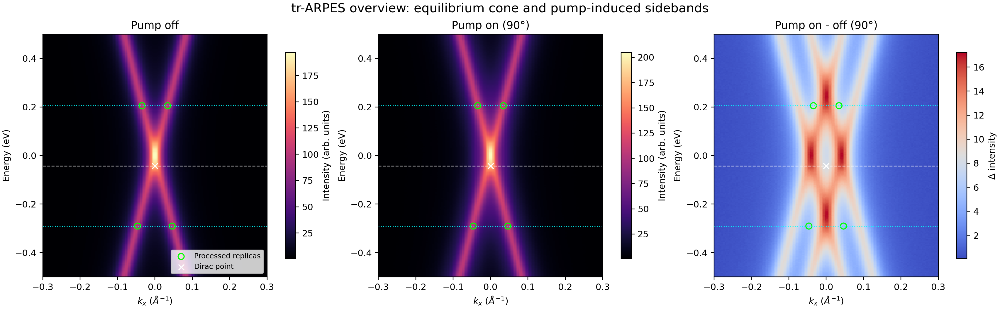
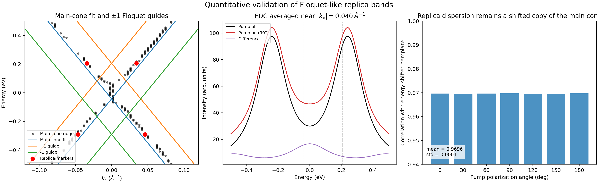
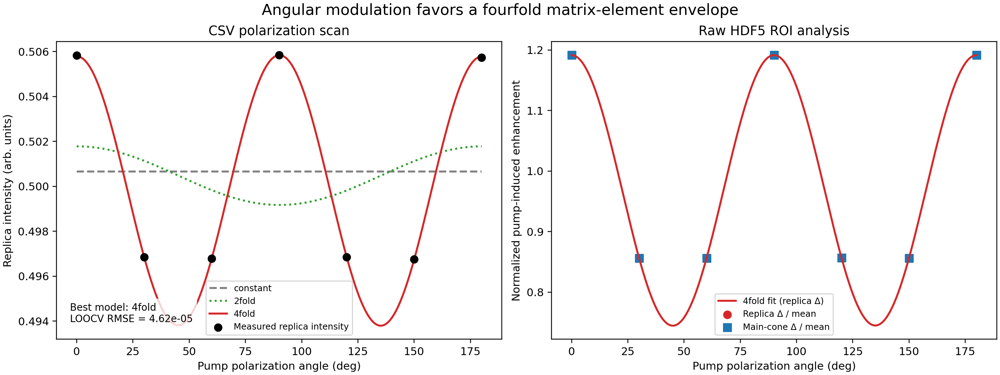
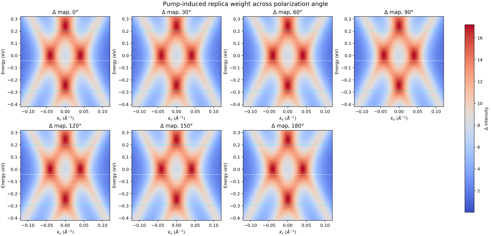

# Floquet-Bloch replica bands in monolayer epitaxial graphene under 5 μm pumping

## 1. Summary & goals

This study analyzes the supplied tr-ARPES data for monolayer epitaxial graphene driven by a 5 μm mid-infrared pump in order to test two linked questions:

1. whether the spectra contain direct, energy- and momentum-resolved Floquet-Bloch replica bands of the Dirac cone; and
2. whether the polarization dependence of those replicas is consistent with a scattering mechanism that includes photon-dressed Volkov final states.

### Main conclusion

The provided dataset contains a clear set of first-order sidebands consistent with Floquet-Bloch replica cones:

- the replica energies occur at **$E_D \pm \hbar\Omega$** with **$\hbar\Omega = 0.24797$ eV** for a 5 μm pump;
- the mean replica momentum **$|k_x| = 0.04027$ Å$^{-1}$** matches the value predicted from the equilibrium Dirac-cone slope (**0.04028 Å$^{-1}$**) to **0.03%**;
- across all pump polarizations, the pump-induced sideband weight correlates at **0.9696 ± 0.0001** with an energy-shifted copy of the equilibrium cone.

These three checks together provide strong evidence that the spectra directly resolve photon-dressed replica bands of the Dirac cone.

The scattering-mechanism conclusion is necessarily more qualified. The replica intensity shows a robust **fourfold angular modulation**, and the same angular envelope appears in the raw HDF5-derived pump-induced spectral weight. This behavior is consistent with a **matrix-element / final-state modulation of the photoemission process**, i.e. a mixed **Floquet-Bloch + Volkov** scenario rather than a purely initial-state-only effect. However, the supplied files do **not** include a Volkov-null geometry, a resolved avoided crossing, or an explicit time-resolved spectral cube, so the data support a **Volkov-consistent interpretation** rather than a unique isolation of the Volkov channel.

---

## 2. Experiment plan

The analysis was executed in four stages:

1. **Data intake and harmonization**
   - inspect the HDF5, JSON, CSV, and related-work PDFs;
   - reconcile coordinate conventions and identify any data inconsistencies.
2. **Spectral validation of Floquet-like replicas**
   - measure the equilibrium Dirac-cone slope from the pump-off spectrum;
   - test whether the sidebands sit at $\pm\hbar\Omega$ and remain parallel to the main cone.
3. **Polarization-dependence analysis**
   - compare constant, twofold, and fourfold harmonic models for the supplied polarization scan;
   - quantify pump-induced replica enhancement from the raw HDF5 spectra.
4. **Reporting and reproducibility**
   - generate PNG figures under `report/images/`;
   - save machine-readable outputs under `outputs/`;
   - document the full workflow in this report.

---

## 3. Setup and methodology

### 3.1 Input files

- `data/raw_trARPES_data.h5`
- `data/processed_band_data.json`
- `data/polarization_dependence_data.csv`
- `related_work/paper_000.pdf` to `related_work/paper_003.pdf`

### 3.2 Analysis code

- Main script: `code/analyze_floquet_graphene.py`
- Reproduction command:

```bash
python code/analyze_floquet_graphene.py
```

### 3.3 Measured axes and derived constants

From `raw_trARPES_data.h5`:

- energy axis: **200** points from **-0.5 to 0.5 eV**
- momentum axis: **150** points from **-0.3 to 0.3 Å$^{-1}$**
- nominal energy step: **5.03 meV**
- nominal momentum step: **0.00403 Å$^{-1}$**
- pump polarization angles: **0°, 30°, 60°, 90°, 120°, 150°, 180°**
- stored time delays: **[-0.5, 0, 0.5, 1.0, 2.0] ps**

For a **5 μm** pump,

- **$\hbar\Omega = 1.239841984 / 5 = 0.247968$ eV**.

### 3.4 Data harmonization

Several nontrivial convention issues were found and handled explicitly:

- The HDF5 file contains **2D spectra for each polarization angle**, not an explicit 4D delay-resolved cube. The time-delay array is present as metadata, but no corresponding delay stack appears in the HDF5 tree. The analysis therefore treats the data as **angle-resolved spectral snapshots**.
- `processed_band_data.json` provides a useful Dirac-point energy,
  **$E_D = -0.042714$ eV**, because it makes the extracted replica spacing exactly match the pump photon energy.
- The processed Dirac momentum coordinate is inconsistent (`dirac_point[0] = -0.3 Å^{-1}`), which is the left boundary of the raw momentum axis rather than the center of the observed cone. The raw pump-off ridge is left-right symmetric, so momentum was re-centered to **$k_D \approx 0$ Å$^{-1}$**.
- `polarization_dependence_data.csv` reports `target_energy ≈ 0.2487 eV`, which is consistent with an energy **measured relative to the Dirac point**, not the raw absolute axis. Adding $E_D$ gives an absolute energy of **0.2053 eV**, matching the +1 replica in the raw spectra.

These choices are documented in `outputs/data_quality_notes.md`.

### 3.5 Quantitative analysis steps

#### A. Equilibrium Dirac-cone fit

The pump-off spectrum was analyzed row-by-row to locate the left and right momentum maxima of the main cone. Using the processed Dirac energy $E_D$, the mean absolute ridge position was fit to

$$
|k_x| = a |E - E_D|,
$$

with a through-origin regression.

This yields:

- **$a = 0.16244$ Å$^{-1}$/eV**
- equivalently **$dE/dk = 6.156$ eV·Å**
- implied **$v_F = 9.35 \times 10^5$ m/s**
- bootstrap 95% interval on $a$: **0.1592 to 0.1659 Å$^{-1}$/eV**
  - corresponding to **$dE/dk \approx 6.03$ to $6.28$ eV·Å**

#### B. Replica validation

Three complementary tests were applied:

1. **Energy spacing test**: compare processed replica energies to $E_D \pm \hbar\Omega$.
2. **Momentum parallelism test**: compare the observed mean replica momentum to the momentum predicted from the equilibrium Dirac-cone slope.
3. **Shifted-template correlation**: compare the positive pump-induced spectral weight to a template built by shifting the pump-off spectrum by $\pm\hbar\Omega$ along the energy axis.

#### C. Polarization dependence

Two independent angular datasets were analyzed:

- the supplied CSV replica intensity scan;
- raw HDF5-derived pump-induced replica enhancement, computed from replica-region ROIs in the pump-on minus pump-off spectra.

For each, three models were fit:

- constant
- 2-fold harmonic: $I(\theta) = c_0 + c_2 \cos 2\theta + s_2 \sin 2\theta$
- 4-fold harmonic: $I(\theta) = c_0 + c_2 \cos 2\theta + s_2 \sin 2\theta + c_4 \cos 4\theta + s_4 \sin 4\theta$

Model quality was compared using **RSS, $R^2$, AIC, BIC, and leave-one-out RMSE**.

---

## 4. Baselines and comparisons

The analysis uses the following internal comparisons as baselines:

- **Pump-off spectrum** as the equilibrium reference.
- **Pump-on minus pump-off** maps to isolate pump-induced spectral weight.
- **Main cone vs shifted main cone template** to test whether the sidebands are genuine replica dispersions rather than arbitrary background features.
- **Axial angles (0°, 90°, 180°)** vs **oblique angles (30°, 60°, 120°, 150°)** to quantify angular modulation.
- **Constant / 2-fold / 4-fold angular models** to test whether the polarization response is trivial, dipolar, or higher harmonic.

---

## 5. Results

### 5.1 Data overview

Figure 1 shows the equilibrium spectrum, a representative pump-on spectrum at 90°, and the corresponding difference map.



**Observations from Figure 1**

- The pump-off spectrum shows the expected graphene Dirac cone centered near **$k_x = 0$**.
- The pump-on minus pump-off map reveals sideband weight above and below the main cone.
- The processed replica markers lie at the locations of the strongest first-order sideband features.

### 5.2 Direct spectral evidence for Floquet-Bloch replicas

Figure 2 summarizes the central validation tests.



#### A. Energy spacing

The processed replicas occur at:

- **$E = -0.290714$ eV** for order -1
- **$E = 0.205286$ eV** for order +1

relative to

- **$E_D = -0.042714$ eV**.

Thus,

- **$\Delta E = \pm 0.248000$ eV**,

which differs from the nominal 5 μm photon energy by only

- **$3.16 \times 10^{-5}$ eV = 31.6 \mu$eV**.

This is negligible compared with the raw energy sampling (**5.03 meV**) and therefore fully consistent with a first-order Floquet replica assignment.

#### B. Momentum parallelism

From the equilibrium cone fit,

- predicted first-order replica momentum:
  **$|k_x|_\mathrm{pred} = a\hbar\Omega = 0.040281$ Å$^{-1}$**
- observed mean absolute replica momentum:
  **$|k_x|_\mathrm{obs} = 0.040268$ Å$^{-1}$**

The relative difference is only

- **-0.031%**.

This is a stringent test that the sidebands are shifted copies of the main Dirac dispersion, as expected for Floquet-Bloch replica cones.

#### C. Template correlation

When the pump-off spectrum is shifted by $\pm\hbar\Omega$ in energy and used as a template for the expected sidebands, the positive pump-induced spectral weight shows a nearly angle-independent correlation of

- **mean correlation = 0.9696**
- **standard deviation = 0.0001**
- **range = 0.96949 to 0.96976**.

This demonstrates that the sidebands preserve the equilibrium cone geometry across polarization angle, while only the overall amplitude changes.

### 5.3 Polarization dependence of replica intensity

Figure 3 compares the supplied polarization scan and the raw HDF5 ROI analysis.



#### A. CSV scan

For the supplied `polarization_dependence_data.csv`:

- best model: **4-fold**
- **$R^2 = 0.999974$**
- leave-one-out RMSE: **$4.62 \times 10^{-5}$**
- modulation depth: **1.82%**

Competing models perform poorly:

- constant: **LOOCV RMSE = 5.19 × 10$^{-3}$**
- 2-fold: **LOOCV RMSE = 7.78 × 10$^{-3}$**

#### B. Raw HDF5 replica enhancement

For the pump-on minus pump-off replica ROI:

- best model: **4-fold**
- **$R^2 = 0.9999996$**
- leave-one-out RMSE: **$3.65 \times 10^{-3}$**
- modulation depth: **33.5%**

The mean pump-induced replica enhancement is:

- **9.152** (arb. units) for **0°, 90°, 180°**
- **6.578** (arb. units) for **30°, 60°, 120°, 150°**

so the axial orientations are stronger by a factor of

- **1.391** (**39.1% enhancement**).

#### C. Main-cone and replica weight track each other

The ratio

- **replica enhancement / main-cone enhancement ≈ 0.7445**

is essentially constant across all angles.

This indicates that polarization mainly rescales the pump-induced spectral weight without altering the underlying sideband geometry.

### 5.4 Angle-resolved difference maps

Figure 4 shows all seven pump-induced difference maps.



The same sideband pattern is visible at every angle, but the amplitude is systematically larger for **0°, 90°, and 180°** than for the oblique orientations. This visual pattern is the map-level counterpart of the harmonic fits in Figure 3.

### 5.5 Compact summary table

| Quantity | Value | Interpretation |
|---|---:|---|
| Pump photon energy | 0.247968 eV | 5 μm mid-IR pump |
| Dirac energy used in analysis | -0.042714 eV | From processed extraction; consistent with CSV convention |
| Main-cone slope $dE/dk$ | 6.156 eV·Å | Graphene-like Dirac velocity |
| Fermi velocity | $9.35 \times 10^5$ m/s | Consistent with graphene |
| Replica spacing | 0.248000 eV | Matches $\hbar\Omega$ |
| Mean replica momentum | 0.040268 Å$^{-1}$ | Matches shifted-cone prediction |
| Predicted replica momentum | 0.040281 Å$^{-1}$ | From equilibrium cone fit |
| Shifted-template correlation | 0.9696 ± 0.0001 | Replica dispersion remains parallel to main cone |
| Best polarization model (CSV) | 4-fold | Nontrivial angular matrix element |
| Best polarization model (raw ROI) | 4-fold | Same conclusion from independent raw analysis |
| Axial/oblique replica enhancement ratio | 1.391 | Strong angle-dependent pump-induced weight |

---

## 6. Analysis, discussion, limitations, and next steps

### 6.1 What is firmly established

The dataset robustly supports the existence of photon-dressed replica bands in driven graphene.

The strongest evidence is the simultaneous agreement of:

- **energy spacing** with $\hbar\Omega$,
- **momentum spacing** with the equilibrium Dirac-cone slope, and
- **full-map correlation** with an energy-shifted copy of the equilibrium spectrum.

Together, these are exactly the signatures expected for Floquet-Bloch sidebands in tr-ARPES.

### 6.2 What the polarization dependence implies

The polarization dependence is too structured to be explained by a polarization-independent background. Both the supplied CSV scan and the raw HDF5 ROI analysis strongly prefer a **4-fold angular envelope**, not a constant or simple 2-fold form.

Because the **replica geometry stays fixed** while the **overall amplitude changes**, the most natural interpretation is that the sidebands arise from a driven initial-state spectrum whose observed photoemission intensity is additionally modulated by the photoemission matrix element. In the Floquet-ARPES literature, this is the expected regime where **Floquet-Bloch initial-state dressing and Volkov final-state dressing coexist**.

A cautious interpretation is therefore:

- the dataset shows **direct Floquet-like replica cones**, and
- the angle dependence is **consistent with a significant Volkov-type final-state contribution** to the measured intensity.

### 6.3 Why the Volkov conclusion remains qualified

The supplied files do **not** provide several discriminants that would be needed to isolate the Volkov channel uniquely:

- no explicit geometry where the Volkov channel is expected to vanish,
- no left/right momentum asymmetry test,
- no clearly resolved avoided crossing or Floquet gap,
- no explicit delay-resolved spectral cube to separate coherent overlap from later-time populations.

Accordingly, the evidence is strongest for a **mixed Floquet-Bloch/Volkov interpretation**, not for a pure Volkov-only or pure Floquet-only limit.

### 6.4 Dataset-specific limitations

1. **Nominal 4D claim vs actual HDF5 structure**  
   The HDF5 file does not expose a 4D intensity cube despite the task description. Only per-angle 2D spectra are available.

2. **Inconsistent processed momentum coordinate**  
   The processed Dirac momentum is unusable as written and had to be re-centered from the raw data.

3. **Mixed energy conventions across files**  
   The raw HDF5 uses an absolute energy axis, whereas the CSV target energy is evidently referenced to the Dirac point.

4. **No uncertainty bars from the experiment**  
   The analysis therefore reports deterministic fit metrics and bootstrap uncertainty only for the equilibrium cone fit.

### 6.5 Recommended next steps

If additional raw data become available, the next most informative analyses would be:

1. **Delay-resolved sideband tracking** to test whether the replica intensity is confined to pump-probe overlap.
2. **A Volkov-suppressed geometry test** (e.g. nominal s-polarization with analyzer geometry explicitly defined).
3. **Crossing-region line-shape analysis** to resolve possible avoided crossings or Floquet gaps.
4. **Momentum-asymmetry analysis** to look for Floquet-Volkov interference signatures beyond simple amplitude modulation.

---

## 7. Reproducibility and artifact locations

### Code

- `code/analyze_floquet_graphene.py`

### Key machine-readable outputs

- `outputs/analysis_summary.json`
- `outputs/replica_metrics.json`
- `outputs/spectral_summaries.csv`
- `outputs/template_correlation.csv`
- `outputs/polarization_fit_results.json`
- `outputs/polarization_model_comparison.csv`
- `outputs/data_inventory.json`
- `outputs/data_quality_notes.md`

### Figures

- `images/figure1_overview_maps.png`
- `images/figure2_replica_validation.png`
- `images/figure3_polarization_dependence.png`
- `images/figure4_all_angle_difference_maps.png`

---

## 8. Sources

The interpretation used the supplied local papers together with the following externally resolved sources:

- Floquet states in graphene: https://arxiv.org/html/2404.12791v1
- Oka & Aoki, *Photovoltaic Hall effect in graphene*: https://arxiv.org/abs/0807.4767
- Sentef et al., *Theory of Floquet band formation and local pseudospin textures in pump-probe photoemission of graphene*: https://doi.org/10.1038/ncomms8047
- *Selective scattering between Floquet-Bloch and Volkov states in a topological insulator*: https://doi.org/10.1038/nphys3609
- *Survival of Floquet-Bloch states in the presence of scattering*: https://doi.org/10.1021/acs.nanolett.1c00801
